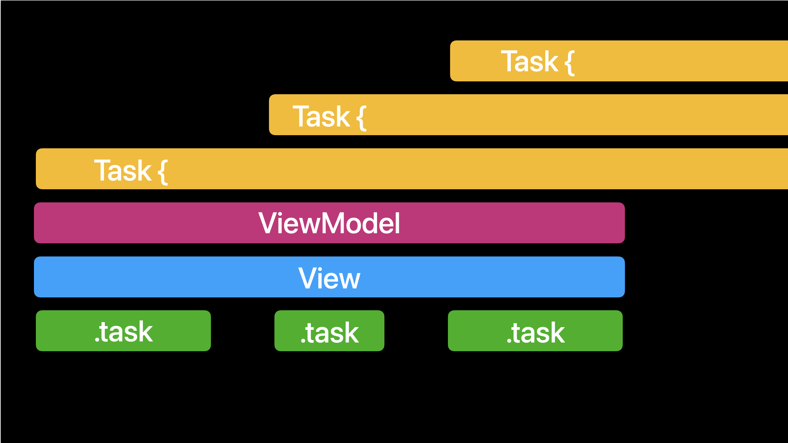

# A Flock of Swifts

We are a group of people excited by the Swift language. We meet each Saturday morning to share and discuss Swift-related topics. 

All people and all skill levels are welcome to join. 

- **RSVP**: https://www.meetup.com/A-Flock-of-Swifts/

## 2022.12.31

### Problems with Button Layout

Rainer is having trouble with getting button layout to work like he wants.

### Performance


On rotation Ed was hitting a layout performance issue. The suggestion was to try Instruments to see where the computations were going.

### AFOS-Process

Implement a command line tool to process the AFOS readme file and reverse the summaries to appear in chronological order.

- Argument Parser is nice
- Used Regex Builder (trouble with ^ anchor matches)


### Implementing cmap

Josh gave a 2022 final treatise on functional thinking with a focus on comap.

Some materials to get started:

- https://www.pointfree.co It is a little pricey, but there is a good holiday discount of 25%.
- https://bartoszmilewski.com/2014/10/28/category-theory-for-programmers-the-preface/  Bartosz Milewski
- http://learnyouahaskell.com
- https://bow-swift.io/docs/
- https://www.objc.io/books/functional-swift/


Josh implemented cmap (contraMap):

```swift
struct Predicate<A> {
    let satisfies: (A) -> Bool
    func callAsFunction(_ x: A) -> Bool { satisfies(x) }
}

typealias F = Predicate // So it matches the Scala chart

let isEqualToFive = Predicate { $0 == 5 }
let isWordleWord = cmap(\String.count)(isEqualToFive)
print(isWordleWord("Swift")) // true
print(isWordleWord("Kotlin")) // false


func isPoop(_ value: Int) -> Bool {
    value.isMultiple(of: 2)
}

func contraMap<A, B, C> (
    _ f: @escaping (A) -> C,
    transform: @escaping (B) -> A
    ) -> (B) -> C {
        f(transform($0))
    }

let isPoopString = contraMap(isPoop, transform: \String.count)
print(isPoopString("Swift"))  // false
print(isPoopString("Kotlin")) // true

```

---

## 2022.12.17

### Tables, Geometry and Layout

Rainer showed us his button layout demo. Peter suggested using 

```swift
VStack { 
    LazyVGrid {} // Row 1
    LazyVGrid {} // Row 2
    LazyVGrid {} // Row 3
            :
}
```

Some layout alternatives and tools:

- https://github.com/joshuajhomann/Radial
- https://github.com/joshuajhomann/PopTip-SwiftUI


### Charts

Ed showed an example of charting. He needed to convert some dates to strings to prevent the graphing system from rearranging them.  If you want a basic intro to Swift Charts in iOS 16

- https://www.kodeco.com/36025169-swift-charts-tutorial-getting-started


### ChatGPT

Emil showed an example of ChatGPT making a simple TODO list app in SwiftUI. It was pretty basic could then be iterated on.

John showed a counter example where they asked it to generate a biography of their father. It got one thing correct and the rest of it just made up (total BS).

We will probably see more AI tools in IDEs


### SE Pitches and Proposals

- https://forums.swift.org/t/pitch-swift-predicates/62000
- https://forums.swift.org/t/pitch-observation/62051
- https://github.com/apple/swift-evolution/blob/main/proposals/0382-expression-macros.md
- https://github.com/apple/swift-evolution/blob/main/proposals/0381-task-group-discard-results.md
- https://github.com/apple/swift-evolution/blob/main/proposals/0379-opt-in-reflection-metadata.md


Swift Evolution will now approve Vision documents for large multi-proposal features.  A link from Bill.

- https://forums.swift.org/c/evolution/18


---

## 2022.12.10


### Swift Foundation Open Source

Peter reports a big announcement on the Swift blog:

https://www.swift.org/blog/future-of-foundation/


- No more C libraries
- More granular libraries
- Unification of implementations
- Open contribution process

### Customizing Toggles


You can customize SwiftUI toggle by making a `ToggleStyle`.

```swift
struct RadioToggleStyle: ToggleStyle {
  func makeBody(configuration: Configuration) -> some View {
      Button(action: {
          configuration.isOn.toggle()
            }) {
              Image(systemName: configuration.isOn ? "circle.fill" : "circle")
                .accessibilityLabel(configuration.isOn ? "On" : "Off")
            }
            .buttonStyle(.plain)
    }
}
```

Make specifying it feel natural:

```swift
extension ToggleStyle where Self == RadioToggleStyle {
  static var radio: Self {
    .init()
  }
}
```

Using it is as easy as:

```swift
      Toggle("The Toggle", isOn: $isChecked)
        .toggleStyle(.radio)
```

### Functional Programming

Monads delay the result of effects. Just as with `try/throws` and `async/await` you kick the responsibility up the ladder to the caller, essentially delaying the effect of errors/suspensions. Optionals, arrays, publishers, streams can be viewed as just this.

It takes a change in thinking in going from imperative to functional and takes practice.  A good way to practice is with the advent of code exercises.  

https://adventofcode.com


### Crates and cranes!

Josh took on a solution of the advent of code day five.

https://adventofcode.com/2022/day/5

The problem can be solved as two sub problems.
Create the initial state by:
1. Unfold the string into lines, up to the delimiter
2. trasnform the lines into an array of tuples of (column, characters)
3. reverse the sequence so we start from the bottom
4. fold the tuples into an array of columns, which are each an array of characters

```swift
    let columns = sequence(state: scanner) { scanner -> String? in
        scanner.scanUpToCharacters(from: .newlines).flatMap { $0 == " 1   2   3   4   5   6   7   8   9" ? nil : $0 }
    }
        .flatMap { line in
            line
                .enumerated()
                .filter { $1.unicodeScalars.first.map(CharacterSet.uppercaseLetters.contains) ?? false }
                .map { value in
                    (column: (value.offset - 1) / 4, value: value.element)
                }
        }
        .reversed()
        .reduce(into: [[Character]](repeating: [], count: 9)) { columns, box in
            columns[box.column].append(box.value)
        }
```
Second, fold the moves into the initial state and extract the answer form the final state:
1. Unfold the rest of the string into a tuple of (quantity, from, to) by extracting the 3 integers from each line and ignoreing everything else
2. Fold the sequence of moves into the initial state by removing quanity items from the end of the from array and placing them at the end of the to array
3. Pluck out the last character from each column and join them into a String
```swift
scanner.charactersToBeSkipped = .decimalDigits.inverted
    return sequence(state: scanner) { scanner -> (quantity: Int, from: Int, to: Int)? in
        guard let quantity = scanner.scanInt(),
              let from = scanner.scanInt().map({ $0 - 1}),
              let to = scanner.scanInt().map({ $0 - 1}) else {
            return nil
        }
        return (quantity: quantity, from: from, to: to)
    }
    .reduce(into: columns) { columns, move in
        let transfer = shouldReverse
            ? columns[move.from].suffix(move.quantity).reversed()
            : columns[move.from].suffix(move.quantity)
        columns[move.to].append(contentsOf: transfer)
        columns[move.from].removeLast(move.quantity)
    }
    .map { $0.last.map(String.init(describing:)) ?? " " }
    .joined()
```

You can see his solution here:

https://github.com/joshuajhomann/Advent-of-Code-2022/blob/main/Advent.playground/Pages/Day%205.xcplaygroundpage/Contents.swift


---

## 2022.12.03


### Functional Design Patterns
Monads are a functional design pattern with origins in category theory. Monads give us a tool for modelling effects. We went through the basics following some popular online posts including:

- https://mokacoding.com/blog/functor-applicative-monads-in-pictures/
- https://www.hackingwithswift.com/example-code/language/what-is-a-monad


ASIDE: Don't confuse functors with function objects.

```swift
// This is a function object, not a functor.
class ViewModel {
  func callAsFunction() {
    print("Hello")
  }
}

let viewModel = ViewModel()
viewModel() // prints Hello
```

- Functors: implement map
- Applicative: implements lift and apply
- Monad: implements flatMap

Monads are special forms of applicatives.  Applicatives are special forms of functors.  Optionals, Arrays, Results, Publishers.


#### Functor Examples
```swift
func compute(_ input: Int) -> Int {
  input + 42
}

Optional<Int>(nil).map(compute(_:))
[5].map { compute($0) }
```

#### Applicative Example

```swift
extension Optional {
  func apply<ReturnType>(_ f: ((Wrapped) -> ReturnType)?) -> ReturnType? {
    guard let f else { return nil }
    return self.map(f)
  }
}

extension Array {
  func apply<ReturnType>(_ fs: [(Element) -> ReturnType]) -> [ReturnType] {
    var result = [ReturnType]()
    result.reserveCapacity(fs.count * self.count)
    for f in fs {
      for element in self.map(f) {
        result.append(element)
      }
    }
    return result
  }
}

[3,2,3].apply([compute(_:), compute(_:)])
```

#### The Monadic Laws

1. Left identity - flat mapping a monad with a function is the same as calling that function
2. Right identity - flat mapping a lifted monad is the same as the monad
3. Associativity - chaining operations is the same as nesting operations

(You can find code examples in the Hacking with Swift)


Tim Colson Suggested this reading:
https://stackoverflow.com/questions/28139259/why-do-we-need-monads


### Functional Symmetry

We discussed how functors, applicatives, monads and related constructs can all be constructed as transforms of A's, B's arrows and F's and the fact that `filter`, `compactMap` and `flatMap` have the same shape, which is why `compactMap` was originally the same function as `flatMap` in earlier versions of swift; they are the same function with different choices for the Monads.  You can rewrite `filter` in terms of `compactMap` or in terms of `flatMap`
```swift
print((0...10).prefix(10).filter { $0.isMultiple(of: 2)})
print((0...10).prefix(10).compactMap { i -> Int? in i.isMultiple(of: 2) ? i : nil })
print((0...10).prefix(10).flatMap { $0.isMultiple(of: 2) ? [$0] : [] })
```
### Functor as a protocol
We looked at how you can implment a functor as a protcol and the symmetry between the free function `fmap` which lifts a function from `A->B` to a function `FA->FB` and the instance method `map` which takes a `A->B` and returns `FB`.  With the implicit self parameter to the instance method it becomes `(A->B), FA -> FB` which is the same as the curried function `(A->B) -> FB -> FA`.
```swift
protocol Functor<A> {
    associatedtype A
    associatedtype FB: Functor = Self
    associatedtype FA: Functor = Self
    typealias B = FB.A
    static func fmap(_ transform: @escaping  (A) -> B) -> (FA) -> FB
    func fmap<T>(_ transform: @escaping (A) -> T) -> FB where T == FB.A
}

extension Optional: Functor {
    typealias A = Wrapped
    static func fmap(_ transform: @escaping  (A) -> B) -> (FA) -> FB {
      { fa in
          guard let a = fa else { return nil }
          return transform(a)
      }
    }
    static func pure(_ value: Wrapped) -> Self {
        .some(value)
    }
    func fmap<B>(_ transform: @escaping (A) -> B) -> B? {
        guard let self else { return nil }
        return transform(self)
    }
}

let v = Optional<Int>.fmap({ $0 * 2 })(5)
let v2 = Optional<Int>.pure(5).fmap { $0 * 2 }
```

### Advent of Code
Josh showed his solution for day one of the (Advent of Code 2022)[https://adventofcode.com] and explained how it makes use of monads:
```swift
let input = Bundle.main.url(forResource: "input", withExtension: "")
    .flatMap { try? Data(contentsOf:$0) }
    .flatMap { String(data: $0, encoding: .utf8) }!
	
let total = sequence(state: Scanner(string: input)) { scanner in
    scanner.scanUpToString("\n\n").map { subarrayString in
        sequence(state: Scanner(string: subarrayString)) { $0.scanInt() }.reduce(0, +)
    }
}
    .max()!
```
You can find his complete set of solutions for the advent of code [here](https://github.com/joshuajhomann/Advent-of-Code-2022)


### Miscellaneous

- https://arstechnica.com/information-technology/2022/12/apple-slices-its-ai-image-synthesis-times-in-half-with-new-stable-diffusion-fix/

Why no test flight?

- https://www.whynotestflight.com


## 2022.11.27

### Diagrams
Rainer showed how to programatically create flow charts and sequence diagrams with [PlantUML](https://plantuml.com):
```
@startuml BF Flow - State Diagram
title BF Flow in plantUML
hide empty description
note right of Root: This is the starting point
Root --> TermsAndConditions
TermsAndConditions --> UserNameAndEmail
UserNameAndEmail -> Phone
Phone -> UserNameAndEmail
UserNameAndEmail --> IconSelection
IconSelection -> PointsCount
PointsCount --> Root
Root --> Welcome
state Contest { 
    state Artwork {
    }
    state Winners { 
    }
}
Welcome -down-> Contest
Artwork -down-> SpaceBuilder
SpaceBuilder -left-> Profile
Profile -up-> Welcome
Welcome -left-> RunningCount
RunningCount --> YourPoints
YourPoints --> RunningCount
@enduml
```

```
stateDiagram-v2
    Root --> Welcome : tap ENTER
    Welcome --> Announcements
    note right of Announcements : This is the note to the right.
    Welcome --> Contest 
    Contest --> Winners
    Contest --> ShareToSocial
    Contest --> CreateArtwork : Create_Art
    CreateArtwork --> ArtBuilder : auto-open
    ArtBuilder --> ShareArt
    ShareArt --> CreateArtwork

```

```
digraph mygraph {
    // concentrate=true
    layout="dot"
    node [fontname="Helvetica,Arial,sans-serif"]
    edge [fontname="Courier,Arial,sans-serif"]
    node [shape=box];
    "Root" -> {Welcome, "Terms and conditions"} 
    "Points Count" -> Root
    lc [label="UserName & Email", xlabel="external label on username"]
    "Terms and conditions" -> lc
    Phone [style=filled, fillcolor="red", constraint=false] 
    lc -> "Icon Selection"
    lc ->  Phone [dir=both] [label="edge label"]
    "Icon Selection" -> "Points Count" [label="edge label", fontcolor="blue"] 
    Welcome -> {"RunningCount", "Contest"}  [dir=both]
    "RunningCount" -> {"Your Points"} [dir=both]
    "Your Points" -> Welcome [constraint=false] 
    Contest -> ArtBuilder -> ArtViewer -> Welcome
    Contest [xlabel="label on Contest"]
    note [label="root note", shape=note, penwidth=0.2, fillcolor=yellow, style="filled", height=0.001, margin=0.01, fontsize=10]
    note -> Root [minlen=0.1, penwidth = 1.0, arrowhead=none, style="dashed", color="grey"]
    Contest [shape=Mrecord, label="{Contest|Artwork|Winners}"]
}
```
### Swift Previews
Ed shared how to customize a view for swift previews using an environment variable:
```swift
	import SwiftUI
	
	struct TestView: View {
	  var body: some View {
	    if ProcessInfo.processInfo.environment["XCODE_RUNNING_FOR_PREVIEWS"] == "1" {
	      Text("Preview Text")
	    } else {
	      Text("Device Text")
	    }
	  }
	}
	
	struct TestView_Previews: PreviewProvider {
	  static var previews: some View {
	    TestView()
	  }
	}
```

### WidgetKit
Josh showed how to create a widget.  The code is availble [here.](https://github.com/joshuajhomann/)  


---
## 2022.11.19

### Generic RadioGroup in SwiftUI
Josh presented a solution to Ed's question from last week with a goal of meeting the following design criteria:
* Declarative
* Idiomatic
* Expressive
* Consistent
* Extensible
* Reusable
* Composable
The first draft was as follows:
```swift
struct RadioPicker<Item: Identifiable, ItemView: View>: View {
    var items: [Item]
    @Binding var selection: Item?
    @ViewBuilder var content: (Item, Bool) -> ItemView
    var body: some View {
        ForEach(items) { item in
            content(item, item.id == selection?.id).onTapGesture { selection = item }
        }
    }
}

struct Num: Identifiable {
    var value: Int
    var id: Int { value }
}
```
Limitations of this version include a lack of consistency with the `List` api, the need for an `Identifiable` wrapper and possible repetative code with the obligator `ViewBuilder`.  
The second draft makes the initializers consistent with `List` and drops the identifiable requirement when the user provides a `KeyPath` for the id:
```swift

struct V: View {
    @State var selection: Num?
    private let numbers = (1...5).map(Num.init(value:))
    var body: some View {
        VStack {
            RadioPicker(items: numbers, selection: $selection) { item, isSelected in
                Text("Item: \(item.value)")
                    .padding()
                    .background(isSelected ? Color.blue : Color.gray)
                    .cornerRadius(8)
            }
           Text(selection.map { "You selected \($0.value)" } ?? "Select an Item")
        }
    }
}


struct RadioPicker2<Item, SomeHashable: Hashable, ItemView: View>: View {
    private var items: [Item]
    private var id: KeyPath<Item, SomeHashable>
    @Binding private var selection: Item?
    private var content: (Item, Bool) -> ItemView
    var body: some View {
        ForEach(items, id: id) { item in
            content(item, item[keyPath: id] == selection?[keyPath: id]).onTapGesture { selection = item }
        }
    }
    init(
        _ items: [Item],
        id: KeyPath<Item, SomeHashable>,
        selection: Binding<Item?>,
        @ViewBuilder content: @escaping (Item, Bool) -> ItemView
    ) {
        self.items = items
        self.id = id
        _selection = selection
        self.content = content
    }
    init(
        _ items: [Item],
        selection: Binding<Item?>,
        @ViewBuilder content: @escaping (Item, Bool) -> ItemView
    ) where Item: Identifiable, Item.ID == SomeHashable {
        self.init(items, id: \.id, selection: selection, content: content)
    }
}


struct V_2: View {
    @State var fruitSelection: String?
    @State var numberSelection: Num?
    private let fruit = ["Apple", "Orange", "Pear", "Bannana"]
    private let numbers = (1...3).map(Num.init(value:))
    var body: some View {
        HStack {
            RadioPicker2(fruit, id: \.self, selection: $fruitSelection) { fruit, isSelected in
                Text(fruit)
                    .foregroundColor(.white)
                    .padding()
                    .background(isSelected ? Color.accentColor : Color.secondary)
                    .cornerRadius(8)
            }
        }
        Text(fruitSelection.map { "You selected \($0)" } ?? "Select a fruit")
        Divider()
        RadioPicker2(numbers, selection: $numberSelection) { number, isSelected in
            HStack {
                Image(systemName: isSelected ? "checkmark.square" : "square")
                Text(String(describing: number.value))
            }
        }
    }
}
```
The final version use static member lookup to create a `RadioGroupStyle` that can be injected into the environment, obviating the need for a `ViewBuilder` when the pick item title is representable as a string.  It is a available as a [swift package](https://github.com/joshuajhomann/RadioGroup).


--

## 2022.11.12

### Conferences and Getting Started

At different points during the meeting we talked about conferences and getting started with Swift.


#### New Conferences

- Deep Dish Swift in Chicago https://deepdishswift.com
- NY Swifty https://nyswifty.com

Then there are some online ones: 

### SwiftPM Autocomplete

#### https://www.tryswift.co/world/

Frank is giving his Distributed Actors workshop next week.

If you are just getting started and have a CS background Josh and Ed recommend Stanford CS 193P.  Also, 100 days of SwiftUI.

#### Getting a Job

Some ideas (in no particular order):

- https://www.builtinla.com
- https://iosdevjobs.com
- https://www.cybercoders.com


### A Radio Button Control

Ed worked on a custom radio button. The code he presented is simple but a little manual. Suggestions from the group (notably Josh) included following the API design of SwiftUI picker.  Maybe a topic for next time?

Here's Ed's code:

```swift
import SwiftUI

struct RadioOption {
  let title : String
  var isOn : Bool
  
  init(_ title: String, _ isOn: Bool) {
    self.title = title
    self.isOn = isOn
  }
}
struct RadioButton: View {
  @Binding var option : RadioOption
  var tapped : (Bool) -> ()
  var body: some View {
    HStack {
      Image(systemName: option.isOn ? "largecircle.fill.circle" : "circle")
        .renderingMode(.original)
        .resizable()
        .aspectRatio(contentMode: .fit)
        .frame(width: 32, height: 32)
      Text(option.title)
    }
    .onTapGesture {
      if !option.isOn {
        option.isOn = true
        tapped(true)
      }
    }
  }
}
struct RadioChoice: View {
  @Binding var choice1 : RadioOption
  @Binding var choice2 : RadioOption
  var changed : () -> ()

  init(_ c1: Binding<RadioOption>, _ c2: Binding<RadioOption>, _ changed: @escaping ()->()) {
    _choice1 = c1
    _choice2 = c2
    self.changed = changed
  }
  
  var body: some View {
    VStack(alignment: .leading, spacing: 20) {
      RadioButton(option: $choice1) { _ in choice2.isOn = false; changed() }
      RadioButton(option: $choice2) { _ in choice1.isOn = false; changed() }
    }
  }
}

struct RadioTest: View {
  @State private var one = RadioOption("One", false)
  @State private var two = RadioOption("Two", false)
  @State private var text = "Select"
  var body: some View {
    VStack(alignment: .leading) {
      Text(text)
      RadioChoice($one, $two) {
        text = one.isOn ? "One" : "Two"
      }
    }
  }
}

struct RadioButton_Previews: PreviewProvider {
  static var previews: some View {
    RadioTest()
  }
}
```


### Decoding an Array of Failable elements

Josh presented a technique for robustly decoding types that might have unexpected JSON in them. (Instead of flatMap of optionals return Result and then split into an array of values and failures.) 

```swift
let json =
"""
    [
        { "name": "a", "value": 1 },
        { "name": "b", "value": "2" },
        { "name": "c", "value": null },
        { "name": "d" }
    ]
""".data(using: .utf8)!

extension Result: Decodable where Success: Decodable, Failure == Error {
    public init(from decoder: Decoder) throws {
        self = Self { try .init(from: decoder) }
    }
}

struct FallibleArray<Element: Decodable>: Decodable {
    var values: [Element] = []
    var failures: [String] = []
    init(from decoder: Decoder) throws {
        let results = try [Result<Element, Error>](from: decoder)
        values.reserveCapacity(results.count)
        for result in results {
            switch result {
            case let .success(value): values.append(value)
            case let .failure(error): failures.append(Self.description(for: error))
            }
        }
    }
    private static func description(for error: Error) -> String {
        switch error {
        case let decodingError as DecodingError:
            switch decodingError {
            case let .typeMismatch(_, context),
                 let .keyNotFound(_, context),
                 let .valueNotFound(_, context): return "\(context.codingPath[0].stringValue): \(context.debugDescription)"
            case .dataCorrupted: return String(reflecting: error)
            }
        default: return String(reflecting: error)
        }
    }
}

struct Example: Codable {
    var name: String
    var value: Int
}

let decoded = try! JSONDecoder().decode(FallibleArray<Example>.self, from: json)
print(decoded.values.map(\.name))
print(decoded.failures.joined(separator: "\n"))
```

### ParallelMap in the ISS example project

Josh continued his epic ISS example. He showed how a naive version of parallelMap doesn't actually run in parallel and suffers from problems that it can't be cancelled.  To do this he leverages taskGroup and guarantees result order (same as input) using a lookup table.

```swift
extension Sequence {
    func parallelMap<Transformed>(transform: @escaping (Element) async throws -> Transformed) async throws -> [Transformed] {
        var lookup = [Int: Transformed]()
        let count = (self as? any Collection)?.count
        if let count {
            lookup.reserveCapacity(count)
        }
        _ = try await withThrowingTaskGroup(of: (Int, Transformed).self) { group in
            for (index, element) in self.enumerated() {
                group.addTask {
                    (index, try await transform(element))
                }
            }
            for try await item in group {
                lookup[item.0] = item.1
            }
        }
        var transformed = [Transformed]()
        if let count {
            transformed.reserveCapacity(count)
        }
        return (0..<lookup.count).reduce(into: transformed) { accumulated, next in
            accumulated.append(lookup[next]!)
        }
    }
}
```

This can then be put into the ISS project to reverse geolocate space station positions.

---

## 2022.11.05


### Equatable

Allen King making progress in his app on equatable found this article useful: https://jayeshkawli.ghost.io/using-equatable/

### Mastodon Viewer

Carlyn is working on a Mastodon viewer:

https://github.com/carlynorama/ActivityPubExplorer

### Watch Gestures in the Background

How can you make a gesture always available in the background. This may be impossible (by public API and Apple app store rules).  Josh suggested checking out the following:

https://developer.apple.com/documentation/watchkit/background_execution


### DocC Demo

Ray gave a demostration of creating project documentation. There is a full (free) Kodeco tutorial that you can find here:

https://www.kodeco.com/34919511-docc-tutorial-for-swift-getting-started


In Ray's demo he created a "Flashcard" demo that he will be using in the coming weeks to demostrate things.

Here is a list of things you can doument:

https://developer.apple.com/documentation/xcode/writing-symbol-documentation-in-your-source-files

How the parser works:

https://github.com/apple/swift/blob/main/docs/DocumentationComments.md


### ISS App

Josh continued his ISS demo app. He showed how to hookup the endpoint and elegantly show positions on the map that can be tapped for more details with a very small amount of code.  Next week he will explore reverse geocoding and async task groups in more detail.


#### Undefined behavior

This undefined behavior warning in Xcode 14 is a false positive:

https://www.donnywals.com/xcode-14-publishing-changes-from-within-view-updates-is-not-allowed-this-will-cause-undefined-behavior/


#### Concurrent forEach

We will discuss some of the gotchas here next week.

https://www.swiftbysundell.com/articles/async-and-concurrent-forEach-and-map/


---


## 2022.10.29

### Kodeko

It started of as Ray Wenderlich's personal blog and evolved into a major mobile development website with hundreds of contributed. Ray had been looking to rename it for years and that time is finally now.  Read about the whole story here:

- https://www.kodeco.com/36641071-introducing-kodeco-the-new-raywenderlich-com

### Bridging between Combine and AsyncStream

A quick cut might look like this:


```swift
import SwiftUI
import PlaygroundSupport
import Combine

let publisher = CurrentValueSubject<Int, Error>(1)
var subscription: AnyCancellable? = nil
let stream = AsyncThrowingStream<Int, Error> { continuation in
    subscription = publisher.sink(receiveCompletion: { completion in
        switch completion {
        case .finished: continuation.finish()
        case let .failure(error): continuation.finish(throwing: error)
        }
    }, receiveValue: { value in
        continuation.yield(with: .success(value))
    })
}
```

Carlyn brought up the fact that you might want to handle cancellation:

```swift
continuation.onTermination = { _ in
                streamTask.cancel()
                print("StreamTask Canceled")
            }
```

She has some experiments that she shared here:  

- https://github.com/carlynorama/StreamPublisherTests


### Hosting a Website

- Github pages
- S3 bucket - more complicated but more options
- Franklin suggested https://www.nearlyfreespeech.net

### Building Documentation with DocC

Specific question about including images in documentation.

- https://www.swift.org/blog/swift-docc/
- https://developer.apple.com/documentation/xcode/slothcreator_building_docc_documentation_in_xcode
- https://developer.apple.com/documentation/docc/image
- https://blog.swiftpackageindex.com/posts/auto-generating-auto-hosting-and-auto-updating-docc-documentation/


### Systems Design

A recommendation from Felipe C:

https://www.youtube.com/playlist?list=PLaMN-JyH50OYAfxJEpiQTYTD-gxTf7x9d


If you are really want to take interviewing seriously (Josh) it might be worth the cost:

https://interviewing.io

### Software Engineering

Bjarne Stroustrup talks about C++ and software engineering

https://www.youtube.com/watch?v=2BuJjaGuInI&ab_channel=CppCon


### Continue work on ISS app

- Finish the model (Using @dynamicMemberLookup and Keypaths to add properties to the existing model)
- Start looking at the service to get locations
- Using URLComponents to create a URL
- Next week to do multiple requests to get named locations

Homework (study this): 

https://forums.swift.org/t/should-task-groups-inherit-actor/57547


### Hint:


---

## 2022.10.22

### Top security vulnerabilities

* We discussed [this list](https://www.youtube.com/watch?v=ELeZAKCN4tY&ab_channel=CppCon) of security vulnerablities from [this video](https://cwe.mitre.org/top25/archive/2022/2022_cwe_top25.html) and how Swift makes many of these errors impossible without opting into unsafe code.  

### Functional programming
* We discussed the Donald Knuth story from [this video](https://www.youtube.com/watch?v=M5HuOZ4sgJE&t=2129s&ab_channel=CppCon) and [this illustrated guide](https://adit.io/posts/2013-04-17-functors,_applicatives,_and_monads_in_pictures.html) to category theory.
* We mob programmed this solution to the Knuth problem:

```swift
text
    .lowercased()
    .components(separatedBy: .lowercaseLetters.union(.init(charactersIn: "'")).inverted)
    .filter { !$0.isEmpty }
    .reduce(into: [String: Int]()) { dictionary, word in
        dictionary[word, default: 0] += 1
    }
    .sorted { $0.value > $1.value }
    .prefix(20)
    .forEach { print($0) }
```

* We discussed use of `partition` vs `sort`:
```swift
let url = Bundle.main.url(forResource: "declaration", withExtension: "txt")
let data = try! Data(contentsOf: url!)
let text = String(data: data, encoding: .utf8)!

var words = text
    .lowercased()
    .components(separatedBy: .lowercaseLetters.union(.init(charactersIn: "'")).inverted)
    .filter { !$0.isEmpty }
    .reduce(into: [String: Int]()) { dictionary, word in
        dictionary[word, default: 0] += 1
    }
    .map { $0 }

let pivot = words.partition { element in
    element.value >= 19
}

words[pivot...]
    .sorted { $0.value > $1.value }
    .forEach { print($0) }
```

### WidgetKit

We began an example of an ISS tracker for WidgetKit using [this api](https://wheretheiss.at/w/developer) and [quicktype](https://app.quicktype.io/).  

```swift
import Foundation
import MapKit

struct SpaceStationLocation: Codable {
    var name: String
    var id: Int
    var latitude, longitude: Double
    var altitude, velocity: Double
    var visibility: String
    var footprint: Double
    var timestamp: TimeInterval
    var daynum, solarLat, solarLon: Double
    var units: Unit

    enum Unit: String, Codable {
        case miles, kilometers
    }

    enum CodingKeys: String, CodingKey {
        case name, id, latitude, longitude, altitude, velocity, visibility, footprint, timestamp, daynum
        case solarLat = "solar_lat"
        case solarLon = "solar_lon"
        case units
    }

}


extension SpaceStationLocation {
    var coordinate: CLLocationCoordinate2D {
        .init(latitude: latitude, longitude: longitude)
    }
    var altitudeKilometers: Measurement<UnitLength> {
        .init(value: altitude, unit: .kilometers)
    }
    var velocityKilometersPerHour: Measurement<UnitSpeed> {
        .init(value: velocity, unit: .kilometersPerHour)
    }
    var date: Date {
        .init(timeIntervalSince1970: timestamp)
    }
}
```

---

## 2022.10.15

### Links and News

- Ask Apple: https://developer.apple.com/events/ask-apple/
- The state of AR: https://arstechnica.com/gadgets/2022/10/apples-ar-vr-headset-will-scan-your-iris-when-you-put-it-on/
- ARM Emulator for ASM https://cpulator.01xz.net/?sys=arm-de1soc
- App Rubik's Cube: https://getgocube.com
- Tool for code understanding: https://codeface.io
- Massive Parallelism: https://www.theverge.com/2022/10/14/23404595/nvidia-rtx-408-12gb-unlaunch?scrolla=5eb6d68b7fedc32c19ef33b4


### Distributed Actors

Frank L. gave us a peek at some of the topics he covered in a workshop about distributed actors at FrenchKit.  He took a local application and converted into a distributed one.

Some of the things he did:

- Add keyword distributed to actor declaration

Follow the compiler errors (and automatic fixits)

- import Distributed
- add distributed to methods and computed properties that need it
- make things throwing
- typealias the `ActorSystem`
- make parameters serializable

In the second part of his presentation, he created a custom ActorSystem using a package called MultipeerKit.

Lots of details about how your own Actor system can customize serialization of types and more.

Helpful hint: you can name your simulators Alice and Bob :D

Reference: https://developer.apple.com/documentation/distributed/distributedactorsystem

---

## 2022.10.8

### Detecting Falls with iPhone

(After a question about shake detection on Apple Watch.)
https://github.com/jeradesign/falling-wilhelm

### Leak in Navigation Stack

- https://developer.apple.com/forums/thread/716804

Carlyn's navigation experiments:

https://github.com/carlynorama/NavigationExplorer

### Debug Printing in SwiftUI

We started out with this code from a post in the Swift forum about extra render passes with SwiftUI ObservableObject.

```swift

{ () -> EmptyView in
  print("debug")
  return EmptyView()
}()
```

Josh showed us this method he made once. It can be used to print.


```swift
extension View {
  func sideEffect(_ sideEffect: @escaping () -> Void) -> some View {
    sideEffect()
    return self
  }
}
```


### NBody with RWLock
Josh showed a [project](https://github.com/joshuajhomann/BruteForceNBody2d) using a rwlock to create a rendering pipeline
#### Read Write Locks
We discussed locks:
  *  [Locks, Thread Safety, and Swift: 2017 Edition](https://www.mikeash.com/pyblog/friday-qa-2017-10-27-locks-thread-safety-and-swift-2017-edition.html)
  * [os_unfair_lock_lock](https://developer.apple.com/documentation/os/1646466-os_unfair_lock_lock)
  * [OSAllocatedUnfairLock](https://developer.apple.com/documentation/os/osallocatedunfairlock)
  * [pthread_rwlock](https://developer.apple.com/library/archive/documentation/System/Conceptual/ManPages_iPhoneOS/man3/pthread_rwlock_init.3.html)

```swift
final class ReadWriteLock {
    private var lock: UnsafeMutablePointer(pthread_rwlock_t)
    init[] {
        lock = UnsafeMutablePointer(pthread_rwlock_t).allocate[capacity: 1]
        pthread_rwlock_init[lock, nil]
    }
    deinit {
        pthread_rwlock_destroy[lock]
    }
    func read[operation: [] -) Void] {
        pthread_rwlock_rdlock[lock]
        defer { pthread_rwlock_unlock[lock] }
        operation[]
    }
    func write[operation: [] -) Void] {
        pthread_rwlock_wrlock[lock]
        defer { pthread_rwlock_unlock[lock] }
        operation[]
    }
}

let lock = ReadWriteLock[]
var a = 1

Task {
    lock.read {
        print["read  \[Date.now]"]
        sleep[1]
    }
}
Task {
    lock.write {
        print["write \[Date.now]"]
        sleep[5]
    }
}
Task {
    lock.read {
        print["read 2 \[Date.now]"]
        sleep[1]
    }
}

```

#### Simulation
  *  [Verlet integration](https://gereshes.com/2018/07/09/verlet-integration-the-n-body-problem/)
  *  [N-Body simulation](https://www.ccampo.me/general/javascript/kotlin/scala/java/2018/03/01/nbodyjs.html)


---

## 2022.10.01

### Displays, M1 vs M2

Studio Display is pretty good.  Comparable to the LG 5k display but better build quality, audio, center stage.  Frank showed us his 40" 5k curved display.

You might want to wait until the end of the month if you are in the market for a pro grade laptop as the M2 Pro, M2 Max, M2 Ultra are probably coming.

Why do certain keys rub off?  If you are using an older butterfly keyboard and it has issues, you might be able to get Apple to fix it for free.

### Stream Publisher Experiments

Some experiments from Carlyn.  Here are the relevant repos:

- https://github.com/carlynorama/NavigationExplorer 
- https://github.com/carlynorama/StreamPublisherTests 

### Decoding Errors from Ed

Here is a function that Ed uses to figure out what is going wrong with a JSON decode:

```swift
func decodeResult<T:Decodable>(data:Data) -> T? {
  let decoder = JSONDecoder()
//    decoder.keyDecodingStrategy = .convertFromSnakeCase
  do {
    let object = try decoder.decode(T.self, from: data)
    
    print(object)
    
    return object

  } catch DecodingError.dataCorrupted(let context) {
      print(context)
  } catch DecodingError.keyNotFound(let key, let context) {
      print("Key '\(key)' not found:", context.debugDescription)
      print("codingPath:", context.codingPath)
  } catch DecodingError.valueNotFound(let value, let context) {
      print("Value '\(value)' not found:", context.debugDescription)
      print("codingPath:", context.codingPath)
  } catch DecodingError.typeMismatch(let type, let context) {
      print("Type '\(type)' mismatch:", context.debugDescription)
      print("codingPath:", context.codingPath)
  } catch {
    print(error.localizedDescription)
  }

  return nil
}
```

### Details about async let binding

We looked at `async let` binding discussed here: https://github.com/apple/swift-evolution/blob/main/proposals/0317-async-let.md

The main motivation is that it lets you run multiple tasks with different return types, collect the results and merge them together without the boiler plate that task groups have.

If you never call `await` for a `async let` bound variable it will get cancelled and awaited when it goes out of scope.  Using _ also implies that it does that.  We looked at the effect of this with a simple example for a method that computes and prints pi.

```swift
import SwiftUI
struct ContentView: View {
  @State private var number = 0
  func printPi() {
    let toggle = sequence(first: -1.0) { -$0 }
    let factor = 10_000_000.0
    let series = stride(from: 3, to: factor, by: 2)
    let final = zip(toggle, series)
      .reduce(1.0) { accum, pair in
        accum + pair.0 * 1/pair.1
      } * 4
    print(Date.now, final)
  }
  var body: some View {
    VStack {
      Button("Print π") {
        Task {
          async let a: () = printPi()
          number += 1
          await a
        }

      }.buttonStyle(.borderedProminent)
      Text("\(number)")
    }
    .padding()
  }
}
```


### Lifetime of unstructured tasks

We observed that subscribing to an `AsyncSequence` in a an unstructured `Task` in a `.task` modifier leads to a number of errors:

* The `.task` modifier is scoped to the visibility of the view and is called each time the view appears and is canceled when the view disappears, such as when a child is pushed; this can cause multiple subscriptions.
* The [trailing parameter](https://github.com/apple/swift/blob/main/stdlib/public/Concurrency/Task.swift) to `Task` is marked as [@_implicitSelfCapture](https://github.com/apple/swift/blob/main/docs/ReferenceGuides/UnderscoredAttributes.md) and this strongly captures `self`, even if you explicitly capture `[weak self]` if you fail to unwrap it correctly.
* Unstructured tasks do not inherit the cancellation status from their parent, so its necessary to cancel them explicitly.



```swift

let lifeCycleLogger = Logger(subsystem: "josh", category: "lifecycle")
let outputLogger = Logger(subsystem: "josh", category: "output")

@MainActor
final class ViewModel: ObservableObject {

    @Published var x = ""
    @Published var y = ""

    private let a = Timer
        .publish(every: 1, on: .main, in: .common)
        .autoconnect()
        .map {_ in 1 }
        .scan(0, +)
        .prepend(0)
        .map { "A: \($0)"}

    private let b = Timer
        .publish(every: 0.5, on: .main, in: .common)
        .autoconnect()
        .map {_ in 1 }
        .scan(0, +)
        .prepend(0)
        .map { "B: \($0)"}

    private var vmlifetime = VMLifetime()

    deinit {
        lifeCycleLogger.log("\(Self.self) DEINIT")
    }

    func callAsFunction(_ lifetime: some Lifetime) async {
        Task {
            for await value in a.values {
                outputLogger.log("\(String(describing: value))")
                x = value
            }
        }
        Task {
            for await value in b.values {
                outputLogger.log("\(String(describing: value))")
                y = value
            }
        }
    }
}

struct Modal: View {
    @StateObject private var viewModel = ViewModel()
    @Binding var shouldShow: Bool
    @State private var path = NavigationPath()
    var body: some View {
        NavigationStack(path: $path) {
            VStack {
                Text(viewModel.x)
                Text(viewModel.y)
                Button("Push") { path.append("Child")}
            }
            .font(.largeTitle)
            .navigationTitle("Modal View Root")
            .toolbar {
                ToolbarItemGroup(placement: .navigationBarTrailing) {
                    Button("Done") { shouldShow = false }
                }
            }
            .navigationDestination(for: String.self) { text in
                Text(text).navigationTitle(text)
            }
            .onAppear { lifeCycleLogger.log("onAppear - modal root") }
            .onDisappear { lifeCycleLogger.log("onDisappear - modal root") }
            .lifetime { lifetime in
                lifeCycleLogger.log("Task begin")
                await viewModel(lifetime)
            }
        }
        .onAppear { lifeCycleLogger.log("onAppear - modal navigation") }
        .onDisappear { lifeCycleLogger.log("onDisappear modal navigation") }
    }
}
```

We observed how we can use [RAII](https://en.cppreference.com/w/cpp/language/raii) to scope the cancellation of a task to another object and also use a regular closure to discard the implicity retain of self, as well as to use the presence of a subscription to subscribe only once:

```swift
@MainActor
final class Lifetime {
    private(set) var subscriptions: [AnyCancellable] = []
    @discardableResult
    func task<Value: Sendable>(
        priority: TaskPriority? = nil,
        operation: @Sendable @escaping () async -> Value
    ) -> Task<Value, Never> {
        let task = Task(priority: priority, operation: operation)
        subscriptions.append(.init(task.cancel))
        return task
    }
    @discardableResult
    func task<Value: Sendable>(
        priority: TaskPriority? = nil,
        operation: @Sendable @escaping () async throws -> Value
    ) -> Task<Value, Error> {
        let task = Task(priority: priority, operation: operation)
        subscriptions.append(.init(task.cancel))
        return task
    }
    func assign<Values: AsyncSequence, Base: AnyObject, Value: Sendable>(
        _ values: Values,
        to keyPath: ReferenceWritableKeyPath<Base, Value>,
        on object: Base,
        onError: @escaping (Error) -> Void = { _ in }
    ) where Values.Element == Value {
        task { @MainActor [weak object] in
            do {
                for try await value in values {
                    guard let object else { return }
                    lifeCycleLogger.log("\(String(describing: value))")
                    object[keyPath: keyPath] = value
                }
            } catch {
                onError(error)
            }
        }
    }
    private func add(_ cancellable: AnyCancellable) {
        subscriptions.append(cancellable)
    }
}
```

```swift
    func callAsFunction() async {
        lifeCycleLogger.log("\(Self.self)()")
        guard lifetime.subscriptions.isEmpty else {
            lifeCycleLogger.log("\(Self.self)() exited without subscribing")
            return
        }
        lifetime.task { @MainActor [weak self, a] in
            for await value in a.values {
                lifeCycleLogger.log("\(String(describing: value))")
                self?.x = value
            }
        }
    }
``` 

Finally we looked at a reactive swift inspired solution using a publisher to scope the lifetime of the subscriptions to the lifetime of a viewmodifier.  That solution is a swift package contained [here](https://github.com/joshuajhomann/Lifetime).


---

## 2022.09.24

### Conferences

There are lots of in-person conferences happening in Europe. Not so much in the US

### Functional Style

Functions being mutated by button pushes.  Is it common?

Functional programming stives to eliminate shared mutal state. If there are multiple clients mutating a function it is probably an anti-pattern.  In some context (such as mocking) it is convenient to pass (or set) mocked functions for testing.  Generally this is done up front at start-up time.

### Passing Values and References

`class` and `actor` are reference types.  When you pass these to other views in SwiftUI, they will be passed as reference types.

### Blog Post from Icon Factory for  Swift 

### GPS Saving Power 

Bill is trying to figure out the best way to conserve GPS power for his app.  Ed suggested starting in low accuracy and switch to high accuracy when acceleration is detected.  It will take a lot of testing.

https://developer.apple.com/documentation/corelocation/cllocationaccuracy

### VIPER

An architecture better off for UIKit (Objective-C). There is a lot of boilerplate for communications.

https://www.objc.io/issues/13-architecture/viper/

### Rotation Changes in iOS16

In iOS16 you need to do something like this in your scene.

```swift
let windowScene = UIApplication.shared.windows.first!.windowScene!
windowScene.requestGeometryUpdate(.iOS(interfaceOrientations:orientation))
```

### Brain Gears Demo from Allen King

http://brain-gears.blogspot.com


He is slowly converting the Factal Workbench from a large Objective-C / UIKit app over to Swift.  Peter is giving him some assistance.


### `CopyTask`

A demo for providing a long running, progress showing, cancellable task.

The `CopyTask` type uses `AsyncStream` but could also be implemented using a Combine `CurrentValueSubject`.

Here is the AsyncStream version:

```swift
final class CopyTask {  
  var status: AsyncStream<FileCopyStatus>! = nil
  private var task: Task<Void, Never>? = nil
  private var continuation: AsyncStream<FileCopyStatus>.Continuation! = nil
  private var access: any FileAccess

  init(source: URL, destination: URL, access: any FileAccess) {
    self.access = access
    self.status = AsyncStream.init { continuation in
      self.continuation = continuation
      continuation.yield(.estimating)
    }
    task = Task {
      do {
        let totalSize = try await self.findSize(source)
        try await self.recursiveCopy(source: source,
                                     destination: destination,
                                     total: totalSize)
        self.continuation.yield(.complete(.init(current: totalSize, total: totalSize)))
      } catch is CancellationError {
        self.continuation.yield(.cancelled)
      } catch {
        self.continuation.yield(.error(error))
      }
      self.continuation.finish()
    }
  }
  
  private func findSize(_ url: URL) async throws -> Int64 {
    let info = try await access.fileInfo(for: url)
    if !info.isDirectory {
      return info.size
    }
    func depthFirst(url: URL) async throws -> Int64 {
      let dir = try await access.listDirectory(url: url)
      var total: Int64 = 0
      for file in dir {
        if file.isDirectory {
          total += try await depthFirst(url: url.appendingPathComponent(file.name))
          try Task.checkCancellation()
        } else {
          total += file.size
        }
      }
      return total
    }
    return try await depthFirst(url: url)
  }
  
  func recursiveCopy(source: URL, destination: URL, total: Int64) async throws {
    var current: Int64 = 0
    let info = try await access.fileInfo(for: source)
    if !info.isDirectory {
      try await access.copyFile(source: source, destination: destination) { byteCount in
        current += byteCount
      }
    } else {
      func depthFirstCopy(source: URL, destination: URL) async throws {
        let dir = try await access.listDirectory(url: source)

        for file in dir {
          let sourceURL = source.appendingPathComponent(file.name)
          let destinationURL = destination.appendingPathComponent(file.name)
          try Task.checkCancellation()
          if file.isDirectory {
            try await access.createDirectory(url: destinationURL)
            try await depthFirstCopy(source: sourceURL,
                                     destination: destinationURL)
          } else {
            try await access.copyFile(source: sourceURL, destination: destinationURL) {
              byteCount in
              current += byteCount
            }
            self.continuation.yield(.progress(.init(current: current, total: total)))
          }
        }
      }
      try await depthFirstCopy(source: source, destination: destination)
    }
  }
  
  func cancel() {
    task?.cancel()
  }
  
  @discardableResult
  func complete() async throws -> FileCopyProgress {
    var last: FileCopyStatus?
    for await state in status {
      last = state
    }
    guard let last = last else {
      throw FileCopyError.unknownTransferFailure
    }
    switch last {
    case .estimating, .progress(_):
      throw FileCopyError.unknownTransferFailure
    case .complete(let progress):
      return progress // happy path
    case .cancelled:
      throw CancellationError()
    case .error(let error):
      throw error
    }
  }
}
```


### Teaser: Task problems

Josh showed us a sample project where there are two async processing streams that don't cancel correctlly when the view goes away. Part of the problem is the `@_implicitSelfCapture` of `Task`.  We will see the full solution next week.


---

## 2022.09.17


### Sanatized Text

View Model has two published values for raw input and "sanitized" value that gets put into a database, etc.

```swift
import SwiftUI
import Combine

final class InputViewModel: ObservableObject {
    @Published var rawInput = ""
    @Published private(set) var sanitizedInput = "" // sanitizedOutput, qualifiedInput, cleanedInput
        
    init() {
        $rawInput
            .print("Input - raw:")
            .dropFirst()
            .drop(while: { $0.isEmpty }) // regex builder to match string pattern
            .removeDuplicates()
            .assign(to: &$sanitizedInput)
    }
}
```

Example Usage:

```swift
struct ContentView: View {
    
    @StateObject var inputViewModel = InputViewModel()
    
    var body: some View {
        HStack {
            Spacer()
            TextField("Enter Your Name", text: $inputViewModel.rawInput)
                .font(.title2)
            Spacer()
        }
        .padding()
        .onAppear {
            inputViewModel.rawInput = "Blob"
        }
        .onChange(of: inputViewModel.sanitizedInput) { newValue in
            // Update value in some other store
            print("Input - sanitized: \(newValue)", "-------------", terminator: "\n")
        }
    }
}
```

### Task Inheritence

We talked about what properties get inherited when you make a new task in various ways.  


Some playground code we messed aroudn with Playground code:

```swift
enum Storage {
  @TaskLocal static var id: Int = 0
}

func compute() async throws -> Int {
  print("compute", Storage.id)  
  for i in 1 ... 100000000 {
    
    if i.isMultiple(of: 1000) {
      await Task.yield()
      try Task.checkCancellation()
    }
  }
  return 42
}

async let x = compute()
print(try await x)


Storage.$id.withValue(10) {
  print(Storage.id)   // 10
  Task {
    print(Storage.id) // 10
  }
  Task.detached {
    print(Storage.id) // 0
  }
}
```


### WWDC Concerency Resources

- Explore structured concurency: https://developer.apple.com/videos/play/wwdc2021/10134/
- Swift concurrency: Behind the scenes: https://developer.apple.com/videos/play/wwdc2021/10254/
- Visualize and optimize Swift concurrency: https://developer.apple.com/videos/play/wwdc2022/110350/
- Discover concurrency in SwiftUI: https://developer.apple.com/videos/play/wwdc2021/10019/
- Updating a sample app code: https://developer.apple.com/documentation/swift/updating_an_app_to_use_swift_concurrency

### PointFree Concurrency

- PointFree (past)  https://www.pointfree.co/episodes/ep190-concurrency-s-past-threads
- PointFree (current) https://www.pointfree.co/episodes/ep191-concurrency-s-present-queues-and-combine
- PointFree (future 1) https://www.pointfree.co/episodes/ep192-concurrency-s-future-tasks-and-cooperation
- PointFree (future 2) https://www.pointfree.co/episodes/ep193-concurrency-s-future-sendable-and-actors
- PointFree (future 3) https://www.pointfree.co/episodes/ep194-concurrency-s-future-structured-and-unstructured 


### Links and Interesting News

Josh's roundup:

- Activity Kit for the Dynamic Island https://developer.apple.com/documentation/activitykit
- What's in Swift 5.7 https://www.swift.org/blog/swift-5.7-released/?utm_campaign=iOS%2BDev%2BWeekly&utm_medium=email&utm_source=iOS%2BDev%2BWeekly%2BIssue%2B576#swift-evolution-appendix
- New screen dimensions of iPhones https://hacknicity.medium.com/how-ios-apps-adapt-to-the-various-iphone-14-screen-sizes-b2504a39b58f
- New HIG now with Activity Button https://developer.apple.com/design/human-interface-guidelines/inputs/action-button?utm_campaign=iOS%2BDev%2BWeekly&utm_medium=email&utm_source=iOS%2BDev%2BWeekly%2BIssue%2B576
- UIHostingConfiguration for better SwiftUI/UIKit integration https://swiftsenpai.com/development/refresh-cells-uihostingconfiguration/?utm_campaign=iOS%2BDev%2BWeekly&utm_medium=email&utm_source=iOS%2BDev%2BWeekly%2BIssue%2B576
- Understanding Type Erasure https://swiftrocks.com/whats-any-understanding-type-erasure-in-swift?utm_campaign=iOS%2BDev%2BWeekly&utm_medium=email&utm_source=iOS%2BDev%2BWeekly%2BIssue%2B576
- SwiftUI Lab https://swiftui-lab.com


### Automatic Memoization of Fibinachi and Levenshtein distance

The un-memoized fibbonacci function:
```swift
func fibonacci(_ value: Int) -> Int  {
    value > 1
        ? fibonacci(value - 1) + fibonacci(value - 2)
        : value
}
```

Generic Memoziation:
```swift
final class Memoize<Parameter: Hashable, Return> {
    private var memo: [Parameter: Return] = [:]
    let operation: (Memoize<Parameter, Return>, Parameter) -> Return
    init(_ operation: @escaping (Memoize<Parameter, Return>, Parameter) -> Return) {
        self.operation = operation
    }
    func callAsFunction(_ value: Parameter) -> Return {
        let memoized = memo[value] ?? operation(self, value)
        memo[value] = memoized
        return memoized
    }
}
```

The memoized fibonacci function:
```swift
let fib = Memoize<Int, Int> { fib, value in
    value > 1
        ? fib(value - 1) + fib(value - 2)
        : value
}
```

Memoziation for higher airty functions:
```swift
final class Memoize2<Parameter1: Hashable, Parameter2: Hashable, Return> {
    private var memo: [Parameter1: [Parameter2: Return]] = [:]
    let operation: (Memoize2<Parameter1, Parameter2, Return>, Parameter1, Parameter2) -> Return
    init(_ operation: @escaping (Memoize2<Parameter1, Parameter2, Return>, Parameter1, Parameter2) -> Return) {
        self.operation = operation
    }
    func callAsFunction(_ value1: Parameter1, _ value2: Parameter2) -> Return {
        let memoized = memo[value1]?[value2] ?? operation(self, value1, value2)
        let dictionary = memo[value1] ?? [value2: memoized]
        memo[value1] = dictionary
        return memoized
    }
}
```
### Fuzzy Matching UI using Levenshtein distance

https://github.com/joshuajhomann/SymbolSearch


---

## 2022.09.10

### Meeting Miscellany

#### Debugging JSON

Ed says you can add this to your \~/.lldbinit file:

```db
command regex json 's/(.+)/expr let input = %1; print(String(data: try! JSONSerialization.data(withJSONObject: (input is String ? try! JSONSerialization.jsonObject(with: (input as! String).data(using: .utf8)!, options: []) : (input is Data ? (try! JSONSerialization.jsonObject(with: input as! Data, options: [])) : input as! Any)), options: [.prettyPrinted]), encoding: .utf8)!)/'
```

Franklin notes this blog post that describes something similar:

- https://soffes.blog/debugging-json-data-in-lldb


Josh notes that he uses this extension with debug logging:

```swift
extension Encodable {
    var prettyPrinted: String {
        let encoder = JSONEncoder()
        encoder.outputFormatting = [.prettyPrinted, .sortedKeys]
        return (try? encoder.encode(self))
            .flatMap { String(data: $0, encoding: .utf8) } ?? "\(self)"
    }
}
```

#### Stable Diffusion

Ed is exploring art with AI:

- https://replicate.com/blog/run-stable-diffusion-on-m1-mac

Franklin notes:

- https://www.pcgamer.com/ai-artist-who-won-competition-says-art-world-is-in-denial-about-the-tech/


### Levenshtein distance
Josh presented project using the Levenshtein distance for fuzzy search.  We started with a naive implmentation of the [algorithm here](https://en.wikipedia.org/wiki/Levenshtein_distance):  
  
And discussed how it can be implmented with generics or with `any StringProtocol`:  
```swift
func lev<Word1: Collection, Word2: Collection>(
    _ left: Word1,
    _ right: Word2
) -> Int where Word1.Element: Comparable, Word1.Element == Word2.Element  {
    if right.isEmpty { return left.count }
    if left.isEmpty { return right.count }
    if left.first == right.first { return lev(left.dropFirst(), right.dropFirst()) }
    return 1 + min(
        lev(left.dropFirst(), right),
        lev(left, right.dropFirst()),
        lev(left.dropFirst(), right.dropFirst())
    )
}
```
### Wagner-Fischer
After looking at the performance of the recursive algorithm, we looked at the [Wagner-Fischer](https://en.wikipedia.org/wiki/Wagner–Fischer_algorithm) and saw how dynamic programming could be used to memoize (cache) the repetitive calculations and lead to a dramatic reduction in run time.  
  
```swift

func levMatrix(_ left: String, _ right: String) -> Int {
    let leftIndices = left.indexArray
    let rightIndices = right.indexArray
    let rows = leftIndices.count + 1
    let columns = rightIndices.count + 1
    var matrix = Matrix(rows: rows, columns: columns, initialValue: 0)
    (1..<rows).forEach { matrix[$0, 0] = $0 }
    (1..<columns).forEach { matrix[0, $0] = $0 }
    for row in 1..<rows {
        for column in 1..<columns {
            let substitutionCost = left[leftIndices[row - 1]] == right[rightIndices[column - 1]] ? 0 : 1
            matrix[row, column] = min(
                matrix[row - 1, column] + 1,
                matrix[row, column - 1] + 1,
                matrix[row - 1, column - 1] + substitutionCost
            )
        }
    }
    return matrix[rows - 1, columns - 1]
}

struct Matrix<Element> {
    private(set) var contiguousRowMajorElements: [Element]
    let rowCount: Int
    let columnCount: Int
    init(rows: Int, columns: Int, initialValue: Element) {
        rowCount = rows
        columnCount = columns
        contiguousRowMajorElements = .init(repeating: initialValue, count: rows * columns)
    }
    subscript(row: Int, column: Int) -> Element {
        get { contiguousRowMajorElements[row + column * rowCount] }
        set { contiguousRowMajorElements[row + column * rowCount] = newValue }
    }
}

private extension String {
    var indexArray: [String.Index] {
        Array(sequence(first: startIndex) { last in
            let next = self.index(after: last)
            return next == endIndex ? nil : next
        })
    }
}
```
### Memory optimization
Finally we looked at how we could discard the index array allocations and table allocation in favor of a single row optimization outlined [here](https://www.baeldung.com/cs/levenshtein-distance-computation) and we discussed other possible optimizations, such as removing the commin prefixes and suffixes and static allocation of the row buffer.  
  
```swift
func levenshteinDistance(_ lhs: String, _ rhs: String) -> Int {
    var left = lhs
    var right = rhs
    if right.count > left.count {
        swap(&left, &right)
    }
    let height = left.count
    let width = right.count
    var row = (0..<width).map { $0 + 1 }
    var leftIndex = left.startIndex
    for y in 0..<height {
        var previousDiagonal = y
        var previous = y + 1
        var rightIndex = right.startIndex
        for x in 0..<width {
            let top = row[x]
            let substitutionCost = left[leftIndex] == right[rightIndex] ? 0 : 1
            row[x] = min(
                previous + 1,
                top + 1,
                previousDiagonal + substitutionCost
            )
            previous = row[x]
            previousDiagonal = top
            rightIndex = right.index(after: rightIndex)
        }
        leftIndex = left.index(after: leftIndex)
    }
    return row.last ?? 0
}
```
### Additional fuzzy search algorithms
[Bitap Algorithm](https://en.wikipedia.org/wiki/Bitap_algorithm)  
[n-gram](https://en.wikipedia.org/wiki/N-gram)  
[Finding similar words with the NL framework](https://developer.apple.com/documentation/naturallanguage/finding_similarities_between_pieces_of_text)  
### Algorithm books
[The Algorithm Design Manual, 3rd Edition by Steven Skiena](https://www.algorist.com)  
  

[Introduction to Algorithms, Fourth Edition](https://mitpress.mit.edu/9780262046305/introduction-to-algorithms/)  


## 2022.09.03


### Color (off-topic)

Inspired by Peter's tinted computer glasses, we got on the subject of color filtering and color spaces.

Carlyn notes that Animals can sense things that we cannot:

https://www.penguinrandomhouse.com/books/616914/an-immense-world-by-ed-yong/

Ray mentioned something about principal component analysis and how three vectors is enough to get most of the information.  Josh mentioned that some people have additional proteins that let them see more colors.


### The Last 360iDev

Ed reported about https://360idev.com. It was a good conference with a lot of informative talks that will hopefully eventually become public. Sadly, the organizers were unable to make a reasonable return on investment so this year will be the last one.

There are not that many in-person conferences

Other conferences:

- https://www.iosdevuk.com/
- https://2022.nsspain.com/
- try! Swift


### Fast SwiftUI Diffing

Ed (inspired by a 360iDev talk) talked about how SwiftUI uses object diffing to re-render views.

```swift
struct P : Codable {
  let a : Int
}

struct E : Equatable {
  let a : String
}

struct C {
  let a : [String:[any View]]
}

_isPOD(P.self)  // true, fast diffing

_isPOD(E.self)  // false
E.self is any Equatable.Type // true, medium speed diffing

_isPOD(C.self)  // false
C.self is any Equatable.Type // false, reflection based slower diffing
```

Aside:  `_isPod` is a private (subject to change method) in 
https://github.com/apple/swift/blob/main/stdlib/public/core/Builtin.swift


```swift
/// Returns `true` if type is a POD type. A POD type is a type that does not
/// require any special handling on copying or destruction.
@_transparent
public // @testable
func _isPOD<T>(_ type: T.Type) -> Bool {
  return Bool(Builtin.ispod(type))
}
```

### Picker and Service Model Demo

Carlyn gave some demos of new SwiftUI controls and using a service model.

- https://gist.github.com/carlynorama/6b70884d35e5a46833e7d36247d9ff55 
- https://github.com/carlynorama/SimpleServiceModel


### Changing Axis Scale of of Swift Chart


Using the IRIS machine learning dataset, Ray showed how to create a grid of plots similar to what R can do.  He used the `TabularData` framework to read in the CSV and display it with Swift charts.  The charts output was pretty good but the automatic scalebars have a strong bias for including zero.  You can customize it.


```swift
private func autoscale(_ name: String, paddingFactor: Double = 0.1) -> some ScaleDomain {
  let data = dataFrame[name].compactMap { $0 as? Double }
  guard let min = data.min(), let max = data.max() else { 
    return 0.0 ... 1.0 
  }
  let size = max - min
  return (min - size * paddingFactor) ... (max + size * paddingFactor)
}
```

Then in the body of the view that includes the `Chart` view add these two modifiers.

```swift
Chart {
   :
}
.chartXScale(domain: autoscale(xColumnName))
.chartYScale(domain: autoscale(yColumnName))
```

### Link roundup

You should subscribe to iOSDevWeekly.  It is a weekly newsletter that comes out every Friday.  Here are some interesting links from this week:

- Swift Package Command Plugins [link](https://www.polpiella.dev/sourcery-swift-package-command-plugin/?utm_campaign=iOS%2BDev%2BWeekly&utm_medium=email&utm_source=iOS%2BDev%2BWeekly%2BIssue%2B574)

- Xcode refactor Async Await [link](https://blog.eidinger.info/xcodes-refactoring-options-for-asyncawait?utm_campaign=iOS%2BDev%2BWeekly&utm_medium=email&utm_source=iOS%2BDev%2BWeekly%2BIssue%2B574)
- Sharing SwiftUI code among Apple Platforms [link](https://www.jessesquires.com/blog/2022/08/19/sharing-code-in-swiftui-apps/?utm_campaign=iOS%2BDev%2BWeekly&utm_medium=email&utm_source=iOS%2BDev%2BWeekly%2BIssue%2B574)
- Coordinate spaces [link](https://daringsnowball.net/articles/swiftui-coordinatespace/?utm_campaign=iOS%2BDev%2BWeekly&utm_medium=email&utm_source=iOS%2BDev%2BWeekly%2BIssue%2B574
)
- UIKit Pro Tips [link](https://blog.steveasleep.com/three-uikit-protips?utm_campaign=iOS%2BDev%2BWeekly&utm_medium=email&utm_source=iOS%2BDev%2BWeekly%2BIssue%2B574)


Notes:

- Talk from 360iDev about Swift Package Plugins: https://speakerdeck.com/designatednerd/generating-code-and-other-mischief-with-swift-package-manager-plugins-360idev-denver-co-august-2022
- Interesting cross-platform framework https://www.scade.io

### Functional ViewModels

ViewModels can be thought as functions. This video about the architecture of the Kickstarter app is an excelent introduction to that: https://www.youtube.com/watch?v=uTLG_LgjWGA

Josh took us on a journey of going from how Apple suggest view models be constructed to a totally function view of the world:

#### Starting Version

```swift
final class ViewModel: ObservableObject {
    @Published var input1 = ""
    @Published var input2 = ""
    @Published private(set) var lowercased = ""
    @Published private(set) var uppercased = ""
    init() {
        $input1.map(\.localizedLowercase).assign(to: &$lowercased)
        $input2.map(\.localizedUppercase).assign(to: &$uppercased)
    }
}

struct ContentView: View {
    @StateObject private var viewModel = ViewModel()
    var body: some View {
        VStack(alignment: .leading) {
            TextField("text1", text: $viewModel.input1)
            Text(viewModel.lowercased)
            TextField("text2", text: $viewModel.input2)
            Text(viewModel.uppercased)
            Spacer()
        }
        .padding()
    }
}
```

#### Inputs and Outputs Made Clear

```swift

final class ViewModel: ObservableObject {

    let input1: (String) -> Void
    let input2: (String) -> Void

    let subject1 = PassthroughSubject<String, Never>()
    private let subject2 = PassthroughSubject<String, Never>()

    @Published private(set) var lowercased = ""
    @Published private(set) var uppercased = ""

    init() {
        input1 = subject1.send
        input2 = subject2.send

        subject1.map(\.localizedLowercase).assign(to: &$lowercased)
        subject2.map(\.localizedUppercase).assign(to: &$uppercased)
    }
}

struct ContentView: View {
    @StateObject private var viewModel = ViewModel()
    @State private var input1 = ""
    @State private var input2 = ""
    var body: some View {
        VStack(alignment: .leading) {
            TextField("text1", text: $input1)
            Text(viewModel.lowercased)
            TextField("text1", text: $input2)
            Text(viewModel.uppercased)
            Spacer()
        }
        .padding()
        .onChange(of: input1, perform: viewModel.input1)
        .onChange(of: input2, perform: viewModel.input2)
    }
}
```

#### As a function

```swift
func viewModel(
    input1: some Publisher<String, Never>,
    input2: some Publisher<String, Never>
) async ->  (
    lowercased: some Publisher<String, Never>,
    uppercased: some Publisher<String, Never>
) {
    (
        lowercased: input1.map(\.localizedLowercase),
        uppercased: input2.map(\.localizedUppercase)
    )
}

struct ContentView: View {
    State private var input1 = ""
    State private var input2 = ""
    private let subject1 = PassthroughSubject<String, Never>()
    private let subject2 = PassthroughSubject<String, Never>()
    @State private var lowercase = ""
    @State private var uppercase = ""
    var body: some View {
        VStack(alignment: .leading) {
            TextField("text1", text: $input1.binding)
            Text(lowercase)
            TextField("text1", text: $input2.binding)
            Text(uppercase)
            Spacer()
        }
        .padding()
        .onChange(of: input1, perform: subject1.send)
        .onChange(of: input2, perform: subject2.send)
        .task {
            let (lowercased, uppercased) = await viewModel(input1: $input1.publisher, input2: $input2.publisher)
            Task { @MainActor in
                for await value in lowercased.values {
                    lowercase = value
                }
            }
            Task { @MainActor in
                for await value in uppercased.values {
                    uppercase = value
                }
            }
        }
    }
}
```

#### Simplifying subscriptions

```swift
func subscribe<Value: Sendable>(
    _ publisher: some Publisher<Value, Never>,
    observe: @escaping (Value) -> Void
) {
    Task { @MainActor in
        for await value in publisher.values {
            observe(value)
        }
    }
}
```

#### Simplifying State publishers

```swift
@propertyWrapper
struct PublishedState<Value>: DynamicProperty {
    final class Projection: ObservableObject {
        @Published var value: Value
        var publisher: some Publisher<Value, Never>  {
            $value
        }
        private(set) lazy var binding: Binding<Value> = {
            .init(get: { self.value }, set: { self.value = $0 })
        }()
        init(value: Value) {
            self.value = value
        }
    }
    @StateObject var projection: Projection
    var wrappedValue: Value {
        get { projection.value }
        nonmutating set { projection.value = newValue }
    }
    var projectedValue: Projection {
        projection
    }
    init(wrappedValue: Value) {
        let projection = Projection(value: wrappedValue)
        _projection = .init(wrappedValue: projection)
    }
}
```

#### The final version

```swift
func viewModel(
    input1: some Publisher<String, Never>,
    input2: some Publisher<String, Never>
) async ->  (
    lowercased: some Publisher<String, Never>,
    uppercased: some Publisher<String, Never>
) {
    (
        lowercased: input1.map(\.localizedLowercase),
        uppercased: input2.map(\.localizedUppercase)
    )
}

struct ContentView: View {
    @PublishedState private var input1 = ""
    @PublishedState private var input2 = ""
    @State private var lowercase = ""
    @State private var uppercase = ""
    var body: some View {
        VStack(alignment: .leading) {
            TextField("text1", text: $input1.binding)
            Text(lowercase)
            TextField("text1", text: $input2.binding)
            Text(uppercase)
            Spacer()
        }
        .padding()
        .task {
            let (lowercased, uppercased) = await viewModel(input1: $input1.publisher, input2: $input2.publisher)
            subscribe(lowercased) { lowercase = $0 }
            subscribe(uppercased) { uppercase = $0 }
        }
    }
}
```

---


## 2022.08.27

### Maps

Andrei was asking about a bug he was hitting with maps. The latest way is to use `MapAnnotation`:

```swift
Map(coordinateRegion: $viewModel.region, annotationItems: viewModel.stations) { annotation in
          MapAnnotation(coordinate: .init(latitude: annotation.lat, longitude: annotation.lng), anchorPoint: .init(x: 0.5, y: 0)) {
            Button { viewModel.select(station: annotation) }
              label: {
                VStack {
                  if annotation.name == viewModel.selectedStation?.name {
                    VStack {
                      Image(systemName: "mappin.circle.fill")
                        .font(.largeTitle)
                        .foregroundColor(Color.blue)
                      Text(annotation.name)
                    }
                  } else {
                    Image(systemName: "mappin.circle")
                      .font(.largeTitle)
                      .foregroundColor(Color.gray)
                  }
                }
              }
          }
        }
```

There was a bug in which the annotation position was binding to the locations and so it would shift with the map.

### Layout

Carlyn is experimenting with layout:

- Her code: https://github.com/carlynorama/LayoutTests

- From objc.io https://talk.objc.io/episodes/S01E225-view-protocols-and-shapes

- https://developer.apple.com/videos/play/wwdc2019/237/?time=876

- The latest layout stuff forrm objc.io 

- https://talk.objc.io/episodes/S01E318-inspecting-swiftui-s-layout-process


### 360idev begins soon!

https://360idev.com


### Revisting a year old SwiftUI App

Ray gave a quick review of a SwiftUI app we built a year ago.  It still compiles!  It was rendered using a state machine. Perhaps now it can use a tab controller instead of a custom view with a switch statement.


### Form & Geometry Reader

Geometry reader modifies the positions of the form.  This seems like a bug.


### Transferable Protocol

Continuing with the Avatar example from last week, it is easy to implement drag and drop (as one-liners) if you have types that are themselves transferable.

---


## 2022.08.20

### SwiftUI Diffing

New blog post describing SwiftUI diffing mechanism.

- https://rensbr.eu/blog/swiftui-diffing/


### Location Services Search

- https://github.com/carlynorama/LocationServices

### Putting Content Inside a ScrollView

Peter investigates using scroll views.  There isn't an option to turn off clipping so you need to play with padding.

```swift
struct ContentView: View {
    var body: some View {
        VStack(alignment: .leading) {
            Text("Some Title")
                .font(.title)
                .frame(alignment: .leading)
            ScrollView(.horizontal) {
                HStack {
                    Rectangle()
                        .fill(.white)
                        .frame(width: 300, height: 100)
                        .shadow(color: .black.opacity(0.5), radius: 10, x: 0, y: 0)
                }
                .padding(10) // overdraw and compensate for clipping
            }
            .padding(-10) // ignore parent's size proposal
        }
        .padding()
    }
}
```

### Box Style Modifier

A helpful view from Ed.


```swift
import SwiftUI

struct BoxView : ViewModifier {
  @Environment(\.colorScheme) var colorScheme
  var title : String
  var color : Color?
  
  func body(content: Content) -> some View {    
    ZStack(alignment: .top) {
      RoundedRectangle(cornerRadius: 3)
        .layoutPriority(-100)
        .foregroundColor(.clear)
        .overlay(RoundedRectangle(cornerRadius: 3).stroke(lineWidth: 1).foregroundColor(Color.gray))
      content
        .padding()
    }
    .overlay(alignment: .topLeading, content: {
      Text(title)
        .bold()
        .padding(.horizontal,4)
        .background(color != nil ? color! : colorScheme == .dark ? .black : .white)
        .offset(x: 4, y: -10)
    })
    .padding(.top,8)
      
  }
}

extension View {
  func boxStyle(title:String = "",color:Color? = nil) -> some View {
    modifier(BoxView(title: title, color: color))
  }
}
```

Example Usage:

```swift
struct BoxView_Previews: PreviewProvider {
  static var previews: some View {
    ScrollView {
      VStack {
        Text("Hello World 3")
          .font(.title)
          .padding(.bottom, 8)
        Text("More Contents 1")
        Text("More Contents 2")
        Text("More Contents 3")
        Text("More Contents 4")
      }
      .boxStyle(title:"Hello World")      
      Spacer()
    }
  }
}
```

### Implementing Services

Presentation by Josh.

Some important points:

  - Defining a protocol lets you program to an interface.
  - Don't make your protocol conform to ObservableObject because it will not allow you to use actors.
  - ObservableObject publishes on the main actor but an arbitrary actor would cause publishing to happen on the actor's executor (not the main actor)
  - Instead consider making a view model factory that contains the service, can be put into the environment, and factory new view models.


```swift
import PlaygroundSupport

final class ViewModelFactory: ObservableObject {
    let weatherService: WeatherService
    func makeSomeViewModel(with: User) -> SomeViewModel { }
}

protocol WeatherService {
    func getWeather() async throws -> String
}

final class WeatherKitService: WeatherService {
    func getWeather() async throws -> String { "" }
}

actor GoogleWeatherService: WeatherService {
    func getWeather() async throws -> String { "" }
}

struct MockService: WeatherService {
    func getWeather() async throws -> String { "" }
}
```

### Transferable Protocol

Presentation by Josh. Includes upgrade to CoinGecko example from previous weeks. Also, a new avatar picker project using PHPhotoPicker. In a future week, we will use Transferable to get data from the photo library to the UI.

- You can define your own UTTypes.
- The protocol requires implementation of a single static method.
- It uses a result builder so that you can prioritize formats you support.
- Supports four representations: Data, File, Proxy, (I can't remember the last one ^^;; )
- Generally prioritize lossless formats first, lossy formats last.

```swift
import SwiftUI
import PhotosUI
import UIKit

enum AvatarImage {
    case image(UIImage), livePhoto(PHLivePhoto)
    enum Error: Swift.Error {
        case noPhoto, invalidImage
    }
}

struct LivePhotoView: UIViewRepresentable {
    var livephoto: PHLivePhoto

    func makeUIView(context: Context) -> PHLivePhotoView {
        .init()
    }

    func updateUIView(_ view: PHLivePhotoView, context: Context) {
        view.livePhoto = livephoto
        view.startPlayback(with: .hint)
    }
}

@MainActor
final class ViewModel: ObservableObject {
    @Published var selectedPhotosPickerItems: [PhotosPickerItem] = []
    @Published var image: AvatarImage?
    func callAsFunction() async {
        for await item in $selectedPhotosPickerItems.values.compactMap(\.first) {
            do {
                async let loadLivePhoto = try await item.loadTransferable(type: PHLivePhoto.self)
                let livePhoto = try await loadLivePhoto
                if let livePhoto {
                    image = .livePhoto(livePhoto)
                } else {
                    let data = try await item.loadTransferable(type: Data.self)
                    async let loadImage = data.flatMap(UIImage.init(data:))
                    let image = await loadImage
                    self.image = image.map(AvatarImage.image(_:))
                }
            } catch {
                self.image = nil
                print(error)
            }
        }
    }
}

public struct AvatarView: View {

    @State private var showPicker = false
    @StateObject private var viewModel = ViewModel()

    public init() { }

    public var body: some View {

        Group {
            switch viewModel.image {
            case let .image(image):
                Image(uiImage: image)
                    .resizable()
                    .aspectRatio(contentMode: .fill)
                    .clipShape(Circle())
            case let .livePhoto(livePhoto):
                LivePhotoView(livephoto: livePhoto).clipShape(Circle())
            case .none:
                Image(systemName: "pawprint.fill")
                    .resizable()
                    .padding(sqrt(64 * 64) / 2)
                    .background(Circle().fill(Color(uiColor: .tertiarySystemBackground).gradient))
            }
        }
        .frame(width: 128, height: 128)
        .overlay(alignment: .bottomTrailing) {
            Button {
                showPicker = true
            } label: {
                Image(systemName: "pencil.circle.fill")
                    .resizable()
                    .frame(width: 36, height: 36)
            }
        }
        .photosPicker(
            isPresented: $showPicker,
            selection: $viewModel.selectedPhotosPickerItems,
            maxSelectionCount: 1,
            matching: .any(of: [.livePhotos, .not(.screenshots)]),
            preferredItemEncoding: .current
        )
        .task { await viewModel() }
    }
}

```
---

## 2022.08.13

### MKLocalSearch

Carlyn is trying to find the best way to get a bunch of results.  It seems to be only returning a single results.  

Peter Wu recommends using `MKLocalSearchCompleter`

```swift
private func startProvidingCompletions() {
        searchCompleter = MKLocalSearchCompleter()
        searchCompleter?.delegate = self
        searchCompleter?.region = searchRegion
        if configuration == .city {
            searchCompleter?.resultTypes = MKLocalSearchCompleter.ResultType([.address])
        }
    }
```

```swift
private func search(for suggestedCompletion: MKLocalSearchCompletion) {
        let searchRequest = MKLocalSearch.Request(completion: suggestedCompletion)
        search(using: searchRequest, dismissAfterSearch: true)
    }
```

Josh found this useful link:

- https://stackoverflow.com/questions/62703042/how-to-search-for-cities-in-mapkit-swift-5


### Kotlin + Operator in HTML Builder

Builder in Kotlin looks very similar to Swift's builder. The Kotlin result builder is unable to lift string types to the result type so you need to put the `+` operator everywhere.  This emphasizes a subtle difference in philosophy about clarity and ease-of-use at the call site.

### Removing Bar from the Bottom

You can remove the home button bar in SwiftUI easily.

- https://danielsaidi.com/blog/2022/08/01/removing-the-home-indicator-in-swiftui?utm_campaign=iOS%2BDev%2BWeekly&utm_medium=email&utm_source=iOS%2BDev%2BWeekly%2BIssue%2B571


### 3D Transforms Explained

A good intro to 3D and iOS views.

- https://www.thealexanderlee.com/blog/how-do-3d-transforms-of-ios-views-work-under-the-hood?utm_campaign=iOS%2BDev%2BWeekly&utm_medium=email&utm_source=iOS%2BDev%2BWeekly%2BIssue%2B570


### Share Live Updates with Activity Kit


Persistent update for live stuff.  It will not be in the initial version of iOS16.

https://developer.apple.com/documentation/activitykit?utm_campaign=iOS%2BDev%2BWeekly&utm_medium=web&utm_source=iOS%2BDev%2BWeekly%2BIssue%2B569


Franklin pointed us to the HIG:

- https://developer.apple.com/design/human-interface-guidelines/components/menus-and-actions/activity-views/


### Move Proposal

Move semantics are coming to Swift!

https://github.com/apple/swift-evolution/blob/main/proposals/0366-move-function.md


### Extistentials, Opaque Types and Primary Associated Types Demo for Combine
```swift
import Foundation
import Combine

//SE-361 Extensions on bound generic types (also 244 & 346)
extension Publisher<Int, Never> {
    func make(byAppending value: Output) -> some Publisher<Int, Never> {
        append(value)
    }
}

let p = [0].publisher.make(byAppending: 1)

//SE-244 Opaque Result Types
func makeSingleValuePublisher<Value>(from value: Value) -> some Publisher<Value, Never> {
    CurrentValueSubject<Value, Never>(value)
}

//SE-346 Lightweight same-type requirements for primary associated types
//SE-335 Existential any
let publishers: [any Publisher<Int, Never>] = [
    p,
    Just(2),
    makeSingleValuePublisher(from: 3)
]

//SE-328 Structural opaque result types
//SE-352 Implicitly Opened Existentials
func printValues(for publisher: some Publisher<some CustomStringConvertible, Never>) -> AnyCancellable {
    publisher.sink { print($0) }
}

var subscriptions: Set<AnyCancellable> = []
publishers.forEach { publisher in printValues(for: publisher).store(in: &subscriptions) }
for publisher in publishers {
    printValues(for: publisher).store(in: &subscriptions)
}

```

### i360Dev

It's coming up!  Ed will be speaking about Unity and SwiftUI.

https://360idev.com


---

## 2022.08.06

### Random Discussion

- Yes, there is a flashlight on the Apple watch.
- Medications in iOS16
- Sleep tracking in iOS16

### Charts

Carlyn was trying to get multiple series on a single chart to display.

- https://developer.apple.com/forums/thread/711609


We will follow up on the solution to this next week.


### Layout Continued

We continued our exploration of SwiftUI's composable layout system available in iOS16.

```swift
struct EqualWidthHStack: Layout {
    
    struct Geometry {
        let maxSize: CGSize
        let spacing: [CGFloat]
        let totalSpacing: Double
    }
    
    func maxSize(subviews: Subviews) -> CGSize {
        let sizes = subviews.map { $0.sizeThatFits(.unspecified) }
        return sizes.reduce(CGSize.zero) { currentMax, size in
            CGSize(width: max(currentMax.width, size.width),
                   height: max(currentMax.height, size.height))
        }
    }
    
    func spacing(subviews: Subviews, along axis: Axis) -> [CGFloat] {
        zip(subviews, subviews.dropFirst()).map { views in
            views.0.spacing.distance(to: views.1.spacing, along: axis)
        } + [0]
    }
    
    func makeCache(subviews: Subviews) -> Geometry {
        let maxSize = maxSize(subviews: subviews)
        let spacing = spacing(subviews: subviews, along: .horizontal)
        let totalSpacing = spacing.reduce(0, +)
        
        return Geometry(maxSize: maxSize,
                        spacing: spacing,
                        totalSpacing: totalSpacing)
    }
    
    func sizeThatFits(proposal: ProposedViewSize, subviews: Subviews,
                      cache: inout Geometry) -> CGSize {
        return CGSize(width: cache.maxSize.width *
                      CGFloat(subviews.count) + cache.totalSpacing,
                      height: cache.maxSize.height)
    }
    
    func placeSubviews(in bounds: CGRect,
                       proposal: ProposedViewSize,
                       subviews: Subviews, cache: inout Geometry) {
        
        let proposal = ProposedViewSize(width: cache.maxSize.width,
                                        height: cache.maxSize.height)
        var x = bounds.minX + cache.maxSize.width /  2
        for index in subviews.indices {
            subviews[index].place(at: CGPoint(x: x, y: bounds.midY),
                                  anchor: .center,
                                  proposal: proposal)
            x += cache.maxSize.width + cache.spacing[index]
        }
    }
}
```

---

## 2022.07.30

### Augmented Reality?

- https://appleinsider.com/articles/22/07/26/see-apples-vr-headset-on-your-desk-using-augmented-reality

- https://departmentmap.store/timemachine

### Problems with Multiple External Monitors

Rainer describing a problem using multiple monitors (thunderbolt, usb-c) where the asynchrony of connection causes windows to be gathered in the wrong place.

One suggestion: https://techpp.com/2021/02/16/window-manager-apps-for-macos/


### Generally useful iOS Links

- https://iosdevweekly.com/
- https://iosdevdirectory.com


### SwiftUI Cheatsheet

- https://goshdarnswiftui.com


Is there something like this for async/await/actors?

Not really.  A few suggested readings:

- https://www.hackingwithswift.com/quick-start/concurrency
- https://github.com/apple/swift-evolution/blob/main/proposals/0306-actors.md


### Creating Multiple Targets

Carlyn is getting closer to shipping a test version of her app and looking for
how to organize her code to prototype vs release.

We went through an example of creating a separate target and a new scheme with 
optimization enabled.


### Composing SwiftUI Layout


We walked through the `EqualWidthHStack` example from WWDC 2022.  Several points touched on:

- `frame(maxWidth: .infinity)` returns a flexible frame. Call it on Text() so that it can be resized.
- The `Layout` protocol has two requirements you need to fulfill to make a custom layout: (1) the total size (2) place subviews using proxy objects.
- `LayoutSubview.sizeThatFits(.unspecified)` is the magic that lets you the text size.
- You don't need to use preference keys to do layout.  It is not recommended but you might need to use it to support older OSes.

https://developer.apple.com/documentation/swiftui/composing_custom_layouts_with_swiftui

### Other 

- `.layoutPriority()` needs to sometimes be used with `ZStack` to get the right effect. (Ed)
- The difference between `.background()` and `background()` in your body is the difference between working and an infinite recursion loop.

---

## 2022.07.23

### Cool Stuff noted by Carlyn

Check out https://calamityware.com for some fun teacups.

### AVIF: New image format

- https://9to5mac.com/2022/07/15/apple-avif-image-safari-ios-16-macos-13/
- https://github.com/SDWebImage/SDWebImage


### Carlyn Working on a Thing

https://gist.github.com/carlynorama/ad0a7449367b9a08e8c8525d5dcc2f8a


### PDF Rendering

We added pdf rendering with the new `ImageRenderer` and `UIGraphicsImageRenderer` to the [Coin Gecko](https://github.com/joshuajhomann/CoinGecko) project.

Other topics discussed:

- Transformation compositions are read from the "bottom up."  Order matters!
- SwiftUI View Modifier `.onReceive()` is called before the property is set.  Make sure to use the value passed to the closure not the current published item because it is the old value.
- `Task.detatched` doesn't inherit anything.
- `Task {}` inherits executor but is not a child task so does not inherit cancellation.
- `async let` does handle cancellation
- Using ShareLink requires eager computation of resource to share.


---

## 2022.07.16

### No Closures in SwiftUI

We discussed the blog post https://rensbr.eu/blog/swiftui-escaping-closures/ and when through the examples of how SwiftUI breaks in a sample project.

### Charts

We explored the new `Chart` API in iOS 16.  Josh created an app to search crypto currencies and graph their performance. Topics including:

- Modelling using quicktype.io
- App architecture, software engineering
- The new charts API

https://github.com/joshuajhomann/CoinGecko


---

## 2022.07.09

Josh presented iOS 16 navigation in depth. Some topics covered.

  - Summary of last week's topics.
  - Deep linking
  - State restoration
  - How to pick apart `NavigationPath` so you can use it in a custom URI.
  - Design for testability

Project for navigation:

- https://github.com/joshuajhomann/PokemonNavigation


---

## 2022.07.02


### Useful Links

Experiment with Swift Regex online.  Brought to you by Kishikawa Katsumi and the Swift Fiddle.

- https://swiftregex.com

New static methods in iOS 16 for getting to common file directories:

- https://nilcoalescing.com/blog/GetURLsForSystemFolders

Format your Swift code

- https://github.com/ruiaureliano/X-SwiftFormat

Quick formatting longer lines:

- https://github.com/aheze/Multiliner


### Pokemon Navigation

Josh builds a sample project using the new navigation types in iOS 16.  The new navigation gives you full programmatic control of navigation including state restoration and deep linking.

- `NavigationSplitView` - The overload that you want is the one that gives you a binding to column visibility.
- `NavigationStack` - Use path as a data tree that controls the views that get pushed on the nav stack.
- `NavigationLink` - New overload lets you specify a value that gets propogated to the parent navigation (not a view).


#### Miscellaneous

- **JSON Tip**: Build your JSON type with: https://app.quicktype.io
- **Xcode Tip**: Use control-shift click to create multiple cursors.
- Make sequences lazy to prevent allocation of temporary arrays.  `zip(pokemon.lazy.map(\.id), pokemon)`
- Be careful creating dictionary with uniqueKeysAndValues init, it will trap if that assumption is violated. Instead, use the init that specifies a collision rule. You can log an error or even throw a recoverable error if you use that version.
- Use `@MainActor` to prevent purple errors when assigning back to published properties in your view model.
- iPadOS 16 supports virtual memory on M1 iPads
- Use `for await item in asyncSequence { }` to access a stream of changing values from `.task()` modifier.
- Compiler reasons about lifetime inside `for await` so you don't have to weak capture self. (It is okay even when you put it in a Task, but can't reason about `Task.detached`)

Sample project:

- https://github.com/joshuajhomann/PokemonNavigation


---

## 2022.06.25

### Weather App Demo

Carlyn gave a demo of the new WeatherKit API. You can find her repo at:

https://github.com/carlynorama/BlueSky


### HaveNWant Demo

HaveNWant is a biologically inspired cognitive architecture by Allen King.  Walked us through a few different demos shown on his website.

http://brain-gears.blogspot.com/p/bica16-simulations.html

More recently he is implementing his Factal Workbench in SwiftUI and SceneKit.


### Algorithms and Data Structures

We discussed differences about the heap and stack.  A heap allocator is complicated because it has to worry about threads, fragmentation and performance.  Allocation is non-deterministic had needs to be avoided in hard realtime systems.

We talked very briefly about dictionaries and hashing algorithms. When there is a key collision in a hash table, usually it falls back to a linear search.  If you have a hashing algorithms with too many collisions you will end up with linear performance.  If you have a hash algorithm with no collisions, your hash table is probably too big.

Some links:

A picture is worth 1000 words:

https://github.com/girliemac/a-picture-is-worth-a-1000-words


A introductory computer science course:

- https://www.edx.org/course/introduction-computer-science-harvardx-cs50x


### Swift, SwiftUI 

Josh presented some links.

What's new in SwiftUI:
- https://mackuba.eu/swiftui/changelog
- https://bigmountainstudio.github.io/What-is-new-in-SwiftUI/

The code gets written for you:
- https://github.com/features/copilot/

Discussions caught from the WWDC SwiftUI lab:
- https://midnight-beanie-ccb.notion.site/swiftui-lounge-wwdc22-e20094b91f074398ba395c3fa245e63d


### Music written for your game

Free to use but costs a subscription if you want to own the copyright.
- www.aiva.ai


### SwiftUI Layout protocol

Josh went though an example by the objc.io guys. Here is the free presentation with more details:

https://talk.objc.io/episodes/S01E308-the-layout-protocol

```Swift
import SwiftUI

enum Layouts: String, Identifiable, CaseIterable {
    case vStack
    case hStack
    case zStack
    case grid
    case circle
    var id: Self { self }
    var layout: any Layout {
        switch self {
        case .vStack: return VStack()
        case .hStack: return HStack()
        case .zStack: return _ZStackLayout()
        case .grid: return Grid()
        case .circle: return _CircleLayout(radius: 100)
        }
    }
    func eraseToAnyLayout() -> AnyLayout {
        .init(layout)
    }
}

struct ContentView: View {

    @State private var selectedLayout = Layouts.hStack
    static let colors = [#colorLiteral(red: 0.2588235438, green: 0.7568627596, blue: 0.9686274529, alpha: 1),
                         #colorLiteral(red: 0.8078431487, green: 0.02745098062, blue: 0.3333333433, alpha: 1),
                         #colorLiteral(red: 0.5568627715, green: 0.3529411852, blue: 0.9686274529, alpha: 1),
                         #colorLiteral(red: 0.9411764741, green: 0.4980392158, blue: 0.3529411852, alpha: 1),
                         #colorLiteral(red: 0.9686274529, green: 0.78039217, blue: 0.3450980484, alpha: 1), 
                         #colorLiteral(red: 0.5843137503, green: 0.8235294223, blue: 0.4196078479, alpha: 1)]
      .map(Color.init(nsColor:))
    var body: some View {
        VStack {
            Picker("Layout", selection: $selectedLayout) {
                ForEach(Layouts.allCases) { layout in
                    Text(layout.rawValue).tag(layout)
                }
            }.pickerStyle(.segmented)
            Spacer()
            selectedLayout.eraseToAnyLayout()() {
                ForEach(Self.colors.indices, id: \.self) { index in
                    Capsule()
                        .foregroundStyle(Self.colors[index].gradient)
                        .frame(width: 60, height: 30)
                }
            }
            Spacer()
        }
        .animation(.linear, value: selectedLayout)
        .padding()
    }
}
```

### Bust-a-move development continued

Josh covered the recursive adjacency algorithms to compute the game pieces that can be removed and the ones not connected to the top.  SwiftUI handles all of the animation for you.


### SuperHappyDevHouse: 

In person meetup if you are in the bay area:

http://superhappydevhouse.org/w/page/16345504/FrontPage

---

## 2022.06.18

### New APIs

- `UIHostingControllerSizingOptions`
- `UIHostingConfiguration`

These help with the interop story.  `UIHostingConfiguration` is for putting SwiftUI views into UICollectionView cells, etc.

- `TextField` now has a lineLimit property that takes a range.
- OSAllocatedUnfairLock A better, safer lock.

Formatting styles are not documented very well. This website helps with that:

- https://goshdarnformatstyle.com

Grab live text and qr codes, etc:

- DataScannerViewController 


### Evolution to Study

Here are a couple of proposals to learn about:

- https://github.com/apple/swift-evolution/blob/main/proposals/0352-implicit-open-existentials.md
- https://github.com/apple/swift-evolution/blob/main/proposals/0351-regex-builder.md

### Layout with Bust-a-move

Josh has a new example to implement with custom layout.  He is implementing the CirclePacked layout from bust-a-move using the API that we discussed last time.  This time he can use the cache to speed the calculations up.

Code TBD.


---

## 2022.06.11

Today was the WWDC roundup.  Apple produced a LOT of new stuff this year.  We will be spending the next many weeks covering it.  Each attendee (more than 20 this week) told us what feature that impressed them the most. 

- Watch as many of the 175 sessions that you can!
- MAKE SURE to watch  https://developer.apple.com/wwdc22/110335
- Take notes!

Speaking of notes: https://www.wwdcnotes.com/

Roundups:

### Congratulations

- Explore Apple Business Essentials - https://developer.apple.com/wwdc22/110335

- Josh Tint (Tim Colson's former student) https://www.apple.com/ma/newsroom/2022/06/apples-wwdc22-swift-student-challenge-winners-help-communities-through-coding/ 


### Combine Leak 

No direct news about the future of combine. Navigation Recipes talk mentioned `objectWillChangeSequence`. Another in the lounge overheard an Apple engineer say the future of combine is AsyncSequence.

### Career Thinking 

Anonymous postings that are useful but sometimes "toxic" so beware:

- https://www.teamblind.com/post/4-onsite-4-offers-3-FAANG-Strategy-AMA-L4SDE2-uQUPj5Sm


### Animated Radial Layout Demo

Josh showed of how easy it is to create a custom layout in SwiftUI with the `Layout` protocol.  You only need to implement two methods (though you can override more if you want fancy things like caching).  The first method is what your prefered size given subviews and the parents proposal.  The second is to position the subviews.

Josh also used some new modifiers for getting color gradients and drop shadows to make things look really good.

https://github.com/joshuajhomann/Radial


---

## 2022.06.04


### Get ready for WWDC

WWDC starts on Monday.  I will be watching from the developer app.  Make sure you download it.  Take notes for next week as we will be talking about it.

- https://developer.apple.com/wwdc22/beyond-wwdc/
- https://wwdc.community
- https://wwdc.community/events
- https://www.eventbrite.com/o/ios-dev-happy-hour-admins-31205108337


### Developer Setup


Some cool products to make your setup more sleek:

- https://www.twelvesouth.com/products/hoverbar-duo
- https://www.twelvesouth.com/products/bookarc-macbook
- https://www.twelvesouth.com/products/staygo-usb-c-hub


### Better code

Seven attributes of good software: simple, consistent, composable, scalable, obvious, communicative, and accommodating. Some old and new ideas mixed together in one place. --Ken Kocienda (@kocienda)

https://twitter.com/kocienda/status/1531423290316558337?cxt=HHwWgsCgwczX2sAqAAAA


"Easy to change"

https://pragprog.com/titles/tpp20/the-pragmatic-programmer-20th-anniversary-edition/

### Showing images

There are some great async APIs if you are dealing with lists of images.

- https://developer.apple.com/documentation/uikit/uiimage


### Property wrappers

An interesting article about property wrappers:

https://www.swiftbysundell.com/articles/accessing-a-swift-property-wrappers-enclosing-instance/


The original property-wrapper proposal:

https://github.com/apple/swift-evolution/blob/main/proposals/0258-property-wrappers.md


### Bridging between different asynchronous programming models

- Imperative: completion handlers, callbacks, delegates, KVO, notifications, target-action, etc  
- Combine: publishers, futures
- Async/Await: AsyncSequence, Task

(aside: Think you understand Sequence? See if you can write a "prefix".)

`lazy` allows you to evalate sequences on the fly instead of materializing the entire sequence in an array.  This is useful and necessary for infinite / expensive to compute when you are only looking for the first element sequences.

Most of this weeks discussion focused around Sequence/Iterator and how similar it is to AsyncSequence/AsyncIterator looking at creating Fibonacci with `sequence(state:next:)` and `AsyncStream.init()`.  Future weeks will look at actual bridging techniques. (You can also find information in the history.)

```swift
let fib = sequence(state: (0,1)) { state -> Int? in
    let (antepenultimate, penultimate) = state
    let value = antepenultimate + penultimate
    state = (penultimate, value)
    return value
}

var iterator = fib.prefix(10).makeIterator()
while let value = iterator.next() {
    print(value)
}

var state = (0, 1)
let asyncFib = AsyncStream<Int> {
    let (antepenultimate, penultimate) = state
    let value = antepenultimate + penultimate
    state = (penultimate, value)
    try? await Task.sleep(nanoseconds: UInt64(0.25e9))
    return value
}

Task {
    var iterator = asyncFib.prefix(10).makeAsyncIterator()
    while let value = await iterator.next() {
        print(value)
    }
}

```

---

## 2022.05.28

“If you hire smart people, you can't tell them what to do more than once a year." ––Steve Jobs

### Preliminary Banter

#### VR Headsets

- https://arstechnica.com/gadgets/2022/05/the-full-saga-of-apples-troubled-mixed-reality-headset-has-been-revealed/

#### Autocompletion

Add to your .zshrc:

```sh
autoload -Uz compinit && compinit
```

It will make autocomplete for git subcommands work, for example.

The full story:

https://zsh.sourceforge.io/Doc/Release/Completion-System.html

A nice book:

https://scriptingosx.com/2019/06/moving-to-zsh/


#### Allen King's Website

https://brain-gears.blogspot.com


### Interesting Swift Links

Josh showed us a set of interesting links.


#### Transition by switching identity

https://sakunlabs.com/blog/swiftui-identity-transitions/

#### SwiftUI Series

A hackathon type event that is now over.

https://www.swiftuiseries.com/


#### Making Simple Swift Games in the Browser with WASM

https://pyrus.io/2021/05/15/gaming-with-swiftwasm.html


#### Quick Look Hero Transition made easy

https://twitter.com/JordanMorgan10/status/1526999338928439296

#### Everyone loves spirals

https://swiftpackageindex.com/buh/Spiral


#### 100 Cool SwiftUI Recipes

Catch up on all of these cool tips and tricks before WWDC 2022

https://medium.com/devtechie/100-swiftui-recipes-by-devtechie-com-26a4bea15e95


#### Hover Effect for iPad

https://medium.com/devtechie/hovereffect-in-swiftui-e756b92747d2


Works great with Universal Control

https://support.apple.com/en-us/HT212757

#### Git Worktrees

Have multiple working copies set to different branches. (John points out that Xcode might get confused.)

https://git-scm.com/docs/git-worktree

#### How Apple is Organized for Innovation

Before Steve left, he thought a lot about the roadmap that Apple should follow to maximize innovation.

https://hbr.org/2020/11/how-apple-is-organized-for-innovation


### SVG import
Josh showed the beginning of how to import SVG files from Illustrator via the paste board: https://github.com/joshuajhomann?tab=repositories

* We looked at how using `UIPasteboard` and enumerating the types in the pasteboard as well as getting the data
* We used `XMLParser` to grab the polugon tag from SVG file
* We used `Scanner` to extract the points into a `sequence` that could then be converted into a `CGPath`


---

## 2022.05.21

This week featured a lot of developer banter.  Here are some of the takeaways:


### iOS 16

Bill wanted to know about about iOS 16. We won't know anything concrete until WWDC in a couple weeks.

### Upgrading Legacy Code

John Brewer recommended this classic:

https://www.amazon.com/Working-Effectively-Legacy-Michael-Feathers/dp/0131177052

Daniel Young mentioned this tool that converts from Obj-C to Swift:

https://swiftify.com/converter/code/

### Debugging SwiftUI

Daniel Young mentioned that `_printChanges()` is a static method on view that dumps the things that changed causing a re-render.

```swift
:
var body: some View {
  let _ = Self._printChanges()
  :
}
:
```

### Pointer Authentication

Pointers can be cryptographically signed?  Coming soon perhaps.  John Brewer:

https://developer.apple.com/documentation/security/preparing_your_app_to_work_with_pointer_authentication

### Git Work Trees

Have multiple working copies in the same repo.

https://levelup.gitconnected.com/git-worktrees-the-best-git-feature-youve-never-heard-of-9cd21df67baf


### App Architecture

Talked about app architecture some.  One of Josh's many sample projects:

https://github.com/joshuajhomann/ImperativeCoordinator


### Evolution Proposals

We will talk more about some of them next week.  There is a nice new blog about evolution:

https://jeehut.medium.com/swift-evolution-monthly-april-22-issue-f7df19377b0b


---

## 2022.05.14

### Classifying Sounds

Rainer is working on using CoreML models for classifying. One suggestion (Ed A.) to split out different songs was to use ShazamKit:  https://wwdcbysundell.com/2021/roll-your-own-shazam-with-shazamkit/

### Searchable

Mark asked about optimizing a list view with a search text field.  The recommendation from Josh was to check out the `.searchable(text: Binding<String>)`.

### Caching

Ray presented improvements from last week to caching.  Some things discussed:

- Making generic keys
- Implementing low memory warning
- Updating the fetch method to include a closure to compute the real value
- Making errors explicit

Regarding the last point, Josh pointed out that it is probably not a good idea to cache errors.  We came up with a solution during the meeting but after the meeting I realized that it is actually better not to cache tasks if errors aren't being cached.  The final code came out like this:

```swift
import Foundation
import UIKit.UIApplication

actor LRUCache<Key: Hashable, Value> {
  let maxCount: Int
  private var values: [Key: Value] = [:]
  internal var lru: [Key] = []
  private var isMonitoringMemory = false
  
  init(maxCount: Int) {
    self.maxCount = maxCount
  }
      
  func evictAll() {
    values = [:]
    lru = []
  }
  
  func evict(key: Key) {
    values.removeValue(forKey: key)
    lru.removeAll(where: {$0 == key})
  }
  
  @discardableResult
  func fetch(key: Key,
             fallback: @escaping () async throws -> Value) async throws -> Value {
    startMonitoringMemory()
    updateLRU(for: key)
    
    // Get it and go.
    if let value = values[key] { return value }
    let value = try await fallback()
    values[key] = value
    return value
  }
  
  private func trim(count: Int) {
    if count > 0 {
      lru.reversed()[0..<count].forEach { key in
        values.removeValue(forKey: key)
      }
      lru = lru.dropLast(count)
    }
  }
  
  private func updateLRU(for key: Key) {
    lru.removeAll(where: { $0 == key})
    lru.insert(key, at: 0)
    let extra = max(lru.count - maxCount, 0)
    trim(count: extra)
  }
  
  private func lowMemoryAction() {
    evictAll()
  }
  
  private func startMonitoringMemory() {
    if !isMonitoringMemory {
      Task { @MainActor in
        NotificationCenter.default
          .addObserver(forName: UIApplication.didReceiveMemoryWarningNotification,
                       object: nil, queue: nil) { [weak self] _ in
            Task { [weak self] in
              await self?.lowMemoryAction()
            }
          }
      }
      isMonitoringMemory = true
    }
  }
}
```

Josh was wondering if memory warnings could be done in the initializer using a Combine publisher.

```swift
fileprivate let outOfMemory = NSNotification.Name(rawValue: UIApplication.didReceiveMemoryWarningNotification.rawValue)

actor LRUCache<Key: Hashable, Value> {
    let maxCount: Int
    @Published private var tasks: [Key: Task<Value?, Never>] = [:]
    @Published internal var lru: [Key] = []
    var monitoringMemory = false

    init(maxCount: Int) {
        self.maxCount = maxCount
        NotificationCenter.default.publisher(for: outOfMemory).map { _ in [:] }.assign(to: &$tasks)
        NotificationCenter.default.publisher(for: outOfMemory).map { _ in [] }.assign(to: &$lru)
    }
```

This works but he notes that you get the following warning: `This use of actor 'self' can only appear in an async initializer; this is an error in Swift 6`


### Animation in Core Animation, UIKit and SwiftUI

This presentation by Josh H. covered the ins and outs of implicit and explicit animations. As background reading, he recommends reading this: http://rensbr.eu/blog/swiftui-render-loop/

Here are some points he made with his code:

- Core Animations are implicit.
- UIView animations are implicit.
- The new SwiftUI implicit animation API specifies the property to trigger the animation off of. 
- When this specified property triggers, all implicit animations fire.  
- The inner-most animation wins.  
- Explicit animations (`withAnimation`) override implicit ones.

```swift
import UIKit

final class V: UIView {

    let shapeLayer = CAShapeLayer()

    override func didMoveToWindow() {
        super.didMoveToWindow()
        if shapeLayer.superlayer == nil {
            layer.addSublayer(shapeLayer)
        }
    }
    override func layoutSubviews() {
        super.layoutSubviews()
        let inset = bounds.insetBy(dx: 20, dy: 20)
        let center = CGPoint(x: inset.midX, y: inset.midY)
        let radius = 0.5 * min(inset.width, inset.height)
        shapeLayer.path = UIBezierPath(
            arcCenter: center,
            radius: radius,
            startAngle: 0,
            endAngle: 2 * .pi,
            clockwise: true
        ).cgPath
        shapeLayer.fillColor = UIColor.clear.cgColor
        shapeLayer.strokeColor = UIColor.red.cgColor
        shapeLayer.lineCap = .round
        shapeLayer.lineWidth = 20
        shapeLayer.strokeEnd = 0
        //backgroundColor = .clear
        Task { @MainActor in
            try? await Task.sleep(nanoseconds: UInt64(1e9))
            shapeLayer.strokeEnd = 0.75
        }
        UIView.animate(withDuration: 4, delay: 2, usingSpringWithDamping: 0.5, initialSpringVelocity: 1) {
            self.transform = .init(rotationAngle: .pi)
        }
    }
}
```

```swift
import SwiftUI
import UIKit

struct ContentView: View {
    @State private var isLeading = true
    @State private var isBlue = true
    var body: some View {
        VStack {
            VStack(alignment: isLeading ? .leading : .trailing) {
                Color.white
                Circle()
                    .foregroundColor(isBlue ? Color.blue : Color.red)
                    .frame(width: 300, height: 300)
                Color.white
            }
            HStack {
                Button("Toggle Alignment") { isLeading.toggle() }
                    .padding()
                Button("Toggle Color") { isBlue.toggle() }
                    .padding()
                Button("Toggle All") {
                    isBlue.toggle()
                    isLeading.toggle()
                }
                    .padding()
            }
        }
            .animation(Animation.linear(duration: 0.5), value: isBlue)
            .animation(Animation.linear(duration: 3), value: isLeading)
    }
}
```
## 2022.05.07

### Bridging async/await and callbacks

Peter discussed the design of a system he was building. Continuations provide a bridge between the worlds.

https://developer.apple.com/documentation/swift/3814988-withcheckedcontinuation


### Building an LRU cache

We walked through making an LRU cache example. The original design that I proposed had a way to get a value from the cache and another to update it.  After we finished the example, Josh suggested that a better API would be to provide a closure to do resource creation.  Since `Task` is effecively a future, we can make the cache hold these tasks.  That way multiple clients asking for the same resource will grab the same task rather than needlessly spawn multiple versions of the same work.  Also missing was some low memory handling.  After the meeting I (Ray) refactored the interface and cleaned up some of the shortcomings.  The solution looks like this:

```swift
//
//  LRUCache.swift
//  Practice
//
//  Created by Ray Fix on 5/7/22.
//

import Foundation
import UIKit.UIImage
typealias ImageCache = LRUCache<UUID, UIImage>

actor LRUCache<Key: Hashable, Value> {
  let maxCount: Int
  private var tasks: [Key: Task<Value?, Never>] = [:]
  internal var lru: [Key] = []
  var monitoringMemory = false
  
  init(maxCount: Int) {
    self.maxCount = maxCount
    // Memory monitoring is deferred until first point of use
    // so that we don't need an async initializer for the actor.
  }
      
  func evictAll() {
    tasks.values.forEach { $0.cancel() }
    tasks = [:]
    lru = []
  }
  
  func evict(key: Key) {
    if let task = tasks[key] { task.cancel() }
    tasks.removeValue(forKey: key)
    lru.removeAll(where: {$0 == key})
  }
  
  @discardableResult
  func fetch(key: Key,
             priority: TaskPriority? = nil,
             fallback: @escaping (Key) async -> Value?) async -> Value? {
    startMonitorMemory()
    updateLRU(for: key)
    
    // Get it and go.
    if let task = tasks[key] { return await task.value }
    // Spin up a new task, and get the value.
    let task = Task(priority: priority) { await fallback(key) }
    tasks[key] = task
    return await task.value
  }
  
  private func trim(count: Int) {
    if count > 0 {
      lru.reversed()[0..<count].forEach { key in
        tasks[key]?.cancel()
        tasks.removeValue(forKey: key)
      }
      lru = lru.dropLast(count)
    }
  }
  
  private func updateLRU(for key: Key) {
    lru.removeAll(where: { $0 == key})
    lru.insert(key, at: 0)
    let extra = max(lru.count - maxCount, 0)
    trim(count: extra)
  }
  
  private func lowMemoryAction() {
    evictAll()
  }
  
  private func startMonitorMemory() {
    if !monitoringMemory {
      Task { @MainActor in
        NotificationCenter.default
          .addObserver(forName: UIApplication.didReceiveMemoryWarningNotification,
                       object: nil, queue: nil) { [weak self] _ in
            Task { [weak self] in
              await self?.lowMemoryAction()
            }
        }
      }
      monitoringMemory = true
    }
  }
}
``` 

Some tests:

```swift
//
//  PracticeTests.swift
//  PracticeTests
//
//  Created by Ray Fix on 5/7/22.
//

import XCTest
@testable import Practice

class PracticeTests: XCTestCase {

  func testLRUCacheBasic() async throws {
    let cache = LRUCache<String, Int>(maxCount: 3)
    
    // Test getting value from the fallback
    do {
      let value = await cache.fetch(key: "magic", fallback: { _ in 42 })
      XCTAssertEqual(value, 42)
    }
    
    // Test getting value from cache
    do {
      let value = await cache.fetch(key: "magic", fallback: { _ in nil })
      XCTAssertEqual(value, 42)
    }
   
    // Test getting value from the fallback
    do {
      await cache.evict(key: "magic")
      let value = await cache.fetch(key: "magic", fallback: { _ in 16 })
      XCTAssertEqual(value, 16)
    }
    
  }
  
  func testReset() async throws {
    let cache = LRUCache<String, Int>(maxCount: 3)

    do {
      await cache.fetch(key: "magic0", fallback: { _ in 0 })
      await cache.fetch(key: "magic1", fallback: { _ in 1 })
      await cache.fetch(key: "magic2", fallback: { _ in 2 })
    }
    
    do {
      let value = await cache.fetch(key: "magic0", fallback: { _ in 16 })
      XCTAssertEqual(value, 0)
    }
    
    do {
      let value = await cache.fetch(key: "magic1", fallback: { _ in 16 })
      XCTAssertEqual(value, 1)
    }
    
    do {
      let value = await cache.fetch(key: "magic2", fallback: { _ in 16 })
      XCTAssertEqual(value, 2)
    }
    // 210
    
    
    // Insert magic4 which will evict magic0
    do {
      let value = await cache.fetch(key: "magic3", fallback: { _ in 16 })
      XCTAssertEqual(value, 16)
    }
    // 321
    
    do {
      let value = await cache.fetch(key: "magic1", fallback: { _ in 16 })
      XCTAssertEqual(value, 1)
    }
    // 132
    
    
    do {
      let value = await cache.fetch(key: "magic2", fallback: { _ in 16 })
      XCTAssertEqual(value, 2)
    }
    //213
    
    do {
      let value = await cache.fetch(key: "magic0", fallback: { _ in 16 })
      XCTAssertEqual(value, 16)
    }
    // 021
    
    do {
      let value = await cache.fetch(key: "magic3", fallback: { _ in 17 })
      XCTAssertEqual(value, 17)
    }
    // 302
    
    do {
      await cache.evict(key: "magic3")
      let value = await cache.fetch(key: "magic3", fallback: { _ in 17 })
      XCTAssertEqual(value, 17)
    }
    // 302
    
    do {
      let lru = await cache.lru
      XCTAssertEqual(lru, ["magic3", "magic0", "magic2"])
    }
    
    do {
      await cache.evict(key: "magic0")
      let lru = await cache.lru
      XCTAssertEqual(lru, ["magic3", "magic2"])
    }
  }

}
```

---

## 2022.04.30

### Server Side Solutions

Tim Condon of the Swift Server Work Group (SSWG) gave their annual update on the Swift blog https://www.swift.org/blog/sswg-update/

Of interest to the group were the different frameworks:

* Vapor (https://github.com/vapor/vapor)
* Smoke (https://github.com/amzn/smoke-framework)
* Hummingbird (https://github.com/amzn/smoke-framework)

All of these have made progress to async/await.

For the problem being asked about something as simple as a WebDAV server where you can get and put files might be enough.

### Localization in SwiftUI


We talked about how to do Swift localization.  Creating a Swift strings file (dictstring for pluralization).  The strings file can contain stuff like this:


```
// The welcome string that appears at launch.
"CONTENT_VIEW_TITLE %@" = "Hello, world! %@";
```

```
/* The welcome string that appears at launch. */
"CONTENT_VIEW_TITLE %@" = "%@ こんにちは、元気？";
```

This can be used in the code like so:

```swift
struct ContentView: View {
    var body: some View {
      let thing = "Ray"
      Text("CONTENT_VIEW_TITLE \(thing)")
    }
}
```

It is probably good to use names like CONTENT_VIEW_TITLE so it is obvious when they are wrong and just in case the same word in English maps to different translations in the target languages.


Translations can be imported and exported through the products menu .xcloc files that have an editor that translators can use.

Schemes let you change the language of the app to test.  There are special language for simulating text, having lots of diacritics, etc.


The main type is `LocalizedStringKey` which does the lookup.


---

## 2022.04.23


### Build problems

- Discussed the plight of large projects with lots of pods having build problems

Adding Build configurations: 

https://developer.apple.com/documentation/xcode/adding-a-build-configuration-file-to-your-project?changes=__6

### Thunderbolt Hubs

- You want thunderbolt ports? Be prepared to spend the money.
- Search the usual suspects, amazon, ebay, macsales, newegg, etc

### Making Diagrams

You can make diagrams using Omnigraffle from https://Omnigroup.com

### Local Swift Packages

Ray demo'ed making a local package using Josh's project from last week.  Created JoshKit and did various other experiments.  The documentation is here: https://developer.apple.com/documentation/swift_packages/

Looked at the Swift Package Index project:

https://swiftpackageindex.com

Ray will do a presentation on Tuesday for the SDiOS group.

https://www.meetup.com/sdiosdevelopers/events/284812539/

### Extensible build tools in SwiftPM

https://github.com/apple/swift-evolution/blob/main/proposals/0303-swiftpm-extensible-build-tools.md


---

## 2022.04.16

### Linting

Talked about introducing linting to a group.

- Make a separate target for linting
- Run lint only on the diffs
- RW has a style guide that uses lint for checking

https://github.com/raywenderlich/swift-style-guide/blob/main/SWIFTLINT.markdown


### New Proposals

Several new proposals are landing including many around RegEx.

Here are some links to the proposals.  Will be covering in future meetings.

- https://github.com/apple/swift-evolution/blob/main/proposals/0350-regex-type-overview.md
- https://github.com/apple/swift-evolution/blob/main/proposals/0351-regex-builder.md


### Hex Grids

Need to implement a hex grid?  You can use arrays with special offsets.

https://www.redblobgames.com/grids/hexagons/


### Match Three Continued

Josh completed his epic presentation on using SwiftUI to implement a match three style game. You can leverage the SwiftUI system to do all of the layout and animation for you. Some cool subtopics included:

- A `with` function for mutation
- User defined coordinate spaces
- Using async system to trigger animations
- Static member lookup for code clarity at the call site
- Functional board manipulations and 2d algorithms
- Types of animations (transitions vs property changes)

code: https://github.com/joshuajhomann/Bejeweled


---

## 2022.04.09

### WWDC Announced

Apple announced an all online meeting from June 6-10 along with an limited Apple Park June 6th event for developers and students.

### Transitions and Forms

Joe is working on a SwiftUI app that has a bunch of form views that want to slide back and forth. His initial version used the `AnyTransition` view to accomplish transitions. The `.move` transition only moves about halfway and using combined lets you get something that looks like a full transition.

```swift
enum MoveDirection {
  case normal
  case undo
  
  var intent: AnyTransition {
    switch self {
    case .normal:
      return AnyTransition.asymmetric(
        insertion: AnyTransition.move(edge: .trailing)
          .combined(with: .move(edge: .trailing)),
        removal: AnyTransition.move(edge: .leading)
          .combined(with: .move(edge: .leading)))
      
    case .undo:
      return AnyTransition.asymmetric(
        insertion: AnyTransition.move(edge: .leading)
          .combined(with: .move(edge: .leading)),
        removal: AnyTransition.move(edge: .trailing)
          .combined(with: .move(edge: .trailing)))
    }
  }
}
```

These transition can be used with the `.transition()` modifier.

Josh noted that SwiftUI's `TabView` can be used with a style to make something very analogous to a page controller.  We worked through the example and it looks like this:

```swift
//
//  ContentView.swift
//
//  Created by Joe Mestrovich on 3/6/22.
//

import SwiftUI

struct ContentView: View {
  @State var selectedForm = 0
  
  var body: some View {
    VStack {
      ZStack {
        Rectangle()
          .frame(maxWidth: .infinity, maxHeight: 200, alignment: .top)
        
        Text("This space intentionally left blank.")
          .fontWeight(.bold)
          .foregroundColor(.white)
      }
      
      TabView(selection: $selectedForm) {
        AnyForm(name: "A",
                next: { selectedForm = 1 },
                prev: nil ).tag(1)
        AnyForm(name: "B",
                next: { selectedForm = 2 },
                prev: { selectedForm = 0 }).tag(1)
        AnyForm(name: "C",
                next: { selectedForm = 3 },
                prev: { selectedForm = 1 }).tag(2)
        AnyForm(name: "D",
                next: nil,
                prev: { selectedForm = 2 }).tag(3)
      }
      .tabViewStyle(.page(indexDisplayMode: .never))
    }
  }
}

struct AnyForm: View {
  var name: String
  var next: (() -> Void)?
  var prev: (() -> Void)?

  var body: some View {
    ZStack {
      Rectangle()
        .cornerRadius(24)
        .padding()      
      VStack {
        Spacer()        
        Text(name)
          .font(.largeTitle)
          .fontWeight(.heavy)
          .foregroundColor(.white)        
        Spacer()        
        Button {
          withAnimation {
            next?()
          }
        } label: {
          Text("normal move")
            .fontWeight(.bold)
        }
        .disabled(next == nil)
        
        Spacer()
        
        Button {
          withAnimation {
            prev?()
          }
        } label: {
          Text("undo move")
            .fontWeight(.bold)
        }
        .disabled(prev == nil)
        Spacer()
      }
    }
  }
}

struct ContentView_Previews: PreviewProvider {
    static var previews: some View {
        ContentView()
    }
}
```

### Match Three Game 

Josh began building a match three game that he will continue on next week. Some points that he touched on:

- View models should be @MainActor
- You can use `typealias ViewModel = GameViewModel` to make a local `var viewModel: ViewModel` in your views.
- Special care must be taken to initialize main actor view models that are declared with `@StateModel`
- Preference keys can be used to propogate layout information up the view hierarchy
- It is easy to create custom coordinate spaces that you can use with a geometry reader to compute frames with.

```swift
import SwiftUI

@MainActor
final class GameViewModel: ObservableObject {
    @Published private(set) var cells: [Cell] = []
    struct Cell: Identifiable, Hashable {
        let id: UUID = .init()
        var position: Int
        var x: Int { position % Constant.boardWidth }
        var y: Int { position / Constant.boardWidth }
        var content: Int = Constant.cellContents.indices.randomElement() ?? 0
        var isMatched = false
    }
    enum Constant {
        static let boardWidth = 8
        static let boardHeight = 8
        static var cellCount: Int { boardWidth * boardHeight }
        static let adjacentOffsets: [[(Int, Int)]] = [
            [(0, 1), (0, 0), (0, -1)],
            [(1, 0), (0, 0), (-1, 0)],
            [(-1, -1), (0, 0), (1, 1)],
            [(-1, 1), (0, 0), (1, -1)]
        ]
        static let cellContents = ["suit.spade.fill", "circlebadge.fill", "flame.fill", "tag.circle.fill", "ladybug.fill", "face.dashed.fill"]
        static let colors = [#colorLiteral(red: 0.1764705926, green: 0.4980392158, blue: 0.7568627596, alpha: 1), #colorLiteral(red: 0.8078431487, green: 0.02745098062, blue: 0.3333333433, alpha: 1), #colorLiteral(red: 0.9372549057, green: 0.3490196168, blue: 0.1921568662, alpha: 1), #colorLiteral(red: 0.8623957038, green: 0.2169953585, blue: 1, alpha: 1), #colorLiteral(red: 0.4666666687, green: 0.7647058964, blue: 0.2666666806, alpha: 1), #colorLiteral(red: 1, green: 0.8398167491, blue: 0, alpha: 1)]
    }
    init() {
        cells = Self.newBoard()
    }

    private static func newBoard() -> [Cell] {
        .init(
            (0..<Constant.cellCount).map { index in
                Cell(position: index)
            }
        )
    }
}

struct SquaresPreferenceKey: PreferenceKey {
    typealias Value = [Int: CGRect]
    static var defaultValue: Value { [:] }
    static func reduce(value: inout [Int : CGRect], nextValue: () -> [Int : CGRect]) {
        nextValue().forEach { value[$0] = $1 }
    }
}

struct ContentView: View {
    typealias ViewModel = GameViewModel
    @StateObject private var viewModel: ViewModel
    @State private var squares = SquaresPreferenceKey.defaultValue
    private enum Space: Hashable {
        case board
    }
    init(viewModel: ViewModel) {
        _viewModel = StateObject(wrappedValue: viewModel)
    }
    var body: some View {
        ZStack(alignment: .topLeading) {
            VStack(spacing: 2)  {
                ForEach(0..<GameViewModel.Constant.boardHeight, id: \.self) { y in
                    HStack(spacing: 2) {
                        ForEach(0..<GameViewModel.Constant.boardWidth, id: \.self) { x in
                            let index = x + y * GameViewModel.Constant.boardWidth
                            GeometryReader { proxy in
                                RoundedRectangle(cornerRadius: 4)
                                    .aspectRatio(1, contentMode: .fit)
                                    .preference(
                                        key: SquaresPreferenceKey.self,
                                        value: [index: proxy.frame(in: .named(Space.board))]
                                    )
                            }
                        }
                    }
                }
            }
        }
        .coordinateSpace(name: Space.board)
        .onPreferenceChange(SquaresPreferenceKey.self) { squares = $0 }
    }
}
```
---

## 2022.04.02

### Update

Bill suggests to update to 15.4.1 ASAP.

https://www.engadget.com/apples-ios-mac-os-update-patches-two-zero-day-vulnerabilities-094010389.html


### Practicing for Interviews

Don't panic, reason through the problem and pay attention to 

John Brewer recommends "Cracking the Code Interview"

- https://leetcode.com

- https://www.hackerrank.com

### Accessiblity

Lots of insights and discussion about Bluetooth and Telephony from Carlyn.

Also:

https://www.ablenetinc.com/switches/all-switches/

### Learn about Modern Collection Views

This app shows a bunch of different layouts (including table-like) layouts.

- https://developer.apple.com/documentation/uikit/views_and_controls/collection_views/implementing_modern_collection_views


### Ed Arenberg's app is in public beta

- https://testflight.apple.com/join/siw7LAin

There is a large wordset community. After getting a good dataset he wrote a bunch of quick lookup functions.

Franklin suggested using the airport community if he is looking for a wider audience.

### Tries

```swift
//
//  PrefixTree.swift
//  Boggle-SwiftUI
//
//  Created by Joshua Homann on 12/13/19.
//  Copyright © 2019 Joshua Homann. All rights reserved.
//
import Foundation

final class PrefixTree<SomeCollection: RangeReplaceableCollection> where SomeCollection.Element: Hashable  {
  typealias Element = SomeCollection.Element

  private var children: [Element: Self]
  private var isTerminal: Bool = false

  required init() {
    self.children = [:]
  }

  init(elements: [SomeCollection]) {
    self.children = [:]
    elements.forEach { self.insert($0) }
  }

  func insert(_ collection: SomeCollection) {
    let terminalNode = collection.reduce(into: self) { node, element in
      let child = node.children[element, default: Self()]
      node.children[element] = child
      node = child
    }
    terminalNode.isTerminal = true
  }

  func contains(_ collection: SomeCollection) -> Bool {
    collection.reduce(into: self, { $0 = $0?.children[$1]})?.isTerminal == true
  }

  func contains(prefix: SomeCollection) -> Bool {
    return prefix.reduce(into: self, { $0 = $0?.children[$1]}) != nil
  }
}
```

---

## 2022.03.26

### CI Servers and Security

We began today talking about CI servers and automatically publishing to test flight.  If you are in a large organization you have to be careful about sharing keys to the app store API because it could allow anyone (including former employees) to publish or remove apps from the app store.  Carl suggested that you might want to do CI as an automated process but leave app publishing up to a human who has special access to the keys.

### Group Activity Sharing

Ed gave a demo of an app he is making that uses group activity sharing.  He found out about it with this tweet:

https://mobile.twitter.com/imryanw/status/1486815964251320321


There is some documentation here:

https://developer.apple.com/documentation/groupactivities/groupactivitysharingcontroller

We talked about message passing to keep shared apps in sync.  Josh pointed out that this is a real strength of a unidirectional redux architecture where state can be be derived by an initial value and a list of every subsequent change.

### Async Sequence Library

Peter alerted us to a new Apple Swift library for Async Sequences that provides much of the Combine functionality:

https://www.swift.org/blog/swift-async-algorithms/


Josh notes that sharing a sequence (like combine does) still seems to be an issue that is not addressed.

### Build Partial Block Proposal 0348

Josh took us on a tour of a new proposal:

https://github.com/apple/swift-evolution/blob/main/proposals/0348-buildpartialblock.md

Accepting this proposal would solve the "you can only have 10 subviews in a container view" in SwiftUI problem. It could also be used for other domain specific languages (DSLs) such as RegEx or HTML or specifying neural network architectures.

This talk at WWDC21 about making DSLs with result builders:

https://developer.apple.com/videos/play/wwdc2021/10253/


The thing that I really like about Becca's talk is how she uses compiler generated messages as a todo list for adding new functionality.  Brilliant.

Josh has demo'ed making result builders in the past:

https://github.com/joshuajhomann/AttributedStringBuilder


### Result Builder Snippet

```swift
@resultBuilder
struct <#Name#>Builder {
    typealias Expression = <#Expression#>
    typealias Component = <#Component#>
    typealias FinalResult = <#FinalResult#>

    static func buildBlock(_ components: Component...) -> Component {
        buildArray(components)
    }
    static func buildExpression(_ expression: Expression) -> Component {

    }
    static func buildOptional(_ component: Component?) -> Component {
        component ?? <#empty#>
    }
    static func buildEither(first component: Component) -> Component {
        component
    }
    static func buildEither(second component: Component) -> Component {
        component
    }
    static func buildArray(_ components: [Component]) -> Component {

    }
    static func buildLimitedAvailability(_ component: Component) -> Component {
        component
    }
    static func buildFinalResult(_ component: Component) -> FinalResult {

    }
}
```

---

## 2022.03.19

### Swift 5.6

We discussed the features in Swift 5.6 in Xcode 13.3.

https://www.swift.org/blog/swift-5.6-released/


- Another way to think about `any` is "box" because it make explicit there is a boxing cost to using protocols as a "base-class".

We talked about method dispatch.
https://blog.allegro.tech/2014/12/swift-method-dispatching.html


### Swift 5.7 and beyond

Proposals we focus on include improvements `some` and `any`. We also looked at the syntax shortening proposal for `if let name = name {}` to `if let name {}` 

### Implementing Search

Caleb was looking for some advice about how to speed up his fuzzy search performance.

Several suggestions:

  - Put the work on a background task
  - Do transformation of the data model early and cache it
  - Reverse the order of the loop
  - Look into other approaches such as RegEx, computing Levenshtein distance, etc

Here is a FRP example of solving the problem.

```swift
final class CardSearchViewModel: ObservableObject {
    @Published var searchTerm: String = ""
    @Published private(set) var cards: [Card] = []
    init(
        cardSearchService: CardSearchServiceProtocol = CardSearchService()
    ) {

        $searchTerm
            .debounce(for: .seconds(1), scheduler: DispatchQueue.main)
            .receive(on: DispatchQueue.global(qos: .userInitiated))
            .removeDuplicates()
            .map { searchTerm -> AnyPublisher<[MagicCard], Never> in
                searchTerm.trimmingCharacters(in: .whitespacesAndNewlines).isEmpty
                ? Just([]).eraseToAnyPublisher()
                : cardSearchService
                    .search(query: searchTerm)
                    .replaceError(with: [])
                    .eraseToAnyPublisher()
            }
            .switchToLatest()
            .map { $0.map(Card.init(magicCard:)) }
            .receive(on: DispatchQueue.main)
            .assign(to: &$cards)
    }
}
```

Manu mentioned: Premature optimization is the Root of Evil 

   - https://okaleniuk.medium.com/premature-optimization-is-the-root-of-all-evil-is-the-root-of-evil-a8ab8056c6b


---

## 2022.03.12

* We discussed use of the `@MainActor` tag for functions and closures as well as the `MainActor` singleton.
### Autoclosures
  * We revisited why you cannot write `XCTAssertTrue(await someAsyncFunction())
  * We looked at the signature for XCTAssertTrue:
  ```swift
  public func XCTAssertTrue(_ expression: @autoclosure () throws -> Bool, _ message: @autoclosure () -> String = "", file: StaticString = #filePath, line: UInt = #line)
  ```
  * We discussed what an `@autoclosure` is and why we would want to use one by looking by making an analog of the `??` operator:
  ```swift
    infix operator ?!

    func ?!<Value>(_ lhs: Value?, rhs: Value) -> Value {
        guard let lhs = lhs else { return rhs }
        return lhs
    }
  ```
  * We saw that the purpose of `@autoclosure` to is to defer expensive work (and possibly only perform it under certain conditions).  We saw that `XCTAssertTrue` wants to capture the error for its `@autoclosure` and reasoned that this is why the function is written with an `@autoclosure`
  * We then wrote a function with `Result` to solve the `@autoclosure` problem:
  ```swift
  extension Result where Failure == Error {
    init(awaiting operation: () async throws -> Success) async {
        do {
            self = .success(try await operation())
        } catch {
            self = .failure(error)
        }
    }
  }
  ```
  * we looked at a more declarative solution:
  ```swift
    class Tests_macOS: XCTestCase {

        func testA() async throws {
            try await
                after { try await a() }
                assert: { XCTAssertTrue($0) }
        }

    }

    func after<Value>(
        _ operation: () async throws -> Value,
        assert: (Value) throws -> Void
    ) async rethrows -> Void {
        let value = try await operation()
        try assert(value)
    }
  ```
  * We didn't make it to the final one line version, but its listed here:
  ```swift
  func a() async throws -> Bool {
    true
  }

  class Tests_macOS: XCTestCase {
      func testA() async throws {
          try await assertTrue(eventually: a)
      }
  }

  func assertTrue(
      eventually operation: () async throws -> Bool,
      _ message: @autoclosure () -> String = "",
      file: StaticString = #filePath,
      line: UInt = #line
  ) async throws {
      try await after(operation, assert: { XCTAssertTrue($0, message(), file: file, line: line)})
  }

  func after<Value>(
      _ operation: () async throws -> Value,
      assert: (Value) throws -> Void
  ) async rethrows -> Void {
      let value = try await operation()
      try assert(value)
  }
  ```

## 2022.03.05

More followup discussion of the coordinator pattern and deep linking. 

### FileAccess Protocol and Actors

Put file access behind an abstraction:

```swift
protocol FileAccess {
    func write(path: [String], data: Data) async throws
    func read(path: [String]) async throws -> Data
    func move(source: [String], destination: [String]) async throws
    func copy(source: [String], destination: [String]) async throws
    func enumerate(path: [String]) async throws -> AsyncStream<String>
    func delete(path: [String]) async throws
    func exists(path: [String]) async throws -> Bool
    func createDirectory(path: [String]) async throws
}
```

Then we can implement a concrete type:

```swift
actor NativeFileAccess: FileAccess {
  
  enum Error: Swift.Error {
    case couldNotEnumerate(String)
  }
  
  
  let root: URL
  
  init() {
    let path =
    NSSearchPathForDirectoriesInDomains(.documentDirectory,
                                        .userDomainMask, true)[0]
    root = URL(fileURLWithPath: path)
  }
  
  func write(path: [String], data: Data) async throws {
    try await Task {
      try data.write(to: root.appending(components: path))
    }.value
  }
  
  func read(path: [String]) async throws -> Data {
    try await Task {
      try Data(contentsOf: root.appending(components: path))
    }.value
  }
  
  func enumerate(path: [String]) async throws -> AsyncStream<String> {
    let location = root.appending(components: path)
    guard let enumerator = FileManager.default.enumerator(atPath: location.path) else {
      throw Error.couldNotEnumerate(location.absoluteString)
    }
    return AsyncStream(String.self) { continuation in
      Task {
        for element in enumerator {
          guard let nsString =  element as? NSString else { continue }
          let file = String(nsString)
          continuation.yield(file)
        }
        continuation.finish()
      }
    }
  }
}

private extension URL {
  func appending(components: [String]) -> URL {
    components.reduce(self) { $0.appendingPathComponent($1) }
  }
}
```

And it can be tested:

```swift
import XCTest
@testable import FileAccess

class FileAccessTests: XCTestCase {

  func checkThrows(method: () async throws -> Void) async {
    do {
      try await method()
    } catch {
      XCTFail("method throws")
    }
  }

  func testRoundTrip() async throws {
    
    let fileAccess = NativeFileAccess()
    
    let payload = try XCTUnwrap("Hello".data(using: .utf8))
    try await fileAccess.write(path: ["hello.txt"], data: payload)
    let readback = try await fileAccess.read(path: ["hello.txt"])
    XCTAssertEqual(readback, payload)
        
    await checkThrows {
     try await fileAccess.write(path: ["..", "..", "hello.txt"], data: payload)
    }
    
    // Alternate approach
    let r = await Task { try await fileAccess.read(path: ["nope.txt"]) }.result
    XCTAssertThrowsError(try r.get())
        
    let files = try await fileAccess.enumerate(path: []).reduce(into: []) { $0.append($1) }
    XCTAssertEqual(["hello.txt"], files)
  }
}
```

### Unsafe Pointers

Josh gave a quick demo of unsafe pointers and unsafe buffer pointers.

---

## 2022.02.26

We talked about a variety of topics including app navigation, deep linking and coordinators.

Rainer gave a demo of UIKit debugging tool called chisel by Facebook.

---

## 2022.02.19

### Rendering to pdf and printers
We discussed printing to pdf and printer contexts using:
* UIGraphicsPDFRendererContext: https://developer.apple.com/documentation/uikit/uigraphicspdfrenderercontext
* UIPrintPageRenderer: https://developer.apple.com/documentation/uikit/uiprintpagerenderer
* UIPrinterPickerController: https://developer.apple.com/documentation/uikit/uiprinterpickercontroller

### Leveling
We discussed leveling and compensation:
* https://medium.com/building-carta/engineering-levels-at-carta-d33db2a55a20
* www.levels.fyi
* https://www.amazon.com/dp/B08RMSHYGG
* https://staffeng.com

### Declarative Tests
Josh presented a project showing declarative testing: https://github.com/joshuajhomann/DeclarativeTests

## 2022.02.12

### App Privacy

Discussion about app privacy and how there is now an option to turn on URL logging for apps under settings :: general :: privacy down at the bottom.  You can also use a proxy to get at the urls and inspect the data.

Proxies:

- https://www.charlesproxy.com
- https://proxyman.io


Discussion about parental IT. Remote desktop via Facetime FTW.

### Core Data and Testing

Continued work on https://github.com/rayfix/DatabaseFacade  What we coded live is committed there.

Things we covered:

- actor basics
- The cost of making an actor conform to a protocol
- Type safe fetch requests
- Managing fetch request controller lifetimes
- Debugging concurrency issues with `-com.apple.CoreData.ConcurrencyDebug 1`
- Writing unit tests
- Making persistent stores in-memory containers
- Unit testing core data


---

## 2022.02.05

### Git and Git Ignore

Xcode has git integration that lets you look at pull requests. John has a problem with pagination and can only list up to "i" in his list of 89 repos.

Some other git clients:

- https://git-tower.com (@stuffmc's client of choice)
- https://gitup.co (Free, open source, works great on giant repos.)
- Sublime Merge
- Fork
- p4merge
- A text editor

Length side discussion about how git ignore files are processed.  You can see what your global git settings are with `git config --global -l`

Here is John's .gitignore for Xcode projects:

https://github.com/jeradesign/0common/blob/main/gitignore_xcode_appcode


### Reveal Followup

Rainer followed up with what Reveal shows for a SwiftUI app using the Stanford University card game project. It might not be all that useful for debugging SwiftUI but is interesting because it lets you see some of the private implementation.

### Programmatically controlling `UIScrollView`

You are probably better off not swizzling the implementation but using the gesture recognizer delegate to resolve conflicts.

https://developer.apple.com/documentation/uikit/uigesturerecognizerdelegate


### AttributedString

New in iOS 15 there is an attributed string class that you should know about.

Check out: https://developer.apple.com/documentation/foundation/attributedstring

The markdown interpreter that it supports is here: https://developer.apple.com/documentation/foundation/attributedstring/markdownparsingoptions/interpretedsyntax


Aside. A cool markdown program is MacDown: https://macdown.uranusjr.com  (It is free, open source MIT.)


### Hacking Database Facade

Ray forked Josh's Database Facade project with an alternative (but very reusable?) approach. It has the big downside that it requires the client of the service to think about the lifetime of the watcher object rather than the service worrying about it.  We started converting the service to an actor.  We made it part of the way but it is finished in the forked version of the repo.  The fork can be found here: https://github.com/rayfix/DatabaseFacade

Here is the basic idea WatchValues type:

```swift
import CoreData
import Combine

// Protocol to let you turn core data types into value types.
protocol ValueTypeConvertable {
  associatedtype ValueType
  func valueType() throws -> ValueType
}

// A private fetched results controller delegate that can publish
private final class FetchEngine<ValueType, CoreDataType>: NSObject, NSFetchedResultsControllerDelegate where CoreDataType: ValueTypeConvertable, CoreDataType.ValueType == ValueType
{
  private let controller: NSFetchedResultsController<NSFetchRequestResult>
  weak var target: WatchedCoreDataValues<ValueType, CoreDataType>?
  
  init(fetchRequest: NSFetchRequest<NSFetchRequestResult>, context: NSManagedObjectContext) {
    controller = NSFetchedResultsController<NSFetchRequestResult>(fetchRequest: fetchRequest,
                                                                  managedObjectContext: context,
                                                                  sectionNameKeyPath: nil,
                                                                  cacheName: nil)
    super.init()
  }
  
  func start(target: WatchedCoreDataValues<ValueType, CoreDataType>) {
    self.target = target
    controller.delegate = self
    try? controller.performFetch()
  }

  private func transform(_ objects: [NSFetchRequestResult]) -> [ValueType] {
    return objects
      .compactMap { $0 as? CoreDataType }
      .compactMap { try? $0.valueType() }
  }
  
  fileprivate
  func controllerDidChangeContent(_ controller: NSFetchedResultsController<NSFetchRequestResult>) {
    guard let objects = controller.fetchedObjects else { return }
    target?.results.send(transform(objects))
  }
  
  func initialValues() -> [ValueType] {
    guard let results = try? controller.managedObjectContext.fetch(controller.fetchRequest) else {
      return []
    }
    return transform(results)
  }
}

final class WatchedCoreDataValues<ValueType, CoreDataType>: ObservableObject
  where CoreDataType: ValueTypeConvertable, CoreDataType.ValueType == ValueType
{
  var publisher: AnyPublisher<[ValueType], Never> {
    return results
      .prepend(fetcher.initialValues())
      .eraseToAnyPublisher()
  }
  
  fileprivate let results = PassthroughSubject<[ValueType], Never>()
  
  private let fetcher: FetchEngine<ValueType, CoreDataType>
  init(fetchRequest: NSFetchRequest<NSFetchRequestResult>, context: NSManagedObjectContext) {
    fetcher = FetchEngine(fetchRequest: fetchRequest, context: context)
    fetcher.start(target: self)
  }
}
```

Having to main


---

## 2022.01.29

I forgot to capture the zoom chat log this week.  Whoops.  Topics included:

- Lots of new Versions of Swift coming (5.6, 5.7, ... 6.0)
- Bumping versions, John showed that Xcode has a checkbox to automatically bump version numbers
- Use a service layer with your MVVM
- App code
- Default View Models should be `@MainActor final class ObervableObject`
- Don't use @Published outside of View Models, just use an `AnyPublisher` that you can recieve on the Main thread.
- Snow in Boston

### Reveal

Rainer Standke demo'ed the Reveal app.  Works best with UIKit and requires a framework that presumably does a lot of swizzling to make it work.  It tends to be faster and more robust than the Xcode solution.

### Force Directed Graph

We implemented the link drawing and dragging methods today.

```swift
let links = Path { drawing in
              for link in viewModel.linkSegments() {
                drawing.move(to: link.0)
                drawing.addLine(to: link.1)
              }
            }
        
context.stroke(links, with: .color(white: 0.9),
               lineWidth: viewModel.linkWidthModel)
```

We talked about setting the transforms and being careful not to write to @Published from the canvas draw method. (It causes an assertion during rotation in this sample.)


A link to the repo: https://github.com/rayfix/ForceDirectedGraph

---

## 2022.01.22

### Security Vulerability in Safari?

Bill was wondering about a recent vulnerability in Safari.  John Brewer shared the following link: https://arstechnica.com/information-technology/2022/01/safari-and-ios-bug-reveals-your-browsing-activity-and-id-in-real-time/

### iOS 15 Adoption

The age old question of what versions of iOS to support. If you are making a new app, you should strongly consider supporting only the latest OS. The decision should be guided by the specific audience however.

Some related links:

- https://www.macrumors.com/2022/01/13/ios-15-installation-rates/
- https://mixpanel.com/trends/#report/ios_15

### Becoming an Expert

This question comes up from time to time. Here are some suggestions in no particular order (Google for links):

- Attend these meetings and ask questions
- Pick a topic and learn everything you can about it - then present it!
- Advanced Swift by objc.io
- Functional Swift by objc.io
- The Stanford iOS course, updated every year, now with SwiftUI
- RayWenderlich.com
- 100 days of Swift, Hacking with Swift
- Read the Swift.org forums

### Resistors!

John Brewer showed us his app for reading resistors!

https://ResistorVision.com


### Canvas and TimelineView Demo

Converting the ForceDirectedGraph app to use Canvas and TimelineView.

We implemented the node drawing:

```swift
struct GraphView: View { 
  @ObservedObject var viewModel: GraphViewModel

  var body: some View {
    TimelineView(.animation) { timeline in
      Canvas { context, size in
        viewModel.canvasSize = size
        let _ = viewModel.updateSimulation()
        print(timeline.date)
        context.transform = viewModel.modelToView
        
        for node in viewModel.graph.nodes {
          let ellipse = viewModel.modelRect(node: node)
          context.fill(Path(ellipseIn: ellipse), with: .color(Palette.color(for: node.group)))
        }
      }
    }
  }
}
```

These rely on transforms that are computed in the view model when the canvas dimensions are known:

```swift
  var canvasSize: CGSize = .zero {
    didSet {
      let minDimension = min(canvasSize.width, canvasSize.height)
      
      modelToView = CGAffineTransform.identity
        .translatedBy(x: (canvasSize.width - minDimension) * 0.5,
                      y: (canvasSize.height - minDimension) * 0.5)
        .scaledBy(x: minDimension, y: minDimension)
      viewToModel = modelToView.inverted()
      
    }
  }
```

We need to make sure we are transformed into the correct spaces.


```swift
  func modelRect(node: Node) -> CGRect {
    let inset = -Constant.nodeSize / (modelToView.a * 2)
    return CGRect(origin: node.position, size: .zero)
      .insetBy(dx: inset, dy: inset)
  }
```

We will continue the discussion next week.

---

## 2022.01.15

### Converting Combine to async/await

Continuing the example from last week, Josh converted the Magic app over to use async/await instead of a combine publisher.  We could then compare and contrast the strenths and weaknesses of each approach.  async/await has a much more imperative feel.  For example `debounce` is a combine publisher and works just by calling that and remembering to switching to the latest publisher. By contast, with async/await, you have to spell it out `Task.sleep(nanoseconds:)` and a `Task.cancel` at the right place.

---

## 2022.01.08

Happy New Year!  It was a first meeting of the year lots of people turned out.

### Proposal Discussion: any

This proposal was accepted yesterday. It is a fairly simple syntax change but perhaps paves the way for more advanced automatic type erasure. 

Here is the [acceptance announcement with modifications](https://forums.swift.org/t/accepted-with-modifications-se-0335-introduce-existential-any/54504).


### Discussion: Performance Predictability

Ray guided a summary discussion on Joe Groff's forum post about expected improvements to the ARC programming model and performance predictability.  The original post is here: [https://forums.swift.org/](https://forums.swift.org/t/a-roadmap-for-improving-swift-performance-predictability-arc-improvements-and-ownership-control/54206)

The walk-through presentation [PerformanceRoadmapPitchSummary](materials/PerformanceRoadmapPitchSummary.pdf).

### Privacy and App Submission

When you are submitting an app, you need to worry about third party dependencies (such as analytics and crash reporters) that phone home.  You need to include those privacy policies in your submission.

You might wish to check your app using a proxy such as Charles or proxyman.
 https://proxyman.io

Manu wrote a book about privacy for app developers
 https://link.springer.com/book/10.1007/978-1-4842-4291-9 


### Modern SwiftUI Magic

Josh revisited an old SwiftUI project (searching cards from the game Magic) from years ago and looked to modernize it.  Some things we did:

- Use `AsyncImage` removing an entire package dependency.
- Use `LazyVGrid` inside a `ScrollView` instead of `List`
- Use `searchable` view modifier (inside a `NavigationView`) instead of doing something custom.

These changes make the user interface look great on different size devices including iPads and Macs.

The original repo is here: https://github.com/joshuajhomann/Magic-Browser-SwiftUI

We looked at how the app uses **Combine** in the view model to map search terms to a publisher of Card types.  Next week Josh will show how this can be updated to the new async/await world.


## Archives

- [2020 Meetings](2020/README.md)
- [2021 Meetings](2021/README.md)
