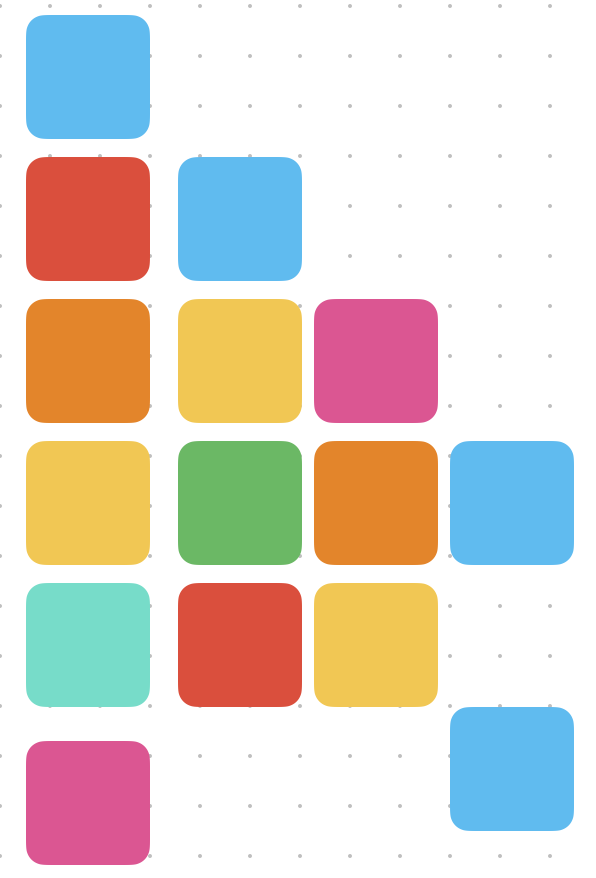
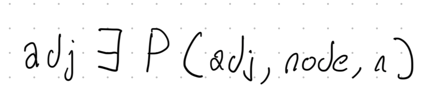

# A Flock of Swifts

We are a group of people excited by the Swift language. We meet each Saturday morning to share and discuss Swift-related topics. 

All people and all skill levels are welcome to join.  
**RSVP**: https://www.meetup.com/A-Flock-of-Swifts/

## Archives

- [2020 Meetings](2020/README.md)
- [2021 Meetings](2021/README.md)
- [2022 Meetings](2022/README.md)
- [2023 Meetings](2023/README.md)
- [2024 Meetings](2024/README.md)

---

## Notes

## 2025.05.31

We discussed some other meetups:
  * https://links.iosdevhappyhour.com
  * https://lu.ma/core-coffee
We discussed solving the [Valid Palindrome](https://leetcode.com/problems/valid-palindrome/) problem and how the particulars of Swift's String implementation make this different than the solutions in other languages.
We discussed comparing normalized strings:
```swift
let chars: [Character] = ["a", "ä"]
extension Character {
    func isSemanticallyEquivalent(to other: Character) -> Bool {
//        String(self).compare(String(other), options: [.diacriticInsensitive, .caseInsensitive, .widthInsensitive], locale: .current) == .orderedSame
        String(self).folding(options: [.diacriticInsensitive, .caseInsensitive, .widthInsensitive], locale: .current) == String(other).folding(options: [.diacriticInsensitive, .caseInsensitive, .widthInsensitive], locale: .current)
    }
}
print(chars[0].lowercased() == chars[1].lowercased())
print(chars[0].isSemanticallyEquivalent(to: chars[1]))
```swift
Then how to solve the problem: First the indexing solution which shows how RandomAccessCollection works.  YUou should no use this solution in any language since index math is unsafe:
```swift
extension RandomAccessCollection where Element == Character  {
    var isPalindrome: Bool {
        let backwards = reversed()
        var front = indices.first
        var back = backwards.indices.first
        while let unwrappedFront = front, let unwrappedBack = back {
            front = self[unwrappedFront...].firstIndex(where: \.isLetter)
            back = backwards[unwrappedBack...].firstIndex(where:\.isLetter)
            guard let unwrappedFront = front, let unwrappedBack = back  else { return true }
            guard self[unwrappedFront].isSemanticallyEquivalent(to: backwards[unwrappedBack]) else {
                return false
            }
            front = front.map { self.index(after: $0) }
            back = back.map { backwards.index(after: $0)}
        }
        return true
    }
}
```
Next the iterator solution:
```swift
extension BidirectionalCollection where Element == Character {
    var isPalindrome2: Bool {
        var frontIterator = makeIterator()
        var backIterator = reversed().makeIterator()
        var matchCount = 0
        let length = count / 2
        while let front = frontIterator.next(where: \.isLetter), let back = backIterator.next(where: \.isLetter), matchCount < length  {
            guard front.isSemanticallyEquivalent(to: back) else {
                return false
            }
            matchCount += 1
        }
        return true
    }
}

private extension IteratorProtocol where Element == Character {
    mutating func next(where predicate: (Character) -> Bool) -> Character? {
        while let next = next(){
            if predicate(next){
                return next
            }
        }
        return nil
    }
}
```
And finally the functional solution:
```swift
extension String {
    var isPalindrome3: Bool {
        zip(
            lazy.compactMap { $0.isLetter ? $0 : nil },
            reversed().lazy.compactMap { $0.isLetter ? $0 : nil }
        ).prefix(count/2).allSatisfy { $0.isSemanticallyEquivalent(to: $1) }
    }
}
```
## 2025.05.24

Discussion about testing, specifically about testing Combine. 

- https://developer.apple.com/documentation/combine/processing-published-elements-with-subscribers  
- https://github.com/FlineDev/ErrorKit

Carlyn gave us a Swift testing demo and it is awesome. We also went over how to get code coverage 
numbers in Xcode.    
    
- https://developer.apple.com/documentation/testing/migratingfromxctest

Josh talked about how many

- https://www.hyrumslaw.com
    
10:33:45 From Peter Wu to Everyone:
    For larger code bases codecov is nice that you can see the lines not covered in a PR https://about.codecov.io
    

A previous project from Josh (before concurrency) forming a nice example about how to get the buisness logic out of your tests.

- https://github.com/joshuajhomann/DeclarativeTests
  

### Discussion of AI and Coding Tools

- https://openai.com/index/introducing-codex/    
- https://repoprompt.com
- https://pre-commit.com/
- https://aider.chat
    
11:05:51 From carlyn to Everyone:
    https://www.cookiecutter.io
    
### New Swift Playground

From Bob: This is newly released from Marcin Krzyzanowski: a third-party 
“Swift Playground”. https://notepadexe.com/ Looks like fun.
    
---

## 2025.05.17


### Discussion on Apple Developer Ecosystem

- General longing for the simple early days and the wonders of getting new stuff at WWDC.
- Apple behind in server tech? Swift could be a great solution.
- Widgets are not in a great state. Hoping for improvements at WWDC. (Problems around multiprocessing and controlling when they wake up.)    

### Swift Proposals

- https://github.com/swiftlang/swift-evolution/blob/main/proposals/0481-weak-let.md
    

#### Progress

- https://forums.swift.org/t/pitch-progress-reporting-in-swift-concurrency/78112    
- https://forums.swift.org/t/review-sf-0023-progress-reporting-in-swift-concurrency/79474

### Using OpenAPI Generator

- https://developer.apple.com/videos/play/wwdc2023/10171/
- https://www.swift.org/blog/introducing-swift-openapi-generator/
    

### Keyboard Avoidance

- https://www.fivestars.blog/articles/swiftui-keyboard/

### Dependency Management PointFree

A demo of using the dependency management system from pointfree

- https://swiftpackageindex.com/pointfreeco/swift-dependencies/main/documentation/dependencies


### Dependency Management 

Alex showed us a dependency injection tool he created.

- https://swiftpackageindex.com/bealex/Macaroni

### Programming Font

- https://en.wikipedia.org/wiki/PragmataPro
- https://github.com/fabrizioschiavi/pragmatapro
- https://github.com/shytikov/pragmasevka
    

### Swift Easter Egg: Jabberwocky

- https://github.com/swiftlang/swift/blob/44c5f9f4596dcb4d85cc2c61930851508df6c513/benchmark/single-source/CodableTest.swift#L72
    

---

## 2025.05.10


### Upcoming Events

- https://github.com/twostraws/wwdc
- https://communitykit.social/schedule.html


### Swift Concurrency is Awesome
- https://mastodon.social/@Migueldeicaza/114446205671894351
  

### Distributed Actors    

Looking for examples.

- https://www.swift.org/blog/distributed-actors/
    
Example (non-production, proof of concept): https://github.com/franklefebvre/DistributedActors-FrenchKit
    
- https://developer.apple.com/documentation/xpc


### Experiments with containerRelativeFrame    

- https://developer.apple.com/documentation/swiftui/view/containerrelativeframe(_:alignment:)
    

```           
available length = ((container length - safe area) - (spacing x (count - 1))       
column length = available length / count
       
view length = (column length x span) + ((span - 1) x spacing)
```

Here is the code we experimented with:

```swift
    struct ContentView: View {
        var body: some View {
      ScrollView(.horizontal) {
       LazyHStack(spacing: 100) {
        ForEach(0..<20) { item in
         Rectangle()
          .fill([Color.red, .green, .blue][item % 3])
    //      .aspectRatio(3.0 / 2.0, contentMode: .fit)
          .frame(height: 100)
    //      .overlay(Color.yellow.opacity(0.5))
          
          .containerRelativeFrame(
           .horizontal, count: 3, span: 1, spacing: 100)
    //      .overlay(Color.blue.opacity(0.5))
        }
       }
      }
    //  .safeAreaPadding(.horizontal, 20.0)
        }
    }
    
    #Preview {
        ContentView()
    }
```
    

### What is a Crash?

A cool low level exploration:

- https://blog.jacobstechtavern.com/p/what-is-a-crash
    

---

## 2025.05.03

### What's New in Swift 6.1

- https://www.hackingwithswift.com/articles/276/whats-new-in-swift-6-1
    

### Deep Dish Videos

- https://www.youtube.com/@DeepDishSwift/streams
- https://deepdishswift.com/#schedule
  
### Swift Mocking

A mocking library announced at Deep Dish from Peter's company fetch-rewards!

- https://swiftpackageindex.com/fetch-rewards/swift-mocking    
- https://github.com/fetch-rewards/swift-mocking


### SSE Server Streaming Events

- https://github.com/launchdarkly/swift-eventsource    
- https://github.com/Recouse/EventSource

Carlyn's experiments on the subject.

- https://github.com/carlynorama/APItizer/blob/main/Sources/APItizer/SSEListener.swift

---

## 2025.04.26


### Concurrency Changes

    https://swiftpackageindex.com/fetch-rewards/swift-mocking
    

Peter took us on a blog post tour:

- https://www.avanderlee.com/concurrency/swift-6-2-concurrency-changes/
 

### Better Sounds

Exploring the sounds that are available:

```
    import AVFoundation
    var greeting = "Hello, playground"
    
    let systemSoundIDs: [SystemSoundID] = Array(1000...4000).map { SystemSoundID($0)}
    
    for id in systemSoundIDs {
    //    AudioServicesPlaySystemSoundWithCompletion(id) {
    //        print(id)
    //        return
    //    }
        AudioServicesPlaySystemSound(id)
        AudioServicesPropertyID(systemSoundIDs[0])
    }
```

Tutorial for creating system sounds (with a funny ending):    
    
- https://www.youtube.com/watch?v=TjmkmIsUEbA
    

Haptics might be a useful semantic way to get some sounds:

- https://developer.apple.com/documentation/corehaptics/delivering-rich-app-experiences-with-haptics


### Backups

"321" - Three copies of your data, two formats, one offsite.

"Just use Backblaze."

---

## 2025.04.19

### Using Ignite

Paul Hudson's static website builder, Ignite, continues to be awesome to use. Mihaela 

- https://aleahim.com

Talked about how to use your own custom domain.

- https://docs.github.com/en/pages/configuring-a-custom-domain-for-your-github-pages-site/managing-a-custom-domain-for-your-github-pages-site

Useful for debugging DNS issues:

https://dnschecker.org/    


### try! Swift Tokyo Conference

- https://www.youtube.com/@trySwiftConference/videos
  

Along with some of Frank's picks:

- https://www.youtube.com/watch?v=eQefdC2xDY4    
- https://www.youtube.com/watch?v=xtXaxMlFI6M&pp=0gcJCX4JAYcqIYzv
    

Learning Regex:    
- https://regexcrossword.com
- https://regex101.com
    
Example: let regex = /^([1-9]\d{0,2}(\,\d{3})*|([1-9]\d*))(\.\d{2})?$/
    
From Apple:

- https://developer.apple.com/videos/play/wwdc2022/110357
- https://developer.apple.com/videos/play/wwdc2022/110358


### Why Chris Eidhof avoids Group
    
- https://chris.eidhof.nl/post/why-i-avoid-group/
    
SwiftUI works more consistently if you have a single stable view at the root of your hierarchy.

### SwiftUI and Identity    

```swift
// Single identity
// .clear option becomes a no-op 
ViewWithState()
    .background(flag ? .red : .clear)
    .animation(.easeInOut(duration: 2), value: flag)
```

As Josh points out, you still get the space taken.

```swift    
struct ContentView: View {
    var body: some View {
        VStack {
            Image(systemName: "globe")
                .imageScale(.large)
                .foregroundStyle(.tint)
            Text("Hello, world!").opacity(0.0)
            Text("a")
        }
        .padding()
    }
}
```

### New Development Environments (Design tools)


- https://createwithplay.com

Firebase

- https://www.firebasestudio.vip
- https://firebase.google.com

### Learning Xcode Instruments

A new cohort of the epic instruments workshop is going to run in May:
- https://swift-virtuoso.com
    
### Presentation: Removing Combine

Josh started a presentation about the tooling that you can build in order 
to ditch import Combine.

Tools we reviewed this week:

- Subject
- Subscriptions
- ViewModel

One more abstraction to build next week and we will be ready to convert apps.

Source code TBD.

---

## 2025.04.12

### Async Discussion

When should you dispatch to the background?

No clear rule. Measure. An example from Josh:

```swift
import SwiftUI

@Observable
@MainActor
final class VM {
    var names: [String] = []
    func sort() async {
        async let sortedNames = { [names] in
            names.sorted()
        }()
        names = await sortedNames
    }
}
```

Peter brings up the point about re-entrancy. That leads to a discussion
about implementing switch map.

https://rxmarbles.com

- FlatMap in Combine is Merge Map
- FlatMap in AsyncAlgorithms is concatMap

There are many ways to flatten such as exhaustMap.

- https://rxjs.dev/api/operators/exhaustMap

Here is a manual way of doing it:

```swift
@Observable
@MainActor
final class VM {
    var names: [String] = []
    var sortTask: Task<[String], Error>?
    func sort() async {
        sortTask?.cancel()
        let sortTask = Task.detached { [names] in
            try await Task.sleep(for: .seconds(1))
            return names.sorted()
        }
        self.sortTask = sortTask
        do {
            names = try await sortTask.value
        } catch {
            switch error {
            case is CancellationError: print("task was canceled")
            default: print(error.localizedDescription)
            }
        }
    }
}
```

### Xcode Preview Bug

Ed filed feedback on Xcode previews always flipping back to their default (half screen) size.


### Benchmarking

How can you be sure that a better abstraction isn't slowing down your code too much. How can you
measure it?  It is a hard problem.

### Swift Evolution Proposal Review


#### Yielding Accessors

- https://github.com/swiftlang/swift-evolution/blob/main/proposals/0474-yielding-accessors.md


#### Observed

- https://github.com/swiftlang/swift-evolution/blob/main/proposals/0475-observed.md


### Swift Forums

There is a lot of detailed, amazing information on them.  Peter wonders where they get the time
to make these long, detailed posts.

You can find the pitches (pre-proposal stage) on the forums:

https://forums.swift.org/c/evolution/pitches/5


---

## 2025.04.05

### Discussion on SwiftData

Some key debugging tips:

- https://www.avanderlee.com/debugging/core-data-debugging-xcode/
    

You can see the underlying SQL commands: `-com.apple.CoreData.SQLDebug 1`
    
- https://developer.apple.com/documentation/swiftdata/adding-and-editing-persistent-data-in-your-app  
    
10:12:17 From Josh Homann to Everyone:
    https://www.hackingwithswift.com/quick-start/swiftui/how-to-dismiss-the-keyboard-for-a-textfield
    
10:13:21 From Josh Homann to Everyone:
    https://developer.apple.com/documentation/uikit/synchronizing-documents-in-the-icloud-environment
    
10:18:42 From Ray Fix to Everyone:
    https://www.pointfree.co/blog/posts/168-sharinggrdb-a-swiftdata-alternative
    

New in iOS 18 there are notifications for SwiftData that you can lisen to.

- https://developer.apple.com/documentation/swiftdata/modelcontext/notificationkey

Recommended reading for SwiftData:

- https://fatbobman.com/en/tags/SwiftData/

### Modular Apps
    
Mihaela MJ is working on a modular framework. Here is a working sample project

https://github.com/mihaelamj/Formidabble

### Design Patterns

It is always possible to convert between level and edge based events.

```swift
    Publishers.Merge(
        NotificationCenter.default.publisher(for: NSApplication.willResignActiveNotification).map { _ in false },
        NotificationCenter.default.publisher(for: NSApplication.willBecomeActiveNotification).map { _ in true }
    )
    .prepend(true)
```

Looking deeper at Patterns with Josh (such as the iterator pattern):


```swift
extension Sequence {
  static func +<Right: Sequence>(lhs: Self, rhs: Right) -> ConcatenatedSequence<Self, Right, Element> {
    ConcatenatedSequence(leftSequence: lhs, rightSequence: rhs)
  }
}
    
struct ConcatenatedSequence<Left: Sequence<Value>, Right: Sequence<Value>, Value>: Sequence {
  typealias Element = Value
  var leftSequence: Left
  var rightSequence: Right
  func makeIterator() -> Iterator {
      .init(leftIterator: leftSequence.makeIterator(), rightIterator: rightSequence.makeIterator())
  }
  struct Iterator: IteratorProtocol {
      typealias Element = Value
      var leftIterator: Left.Iterator
      var rightIterator: Right.Iterator
      mutating func next() -> Value? {
          leftIterator.next() ?? rightIterator.next()
      }
  }
}
    
let a = [1,2,3] + Set([4,5,6])
for value in a {
    print(value)
}
``` 

```swift
extension Sequence {
  static func +(lhs: Self, rhs: some Sequence<Element>) -> some Sequence<Element> {
    sequence(
        state: (
                leftIterator: lhs.makeIterator(),
                rightIterator: rhs.makeIterator()
        )
    ) { state in
          state.leftIterator.next() ?? state.rightIterator.next()
    }
}
```    

---

## 2025.03.29

### Instruments

A new video tutorial from Apple about instruments. 90 minutes long.

- https://developer.apple.com/tutorials/instruments

### Swift 6: What am I missing?

If you go to the evolution website:

- https://www.swift.org/swift-evolution/
    
You can apply the filters "Implemented" and then the versions you are interested in
such as Swift 6, Swift 6.1, Swift 6.2 to see what features are available.

### Vibe Coding

An interesting article (via Josh) about a potential future for the industry.

- https://irace.me/vibe

Gemini 2.5 model is new model that does a lot of stuff correctly that other models don't seem to be able to.

- https://www.youtube.com/watch?v=RxCZhltR9Cw
    
Someone mentioned that Claude is good for interactive Vibe coding.

### Presentation: GoF: Design Patterns in Swift

Josh H. presented about the classic "Gang of Four" Design patterns--it is a common lexicon that can be used
to communicate with other developers or even machines using prompts.


#### Creational Patterns

These focus on object creation mechanisms, promoting better encapsulation and system independence.
    
- **Factory Method:** Defines an interface for creating objects, letting subclasses decide the class to instantiate.
- **Abstract Factory:** Provides an abstract factory class that creates families of related objects.
- **Builder:** Separates object construction from its representation, enabling different representations through the same process.
- **Prototype:** Creates objects by cloning existing instances rather than using constructors.
- **Singleton:** Ensures a class has only one instance and provides global access to it.
    
#### Structural Patterns

These focus on how classes and objects can be composed to form larger structures.

- **Adapter:** Converts an interface to another, allowing incompatible classes to work together.
- **Decorator:** Dynamically adds responsibilities to objects by wrapping them in decorator classes.
- **Proxy:** Acts as a placeholder for an object, controlling access and handling tasks like lazy loading.
- **Facade:** Provides a simplified interface to a complex system, reducing exposed complexity.
- **Composite:** Treats individual and composite objects uniformly, useful for tree structures.
- **Flyweight:** Shares data among multiple objects to reduce memory usage.
    

#### Behavioral Patterns
    
These focus on how classes interact and the responsibilities of objects within a system.

- **Strategy:** Encapsulates algorithms, allowing selection at runtime based on conditions.
- **Observer:** Establishes a one-to-many dependency, notifying dependents of state changes.
- **State:** Changes object behavior when its internal state changes.
- **Chain of Responsibility:** Passes requests along a chain of handlers until one handles it.
- **Command:** Encapsulates requests as objects for operations like logging and undo/redo.
- **Iterator:** Accesses aggregate elements sequentially without exposing the structure.
- **Mediator:** Reduces coupling between classes by encapsulating interactions.
- **Memento:** Captures and restores object state, useful for undo/redo functionality.
- **Visitor:** Adds methods to objects without changing their classes, useful for operations across sets of objects.
- **Template Method:** Defines an algorithm skeleton in a base class, letting subclasses implement specific steps.
    

### Other Patterns

Peter mentioned a pattern that he has been looking into

- https://swiftology.io/articles/typestate/
 

Alex mentioned one of his favorites: "Inversion of Control 🙂"

---

## 2025.03.22

### Discussion

Ray shared a recent experience with upgrading XCTest to Swift Testing.
The migration was straightforward in Xcode and there is a good migration
guide.

- https://developer.apple.com/documentation/testing/migratingfromxctest
    

### Swift Evolution

Related to Swift testing, this proposal means you can use a short description with spaces and punctuation 
as the name of your test:

- https://github.com/swiftlang/swift-evolution/blob/main/proposals/0451-escaped-identifiers.md

Josh also taked about a new addition to the language which lets you better hide implementation details.
  
- https://github.com/swiftlang/swift-evolution/blob/main/proposals/0409-access-level-on-imports.md


### Swift Packages    

Talked about modularization.

You can set the library type to statically or dynamically link packages. 

https://developer.apple.com/documentation/packagedescription/product/library(name:type:targets:)
    

CoreData in packages needs to be handled specially: https://ishabazz.dev/blog/2020/7/5/using-core-data-with-swift-package-manager
    

### Other discussion
    
From Ed returning integers as a blob of bytes:

```swift
extension FixedWidthInteger {
  var data: Data {
    let data = withUnsafeBytes(of: self) { Data($0) }
    return data
  }
}
```

From Josh (another way to deserialize)

```swift
enum JSON {
    indirect case array([JSON])
    indirect case dictionary([String: JSON])
    case boolean(Bool)
    case number(Double)
    case string(String)
    case null
}
    
extension JSON: Decodable {
    init(from decoder: Decoder) throws {
        self = try Result { try decoder.singleValueContainer() }
            .flatMap { container in
                container.decodeNil()
                    ? .success(JSON.null)
                    : Result { JSON.boolean(try container.decode(Bool.self)) }
                        .flatMapError { _ in Result { JSON.number(try container.decode(Double.self)) } }
                        .flatMapError { _ in Result { JSON.string(try container.decode(String.self)) } }
                        .flatMapError { _ in Result { JSON.array(try container.decode([JSON].self)) } }
                        .flatMapError { _ in Result { JSON.dictionary(try container.decode([String: JSON].self)) } }
             }.get()
    }
}
```    

---

## 2025.03.15

### Discussion 

How to cleanup space on your disk.

#### Daisydisk
- https://apps.apple.com/us/app/daisydisk/id411643860?mt=12
- https://daisydiskapp.com    


#### Hyperspace to delete duplicates

- https://hypercritical.co/hyperspace/

#### OmniDiskSweeper

- A free app from OmniGroup: 

- https://www.omnigroup.com/more
    
### Presentation: Recent Swift Evolution Topics

MutableSpan: https://github.com/swiftlang/swift-evolution/blob/main/proposals/0467-MutableSpan.md

To understand borrowing and consuming we looked at some of the 

```swift
static func embiggened(_ value: [Int]) -> [Int] {
    var mutableValue = value
    for index in mutableValue.indices {
        mutableValue[index] += 1
    }
    return mutableValue
}

static func embiggened(byBorrowing value: borrowing [Int]) -> [Int] {
    var mutableValue = copy value
    for index in mutableValue.indices {
        mutableValue[index] += 1
    }
    return mutableValue
}
static func embiggen(byExclusiveBorrow value: inout [Int]) {
    for index in value.indices {
        value[index] += 1
    }
}
static func embiggen(byConsuming value: consuming [Int]) -> [Int] {
    for index in value.indices {
        value[index] += 1
    }
    return consume value
}
    
let a = [1, 2, 3]
let b = embiggen(byConsuming: a)
print(a,b)
```    

### Presentation: Replacing Combine with Modern Concurrency

Josh continued with a topic from last week about how to replace combine
with modern Swift concurrency. This week Josh created a `Pipe` abstraction
to allow multiple observers of a sent value (much like notification center).

```swift
import Foundation
import Synchronization
    
public final class Pipe<Value: Sendable>: Sendable, AsyncSequence {
    public typealias Stream = AsyncStream<Element>
    public typealias AsyncIterator = Stream.AsyncIterator
    public typealias Element = Value
    private let lockedContinuations: Mutex<[UUID: Stream.Continuation]>
    private let replayCount: Int
    public init(replay: Int = 0) {
        replayCount = replay
        lockedContinuations = .init([:])
    }
    deinit {
        lockedContinuations.withLock { continuations in
            continuations.values.forEach { $0.finish() }
        }
    }
    public func send(_ value: Value) {
        lockedContinuations.withLock { continuations in
            continuations.values.forEach { $0.yield(value) }
        }
    }
    
    public func makeAsyncIterator() -> AsyncIterator {
        let (stream, continuation) = Stream.makeStream(of: Element.self,
                bufferingPolicy: .bufferingNewest(replayCount))
        let id = UUID()
        continuation.onTermination = { [weak self] _ in
            self?.lockedContinuations.withLock { $0[id] = nil }
        }
        lockedContinuations.withLock { $0[id] = continuation }
        return stream.makeAsyncIterator()
    }
}
```    


---

## 2025.03.08

### Instruments

James Dempsey has a new online course that teaches the ins and outs of Apple Instruments:

- https://swift-virtuoso.com

Also, there is a new Processor Trace Instrument that uses low level hardward on the M4 and iPhone 16 to collect very detailed metrics about performance.

https://developer.apple.com/documentation/xcode/analyzing-cpu-usage-with-processor-trace?changes=la
    

### OpenAI on Xcode
Chatgpt Xcode: https://help.openai.com/en/articles/10119604-work-with-apps-on-macos
    

### Running a VM on macOS

    macOS VM: https://arstechnica.com/gadgets/2022/07/how-to-use-free-virtualization-apps-to-safely-test-the-macos-ventura-betas/
    

### Syncing across devices
    
- NSUnibiquitousKeyValueStore https://developer.apple.com/documentation/foundation/nsubiquitouskeyvaluestore
- CKAsset to sync user data: https://developer.apple.com/library/archive/documentation/DataManagement/Conceptual/CloudKitQuickStart/AddingAssetsandLocations/AddingAssetsandLocations.html#//apple_ref/doc/uid/TP40014987-CH6-SW2
    

### URL Encoding Game State    

Ways to crunch down the JSON so it can be URL encoded.

- https://www.whynotestflight.com/excuses/how-do-custom-encoders-work/    
- https://github.com/SomeRandomiOSDev/CBORCoding
- https://cbor.io/impls.html
- https://msgpack.org

Using a server:    

A large infrastructure:

- https://www.swift.org/blog/how-swifts-server-support-powers-things-cloud/


Smaller deployments:

- https://fosdem.org/2025/schedule/event/fosdem-2025-4592-your-first-aws-lambda-function/
- https://rambo.codes/posts/2021-12-06-using-cloudkit-for-content-hosting-and-feature-flags


### Industry Compensation

- https://newsletter.pragmaticengineer.com/p/trimodal    
- https://www.levels.fyi/t/software-engineer?countryId=254
    

### Presentation (Josh): Removing @StateObject

Previously, Josh demostrated how SwiftUI can use Combine to achieve lazy initialization
and prevent repeated re-initialization of a view model of a view in a timeline view
using StateObject.

Inspired by this blog post:

- https://fatbobman.com/en/posts/lazy-initialization-state-in-swiftui/
    

Josh created a special property wrapper ViewModel that does the same thing and means 
you don't need to use StateObject or derive from Combine's ObservableObject.


```swift
import SwiftUI
import PlaygroundSupport
    
PlaygroundPage.current.setLiveView(ContentView())
    
struct ContentView: View {
    var body: some View {
        TimelineView(.periodic(from: .now, by: 3)) { _ in
            let _ = print("-----------\(Date.now)-----------")
            V()
        }
    }
}
    
struct V: View {
    var vm = VM("naked var")
    @State var vm0 = VM("@State")
    @ViewModel var vm1 = VM("@ViewModel")
    var body: some View {
        Text(vm.text)
        Text(vm0.text)
        Text(vm1.text)
    }
}
    
@Observable
final class VM {
    var text: String
    init(_ text: String) {
        self.text = text
        print("Init \(text)")
    }
    deinit {
        print("Deinit \(text)")
    }
}
```    

Here is the property wrapper:

```swift
@propertyWrapper
struct ViewModel<Wrapped: AnyObject & Observable>: DynamicProperty {
    @State private var reference: Reference
    var wrappedValue: Wrapped {
        reference.value
    }
    var projectedValue: Bindable<Wrapped> {
        reference.bindable
    }
    init(wrappedValue make: @autoclosure @escaping () -> Wrapped) {
        _reference = State(wrappedValue: Reference(make))
    }
}
    
extension ViewModel {
    final class Reference {
        private var viewModel: Wrapped?
        private let makeViewModel: () -> Wrapped
        lazy var value: Wrapped = makeViewModel()
        lazy var bindable = { Bindable(value) }()
        init(_ make: @escaping () -> Wrapped) {
            makeViewModel = make
        }
    }
}
```    


---

## 2025.03.01


### FOSDEM

There were a lot of Swift topics presented at this years FOSDEM (Free Open Source Developers European Meeting) that have been
organized for viewing here:

- https://swiftlang.github.io/event-fosdem/

### SwiftUI Fundamentals

A new book about SwiftUI from Natalia Panferova of nilcoalecing is available. Bob DeLaurentis says that it does a great job in 
explaining some of the subtleties of the framework.

- https://books.nilcoalescing.com/swiftui-fundamentals
    

### Electronic Readers

This led to a discussion about books and apps for reading ebooks.

- Remarkable: https://remarkable.com  (https://www.amazon.com/dp/B0CZ9VFQ2P)
- Meebook ebook reader    
- https://www.amazon.ae/AZMXDVP-Meebook-P78-Adjustable-Micro-SD/dp/B09Q37DFJ7
- https://www.liquidtext.net
- Boox Palma: https://shop.boox.com/products/palma
- https://supernote.com/products/supernote-nomad


### Forward Progress and Concurrency

Led by Peter and Josh, we discussed concurrency and the tools to guarantee forward progress.

- https://github.com/swiftlang/swift-evolution/blob/main/proposals/0433-mutex.md


To visualize / test restricting cooperative thread pool:  https://alejandromp.com/development/blog/limit-swift-concurrency-cooperative-pool/

A key insight is the ability to use `LIBDISPATCH_COOPERATIVE_POOL_STRICT=1` to make sure forward progress is always being made.

This is the thread on forum that goes in-depth on lock ownership and safety in using across suspension point https://forums.swift.org/t/incremental-migration-to-structured-concurrency/54939/5
    

Assert that you are on a specific queue https://developer.apple.com/documentation/dispatch/dispatchprecondition(condition:)
    
10:33:29 From Mihaela MJ to Everyone:
    https://github.com/siteline/swiftui-introspect


### New Isolation Guarantees
    
Josh gave us a tour of proposal 0461 and how it makes things more similar between sync and async methods.

- https://github.com/swiftlang/swift-evolution/blob/main/proposals/0461-async-function-isolation.md
    

```swift
import Foundation
    
final class Q {
    func sync() {
        MyActor.assertIsolated()
        print("synchronous Q")
    }
    nonisolated func nonSync() async {
        MyActor.assertIsolated()
        print("asynchronous Q")
    }
}
    
@MyActor
final class P {
    var q = Q()
    func doStuff() async {
        q.sync()
        async let v = q.nonSync()
        let _ = await v
    }
}
    
@globalActor
actor MyActor: GlobalActor {
    static let shared = MyActor()
    private init() { }
}
    
Task {
    let p = await P()
    await p.doStuff()
}
```


### Making UI around Command line

Some useful tools!

- https://forums.swift.org/t/review-sf-0007-introducing-swift-subprocess/70337   
- https://github.com/apple/swift-argument-parser
    

Also, some code from Carlyn:

```swift
@discardableResult
func shellOneShot(_ command: some StringProtocol) throws -> String {
   let task = Process()
   let pipe = Pipe()
       
   task.standardOutput = pipe
   task.standardError = pipe
   task.arguments = ["-c", command]
       
   //task.currentDirectoryURL
   //task.qualityOfService
   //task.environment = ProcessInfo.processInfo.environment
       
   task.standardInput = nil
   task.executableURL = URL(fileURLWithPath: "/bin/zsh")
   try task.run()
       
   let data = pipe.fileHandleForReading.readDataToEndOfFile()
   let output = String(data: data, encoding: .utf8)!
       
   task.waitUntilExit()
    
   if task.terminationStatus == 0 || task.terminationStatus == 2 {
     return output
   } else {
     print(output)
     throw CustomProcessError.unknownError(exitCode: task.terminationStatus)
   }
}

@discardableResult
func runProcess(_ tool:URL, arguments:[some StringProtocol] = [], workingDirectory:URL? = nil) throws -> String {
    let task = Process()
    let pipe = Pipe()
        
    task.standardOutput = pipe
    task.standardError = pipe
    task.arguments = arguments
        
    if let workingDirectory {
        task.currentDirectoryURL = workingDirectory
    }
    //task.qualityOfService
    //task.environment
    
    task.standardInput = nil
    task.executableURL = tool
    try task.run()
        
    let data = pipe.fileHandleForReading.readDataToEndOfFile()
    let output = String(data: data, encoding: .utf8)!
        
    task.waitUntilExit()
    
    if task.terminationStatus == 0 || task.terminationStatus == 2 {
      return output
    } else {
      print(output)
      throw CustomProcessError.unknownError(exitCode: task.terminationStatus)
    }
    }

enum CustomProcessError: Error {
  case unknownError(exitCode: Int32)
}
```

### Apple Vision Pro Meeting

Apparently there was an interesting (mostly non-code meeting) by Apple last week about
how to develop "experiences" of vision pro. Ed atteneded online and John B was there in-person.
Four sessions over the course of the day.

Apparently they had a demo where they showed how to render the experience of being on the moon.

```none
    Environment metrics
    Geometry: 20K-500K total triangles
    View: -100K triangles per camera angle
    Memory: Less than 250MB total texture data
    Entities: Under 200 draw calls
    Materials: Unlit with custom shader effects
```
    
---


## 2025.02.22

### Concurrency in Legacy Code

Questions from Rainer about how to use concurrency effectively in legacy code.

We talked about where things run and how the default might change in future versions
of Swift.


Link from Peter:

- https://developer.apple.com/documentation/swift/mainactor/assertisolated(_:file:line:)

Examples from Josh:

```swift
struct A {
    //@MainActor
    nonisolated func a() {
        Task {
            MainActor.assertIsolated()
        }
    }
}

Task {
     A().a()
}


```

Instead of falling back to using Combine (which bring tech debt with it), a suggestion from Josh to make
simple abstractions to avoid creating Tasks everywhere.

    
```swift
extension AsyncSequence where Failure == Never {
    func subscribe<Unretained: AnyObject>(withUnretained object: Unretained, onNext: @escaping (Unretained, Element) -> Void) -> Task<Void, Never> {
        Task { [weak object] in
            for await value in self {
                guard let object else { return }
                onNext(object, value)
            }
        }
    }
}
```

Can be used like this:

```swift
actor A {
    var subscription: Task<Void, Never>?
     func a()  {
         let (output, input) = AsyncStream.makeStream(of: Int.self, bufferingPolicy: .bufferingNewest(1))
         subscription = output.subscribe(withUnretained: self) { unretained, value in
             print(unretained, value)    
         }
         input.yield(1)
         input.yield(2)
         input.yield(3)
    }
}
```
 
### Protocol Composition   

- https://developer.apple.com/documentation/swiftui/viewbuilder/buildeither(first:)


### File System

This came up in the context of Peter's custom image caching problem.

Some notes from Carlyn:

- https://www.whynotestflight.com/excuses/how-to-do-some-basic-file-handling/
- https://forums.swift.org/t/what-is-the-best-way-to-work-with-the-file-system/71020/17
- https://github.com/apple/swift-nio-examples/blob/4bd02d14e6309bbd722b64f6de17855326aa1145/backpressure-file-io-channel/Sources/BackpressureChannelToFileIO/FileIOChannelWriteCoordinator.swift#L17 
- https://github.com/apple/swift-nio/tree/5f60ceeca072475252ca1ad747bd1156a370fe5d/Sources/NIOFileSystem
  

Using custom executors (Josh)

- https://github.com/swiftlang/swift-evolution/blob/main/proposals/0392-custom-actor-executors.md
- https://www.swift.org/migration/documentation/swift-6-concurrency-migration-guide/incrementaladoption
    

```swift
actor LandingSite {
    private let queue = DispatchSerialQueue(label: "something")

    nonisolated var unownedExecutor: UnownedSerialExecutor {
        queue.asUnownedSerialExecutor()
    }
    
    func acceptTransport(_ transport: PersonalTransportation) {
        // this function will be running on queue
    }
}
```
    
10:35:09 From carlyn to Everyone:
    private func appendData(data: Data) throws {
        let fileHandle = try FileHandle(forWritingTo: storageUrl)
        fileHandle.seekToEndOfFile()
        fileHandle.write(data)
        fileHandle.closeFile()
      }

Creating a custom global actor:

```swift
@globalActor actor SharedActor {
  static let shared = SharedActor()
}
    
@SharedActor final class A { }
@SharedActor final class B { }
```

- Actor all implicitly conform to the Actor protocol https://developer.apple.com/documentation/swift/actor
- Swift Concurrency and Instruments https://developer.apple.com/videos/play/wwdc2022/110350

### Delphi Style Components

Starting with Package definitions. From MJ

```swift
// Dependency grouping
enum Dependencies {
    static var common: [Target.Dependency] {
        [
            .product(name: "Difference", package: "Difference"),
            .product(name: "LifetimeTracker", package: "LifetimeTracker"),
        ]
    }
}

    .target(
         name: "SharedModels",
         dependencies:
            Dependencies.common + [
                "AutomaticSettings",
            ]
    ),
```    

These ideas come from:

- https://www.swiftystack.com/curriculum
    

Related: 

```swift
@_exported import PackageName
```

For details see:

- https://github.com/swiftlang/swift/blob/main/docs/ReferenceGuides/UnderscoredAttributes.md
    

### Interesting Links
    

- New Junior Developers Can’t Actually Code: https://nmn.gl/blog/ai-and-learning
- Cybersecurity and AI https://cset.georgetown.edu/publication/cybersecurity-risks-of-ai-generated-code/
- Swift Navigation https://github.com/pointfreeco/swift-navigation
    

### Ed's Hex Tac Toe in Beta Review

Hex Tac Toe is waiting for Apple beta review.  Anyone else want to be 
on the beta, send your Apple email (DM).  I have all the ones from before.


---


## 2025.02.15

Peter worked on a caching system for an app and wanted feedback for
how it could be improved. The basic app is here:

https://github.com/PeterWu9/Recipes


A recommendation from Josh to use the headers in the HTTP response headers:

- https://developer.mozilla.org/en-US/docs/Web/HTTP/Headers/Cache-Control
    
Also related:
- https://developer.apple.com/documentation/foundation/nsurlcache
    
- Async file reading https://losingfight.com/blog/2024/04/22/reading-and-writing-files-in-swift-asyncawait/

### SwiftUI View Builders


View builder returns some View which is a container view like `ConditionalContent`.

```swift    
struct W: View {
    let a: Int
    @ViewBuilder
    var body: some View {
        switch a {
        case ..<0: Text("Negative")
        case 0: Text("Zero")
        case 1... : Color.green
        default: EmptyView()
      }
    }
}
```
    

### SwiftUI Navigation Bug

Joe shared this SwiftUI navigation bug:

```swift
struct ContentView: View {
    var body: some View {
        NavigationStack {
            NavigationLink {
                Text("Do not tap back, you'll regret it")
                    .toolbarBackground(.visible, for: .navigationBar)
                    .toolbarBackground(Color.orange, for: .navigationBar)
                    .toolbarColorScheme(.dark, for: .navigationBar)
            } label: {
                VStack {
                    Text("First page is the sweetest")
                }               
                .padding()
            }
            .navigationTitle("First Page")
            .toolbarBackground(.visible, for: .navigationBar)
            .toolbarBackground(Color.orange, for: .navigationBar)
            .toolbarColorScheme(.dark, for: .navigationBar)
        }
    }
}
```

### Sequencing Animations    
    

Sample from Josh:

```swift
    withAnimation(animation, completionCriteria: .logicallyComplete) {
                operation()
            } completion: {
                continuation.resume()
            }
```


### Swift Blog gRPC 2
    
-  https://www.swift.org/blog/grpc-swift-2/
    

---

## 2025.02.08

### Discussions

- Creating a multi-platform framework bundle. https://developer.apple.com/documentation/xcode/creating-a-multi-platform-binary-framework-bundle/
    

- Integer generic parameters are going to be a thing. https://github.com/swiftlang/swift-evolution/blob/main/proposals/0452-integer-generic-parameters.md
    
- New InlineArray type. https://github.com/swiftlang/swift-evolution/blob/main/proposals/0453-vector.md
    
- Transferable protocol
    https://developer.apple.com/documentation/CoreTransferable/Transferable
    

### Assistive Technology

- App Intents https://developer.apple.com/videos/play/wwdc2024/10134/
- Guided Access https://www.theseniorlist.com/cell-phones/assistive-access/
- https://www.ninjaone.com/blog/ipad-kiosk-mode/
    
09:57:53 From Josh Homann to Everyone:
    Request sharing in FaceTime: https://support.apple.com/guide/iphone/request-give-remote-control-a-facetime-call-iph5d70f34a3/ios
    

### Hacking Problem
    

Puzzle from John Brewer

```swift
var test3 = [-1, 1, 2, 3, 4, -1, -9, -6, 10, 1, -5]
print(largestSumSpan(array: test3)) // [10, 1]
var test4 = [-1, 1, 2, 3, 4, -1, -9, -6, 8, 1, -5]
print(largestSumSpan(array: test4)) // [1, 2, 3, 4]
```
What is the best idiomatic Swift to handle this?

```swift    
print(missingPair([1, 2, 3, 4, 5, 6, 7, 8, 9, 8, 7, 6, 5, 4, 3, 2, 1]))
9
```

There is a "trick" to this one which to xor all of the bits.

Related book
    
- https://www.amazon.com/Hackers-Delight-2nd-Henry-Warren-dp-0321842685/dp/0321842685/ref=dp_ob_title_bk
    

---


## 2025.02.01

### Resources and SwiftPM

- Peter was able to make a common target that other targets could depend on.

Exciting announcement Carlyn let us know about is that Swift Build (used by Xcode)
is, as of today, an open source technology. It will support Windows and Linux.

- https://forums.swift.org/t/evolving-swiftpm-builds-with-swift-build/77596/2

Also, the official announcement:

https://www.swift.org/blog/the-next-chapter-in-swift-build-technologies/

We looked at conditional package inclusion. You can conditionalize based on
platform but it doesn't look like there are too many other options.

An example from Mihaela:

```swift
    .product(name: "ResChatHouUIKit", package: "ResChatHouUIKit", condition: .when(platforms: [.iOS])),
                    .product(name: "ResChatUIKit", package: "ResChatUIKit", condition: .when(platforms: [.iOS])),
                    .product(name: "ResChatHouAppKit", package: "ResChatHouAppKit", condition: .when(platforms: [.macOS])),
                    .product(name: "ResChatAppKitUI", package: "ResChatAppKitUI", condition: .when(platforms: [.macOS])),
                    ]
            ),
```

### Swift Playgrounds App

Now supports Swift 6.  You may need to remove previous versions.
- https://apps.apple.com/us/app/swift-playground/id1496833156?mt=12

### Hex Tac Toe

Ed is working on his game hex-tac-toe.  Lots of suggestions for how to improve.


### Other random stuff

It is an open source airdrop thing but written in Flutter:

- https://localsend.org

Josh demo'ed LLMs including deepseek on your local machine:

- https://ollama.com/library/deepseek-r1
    

You can run in from within a UI too that supports many models.

- https://chatboxai.app/en

---

## 2025.01.25

- How to share resources among multiple Swift packages.
- Continued working on Mine Sweeper

---

## 2025.01.18

### Making CoW Types Sendable

We modernized a small app to Swift 6. Making a type CoW and isolating all mutation
allows you to declare a type sendable. The mutable state is not shared so these 
properties can be marked sendable (unsafe).

### Performance

Measure the performance of a new collection type using the Swift performance package.

https://www.swift.org/blog/benchmarks/


### Mine Sweeper

Continued the mine sweeper example.

---

## 2025.01.10

### Debugging SceneKit Audio

We spent some time debugging a problem with a SceneKit app that was leaking audio players.

### Animating Text

Rainer was trying to animate text along a Bézier curve.

Josh reminded us of this project example from last year:

- https://github.com/aflockofswifts/meetings/tree/main/2024#20240518

Also, a Primer on Bézier curves: https://pomax.github.io/bezierinfo/
    

Rainer noted that the example he was trying to emulate: 

- https://github.com/objcio/S01E166-geometry-effects
  

His code here:
  
- https://github.com/minsOne/custom-ui-prototype-in-swiftui
  

### Continuing the Mine Sweeper Example

This week we looked at a serious performance problem in what we built so far.
Changing the color of a handful of tile taking almost a second to perform.

A nice video from Ben Cohen about Fast Safe Mutable State:

- https://www.youtube.com/watch?v=BXJIIQ-B4-E
    

An internal way to do in-place mutation:

- https://jano.dev/apple/2024/12/10/Modify-and-Yield.html
- https://forums.swift.org/t/modify-accessors/31872
    

But the biggest performance win was had by using a properly identifiable type in the ForEach statement of the grid.

---

## 2025.01.03

### A functional solution to Ed's game
  * Ed is making a game where he needs to match n distinct items in a row.  Josh offered a solution in functional swift:
  * We start with an assumption that we have a node, a sequence of adjacencies that can transform a node into another node, and the number of distinct items we want to match
```swift
let n = 6
let adjacency: some Sequence<(Node) -> Node?>
let node: Node
```

  * We can express the algorithm we want to apply as a node represents a winning state if there is a way to transform it into a sequence of n distinct elements. or more formally:

  * Equivalently in swift:
```swift
let isWon = adjacency.contains { [node, n] adjacency in
	Set(sequence(first: node) { adjacency(node)}.prefix(n))).count == n
}
```
  * We can further express our intent with the use of explanatory variables:
```swift
let isWon = adjacency.contains { [node, n] adjacency in
    let adjacentUnique = Set(sequence(first: node) { adjacency(node)}.prefix(n))
	let isWinningRun = adjacentUnique.count == n
	return isWinningRun
}
```
* Ed asked how to get the winning nodes.  We can do this by changing the operator to `compactMap`:
```swift
let winningSets = adjacency.compactMap { [node, n] adjacency in
    let adjacentUnique = Set(sequence(first: node) { adjacency(node)}.prefix(n))
	let isWinningRun = adjacentUnique.count == n
	return isWinningRun ? adjacentUnique : nil
}
.reduce(into: Set<Node>()) { $0.formUnion($1) }
```

### Mine sweeper continued
* We updated the Layout to use a cache and added a viewModel:
```swift
@Observable
final class ViewModel: ObservableObject {
    private(set) var cells: Grid2D<Cell> = .init(rows: 8, columns: 8) { x, y in
        .init(id: x + y * 8, position: .init(x, y), color: .allCases.randomElement()!)
    }
    func tap(index: SIMD2<Int>) {
        cells[index].color = .blue
    }
}

struct Cell: Identifiable, Hashable {
    let id: Int
    let position: SIMD2<Int>
    var color: ViewModel.BoardColor
}

extension ViewModel {
    enum BoardColor: Hashable, CaseIterable {
        case red, green, blue
    }
}

struct ContentView: View {
    @StateObject private var viewModel = ViewModel()
    var body: some View {
        Board(dimension: 8) {
            ForEach(viewModel.cells.indices, id: \.self) { index in
                Group {
                    switch viewModel.cells[index].color {
                    case .red: Color.red
                    case .green: Color.green
                    case .blue: Color.blue
                    }
                }
                .onTapGesture {
                    viewModel.tap(index:  viewModel.cells[index].position)
                }
                .boardPosition(index)
            }
        }
    }
}

extension View {
    func boardPosition(_ position: SIMD2<Int>) -> some View {
        layoutValue(key: BoardPosition.self, value: position)
    }
    func boardPosition(x: Int, y: Int) -> some View {
        boardPosition(.init(x, y))
    }
}

struct Board: Layout {
    let dimension: Int

    func sizeThatFits(proposal: ProposedViewSize, subviews: Subviews, cache: inout Cache) -> CGSize {
        let size = proposal.replacingUnspecifiedDimensions(by: .zero)
        let minimumDimension = min(size.width, size.height)
        return .init(width: minimumDimension, height: minimumDimension)
    }

    func placeSubviews(in bounds: CGRect, proposal: ProposedViewSize, subviews: Subviews, cache: inout Cache) {
        if cache.bounds != bounds {
            cache.bounds = bounds
            cache.cellSize = CGSize(width: bounds.width / Double(dimension), height: bounds.height / Double(dimension))
            let transform = CGAffineTransform
                .identity
                .translatedBy(x: bounds.origin.x, y: bounds.origin.y)
                .scaledBy(x: cache.cellSize.width, y: cache.cellSize.height)
            cache.grid = .init(rows: dimension, columns: dimension) { x, y in
                CGPoint(x: x, y: y).applying(transform)
            }
        }
        for view in subviews {
            let position = cache.grid[safe: view[BoardPosition.self]] ?? bounds.origin
            view.place(
                at: position,
                proposal: .init(cache.cellSize)
            )
        }
    }

    func makeCache(subviews: Subviews) -> Cache {
        .init()
    }

    struct Cache {
        var bounds = CGRect.zero
        var cellSize = CGSize.zero
        var grid: Grid2D<CGPoint> = .init(repeating: .zero, rows: 0, columns: 0)
    }
}

struct BoardPosition: LayoutValueKey {
    static let defaultValue = SIMD2<Int>.zero
}
```
