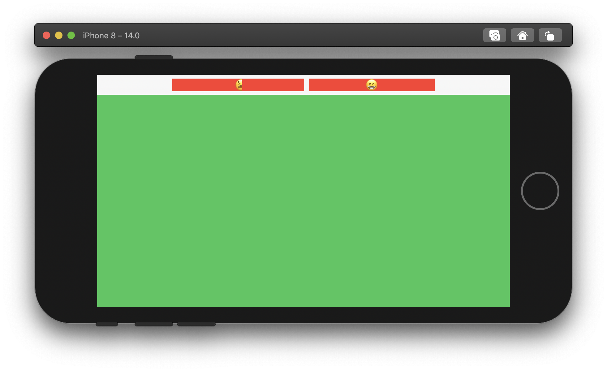
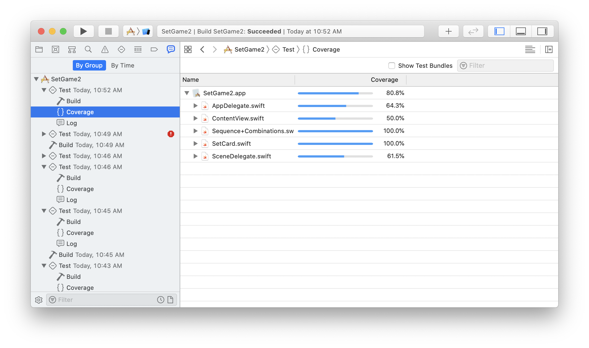
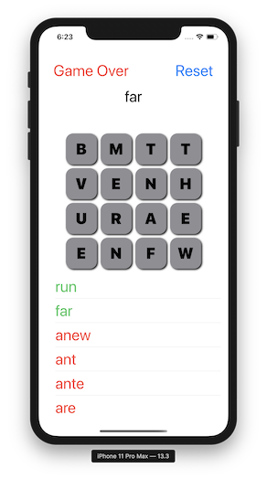

# A Flock of Swifts 

A Flock of Swifts is a physical space meeting of like-minded people excited about the Swift language.  We normally meet each Saturday morning.  Here is our meetup page.  All people and all skill levels are welcome to join.  

https://www.meetup.com/A-Flock-of-Swifts/

Also see Tim's notes: Also see https://bit.ly/flock-of-swift-notes

---
### 2020.12.26

#### OAuth

Ed wants to hide an OAuth service behind his service:


https://developers.google.com/identity/protocols/oauth2/service-account — server to server

#### HIPPA Rule of thumb

Be careful. Use the service; don't cache or save anything. 

#### Navigation from Spensor

Spenser showed his test app.  Josh recommended that he lift his Navigation object into a shared object via @EnvironmentObject


#### Wrapping paper app from John

Fully functional app from John for determining wrapping paper size.

Link TBD

Some notes:

- `@AppState` can be used to save to user defaults
- `Image` can take advantage of font metrics to be the right size.


#### Async Await

This proposal got accepted a few days ago:

https://github.com/apple/swift-evolution/blob/main/proposals/0296-async-await.md

Download the snapshot:

https://swift.org/builds/development/xcode/swift-DEVELOPMENT-SNAPSHOT-2020-12-23-a/swift-DEVELOPMENT-SNAPSHOT-2020-12-23-a-osx.pkg

Add this to your project:  

`-Xfrontend -enable-experimental-concurrency`

```swift
func computeX() async -> Int {
  42
}

func computeY() async -> Int {
  31
}

var result: Int = 0

@asyncHandler func computeSum() {
  let x = await computeX()
  let y = await computeY()
  result = x + y
}
```

Lots to learn.  Josh's recommended reading:

- https://github.com/apple/swift-evolution/blob/main/proposals/0296-async-await.md
- https://github.com/DougGregor/swift-evolution/blob/concurrency-objc/proposals/NNNN-concurrency-objc.md
- https://github.com/DougGregor/swift-evolution/blob/structured-concurrency/proposals/nnnn-structured-concurrency.md
- https://github.com/DougGregor/swift-evolution/blob/actors/proposals/nnnn-actors.md

#### EVO Swift App

Recommendation from Josh on following Swift proposals.

- https://apps.apple.com/ug/app/evolution-app/id1210898168

#### Generic Algorithms by Josh

Mapping into a Set.  

```swift
// TBD
```

---
### 2020.12.19

#### Getting started

Where to get started as an iOS developer.

Use playgrounds to learn about pure Swift:

(Learn to code in 7 days)
https://apps.apple.com/us/story/id1498544817

SwiftUI Tutorial from Apple
https://developer.apple.com/tutorials/swiftui/

Paul Hudson:
https://www.hackingwithswift.com/100

Ray Wenderlich:
https://www.raywenderlich.com/

iOS Academy:
https://youtu.be/U-Y9HJzNhQ0

#### Processing video frames

Some discussion about Tim's app ideas QR code inventory, vocabulary lookup.

How to process video frames:
https://developer.apple.com/documentation/coremedia/cmsamplebuffer-u71

#### Small Array

A brainstorm idea by Ray for a fixed size small array that requires no
heap allocations.  We outlined the idea though didn't write out the 
whole thing.  Here is a "working" example completed after the meeting: 

https://gist.github.com/rayfix/7ebacfac3beb3eac661197fe372228d6

Josh made the observation that subscripting might be slow because of 
all of the branches required.  After the meeting I tried another 
example and after posting a question to the Swift forum I learned that
there is some prior art:

https://forums.swift.org/t/getting-around-unsafe-pointer-mutability-requirements/43136

#### Xcode Live Preview

Time shows a demo.  Push the button, it appears on the device.  You can also 
connect wirelessly by going to Xcode menu Window :: Devices and Simulators
and checking the box for wireless.

https://github.com/dmsnell/aoc2020/blob/trunk/src/day1.erl

#### Advent of Code

Tim C showed us a website he was introduced by a functional programmers meetup

We attached this problem:

https://github.com/dmsnell/aoc2020/blob/trunk/src/day1.erl

Find the product of two number in the list that add to 2020:

An O(n^2) solution that uses swift-algorithms goes like this:

```swift

import Algorithms

numbers.combinations(ofCount: count)
  .lazy
  .first { $0.reduce(0, +) == 2020 }
  .map { $0.reduce(1,*) }
```

By changing count, you can make it pairs of 2, 3, ... numbers.

Josh showed us an O(n) algorithm that solves the count == 2 problem.

Code:

```swift
// Put the complement numbers in the set and look up the one 
// that completes the combo.
import Foundation
import PlaygroundSupport

let input = [1721, 979, 366, 299, 675, 1456]
let compliments = Set(input.map { 2020 - $0} )  // O(n)
print(compliments)
// contains on a Set O(C)
let solution = input
  .first { compliments.contains(2020 - $0) }
  .map { ($0, 2020 - $0) }
  .map(String.init(describing:))
print(solution ?? "no solution")
```
---

### 2020.12.12

Also see https://bit.ly/flock-of-swift-notes

#### Xcode Tips and Tricks from John

Not sure if this is where these tips came from but need to put credit where it is due:
https://www.hackingwithswift.com/articles/166/xcode-tips-and-tricks-part-one

These are the tips from Paul Hudson that John J. demoed during the meetup:

Xcode tip #1: Swift can synthesize memberwise initializers for structs, but not for classes. Fortunately, Xcode can generate the code for us: select your class name, then go to the Editor menu and choose Refactor > Generate Memberwise Initializer. Done!

Xcode tip #2: When building software, it’s important to make sure your app works for *everyone*. One great way to do that is with Xcode’s environment overrides panel, which lets you adjust Dynamic Type size, accessibility options, and appearance all in one place.

Xcode tip #3: You probably already know that you can click after any open { or close } brace to have Xcode highlight its matching brace, but another useful tip is that you can double click a brace to select the entire block of code it contains.

Xcode tip #4: Xcode can check if your spelling is correct, and it even understands that camelCaseNames should be treated as separate words. Go to the Edit menu and choose Format > Spelling and Grammar > Check Spelling While Typing, and Xcode will check your code for typos.

Xcode tip #5: If you have a Swift file with many errors, you can use Xcode’s fix-its to try to correct them one by one. But a faster way is to go to the Editor menu and choose Fix All Issues to apply fix-its all at once. (Make sure and double-check which changes were made!)

Xcode tip #6: When you search using Xcode’s find navigator, you can click to view individual results and make any changes you want. But when you’re done, I recommend you hit Backspace to remove the search item from the results, so you can see which results you have left to check.

Xcode tip #7: This is the simplest tip I know, but it will save you time if you don’t already know it. Whenever you see Automatic Preview Updating Paused in your SwiftUI canvas, press Opt+Cmd+P to resume previewing. Alternatively, use Opt+Cmd+Return to hide the canvas completely.

Xcode tip #8: If you frequently move from Xcode to the simulator, tile them side by side. With the simulator active, go to the Window menu and choose Tile Window To Right Of Screen, then select Xcode on the left. You can adjust the split so the simulator sits snugly on the right.

Xcode tip #9: Xcode has great code completion built right in, but sometimes as you scroll through the options you might find the names are too long to fit. Fortunately, you can just grab the edge of the autocomplete popup and drag it as wide as you want!

Xcode tip #10: Breakpoints are great for debugging – place them by selecting a line number, or remove them by right-clicking and choosing Delete Breakpoint. You can also remove one by dragging it away, but a fast method is to use Cmd+\ to toggle a breakpoint on the current line.

#### String Encryption

A quick demo by Ray on CryptoKit using the mac playgrounds app (not Xcode):

```swift
import CryptoKit
import Foundation

let data = "Secret Message!".data(using: .utf8)!

let key = SymmetricKey(size: .bits256)
let sealed = try AES.GCM.seal(data, using: key)

let result = try AES.GCM.open(sealed, using: key)
print(String(data: result, encoding: .utf8)!)

do {
    let wrongKey = SymmetricKey(size: .bits256)
    let _ = try AES.GCM.open(sealed, using: wrongKey)
} catch {
    print(error)
}
```

#### Josh's watermark playground

```swift
import UIKit
import PlaygroundSupport

let image = Bundle.main.url(forResource: "a", withExtension: "jpg")
  .flatMap { try? Data.init(contentsOf: $0) }
  .flatMap(UIImage.init(data:))!

let bounds = CGRect(origin: .zero, size: image.size)

var format = UIGraphicsImageRendererFormat()
format.scale = 1

let waterMarkedImage = UIGraphicsImageRenderer(
  bounds: bounds,
  format: format
).image { context in
  image.draw(in: bounds)
  UIColor(white: 1, alpha: 0.4).setFill()
  UIBezierPath(ovalIn: bounds).fill()
}

let imageView = UIImageView(image: waterMarkedImage)
imageView.contentMode = .scaleAspectFit
imageView.bounds = .init(origin: .zero, size: .init(width: 300, height: 300))
PlaygroundPage.current.liveView = imageView
```

We discussed first class functions in Swift `.flatMap(UIImage.init(data:))` vs `.flatMap { UIImage(data:$0)) }` and end example of `reduce` as a function that takes a function `func(Accumuated, Element) -> Accumulated` and the equivalence of the following forms in swift:
```swift
[1,2,3].reduce(0, +)
[1,2.3].reduce(0) { accumulated, element in
  accumulated + element
}
func plus(_ a: Int, b: Int) -> Int {
  a + b
}
[1,2,3].reduce(0, plus)
```

We discussed how to write Swift idiomatically:

 - Prefer `guard` as earyly in the scope as possible (ie top of function) to assert precoditions, rather that if / return
 - Prefer the composition of functional methods on swift `Sequence` to imperative `for` loops: https://developer.apple.com/documentation/swift/sequence
 - Prefer values (`struct`, `enum`) over references (`class`, `indirect`) unless you have a well founded to opt into reference symantics
 - Perfer failable initializers to incomplete objects
 - Prefer default values or factor methods to requiring mutable state (as with the objC `UIGraphicsImageRendererFormat` above)

### 2020.12.05

Here is a quick summary of our last meeting. A more detailed version with lots of screenshots from Tim Colson can be found here: https://bit.ly/flock-of-swift-notes

#### Caleb's Inventory Demo

Caleb gave an overview of his inventory app. The current version uses Storyboards, a network service and delegates.  We discussed using callback closures for network requests and did some of that refactoring in realtime with Josh driving most of the discussion.

- Use the Swift Result type
- Use a custom error type
- Use `defer` to manage a boolean value that says if a request is "processing" or in-flight.

This week a Swift evolution proposal talks about how callbacks are "suboptimal" even though they are a good starting point for current Swift.

https://github.com/apple/swift-evolution/blob/main/proposals/0296-async-await.md

#### Mark's Stock Rater Demo

Mark demostrated a command line app written in Python to show stock the performance of a given stock ticker.  Scrapping info from the web.

Mark would love to partner with someone to tackle something for Apple Watch.

Josh offered to make a quick demo if Mark can provide an API.

You can use a tool called ngrok to project a private API out onto the web.

https://ngrok.com/

#### Emil's Questions About Crypto and IAP

- Don't store sensitive data in UserDefaults
- Consider using Keychain
- Probably don't want to fight against Apple's provided mechanisms
- Why not make an IAP to remove image watermark?

#### Josh Continues Tides App

Continuing the Tides app example, Josh created a destructureAndAssign method on the Publisher protocol.

- Swift lacks variatics so you have to make overloads explicitly
- AnyObject is not a type erasure but a standin for any reference type
- ReferenceWritableKeyPath
- Abstract each input
- Use where to put constraints on the generic
- Require Failure == Never so that you can call sync without an error type
- Frank suggested using `@inlinable`


```swift
extension Publisher {
  @inlinable
  func destructureAndAssign<A,B,C,Target: AnyObject>(
      to a: ReferenceWritableKeyPath<Target, A>,
      and b: ReferenceWritableKeyPath<Target, B>,
      and c: ReferenceWritableKeyPath<Target, C>,
      on target: Target) ->  AnyCancellable where Output == (A,B,C), Failure == Never {
    sink(recieveValue: { [weak target] output in
        target?[keyPath: a] = output.0
        target?[keyPath: b] = output.1
        target?[keyPath: c] = output.2                
      })
   }
}
```

#### John's Watermark Display

John showed the Hacking w/ Swift solution:

https://www.hackingwithswift.com/quick-start/swiftui/how-to-play-movies-with-videoplayer

#### Josh's Watermark

This version creates a new image:

```swift
let image = UIGraphicsImageRenderer(bounds: .init(origin: .zero, size: .init(width: 100, height: 100))).image { context in
  UIImage(systemName: "circle.fill")?.draw(at: .zero)
  NSAttributedString(string: "watermark").draw(at: .zero)
}
```


---
### 2020.11.28

#### M1 Show and Tell
John gave us a demo of his maxed-out 13" MacBook Pro using Xcode.  He ran a sample project using lazy grids that reproduce the app store layout.  The article is on medium here: 

https://medium.com/swlh/make-your-app-faster-using-lazystacks-in-swiftui-6c670950a8ff

The Github repository is here:
https://github.com/KeatoonMask/AppStoreGrid

Some notable aspects:
   - The simulator starts up almost instantly.
   - It doesn't get hot, even under load.
   - It's cold on John's legs because he is always in shorts.

John is using this monitor:

https://www.amazon.com/Portable-Monitor-Touchscreen-Auto-Rotating-Kickstand/dp/B086VJP65W?ref_=ast_sto_dp

#### DataGridView Summary

Ray gave a keynote presentation on creating a data grid view. The presentation is here:

https://github.com/aflockofswifts/meetings/blob/main/resources/DataGridView.pdf

The source code is here:

https://github.com/rayfix/DataGridView

There is a quick look view controller that lets you view CSV and pdf files:
https://developer.apple.com/documentation/quicklook/qlpreviewcontroller

#### Continuing the Tides App

Josh continued refactoring the Tides app.  Going from our design document, we built a view model that takes the screen's inputs and maps it to outputs using a CombineLatest4 publisher chain.

Josh showed the use of an external extensions library for Combine.  Unfortunately, multiple assignment doesn't work the way hoped for so ended up not being able to use it.

https://github.com/CombineCommunity/CombineExt

Sometimes you need to spell out the return type for a closure to compile.  We will continue building this next week.

---
### 2020.11.21


#### App Store Prices

We talked about recent changes to app store cost.  If you are making less than 1M, Apple will start only taking a 15% cut.

What about trial offers?  Here are some links from Tim:

https://developer.apple.com/documentation/storekit/in-app_purchase/subscriptions_and_offers/implementing_introductory_offers_in_your_app

Ed notes Tier 0 that follows the naming convention: “14-day Trial.”

https://bitsplitting.org/2018/06/06/ersatz-free-trials/ -> article on Apple allowing this from 2018

#### M1 Macs and Mac mini hubs

It's fast and cool.  Wakes from sleep fast, has a better keyboard.  It's very fast too.

https://daringfireball.net/2020/11/the_m1_macs

https://techcrunch.com/2020/11/17/yeah-apples-m1-macbook-pro-is-powerful-but-its-the-battery-life-that-will-blow-you-away/ 

We need cheap hubs.  Apple tax too high:

Links from Ed Arenberg:

https://www.macrumors.com/2020/11/20/owc-thunderbolt-hub-mac/

https://www.sabrent.com/product/SB-XTMQ-2TB/rocket-xtrm-q-2tb-usb-3-2-thunderbolt-3-external-ssd-sb-xtmq-2tb/

https://www.sabrent.com/product/SB-XTMQ-1TB/rocket-xtrm-q-1tb-usb-3-2-thunderbolt-3-external-ssd-sb-xtmq-1tb/

https://www.amazon.com/Sabrent-Rocket-Thunderbolt-External-SB-XTMQ-2TB/dp/B08BZ2FXTF/ref=sr_1_14?dchild=1&keywords=sabrent+external+nvme&qid=1605982882&sr=8-14

In the future (M2)?
https://en.wikipedia.org/wiki/Unum_(number_format)

#### Progress on a scrolling table header

Using `UIViewRepresentable` with a `UIView` that contains three `UICollection` wired together via scroll view delegate.
Something is wrong with layout.  We tried to debug it. (The problem is now solved and will have the solution next week.)

Debugging functional chains.

```swift
extension Sequence {
  func print() -> Self {
    forEach { Swift.print($0) }
    return self
  }
}
```

Note:  I got it all working.

https://vimeo.com/482224242


#### Returning to the Tides app

- implemented a new endpoint and mock to get more information: low and high tide
- thought about inputs and outputs and bindings so that we can refactor the view model

Think of the view model that takes a bunch of inputs from user interface and services and generates outputs: views and service actions.

---

### 2020.11.14

We had some problems starting the meeting because of Big Sur. Installing Zoom 5.4.1 resolved and changing preference fixed the issue for Ray.

#### Deprecated hashValue

Franklin shared a Swift lang bug he has been working on.  It is reported here. He proposes getting rid of the hashValue definition in RawRepresentable.

https://bugs.swift.org/browse/SR-13851


#### SwiftUI Grid

Ray created an auto-resizing data grid for displaying a bunch of numbers.  A gist of the project can be found here:

https://gist.github.com/rayfix/1805ad584f1028b3e52ecf45c3f0ce9e

The shortcoming of the solution is that the header cells can scroll off the window and can't be pinned on the screen.  It would be great if ScrollView took the content offset as a binding.  Unfortunately, it currently does not.  This probably needs to be implemented with `UIViewRepresentable`

#### Mirror, mirror on the wall

John wants to build a unit conversion app using foundation. Does he need to make his own list of all the unit types?  The short answer is yes.

Josh made an attempt at using mirror to get them.  However, since mirror only mirrors stored properties, it won't do the job here.

```swift
struct A {
  var a,b,c: Int
}

let mirror = Mirror(reflecting: A.init(a: 1, b: 2, c: 3))

mirror.children.forEach { child in
  print(mirror.subjectType, child.label!, "value: \(child.value)")
}
```

This prints:

```console
A a value: 1
A b value: 2
A c value: 3
```

#### Apple Silicon Mac

Looking forward to the performance of the new M1 Macs. These are all low end systems with integrated graphics. (16 GB max)  It will be interesting to see how it scales to higher end systems that have external graphics.

#### Functional vs OO

Recommended viewing from Josh about functional and object oriented from a historical perspective.

https://www.youtube.com/watch?v=6YbK8o9rZfI

#### What Framework to use?

SwiftUI is the new hotness should I use it.  There are several factors to weigh in the consideration:

- The familiarity team
- Hiring future engineers
- What iOS versions need to be supported? (if iOS 12, SwiftUI is a no-go)

RxSwift with MVVM seems like a good candidate because it has a similar mindset to SwiftUI and supports iOS 12 and later.

#### Tim Colson's blow-by-blow:

https://paper.dropbox.com/doc/Flock-of-Swifts--A~gCRNtylBictlURDRC0xwMRAg-RYLxaSucg20Uhe9Bn2X5O

---

### 2020.11.07

We discussed memory management (ARC) and how to prevent reference cycles and extend lifetime with closure captures (aka lambda captures in C++).  The discussion comes from a RW forum post:

https://forums.raywenderlich.com/t/advanced-swift-memory-management-conclusion-raywenderlich-com/71286/4


We also looked at Google's Swift benchmark package that was showcased at the Swift for TensorFlow design meeting last week:

https://github.com/google/swift-benchmark


Tim Colson's blow-by-blow:

https://paper.dropbox.com/doc/Flock-of-Swifts--A~gCRNtylBictlURDRC0xwMRAg-RYLxaSucg20Uhe9Bn2X5O


---
### 2020.10.31

Happy Halloween!

#### Layout of UILabel with fixedSize

Frank gave an presentation on a tricky layout problem that ended up having a simple solution.
He had a wrapped UIViewRepresentable containing a label that was taking the entire screen.  
Adding this modifier made the layout use the intrinsic size of the UILabel (size of the text).

`.fixedSize()`

https://developer.apple.com/documentation/swiftui/text/fixedsize()

#### More Image Picking

Ray reviewed what we did last week with PHPickerViewController and talked about problems.

- Adding support for multiple images
- Be careful using ForEach with ranges.  It has to be constant.
- Using a view-model instead of state
- Using a UIHostingController
- Connecting the UIKit and SwiftUI worlds with Combine
- Start with .sync and convert to a functional chain
- Be careful with strong reference cycles!

Final code can be found here:

https://gist.github.com/rayfix/becca80cb2dc1c5e90496a6b7c61274b

#### Chat notes
CocoaPods and manual install for AdMob explained

https://developers.google.com/admob/ios/quick-start

An unanswered AdMob forum request for a date on SPM compatibility. ;-)

https://support.google.com/admob/thread/73551601?hl=en

Using ForEach with id. (Be careful if your array contains duplicates!)

https://www.hackingwithswift.com/quick-start/swiftui/how-to-create-views-in-a-loop-using-foreach

Tim Colson's detailed blow-by-blow

https://paper.dropbox.com/doc/Flock-of-Swifts--A~gCRNtylBictlURDRC0xwMRAg-RYLxaSucg20Uhe9Bn2X5O


---

## 2020.10.24

Discussion on monetization.  AdMob, funnels, subscriptions.  This meetup is coming up on Monday.

https://www.meetup.com/sdiosdevelopers/events/274096826/


Presentation on `PHPickerViewController` and using `UIViewRepresentable` and `UIViewControllerRepresentable`. 
Here is the final code of what we worked on.

https://gist.github.com/rayfix/96deae8e715554560e9e89a8bd48ab71

Thanks for great feedback from Frank, John, Tim. Now, I think I could actually do a presentation on this topic.

We talked about ARC and cancellable.  Specifically, this tweet from Peter Steinberger:

https://twitter.com/steipete/status/1318812545621393408

Tim Colson's blow-by-blow can be found here:

https://paper.dropbox.com/doc/Flock-of-Swifts--A9QHVH0PWyw1HQ9hwVQbwImiAg-RYLxaSucg20Uhe9Bn2X5O

---
## 2020.10.17

### Tides App Continued

Josh continued to work to finish out the Tides app and added the following features:

  - A endpoint to get station data and a mock
  - Use of a charting package to show tide predictions data
  - Better map pin annotations
  - Selecting and deselecting favorites
  - An .all vs .favorites segmented control display.
  
Tim Colson added to his notes constellation:

https://paper.dropbox.com/doc/Flock-of-Swifts--A9QHVH0PWyw1HQ9hwVQbwImiAg-RYLxaSucg20Uhe9Bn2X5O

Josh will do some cleanup and publish to a repo soon.

---

## 2020.10.10

### Offical Swift Algorithms

There is a new sub-project from swift.org for algorithms. 
It can be found at https://github.com/apple/swift-algorithms/

### Tides App Continuation

This week Josh built out the actual dataTaskPublisher endpoint for tide data and view 
rendering.  He showed how publishers can be combined together to form new 
publishers for filtering and organizing content.

He described other tips for organizing code and keeping everything neat and
tidey (pun!).  

Finally, Josh shoowed how to use the SwiftUI Map view along with custom annotations 
and lamented on the shortcomings of the SwiftUI implementation.

Tim C posted his notes here:
https://paper.dropbox.com/doc/Flock-of-Swifts--A9QHVH0PWyw1HQ9hwVQbwImiAg-RYLxaSucg20Uhe9Bn2X5O

Quote of the week:

"That was a firehose of awesome."
-- Tim Colson on Josh's presentation

---
## 2020.10.03

### Seedable Random Numbers

Ray showed how to build a psuedo random number generator.  It gives you 
repeatability and reasonable randomness for tests but is not cryptographically 
secure.  You can use it as a replacement for SystemRandomNumberGenerator().

https://gist.github.com/rayfix/656d044c87dfc059ad301d378fe28e33


### Tides App

This mega presentation from Josh will span several meetings and eventually cover:

  - Multiplatform
  - Watch
  - Using Swift PM
  - Widgets

Tim Colson created some detailed meeting notes on Dropbox:

https://paper.dropbox.com/doc/Flock-of-Swifts--A8y~OD2rSkR3ODVFk1TfhR9EAQ-RYLxaSucg20Uhe9Bn2X5O

---
## 2020.09.26

Moving day. See you October 3rd.

---
## 2020.09.19

### Mocking Services

Ray talked about mocking services.

There are three different approaches:

- Baked into the code (if-else)
- Make a service protocol, use the protocol once for the service, once for the mock
- Make a service struct with closure properties that define service

A gist of the code can be found here:
https://gist.github.com/rayfix/e63b84c12f47650fad8d7d50697eb9f1

The last approach, called protocol witnesses, is more manual but nice for composability.

### Loading States

Josh created a reddit client that uses a generic loading abstraction.  He also created
a shimmering modifier that can be composed with the new redacted modifier for a very cool
visual loading effect.

The project can be found here: https://github.com/joshuajhomann/ShimmeringLoadingState

---
## 2020.09.12
We dicussed cross platform caching: Firebase, Apollo, CoreData / iCloud, Realm, CouchDB  
John showed his weather app and we discussed JSON serialization using www.quicktype.io and the new colored SF Symbols:  https://github.com/codger/OpenWeatherDemo2  
Josh showed another weather app and we discussed dependency injection and Futures: https://github.com/joshuajhomann/weather-swiftui  

## 2020.09.05
- Navigation, page controllers using tab views and a page style
- Discussion about making cancellable publishers in combine

---
## 2020.08.29
Path animation and adpating UI based on size class:
https://github.com/joshuajhomann/PathMorphing-SwiftUI

## 2020.08.15

### Navigation Bars

We looked at three column navigation using a simple app.

```swift
struct View1: View {
  var body: some View {
    Color.red
  }
}

struct View2: View {
  var body: some View {
    Color.blue
  }
}

struct View3: View {
  var body: some View {
    Color.green
  }
}

@main
struct BrowserApp: App {
  var body: some Scene {
    WindowGroup {
      View1().navigationBarTitle("1", displayMode: .inline)
      View2().navigationBarTitle("2", displayMode: .inline)
      View3().navigationBarTitleDisplayMode(.inline)
         .toolbar(...)
     }
  }
}
```
### Semantic Toolbars Versus Navigation Bar Items

You can only have one .principle. It doesn't show up if there is 
a navigation title.

```swift
.toolbar {
  ToolbarItem(placement: .principal) {
    HStack {
      Button("Button 1") {  }                
      Button("Button 2") {  }
      Button("Button 3") {  }
    }
  }
}
```

### Feedback sent to Apple -- FB8415373 

We filed a feedback issue about a strange thing when the button of one of the above HStacks is small (one character) and has padding.



```swift
import SwiftUI

struct MainView: View {
  var body: some View {
    Color.green
  }
}

struct TestView: View {
  var body: some View {
    MainView()
      .navigationBarTitleDisplayMode(.inline)
      .toolbar {
        ToolbarItem(placement: .principal) {
          HStack {
            Button {  } label: {
              Text("😫")   // Disappears without a trace, unless you make longer string
                .padding(.horizontal, 100)
                .background(Color.red)
              // .layoutPriority(1) // commenting this in will also fix it
            }
            Button {  } label: {
              Text("😁")
                .padding(.horizontal, 90) // making this 100 will also fix it
                .background(Color.red)
            }
          }
        }
      }
  }
}

@main
struct BrowserApp: App {
  var body: some Scene {
    WindowGroup {
      NavigationView {
        TestView()
        TestView()
      }
    }
  }
}
```


### Showing a list of different Views

The trick is to use an AnyView type erasure and then wrap that in a ForEach that 
is enumerated to be identifiable.  

Guess: works well for small number of views but
might be harder to diff and result in slower performance when there are larger
numbers of views?

```swift
let views = [AnyView(View1()), AnyView(View2()), AnyView(View3())]

...

VStack {
 ForEach(Array(views.enumerated()), id: \.offset) { pair in
   pair.element
 }
}
```

----
## 2020.08.08

We explored dismissing the keyboard in SwiftUI using a hack to send the resignFirstResponder selector to the shared application.  (It still works for SwiftUI native (@main struct defined) apps.

We also created a shake animation effect using GeometryEffect and a ProjectionTransform that translated the x coordinate.

Josh showed us the difference between different styles of animations including implicit animation with the animation modifier and explicit animations using withAnimation. 

The code can be found here:

https://gist.github.com/rayfix/400893d383bae7fbab4a69f7b535d5d1

Josh demostrated the Hero animation in action using one of his first expermental SwiftUI apps that reads in Pokemon.

We also debuged some Navigation related code.  After the meeting John and Josh found that you need to set the rendering mode to .original if you want it to look right within a navigation view.  We will probably go over this in more detail next week.

----

## 2020.08.01

### Matched Geometry

SwiftUI this year brought a way to make smooth transitions across views. You match a two views with the same `id` and `namespace` and then SwiftUI can do an interpolating animation between them.  Much like a Keynote magic move.  John put together a project with a few examples of this.

https://github.com/codger/Matched-Geometry

### Creating a `.popTip()` modifier

Josh looked at how to create a custom view modifier that does layout and display of a small popup view.  
We explored how to use `PreferenceKey` to send information up the view hierachy and how to use `EnvironmentKey` to add our PopTipStyle to SwiftUI's envrionment so that in can be used to style all child Poptips without having to provide the same parameters to each modifier.

Code: https://github.com/joshuajhomann/PopTip-SwiftUI

### Core Data based and Item Browswer

Ray is working on a CoreData based app that lets you build a hierarchy of items that you can browse, tag and search for much like the files app.  We discussed how to setup the CoreData App given that App types are implemented as structs and don't have lifetime.

https://github.com/rayfix/ItemBrowser

----

## 2020.07.24

### Using `UserDefaults`

John showed how to make an apps view-model remember its state using `UserDefaults`.  He did that by loading (or defaulting) the values of the view-model in the initializer and saving the values in the `didSet` method for each of these published properties. He created a separate "Hello" view that initialized the view-model and showed some of the data.  It stays in sync with the rest of the app because it is coming in from `UserDefaults`.

Interesting finding:  The + operator is implemented for `Text` views. 

The code: https://github.com/codger/Persistant-Demo

### A generic storage abstraction

Josh took another look at John's solution.  First, he demonstrated using the new SwiftUI feature `@AppStorage` that lets you save things in `UserDefaults` and also conforms to the `DynamicProperty` protocol which means that your `View` will recompute the `body` every time it changes.  It has some downsides in that it cannot be used inside an `ObservableObject` and only support a very primative set of data types.

He asked what would happen if requirements changed. For example, first you used `UserDefaults`, but then you wanted to sync to cloudkit.  Then you required a common file format for android devices.  Then you wanted to use Firebase; then your own server.  Can you abstact the problem of saving and loading so that you can implement any of these solutions without making changes to the call-sites of your code.  He first created a generic `StorageService` based on the `Codable` protocol.  He implemented this for mock storage service (in-memory dictionary) and then `UserDefaults`.  He then put this into John's original solution.  So that he could keep `@Published` vars publishing their changes and control setter control of these types, he created a `Storage` wrapper type that used `@dynamicMemberLookup` to guarantee values get saved.  Finally, he showed how he could swap out the storage implementation using file based storage.

The code: https://github.com/aflockofswifts/Persistant-Demo

### Stacks of Navigation

Andrei showed us what happens if you navigate to a view that has navigation in it. The navigation titles stack!  This is cool but probably not what you want because it reduces the amount of content available.  You only want the top level view to be wrapped in the `NavigationView`.  When you navigate down the hierarchy, you can still use `.navigationTitle(...)` modifiers and they will utilize the top level `NavigationView`.

### Implementing an in-place editable, draggable folder icon

Ray showed a demo making a draggable folder that can be edited in-place. The two major tricks here:

#### Point 1

Make `TextField` use the same layout spaces as `Text`

```swift
    Text(text)
      .hidden()
      .overlay(TextField("",  text: $text))
```

#### Point 2

When making your `DragGesture()` make sure to make the `minimumDistance` > 0 or it will interfere with `TextField`

The code:
https://gist.github.com/rayfix/400893d383bae7fbab4a69f7b535d5d1

---

## 2020.07.18

Dug into many of the shortcomings of the Combine framework and how they can be overcome.  Great demos on concat, amb and more by Josh.

We looked at these projects:

https://github.com/CombineCommunity/CombineExt

Adds a bunch of missing features for combine (including concat).

We also looked at:

https://github.com/pointfreeco/combine-schedulers

This allows you to control time in detail.

----

## 2020.07.11

Demonstrated examples of using `UIHostingViewController` and `UIViewControllerRepresentable` to interoperate between SwiftUI and UIKit.

Josh had an amazing demonstration but because turnout was light this week, we decided to save it for a future meetup.

----

## 2020.07.04

Happy 4th!  

#### Ray showed:

A fireworks demonstration using the new `SpriteView` available in SwiftUI.  The demo shows how to use a geometry reader to scale the scene to the entire device or window.

I cleaned up some of the variable names and start the fireworks show in onAppear rather than in the init.  I also added a message in a ZStack


The source code is here:  https://github.com/aflockofswifts/FireworksDemo

#### Josh showed:

  * [Nasa Media Search](https://github.com/joshuajhomann/NasaMediaSearch-SwiftUI) example project
  * [OutlineGroup](https://developer.apple.com/documentation/swiftui/outlinegroup) to create a hierarchical navigation side bar
  * [@Appstorage](https://developer.apple.com/documentation/swiftui/appstorage) to persist recent searches.
  * [GridItem](https://developer.apple.com/documentation/swiftui/griditem) to create `.fixed`, `.flexible` and .`adaptive` grids
  * [fullScreenCover](https://developer.apple.com/documentation/scenekit/sceneview/3607780-fullscreencover) to present fullscreen modals on iPad on MacOS


## 2020.06.27

### WWDC 2020 round up
#### Ray showed:
  * The new [`DocumentGroup`](https://developer.apple.com/documentation/swiftui/documentgroup) and [`TextEditor`](https://developer.apple.com/documentation/swiftui/resetfocusaction)
#### John showed
  * dismissing the keyboard with UIKit.  There aappear to be a series of focus values in the environment that you may wish to [explore further](https://developer.apple.com/documentation/swiftui/resetfocusaction)
  * [The new multiple traingling closure syntaxt](https://forums.swift.org/t/se-0279-multiple-trailing-closures/34255)
  * The new [`Map`](https://developer.apple.com/documentation/mapkit/map) `struct` in SwiftUI; similar functionality exists for:
    * SpriteKit
    * SceneKit
    * AVKit
    * QuickLook
    * Homekit
    * ClockKit
    * WatchKit
#### Josh showed
  * control flow and optional binding in a ViewBuilder
  * [`Label`](https://developer.apple.com/documentation/swiftui/label) 
  * Images inside of String interpolation
  * `LazyVGrid`.  We also discussed the new LazyVStack/HStack and ScrollViewReader which you can find [here](https://developer.apple.com/documentation/swiftui/view-layout-and-presentation)
Additional discussion:
  * `@Namespace` and `matchedGeometryEffect`
  * `ContainerRelativeSshape`
  * `Guage` and `ProgressView`
  * `ToobarItem` and semantic positioning
  * `Link`, `AppleArchive`, `System`, `Numeric`
  *  Automatic loading skeleton generation with `.preview`
  * `@main`, `@Argument`, `@Help`
  * `Appstorage` and `SceneStorage`

----

## 2020.06.20

### Drawing a custom WatchOS style activity ring view in SwiftUI
Ray presented creating a custom watchOS style activity ring view in SwiftUI by using shapes, AngularGradient, strokes and transforms.  Here is what we came up with:

https://gist.github.com/rayfix/651894420460161b8f2345f9e6a07b59

The idea for drawing the circle at the end came from this implementation:

https://andyregensky.dev/articles/swiftui-activityrings/

This article also describes making a shadow and clip region which we did not discuss.  (I don't think it looks great on a white background.  The example uses a black background.)

### Publishers and Functional MVVM
Josh reviewed Publishers:
  * Publishers emit 0 to ♾️ Outputs followed by exactly 0 or 1 completion or Failure
  * Subscriptions (sink and assign) return a Cancellable that you must retain to keep the Publisher alive
We looked at the various ways you can create a publisher:
```
//Factories
let a = Just(1)
let b = Empty(completeImmediately: false, outputType: String.self, failureType: Never.self)
let c = Fail<Int, URLError>(error: URLError(URLError.Code(rawValue: 404)))

// Closure
let d = Future<Int, Never> { promise in
  promise(.success(1))
}

// Subject
class A {
  @Published var a = 0
}
let e = CurrentValueSubject<Int, Never>(0)
let f = PassthroughSubject<Int, Never>()

// Foundation (or RealityKit)
let g = NotificationCenter.default.publisher(for: UIApplication.willTerminateNotification)
let h = URLSession.shared.dataTaskPublisher(for: URL(string: "cnn.com")!)
let i = [1,2,3].publisher
let j = Timer.publish(every: 1, on: .main, in: .common)
```

We looked at how you can use various operators including `map`, `scan`, and `prepend` to model a stateful system functionally.
```
let emojis = "🐶🐱🐭🐹🐰🦊🐻🐼🐨🐯"

let cancellable = Timer
  .publish(every: 1, on: .main, in: .common)
  .autoconnect()
  .map { _ in 1 }
  .scan (0, +)
  .prepend(0)
  .map { index in
    let wrappedIndex = index % emojis.count
    return String(emojis[emojis.index(emojis.startIndex, offsetBy: wrappedIndex)])
  }
  .sink { output in
    print(output)
  }
```
* We looked making a functional viewModel and the difference between `flatMap` and `switchToLatest`
* We applied what we learned to refactor and imperative version of Tic Tac Toe to be stateless, declarative, immutable and functional.

example code: https://github.com/joshuajhomann/TicTacToe-SwiftUI

## 2020.06.13

### Generics and Opaque types

Ray presented a solution for genrating combinations of sequences and touched on the differences between the opaque return types from `some` and the concrete `Any*` type erasers as well as code coverage and unit testing.

Here is the gist of the code:

https://gist.github.com/rayfix/9053908eccfad6cb744dc6048fa2b8dc

Started a discussion here:

https://forums.swift.org/t/constraining-associated-type-s-of-opaque-types/37551

Xcode tips:
- Document the code you write by selecting the API and pressing Option-Command-/.  Then fill in the placehodlers.
- Option shift click to make multiple, simultaneous edit points.
- Option drag to select a rectangular region.

Update: We were looking for overall coverage. statistics.  You have to turn on coverage in the scheme.  Also enable coverage in the display.



### SwiftUI, Stanford Course and Composable Architecture

Josh presented a solution to Stanford's CS193P Homework 3 using the Composable Architecture from Pointfree
https://github.com/joshuajhomann/Set-Game-Composable-Architecture-CS193P

### Announcment

Frank shared an upcoming WWDC recap meetup for Swift Paris online June 30 (GMT +2 6:00PM which is 9:00AM Pacific)
https://www.meetup.com/swiftparis/events/271199742

---

## 2020.06.06

We discussed functional approaches to solving Standford CS193P's 3rd assignment:
https://cs193p.sites.stanford.edu/sites/g/files/sbiybj16636/files/media/file/assignment_3.pdf

Joe shared his solution here: https://github.com/jmestro/SetGame/tree/master

Point free's composable architecture.  Note that their sample app contains many examples that you may find to be useful.
https://github.com/pointfreeco/swift-composable-architecture
The video series is here:
https://www.pointfree.co/episodes/ep100-a-tour-of-the-composable-architecture-part-1

Demo Composable app showing master detail navigation and composable reducers for state propagation:
https://github.com/joshuajhomann/Composable-Test

We discussed the idea `projection` in the context of transforming state to substate and of `pullback` as the inverse of transforming a subaction to an action using a casePath:
https://www.pointfree.co/blog/posts/22-some-news-about-contramap
https://github.com/pointfreeco/swift-case-paths

Stephen Celis - Reactive view models, simplified:
https://www.youtube.com/watch?v=uTLG_LgjWGA

Next week, more Composable Architecture (including side effects) and functional MVVM in SwiftUI & Combine and a follow up on Stanford homework 3.

## 2020.05.30

Ray showed how to use template views in lieu of preferences to make views with a minimum size.  https://swiftwithmajid.com/2020/05/13/template-view-pattern-in-swiftui/

John demoed a maps project using UIViewRepresentable to show and zoom in on a MapView using spans and geometry effects.
https://github.com/codger/MapZoom

Josh demoed his 2048 project and showed how to use coordinate spaces, and generic preference keys to leverage the SwiftUI rendering system with custom drawing: https://github.com/joshuajhomann/SwiftUI-2048

## 2020.05.23

We met on Zoom and talked about SwiftUI state observation and looked forward to what is coming at WWDC 2020.

### Probing @State and @Binding

We looked the similarities and difference between @Binding and @State.  State is the single source of truth that can be connected to two way bindings.  We can use the projected type of @State to get at the binding.  Everything stays in sync!

### Observable Object

We used didSet {} to limit a message to 20 characters.  Our combine version didn't work.  Here is the broken code for that attempt.

https://gist.github.com/rayfix/854c2844366351e4fe29e91118ebfdbb

The print show that the string is being truncated but for some reason assign to message isn't working like we think it should.

### A minimal custom @Environment  example

Exploring the @Environment and @EnvironmentObject

https://gist.github.com/rayfix/1606190f572b6eb934e45f4a56701feb

### Swift 5.3

Josh walked us through things coming in Swift 5.3

https://medium.com/better-programming/whats-new-in-swift-5-3-142d89d4d1f7

### Teaser: Animating 1024

Josh is creating the game 1024.  With relatively small code he got the whole game working but without animation.  Animation is coming next week.

### Divvy Scan

From Joe

This is a short explainer video of the project I worked on during the Brother hackathon:

https://www.youtube.com/watch?v=uqjUeefqec8

This will be an open-source project eventually; after releases are finalized.


### Stanford Class

Stanford videos are starting to come out.  Thanks Matt!
https://cs193p.sites.stanford.edu/


### The Composable Architecture

Ray will discuss (and demo) this at next week's meeting.


### Follow up on text assignment with a binding

It appears that this doesn't work because we are trying to modify the `@Published` value while SwiftUI is in the middle of a redraw.  Matt discovered it does work if you add a `receive(on: DispatchQue.main)`, which I suspect is due to the fact that this defers the update to the next runloop, at which point SwiftUI is no longer in the midst of a redraw.

```
import Combine
import SwiftUI
import PlaygroundSupport

final class VM: ObservableObject {
  @Published var text = "0123456789"
  var s: AnyCancellable?
  init() {
    s = $text
      .filter { $0.count > 10 }
      .map {
        print("Map")
        return String($0.prefix(10))
      }
      .assign(to: \.text, on: self)
  }
}

struct V: View {
  @ObservedObject var vm: VM = .init()
  var body: some View {
    VStack {
      Text(vm.text)
      TextField("test", text: .init(get: { self.vm.text}, set: {
        print("setting")
        self.vm.text = $0
      }))
    }
  }
}

PlaygroundPage.current.liveView = UIHostingController(rootView: V())
```

----


## 2020.05.16

We met on Zoom and did some review of SwiftUI and Combine

### Building up a ViewModel

We built a very simple SwiftUI with a slider and a couple of numbers.  We purposefully wrote a lot of wrong code that compiled so we could understand why it was wrong.  For example, if you put an onRecieve of a publisher in your view, that publisher is going to get the CurrentValue each time and fail to update correctly.  Reviewed the mechanism by which Bindings work with State and ObservedObject property wrappers.  How to use the projected type to get bindings for both State and ObservedObjects.

https://gist.github.com/rayfix/f97a8f9bac0bc3ba7d23f64fa4b3dfe1


Josh showed off a project to get magic cards and converted it from imperative to declarative and functional reactive.
The project is here with two folders, the starting imperative version and the final declarative version:

https://github.com/joshuajhomann/Magic-Browser-SwiftUI

## 2020.05.09

We met on Zoom and focused on SwiftUI today.

### Demonstration of making a view dragable

Use `ViewModifiers` to make behaviors reusable.

https://gist.github.com/rayfix/605066823f4a70c644dd216226d51c41

### Rolex Watch (1)

https://github.com/codger/SwiftUI-Rolex

### Rolex Watch Refactored (2)

https://github.com/aflockofswifts/2020-05-09-SwiftUI-Rolex-Refactor-MVVM

### Concentration with Animation

Uses a redux inspired approach

https://github.com/joshuajhomann/Memory-SwiftUI-Animation


## 2020.05.02

We met today on Zoom.  There were four presentations.

### A demonstration of scale and rotation effect anchor with `UnitPoint`
by Ray Fix

We created a simple project and explored animation modifiers.
https://gist.github.com/rayfix/6cdfcbffc9294456729d46aab8184ef8

### Charting in SwiftUI
by John James

First load in the package using the package manager:
https://github.com/AppPear/ChartView

It is very easy to add and remove packages.

Show off the code using this sample code:
https://gist.github.com/rayfix/89e6d6167e7c1881e222413e1d3cee03

### John Conway's Life in SwiftUI
https://github.com/joshuajhomann/Conway-Life-SwiftUI

### Concentration in SwiftUI
by Josh Homann

## 2020.04.25

We met on Zoom.

Talked about Dave Abrahams' apperance on the Swift by Sundell podcast.

https://www.swiftbysundell.com/podcast/71/

Start with a value type, you will discover (not invent) the protocols by exploring the problem domain.

John was running into a problem with creating fancy buttons:

https://www.appcoda.com/swiftui-button-style-animation/

Discovered the problem was that the gradient code using colors from the asset catalog not registered.  They can be registered.

Josh: Why can't Xcode auto generate code for the assets?

Presentation on Swift on the Server using Vapor

https://iosdevsurvey.com/2019/08-swift-on-the-server/

Ray will be giving a presentation on this on Monday night.

https://www.meetup.com/sdiosdevelopers/events/270119290/

Josh working on a Combine / SwiftUI version of John Conway's Life. Having trouble with timer events.

Next week we will look more at SwiftUI animation and app architecture. If you have DispatchQueue in your View code you are doing it wrong.

## 2020.04.11

We met on Zoom.

Josh presented how to make a type eraser, and when to use type erasure in SwiftUI and Combine: https://github.com/joshuajhomann/TypeErasure

Ray talked about type erasure with opaque return types using the `some` keyword.

John presented a flip animationf or his card game and we discussed various ideas for how to animate cards moving from one section of the game board to another.

## 2020.04.04

We met on Zoom.

There have been many small improvements to Swift from Swift 4 to the current 5.2.  We are noticing how many of these changes are being utilized in interesting and even unexpected ways in libraries like SwiftUI.

Ray presented a playground on `keyPaths`
* More on keypaths: https://github.com/apple/swift-evolution/blob/master/proposals/0161-key-paths.md
* The sample code that we played with: https://gist.github.com/rayfix/4ca37c321fb64fc376b100b2f6b08ef5

There are many `KeyPath` types that the compiler uses in various situations:

* `KeyPath<Root, Value>`
* `WriteableKeyPath<Root, Value>`
* `ReferenceWritableKeyPath<Root, Value>`
* `PartialKeyPath<Root>`
* `AnyKeyPath`

Josh presented a playground on `propertyWappers`, their `wrappedValues` and their `projectedValues` and then demostrated a project to show the `projectedValues` for the `propertyWrappers` in SwiftUI and Combine: https://github.com/aflockofswifts/2020-4-5-Property-Wrappers

* More on property wrappers: https://github.com/apple/swift-evolution/blob/master/proposals/0258-property-wrappers.md
* More on key apth dynamic member lookup: https://github.com/apple/swift-evolution/blob/master/proposals/0252-keypath-dynamic-member-lookup.md

John showed his card game in SwiftUI, using image slicing.  We discussed some possible solutions for animations.

## 2020.03.28

We met on Zoom due to California's current "Safer at home" restrictions.

Ray presented a measure utility to explore sizing of SwiftUI.Views.
Ray discussed new features in Swift 5.2:
  * Key Path Expressions as Functions https://github.com/apple/swift-evolution/blob/master/proposals/0249-key-path-literal-function-expressions.md
  * Callable values of user-defined nominal types https://github.com/apple/swift-evolution/blob/master/proposals/0253-callable.md
and new in Swift 5.3:
  * Enum cases as protocol witnesses https://github.com/apple/swift-evolution/blob/master/proposals/0280-enum-cases-as-protocol-witnesses.md

Josh presented debouncing expensive operations in combine with an Ascii filter example available here: https://github.com/joshuajhomann/AsciiFilter

Jo fixed her launch image by purging the similator & fixed an opacity animation.  Note that that requirement to use a storybaord for your launch screen has been delayed: https://developer.apple.com/news/

## 2020.03.07

We met at Daden LLC where Ray gave a presentation on layout in SwiftUI and how to communicate information up the View tree by using `PreferenceKey`.

We broke into groups and tried to apply `PreferenceKey` to the problem of making a grid where you can select a number of squares by dragging.

Josh's solution to this problem is here: https://github.com/joshuajhomann/Preferences

A similar problem solved without preferences by manually calcaluating everything is here: https://github.com/joshuajhomann/Boggle-SwiftUI

## 2020.02.15

Josh is working on AWS amplify: https://aws-amplify.github.io/docs/ios/start?ref=amplify-iOS-btn

Decoding JSON from firebase dictionaries:
```
protocol JSONRepresentable {
  init?(json: [String: Any])
  func json() -> [String: Any]?
}

extension JSONRepresentable where Self: Codable {
  init?(json: [String:Any]) {
    guard let value = (try? JSONSerialization.data(withJSONObject: json, options: []))
      .flatMap ({ try? JSONDecoder().decode(Self.self, from: $0) }) else {
        return nil
    }
    self = value
  }
  func json() -> [String:Any]? {
    return (try? JSONEncoder().encode(self))
      .flatMap { try? JSONSerialization.jsonObject(with: $0, options: []) } as? [String: Any]

  }
}


struct User: Codable, JSONRepresentable {
  var name: String
}

let dictionary: [[String: Any]] = [
  ["name" : "John"],
  ["name" : "Bill"],
  ["invalid": "test"]
]

let users = dictionary.compactMap(User.init(json:))
print(users)
```

## 2020.02.08
* Josh made 2D water in spriteKit: https://github.com/joshuajhomann/Waves
* John worked on bar charts in SwiftUI

## 2020.02.01
* We met at Daden LLC for some presentations
* Ray covered github & swift package manger https://gitup.co
* Josh covered SwiftUIAnimations: https://github.com/joshuajhomann/SwiftUI-Animations

## 2020.01.25

* John is exploring swift package manager: https://swift.org/package-manager/
* Josh worked on displaying a chain of CFilters in a MTKView: https://github.com/joshuajhomann/Core-Image-Metal-View
* Feathering: https://stackoverflow.com/questions/40593884/how-to-achieve-real-feather-fade-effect-on-a-uiimage-which-is-cropped-by-a-uibez/40667463#40667463

## 2020.01.18

Coding challenges for all levels if anyone is interested in trying: https://www.reddit.com/r/dailyprogrammer/

The deadline is fast approaching.  Update your apps with a launch storyboard and support for arbitrary screen sizes.
```As announced at WWDC19, starting April 2020, apps submitted to the App Store must use an Xcode storyboard to provide the app’s launch screen and must have an interface that supports any display size.```
https://developer.apple.com/news/?id=01132020b

CIFilter example:
```
import PlaygroundSupport
import UIKit

let ciImage = Bundle.main.url(forResource: "dog", withExtension: "jpg")
  .flatMap { try! Data(contentsOf:$0) }
  .flatMap(UIImage.init(data:))?
  .cgImage
  .flatMap(CIImage.init(cgImage:))!

let blur = CIFilter(name: "CIGaussianBlur")
blur?.setValue(ciImage, forKey: kCIInputImageKey)
blur?.setValue(16, forKey: "inputRadius")
let uncroppedImage = (blur?.value(forKey: kCIOutputImageKey) as? CIImage)
  .flatMap(UIImage.init(ciImage:))!
let croppedImage = UIGraphicsImageRenderer(size: ciImage!.extent.size).image { _ in
  uncroppedImage.draw(at: .init(
    x: (ciImage!.extent.size.width - uncroppedImage.size.width) / 2,
    y: (ciImage!.extent.size.height - uncroppedImage.size.height) / 2
  ))
}
```


## 2020.01.11

John working on button customization using a view modifier.  I suggested creating a `ButtonModifier` because you can get at the button.

```swift
struct RectangularButtonStyle: ButtonStyle {

  func makeBody(configuration: Configuration) -> some View {
    configuration.label.frame(width: 150, height: 50)
      .background(Color.blue)
      .foregroundColor(.white)
      .font(.subheadline)
      .cornerRadius(10)
    
  } 
}

// Use it like this:

Button("Press Me!") {
  print("Hello")
}.buttonStyle(RectangularButtonStyle())

```


Josh and Ray working on SwiftUI navigation.

Some background links:

### Basic SwiftUI Navigation
https://www.raywenderlich.com/5824937-swiftui-tutorial-navigation

### Deep Linking (Uses AppState to control navigation)
https://nalexn.github.io/swiftui-deep-linking/
This uses `AppState` to figure out how views set themselves up.

### Combine Tutorial Navigation
https://www.raywenderlich.com/4161005-mvvm-with-combine-tutorial-for-ios
Combine tutorial which contains some info on "pragmatic navigation" using a view builder function.

### Starter Project from Josh
This uses the TVMaze API that creates a simple navigation.
https://github.com/joshuajhomann/TVMaze-SwiftUI-Navigation

Adding a coordinator turns out to be a little less straightforward than originally thought.


### Looking for a Job

Some ideas in no particular order.

- Hired
- Vettery
- TrippleByte
- Karat
- Mainz Brady Group
- StackOverflow
- Zip Recruiter
- AngelList

Project a professional appearance online.

## 2020.01.04 

- Simon Simon worked on SwiftUI navigation.  We hit a bug where you can't push a view after it has been dismissed.  This is really weird.

```swift
struct DetailView: View {

    @Environment(\.presentationMode) var presentation

    var body: some View {
        Button("Done") {
            self.presentation.wrappedValue.dismiss()
        }
    }
}

struct ContentView: View {
    var body: some View {
        NavigationView {
            NavigationLink(destination: DetailView()) {
                Text("Hello")
            }
        }
    }
}
```

Any ideas?

--EDIT: Josh--

John and I worked on the same issue a few weeks ago.  The solution is to use a binding for the navigationLink.  If you think about it its wierd to be manipulating the global presentation state since whether or not a view is presented is a piece of local state that someone should own (in this case that someone is the parent).

```swift
struct DetailView: View {
  @Binding var isShown: Bool
  var body: some View {
    Button("done") {
      self.isShown = false
    }
  }
}

struct ContentView: View {
  @State private var isDetailShown = false
  var body: some View {
    NavigationView {
      NavigationLink("hello", destination: DetailView(isShown: $isDetailShown), isActive: $isDetailShown)
    }
  }
}
```
--END EDIT--

Ray:  Actually this also does not work. If you go back using the back button, you can no longer push onto the navigation stack.  (At least in the 13.3 sim).  Ray Posted feedback to Apple FB7522002


- Victoria worked on SpriteKit and attempted to commit her code with Gitup.  She understands the importance of version control but isn't a fan of the current product offerings.  

https://gitup.co

- Other topics included working with Firebase (cascading multiple requests)


## 2019.12.21 [A Geeky Swiftmas Party]

Making Ornaments, snacks, drinks (moldly drinks!), iPad Pictionary, a presentation, discussion. 

Five Swift things to be excited about in 2020.

- SwiftUI and Combine
- Swift on the Server
- Swift for Machine Learning (TensorFlow)
- The vibrant Swift community
- Our community

Brainstorm ideas for 2020.

- Analyze buoy data in relation to tsunamis
- Build a game for Apple Arcade (or find out what it takes)
- Build a self driving car (Use Swift for TensorFlow)
- Build a Draw and Guess Game

### Links:
- https://www.donkeycar.com
- https://www.robolink.com/codrone/


## 2019.12.14 [New Beginnings]

- Discussion  of Markov Chains, Markov Chain Monte Carlo (MCMC)

- Ray starting aflockofswifts github organization.  See me (ray) IRL if you want to join the organization.  

- Josh and John are working on a SwiftUI version of Boggle.  https://github.com/joshuajhomann/Boggle-SwiftUI

- John and Josh used `UITextChecker` to validate the dictionary which contained 250k invalid words.  Seems to be slow, it takes 5 minutes to process the 300k dictionary.  Cleaned up dictionary opens fast in iOS but crashes in catalyst (???)

- Xcode 11.3 seems to have trouble opening a large json array. Hangs. (Reported to Apple as FB7493904)

- Bill wants to know how to use hash tags in his instagram profile (Not Swift related but hey...)

- Simon is working of SwiftUI layout with video player.  Also used `Bundle.main` to fetch a local video rather than streaming from the web.

- Victoria is going through a SpriteKit tutorial  

- Swiftforgood.com Book is on pre-order.

### Some Code

`PrefixTree` is a trie that provides fast lookup in the English dictionary for a valid word.  Here is the key method:

```swift
     func contains(_ collection: SomeCollection) -> Bool {
        collection.reduce(into: self, { $0 = $0?.children[$1]})?.isTerminal == true
     }
```

### Required init issue

A short coming in the current version of Swift is that even if you have a `final class` if you reference and init a `Self` you *MUST* have a `required` initializer.  It seems like it should not be `required` if the class is `final`.

#### Screenshot of Boogle App



