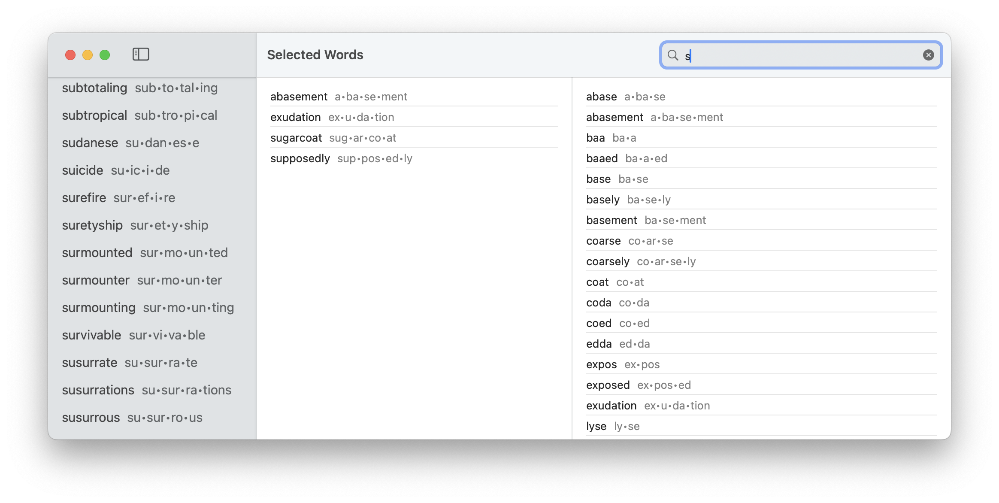
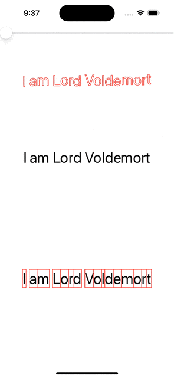
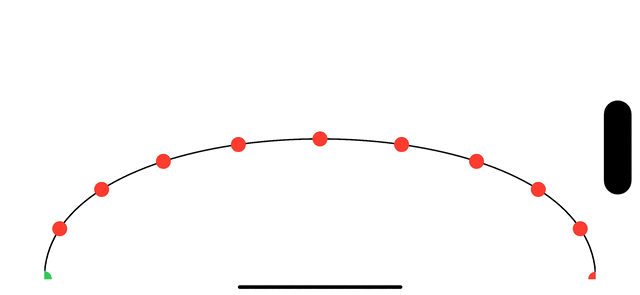
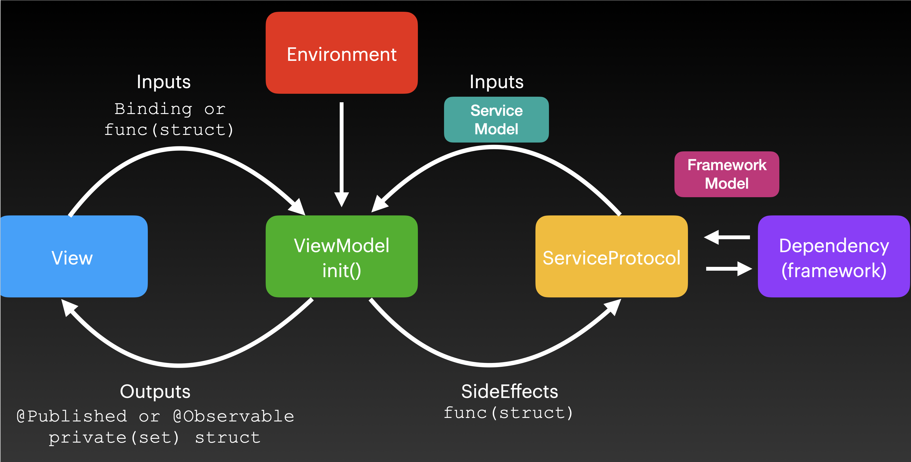

# A Flock of Swifts

We are a group of people excited by the Swift language. We meet each Saturday morning to share and discuss Swift-related topics. 

All people and all skill levels are welcome to join.  
**RSVP**: https://www.meetup.com/A-Flock-of-Swifts/

## Archives

- [2020 Meetings](2020/README.md)
- [2021 Meetings](2021/README.md)
- [2022 Meetings](2022/README.md)
- [2023 Meetings](2023/README.md)

---

## Notes

## 2024.09.21

### Presentation: Types (Peter W)

Peter took us on a guided tour of Alex Ozun's SwiftCraft 2024 talk. The only guarantee that underdesired changes don't get fixed is the compiler--use it!

- https://www.youtube.com/watch?v=cCZ00b_RNyc

This is from his blog https://swiftology.io

From a few years back: Cory Benfield - Building State Machines

-  https://www.youtube.com/watch?v=7UC7OUdtY_Q


### Presentation Modern SwiftUI Architecture (Josh):

Josh continued going over his @Once property wrapper to avoid the re-initialization problem. 

As an aside, Jesse Squires talked about the same problem (albeit with a different solution).

- https://www.jessesquires.com/blog/2024/09/09/swift-observable-macro/


### Other videos from SwiftCraftUK 
- https://www.youtube.com/@SwiftCraftUK/videos


### Finding problems with build

- https://git-scm.com/docs/git-bisect

- https://developer.apple.com/wwdc24/10171


### Tabs in iOS 18 have changed 

- https://developer.apple.com/documentation/swiftui/tabviewstyle/tabbaronly


### Cool Upcoming Pitches

- https://forums.swift.org/t/integer-generic-parameters/74181


### Apple Dev Events in Cupertino (October 2 and October 23): 

https://developer.apple.com/events/


## 2024.09.14

### Pong Event

From Carlyn.

- https://www.eventbrite.com/e/avoid-missing-ball-tickets-999778443237

Ed Fries of Supercade was the speaker. See https://www.supercademuseum.org

### How to estimate an app?

We talked about what to tell someone when they come to you with a great app idea. Here were some key points:

- You need a blueprint to build a building.
- Phase 0 of a project is just about collecting requirements and making wireframes.
- Don't underestimate the effort required. It is always more than you think.
- "Ideas are cheap, execution is everything."
- If they don't want to learn to do it themselves, consider pitching to VCs. 

### ChartRun - New App

Try it out.

- https://apps.apple.com/app/chartrun/id6670346978

### Presentation

Josh took us through the pitfalls of lifetime with SwiftUI. Close examination of @State, @StateObject, @ObservableObject.

We started to create a property wrapper called @Once to be used with @Observable and make sure expensive view model inits don't get called repeatedly.

---

## 2024.09.14

### Animation in SwiftUI

Ed was having problems with one of his animations and Josh referred him to this previous example:

- https://github.com/joshuajhomann/Bejeweled/blob/master/Shared/Animation.swift

### Draggable in SwiftUI

There are serval shortcomings in SwiftUI. Here is some sample code (via Joe) to demostrate the issues:

```swift
import SwiftUI
    
struct ContentView: View {
    @State private var selection: Set<Int> = []
    private let colors = [Color.green, .yellow, .orange, .red, .purple, .blue]
    let range: Range = 0..<42
    var body: some View {
        ScrollView {
            VStack {
                Text("Select count \(selection.count)")
                    .padding(10)
            }.background(colors[selection.count%colors.count])
            .cornerRadius(10.0)

            LazyVGrid(columns: .init(repeating: .init(), count: 6)) {
                ForEach(range) { i in
                    ZStack {
                        let shape = RoundedRectangle(cornerRadius: 16)
                        shape
                            .strokeBorder(selection.contains(i) ?  Color.black : .clear, lineWidth: 3)
                            .background(shape.fill(colors[i%colors.count]))
                            .frame(idealWidth: 80, idealHeight: 80)
                            .onTapGesture {
                                if !selection.insert(i).inserted {
                                    selection.remove(i)
                                }
                            }
                            .draggable(String(describing: selection)){
                                RoundedRectangle(cornerRadius: 16)
                                    .strokeBorder(Color.white)
                                    .frame(width:100, height: 100)
                                    .background(colors[selection.count%colors.count])
                                    .id("id\(selection.count)")
                                    .overlay(alignment: .topLeading){
                                        Text("\(selection.count)")
                                    }
                                }
                            .dropDestination(for: String.self){ element, location in
                                selection.removeAll()
                                return true
                            }.id("id\(i)-\(selection.count)")
                        Text("\(selection.count)")
                    }    
                }
            }
        }
    }
}
```

### Recovering from Failures

You should define a function like this to handle unexpected problems. Note the use of @autoclosure to defer execution.

```swift
func recoverFailure<Value>(
        message: String,
        file: StaticString = #file,
        line: UInt = #line,
        value: @autoclosure () -> Value
    ) -> Value {
    #if DEBUG
        fatalError(message)
    #else
        reportErrorToServer()
        return value()
    #endif
}
```

Alternatively,

```swift
infix operator ?!: NilCoalescingPrecedence

func ?!<Value, MyError: Error>(lhs: Value?, rhs: @autoclosure () -> MyError) throws (MyError) -> Value {
    guard let lhs else { throw rhs() }
    return lhs
}

struct ContentView: View {
    var a: Int? = 0
    var body: some View {
        Text("A")
    }
    func A() throws (CustomError) {
        print(try a ?! CustomError.message("a is nil"))
    }
}
    
enum CustomError: Error {
    case message(String)
}
```

---

## 2024.08.31

### Presentation: Migration to Swift 6 (Josh)

We continued the discussion on migrating to modern, concurrency safe Swift.

- https://www.swift.org/migration/documentation/migrationguide/

Specifically:

- https://www.swift.org/migration/documentation/swift-6-concurrency-migration-guide/incrementaladoption


Another post going into depth about ownership:

- https://infinum.com/blog/swift-ownership/


### Presentation: Modern App Architecture (Josh)


### Cool Links

Lots of discussion and cool links from the week.


### New Swift Pitch for inout and borrow

- https://forums.swift.org/t/pitch-borrow-and-inout-declaration-keywords/62366


### How Diffusion Models and LLMs work:

- https://www.youtube.com/watch?v=UZDiGooFs54

Also 3 Blue 1 Brown:

- https://www.youtube.com/watch?v=eMlx5fFNoYc


### Recreating Apps:

- https://seanallen.teachable.com/p/portfolio-project
- https://www.hackingwithswift.com/plus/remaking-apps


---

## 2024.08.25

### Presentation: Migration to Swift 6 (Josh)

Josh continued his review Swift 6 migration this week going over the guide:

- https://www.swift.org/migration/documentation/migrationguide/

Also, this chart always comes in helpful:

- https://github.com/aflockofswifts/meetings/blob/main/2022/materials/task-inheritance.png

### Discussion

Josh talked about a strategy for transitioning between combine and between async sequences. Combine offers multi-client observation so it is still useful.  Here is a proposed property wrapper that lets you get at both:

```swift
@propertyWrapper
struct Streamable<Wrapped> {
  private var value: CurrentValueSubject<Wrapped, Never>
  var wrappedValue: CurrentValueSubject<Wrapped, Never> {
    value
  }
  var projectedValue: some AsyncSequence<Wrapped, Never> {
    value.values
  }
  init(wrappedValue: Wrapped) {
    value = wrappedValue
  }
}
```

---

## 2024.08.17

### Presentation: Migration to Swift 6 (Josh)

Continuing from last week, Josh guiding us through sendability and other concurrency topics in the official migration guide.

- https://www.swift.org/migration/documentation/migrationguide/


### Discussion

#### Shipping an App

Ray is trying to ship an unlisted app. First, you need to go through the normal app review process. He is using a private CloudKit container to share data to the three different devices that will run the app. There was some discussion about sharing records.

- https://developer.apple.com/documentation/coredata/sharing_core_data_objects_between_icloud_users


#### Cancelling an animation if SwiftUI

Create a transaction that disables animation and then set some properties with it. It will instantly cancel any in-flight animations and update the model.

```swift
var transaction = Transaction(animation: .linear(duration: 0))
transaction.disablesAnimations = true
withTransaction(transaction) { viewModel.stop() }
```

#### ScrollView Tricks

Ed is making a new app to track fitness stats over arbitrary times and trying to make scroll views work in SwiftUI.

- https://developer.apple.com/documentation/uikit/uiscrollviewdelegate/1619385-scrollviewwillenddragging
- https://developer.apple.com/documentation/swiftui/scrollphase/decelerating

#### Maintaining Swift Compiler Versions

A cross platform command line tool that lets you manage Swift versions.

- https://forums.swift.org/t/introducing-swiftly-a-new-swift-toolchain-installer-and-manager/67254
- https://github.com/swiftlang/swiftly

---

## 2024.08.10

### Presentation: Ownership and Sendability (Josh)

Josh talked about some of the new ownership keywords following up on previous discussions of ownership. Many of these keywords are not needed in day-to-day but become important when you are trying to vent high performance Swift packages.  For example:

- `consuming`: Mark a parameter consuming when the function will take ownership of the type and drop the reference count before returning.
- `borrowing`: Mark a parameter borrowing when the function will not worry about dropping the reference count before returning.

Here is an example of using `sending` 

```swift
final class A: CustomStringConvertible {
    var value: Int = 0
    var description: String { "A\(value)" }
}
struct ContentView: View {
    var body: some View {
        VStack {
            Image(systemName: "globe")
                .imageScale(.large)
                .foregroundStyle(.tint)
            Text("Hello, world!")
        }
        .padding()
        .task {
            let a = A()
            var b = B()
            await b(a)
        }
    }
}

func x<T: CustomStringConvertible>(_ a: T) async {
    print(a)
}

actor B {
    func callAsFunction<T: CustomStringConvertible>(_ value: sending T) {
        print(value)
    }
}
```

### Discussion: @Observable

Bob was working on a chart to explain how to use the observable macro which makes 
the type conform to `Observation.Observable`. Be careful not to use the words
"observed object" because they are too easily confused with the old protocol
ObservedObject.

Also, from Ed:

- https://developer.apple.com/documentation/swiftui/migrating-from-the-observable-object-protocol-to-the-observable-macro

### Followup discussion:

Instead of using UITextFieldDelegate (as we did last week) we can use UIControl::addAction.

```swift
import SwiftUI

import PlaygroundSupport
struct V: UIViewRepresentable {
  @Binding var text: String
  func makeUIView(context: Context) -> some UIView {
    let view = UITextField()
    view.addAction(UIAction { [weak view] _ in text = view?.text ?? "" }, 
                   for: .editingChanged)
    view.text = text
    return view
  }
      
  func updateUIView(_ uiView: UIViewType, context: Context) {
     (uiView as! UITextField).text = text
    }
  }
    
struct W: View {
    @State var text = "hello"
    var body: some View {
        VStack {
          Text(text).foregroundStyle(.red)
          Button("Reset") { text = "hello"}
          V(text: $text)
        }
        .font(.largeTitle)
    }
}

PlaygroundPage.current.setLiveView(W())
```

### Xcode problems

Be careful not to run out of disk space. You may need to delete and reinstall simulators if you get into a bad state.

https://apps.apple.com/us/app/devcleaner-for-xcode/id1388020431?mt=12


## 2024.08.03

### Discussion: Distribute an App

Ray asked about how to distribute an app to a limited audience. The problem with doing a TestFlight build is that the app expires. In this case, an unlisted app works better.

Also, for syncing data, you might just want to go with `NSUbiquitousKeyValueStore` instead of iCloud syncing. However, there is a 1MB 1024 key limitation to this approach. 

- https://developer.apple.com/documentation/foundation/nsubiquitouskeyvaluestore


### Discussion: Detecting Key Press Events

- https://www.hackingwithswift.com/quick-start/swiftui/how-to-detect-and-respond-to-key-press-events

The official documentation:

- https://developer.apple.com/documentation/swiftui/view/onkeypress(_:action:)

### Discussion: UIViewRepresentable

Josh gave us a quick rundown about how to create 2-way bindings in representable types.

```swift
import SwiftUI
    import PlaygroundSupport
    struct V: UIViewRepresentable {
        @Binding var text: String
        func makeUIView(context: Context) -> some UIView {
            let view = UITextField()
            view.text = text
            view.delegate = context.coordinator
            return view
        }
        func updateUIView(_ uiView: UIViewType, context: Context) {
            (uiView as! UITextField).text = text
            
            context.coordinator.text = text
        }
        func makeCoordinator() -> Delegate {
            .init($text)
        }
    }

    final class Delegate: NSObject, UITextFieldDelegate {
        @Binding var text: String
        init(_ binding: Binding<String>) {
            _text = binding
        }
        func textFieldDidEndEditing(_ textField: UITextField) {
            text = textField.text ?? ""
        }
    }

    struct W: View {
        @State var text = "hello"
        var body: some View {
            VStack {
                Text(text).foregroundStyle(.red)
                Button("Reset") { text = "hello"}
                V(text: $text)  
            }
            .font(.largeTitle)
        }
    }
    PlaygroundPage.current.setLiveView(W())
```

### Discussion: Creating a Generic Loading View

Andrei had a question about using animating a loading view.  When views come in and out of the view
hierarchy, you want to use `.transition` and not `.animation`.

Josh had previously shown an example of doing this generically:

- https://github.com/joshuajhomann/Shimmer

### Discussion: Getting Symbols from Crash Logs

- https://forums.developer.apple.com/forums/thread/673057
- https://developer.apple.com/documentation/xcode/diagnosing-issues-using-crash-reports-and-device-logs
- https://developer.apple.com/documentation/xcode/building-your-app-to-include-debugging-information

### Discussion: Mac projects require dev account?

It seems like Xcode (and previews in particular) are very chatty if you try to build a Mac app without a team.


## 2024.07.27

### Presentation: Container Views in iOS18 (Josh)

Josh showed how to implement a container view using the new APIs in iOS18. Code TBD.

### Question: Identified
 
 You can wrap your type in an identified type that uses a UUID as an id. Or use the position in the index of the array to uniquely identify it.

UUIDs are guaranteed unique in time and space and you can allocate 10^7 / second and not expect a collision.

 - https://datatracker.ietf.org/doc/html/rfc4122

 Josh showed a nice way to compact huge numbers using `radix`:


 ```swift
import Foundation
let value = UInt64.random(in: 0 ... .max)
print(String(value, radix: 36, uppercase: true))
 ```

### Xcode tip: Automatic line breaks

Go over a function and press Control-M.  It will put each argument on a separate line.

### Question: Video Services

Peter wondering about what 3rd party services are good. Some brainstorming:

- https://www.agora.io/
- https://productcoalition.com/10-best-video-calling-apis-to-integrate-into-android-ios-and-web-apps-e2c6627f3bf


Vinage, Sendbird, Daily.co, 100ms, Jitsi, Zoom SDK, SignalWire

### Question: Migrating to Swift 6

Watch the WWDC2024 Video from Ben Cohen:

- https://developer.apple.com/wwdc24/10169

Look at the migration guide:

- https://www.swift.org/migration/documentation/migrationguide/

### Heap Performance

From this WWDC video:

- https://developer.apple.com/videos/play/wwdc2024/10173/


`weak` is 10x and `unowned` is 4x the cost of a strong reference. Use `unowned(unsafe)` at your own risk as getting it wrong means undefined behavior.


## 2024.07.20

### Presentation: Noncopyable Types (Ray)

We covered what we talked about last week in the form of a "whiteboard interview" style format.

- 1. What problem do non-copyable types solve? 
    - precise lifetime control
- 2. What does ~Copyable mean when you use on an enum or struct?
    - non copyable
- 3. What does ~Copyable mean you use it on a protocol or generic constraint?
    - not necessarily copyable
- 4. Why is it hard to use non-copyable types with the standard library?
    - most protocols are built for Copyable types
- 5. What types in the standard library support non-copyable types?
    - Optional, Result, unsafe pointer
- 6. What does it mean to consume a value instead of copying it?
    - Lifetime is reliqueshed
- 7. What is the difference between borrowing, consuming and inout parameters?
    - readonly, write, taken in and then given back
- 8. When must parameters be marked borrowing, consuming or inout?
    - When they are non-copyable types
- 9. When and why would you mark a method consuming?
    - When you want to end the lifteime of the object
- 10. What types can contain a non-copyable type?
    - non-copyable types or classes (which are only copied by reference)
- 11. How do you support both copyable and non-copyable generic types?
    - First create a ~Noncopyable and then add a Copyable extension
- 12. What does discard do?
    - Stops tracking lifetime and prevents deinit from being called.

### Dynamic Options

Joe Graf had an interesting problem about accessibility and how to present options in a contextual menu. It mostly stumped us.

- https://revealapp.com/news/introducing-the-accessibility-workspace/    
- https://www.kodeco.com/7180554-ios-accessibility-in-swiftui-tutorial-part-1-getting-started

---

## 2024.07.13

### Presentation: Noncopyable Types (Ray)

We looked at some of the motivations of non-copyable types. The key benefit 
is precise lifetime control which also means that the compiler doesn't have
to put things on the heap (which is intrinsically more expressive and less
predictable).

Here are some resources:

A WWDC talk "Consume noncopyable types in Swift":

- https://developer.apple.com/wwdc24/10170


Evolution Proposals

- https://github.com/swiftlang/swift-evolution/blob/main/proposals/0390-noncopyable-structs-and-enums.md
- https://github.com/swiftlang/swift-evolution/blob/main/proposals/0427-noncopyable-generics.md
- https://github.com/swiftlang/swift-evolution/blob/main/proposals/0437-noncopyable-stdlib-primitives.md


Documentation

- https://developer.apple.com/documentation/Swift/Copyable


We used a playground to mess around with:

```swift
struct Tracker: ~Copyable {
  var count: Int128 = 0
  
  init() {
    // write a file
  }
  
  consuming func cancel() {
    // delete the file
    discard self
  }
  
  deinit {
    // delete the file
  }
}

func test() {
  let t = Optional(Tracker())
}

func compute0<T>(_ value: borrowing T) {
  
}

func compute<T: ~Copyable>(_ value: borrowing T) {
  
}
compute("blob")
compute(Tracker())


struct UDT {
  var value = ""
  
  borrowing func method1(param: borrowing String)  {
    print(copy param)
  }
  consuming func method2(param: consuming String)  {
    param += "1"
    print(param)
  }
  mutating func method3(param: inout String) {
    
  }
}
var hello = "hello"
UDT().method2(param: hello)
print(hello)
```
### Question: Proper Navigation

It is not a good idea to put views into your model objects. Keep the models
pure and build the models around them.  An example from Josh last year:

https://github.com/joshuajhomann/PokemonNavigation


### Question: Using Apple Maps instead of Google Maps

- https://developer.apple.com/documentation/mapkit/mapkit_for_appkit_and_uikit/mapkit_overlays
- https://developer.apple.com/documentation/mapkit/mktileoverlay

### Question: Crash in Swift Data?

In the log, the crash is coming from:

`ModelContext._processRecentChanges(validate:)`

Very difficult to debug. Might consider trying to get a syslog if QA can reproduce it.

- https://developer.apple.com/bug-reporting/profiles-and-logs/

---

## 2024.07.06

### Presentation: Maps in SwiftUI (Frank)

Previously, Frank showed us how to use MapKit from SwiftUI. The only way to get a long press gesture
and be able to pinch and zoom a map was to drop down to UIViewRepresentable.  This year, with iOS 18,
you can now use UIKit gestures in your SwiftUI so it makes implementing long press features a lot easier.

Starting with an abstraction for a point-of-interest:

```swift
struct POI: Identifiable {
        let id = UUID().uuidString
        var location: CLLocationCoordinate2D
        
        init(coordinate: CLLocationCoordinate2D) {
            location = coordinate
        }
        
        init(latitude: CLLocationDegrees, longitude: CLLocationDegrees) {
            location = .init(latitude: latitude, longitude: longitude)
        }
    }
```

You can use this SwiftUI view:

```swift
struct ContentView: View {
        @State private var points: [POI] = [
            .init(latitude: 48.85, longitude: 2.33),
            .init(latitude: 48.87, longitude: 2.38)
        ]
        
        var body: some View {
            MapReader { mapProxy in
                Map {
                    ForEach(points) { point in
                        Marker(coordinate: point.location) {
                            Image(systemName: "globe")
                        }
                    }
                }.onLongPress { point in
                    if let coordinate = mapProxy.convert(point, from: .global) {
                        points.append(.init(coordinate: coordinate))
                    }
                } cancel: {
                    _ = points.popLast()
                }
            }
        }
    }
```

To implement the modifier `onLongPress` do this:

```swift
struct LongPressGesture: UIGestureRecognizerRepresentable {
        let perform: (CGPoint) -> Void
        let cancel: () -> Void
    
        func makeUIGestureRecognizer(context: Context) -> some UIGestureRecognizer {
            UILongPressGestureRecognizer()
        }
        
        func handleUIGestureRecognizerAction(_ recognizer: UIGestureRecognizerType, context: Context) {
            switch recognizer.state {
            case .began:
                perform(recognizer.location(in: nil))
            case .cancelled:
                cancel()
            default:
                break
            }
        }
    }
```  

With a modifier:

```swift
extension View {
        func onLongPress(perform: @escaping (CGPoint) -> Void, cancel: @escaping () -> Void) -> some View {
            gesture(LongPressGesture(perform: perform, cancel: cancel))
        }
    }  
```

### Presentation: Mesh Gradient Animation (Josh)

Josh continued his epic presentation of mesh gradients by creating a full on lava lamp style animation.

Source code: TBD.

### Discussion: What's new in Swift 6?

What is the best way to find out what all the changes are?

- https://youtu.be/aCbh9LmIZTI?si=3h40iZailxoxv2x_
- https://www.hackingwithswift.com/articles/270/whats-new-in-swiftui-for-ios-18

### How do you type ∆ on a mac?

- Option J on a US keyboard (Option d is ∂)

Frank notes that on a French keyboard Option d is also ∂, but option shift d is ∆. Makes more sense, indeed!

---

## 2024.06.29

### Presentation: Mesh Gradient (Josh)

Josh continued his discussion of the new MeshGradient. He pointed out
some of the sharp edges in this new API. Thinking about these issues deeply--how 
to make an API easy to understand and hard to misuse is a key to good software
engineering. Thinking about issues like this separates coding (just getting the 
job done) from engineering where next level concerns are top of mind.

He was able to create the basics of a mesh gradient editor where you can 
manipulate the bezier control points in real time. Future discussion may include
animation of these control points.

Code:
```swift
import SwiftUI
import CxxStdlib


@Observable
final class ViewModel: ObservableObject {
    var color: Color = .white
    private(set) var mesh: MeshGradient.Model
    private(set) var points: [MeshPoint]
    var width: Int
    var height: Int
    init() {
        let width = 4
        let height = 4
        let points = ViewModel.makePoints(width: width, height: height)
        mesh = .init(width: width, height: height, points: points)
        self.width = width
        self.height = height
        self.points = points

    }
    private static func makePoints(width: Int, height: Int) -> [MeshPoint] {
        (0..<width).flatMap { x in
            (0..<height).map { y in
                MeshPoint(
                    id: .init(x: x, y: y),
                    location: .init(
                        x: Float(x) / Float(width - 1),
                        y: Float(y) / Float(height - 1)
                    ),
                    color: .random
                )
            }
        }
    }
    func set(location: SIMD2<Float>, for id: MeshPoint.ID) {
        guard let index = points.firstIndex(where: { $0.id == id}) else { return }
        points[index].location = location
        mesh = .init(width: width, height: height, points: points)
    }
}

extension Color {
    static var random: Self {
        .init(
            red: Double.random(in: 0..<1),
            green: Double.random(in: 0..<1),
            blue: Double.random(in: 0..<1)
        )
    }
}

struct ContentView: View {
    @State private var showInspector = true
    @State private var showPoints = true
    @StateObject var viewModel = ViewModel()
    @State private var selectedPointID: MeshPoint.ID?
    enum Space: Hashable {
        case gradient
    }
    var body: some View {
        GeometryReader { proxy in
            Rectangle()
                .foregroundStyle(MeshGradient(viewModel.mesh))
                .coordinateSpace(name: Space.gradient)
                .overlay(alignment: .topLeading) {
                    if showPoints {
                        ForEach(viewModel.points) { point in
                            Circle()
                                .background(Circle().foregroundStyle(point.id == selectedPointID ? Color.accentColor : Color.white).padding(-2))
                                .foregroundStyle(point.color)
                                .frame(width: 20, height: 20)
                                .offset(
                                    x: CGFloat(point.location.x) * proxy.size.width - 10,
                                    y: CGFloat(point.location.y) * proxy.size.height - 10
                                )
                                .onTapGesture {
                                    selectedPointID = point.id
                                }
                                .gesture(DragGesture(minimumDistance: 1, coordinateSpace: .named(Space.gradient))
                                    .onChanged { gesture in
                                        guard let selectedPointID else { return }
                                        let unitPoint = SIMD2<Float>(
                                            x: Float(gesture.location.x / proxy.size.width),
                                            y: Float(gesture.location.y / proxy.size.height)
                                        )
                                        viewModel.set(location: unitPoint, for: selectedPointID)
                                    }
                                )
                        }
                    }
                }
        }
        .onTapGesture {
            selectedPointID = nil
        }
        .inspector(isPresented: $showInspector) {
            Form {
                Toggle("Show points", isOn: $showPoints)
            }
        }
    }
    func points() -> [SIMD2<Float>] {
        let width = 3
        let height = 3
        return (0..<height).flatMap { y in
            (0..<width).map { x in
                .init(
                    x: Float(x) / Float(width - 1),
                    y: Float(y) / Float(height - 1)
                )
            }
        }
    }
}

extension MeshGradient {
    struct Model {
        var width: Int
        var height: Int
        var points: [SIMD2<Float>]
        var colors: [Color]
    }
    init(width: Int = 3, height: Int = 3, seed: Double) {
        var generator = Mersenne(seed: seed)
        self = .init(
            width: width,
            height: width,
            points: stride(from: Float.zero, through: 1, by: 1 / (Float(width) - 1)).flatMap { x in
                stride(from: Float.zero, through: 1, by: 1 / (Float(height) - 1)).map { y in
                    SIMD2<Float>(x: x, y: y)
                }
            },
            colors: (0..<(width * height)).map { _ in generator.color() }
        )
    }
    init(_ model: Model) {
        self = .init(width: model.width, height: model.height, points: model.points, colors: model.colors)
    }
}

extension MeshGradient.Model {
    init(width: Int, height: Int, points: some Collection<MeshPoint>) {
        self.width = width
        self.height = height
        assert(width * height == points.count)
        self.points = points.map(\.location)
        self.colors = points.map(\.color)
    }
}

struct MeshPoint: Identifiable, Hashable {
    var id: SIMD2<Int>
    var location: SIMD2<Float>
    var color: Color
}

struct Mersenne: RandomNumberGenerator {
    private var generate = std.mt19937_64()
    init(seed: Double = 0) {
        self(seed: seed)
    }
    mutating func next() -> UInt64 {
        generate()
    }
    mutating func callAsFunction(seed: Double) {
        generate.seed(seed.bitPattern)
    }
    mutating func double(in range: Range<Double>) -> Double {
        Double.random(in: range, using: &self)
    }
    mutating func float(in range: Range<Float>) -> Float {
        Float.random(in: range, using: &self)
    }
    mutating func color() -> Color {
        .init(red: double(in: 0..<1), green: double(in: 0..<1), blue: double(in: 0..<1))
    }
    mutating func unitSIMD2() -> SIMD2<Float> {
        SIMD2<Float>(x: float(in: 0..<1), y: float(in: 0..<1))
    }
}

```

### Q: Using the Camera in SwiftUI

You can't really use the live camera without dropping down into AVFoundation
and using UIKit. There are lots of resources about this:

- https://www.hackingwithswift.com/quick-start/swiftui/how-to-let-users-select-pictures-using-photospicker
- https://www.youtube.com/watch?v=T7wf4DGPCHs
- https://github.com/rorodriguez116/Camera-SwiftUI
- https://developer.apple.com/documentation/avfoundation/capture_setup/avcam_building_a_camera_app
- https://developer.apple.com/documentation/avfoundation/capture_setup/avcambarcode_detecting_barcodes_and_faces
- https://www.hackingwithswift.com/books/ios-swiftui/instafilter-introduction

### Presentation: What's new in SwiftUI for iOS 18

Josh took us through the Hacking with Swift rundown.

- https://www.hackingwithswift.com/articles/270/whats-new-in-swiftui-for-ios-18

As part of the discussion, we talked about targetting older platforms.

This podcast sometimes talks about install bases:

- https://www.relay.fm/radar

Also, some statistics:

- https://www.statista.com/statistics/565270/apple-devices-ios-version-share-worldwide/

- https://developer.apple.com/support/app-store/

- https://gs.statcounter.com/ios-version-market-share/all/united-states-of-america

---

## 2024.06.22

### Presentation: Random Numbers (Josh)


Josh showed us how to make a simple random number generator. You can use this for deterministic testing, for example.

```swift
struct MockRandom: RandomNumberGenerator {
        let source: [UInt64] = [1,2,3,4,5,6]
        var index = 0
        mutating func next() -> UInt64 {
            defer { index += 1 }
            return source[index % source.count]
        }
    }
```

The C++ standard library implements several random number generators.  You can leverage those using C++ interop in Swift:

```swift
import CxxStdlib

struct Mersenne: RandomNumberGenerator {
    private var generate = std.mt19937_64()
    init(seed: Double = 0) {
        self(seed: seed)
    }
    mutating func next() -> UInt64 {
        generate()
    }
    mutating func callAsFunction(seed: Double) {
        generate.seed(seed.bitPattern)
    }
}
```

From a few years back, a native Swift random number generator:

https://gist.github.com/rayfix/656d044c87dfc059ad301d378fe28e33

#### Sneak peak for next week: Mesh Gradient

```swift
import SwiftUI

struct ContentView: View {
    @State private var size = 10.0
    var body: some View {
        MeshGradient(width: 3, height: 3, points: points(), colors: [Color.red, .green, .blue, .yellow, .purple, .orange, .brown, .cyan, .indigo])
    }
    func points() -> [SIMD2<Float>] {
        let width = 3
        let height = 3
        return (0..<width).flatMap { x in
            (0..<height).map { y in
                .init(
                    x: Float(x) / Float(width - 1),
                    y: Float(y) / Float(height - 1)
                )
            }
        }
    }
}
```

### onGeometryChange

We looked at the new modifier `onGeometryChange`

https://developer.apple.com/documentation/swiftui/view/ongeometrychange(for:of:action:)-6tl7p?changes=_2

```swift
struct ContentView: View {
    var body: some View {
        VStack {
            Image(systemName: "globe")
                .imageScale(.large)
                .foregroundStyle(.tint)
                .background(GeometryReader { proxy in
                    Color.clear.onAppear {
                        print(proxy.size)
                }
            })
            .onGeometryChange(for: CGSize.self, of: \.size) { size in
                        print(size)
                    }
                Text("Hello, world!")
         }
         .padding()
     }
 }
```

### What's new in Swift

- https://developer.apple.com/documentation/updates/swiftui
- https://www.whatsnewinswift.com/?from=5.10&to=6.0

Not including evolution changes:

- https://docs.swift.org/swift-book/documentation/the-swift-programming-language/revisionhistory

### count(where:) is finally released!

Consider this:

```swift
print(a.lazy.filter { $0.isMultiple(of: 2) }.reduce(0) { total, _ in total + 1 } )
```

That is now the much clearer:

```swift
a.count { $0.isMultiple(of: 2) }
```

### Feature Flags

A handy website that keeps track upcoming and experimental feature flags in Swift. (They may require a special toolchain build.)

- https://flags.swiftythemes.com

### Swift Data issues

Bob was having some Swift Data issues. He thinks he can show us something more complete in a future meetup.

### Launch Hang

Allan was running into a launch hang with his Factal app. We gave him several areas for him to look into. Hopefully, he can narrow down what is happening and let us know next week.  Topics discussed included clearing user defaults, deleting derived, running instruments, and git bisect.

---

## 2024.06.15

A review of WWDC 2024. We talked about our favorite features announced at the event. It is going to be an exciting year as they roll out many of the features later this summer. Many of the announced features are not yet included in the first beta.

Lots of great Swift content this year:

#### VisionPro

The Talk Show was apparently shot for an immersive experience on VisionPro.

https://apps.apple.com/app/theater-the-future-of-cinema/id6502666560

#### Noncopyable

- https://developer.apple.com/wwdc24/10170

Also performance of Swift by John McCall

- https://mastodon.social/deck/@rjmccall@hachyderm.io/112610472391266815

#### Swift Testing

- https://developer.apple.com/wwdc24/10179

To name just a few.

#### AI Stuff

Some things discussed:

- https://ia.net/topics/turning-the-tables-on-ai

- https://www.lighton.ai/blog/llm-glossary-6/turning-up-the-heat-the-role-of-temperature-in-generative-ai-49

#### Greater standardization?

The platforms state of the union referred to Swift as a successor to C++. Are we moving toward greater standardization outside of Apple.

- https://github.com/swiftlang

Other topics included embedded Swift and Swift being used in other environments.


---

## 2024.06.08

### Discussion

#### WWDC

Events happening next week:

- https://github.com/twostraws/wwdc
- https://wwdc.community

Lots of rumors about AI. What will they license from OpenAI?

- https://openai.com/index/gpt-4o-and-more-tools-to-chatgpt-free/

Interesting side note from carlyn:

- https://www.scientificamerican.com/article/why-writing-by-hand-is-better-for-memory-and-learning/


#### Outline Group

- https://developer.apple.com/documentation/swiftui/outlinegroup

#### Swift Concurrency 

Steadily making headway on reducing the false positive rate:

- https://www.massicotte.org/concurrency-swift-6-se-0414

#### Inserting images into test 

https://www.hackingwithswift.com/example-code/system/how-to-insert-images-into-an-attributed-string-with-nstextattachment

### Presentation

We talked about algorithms and the Swift standard library. In particular, Josh led us through how the sort() algorithm has evolved and become a stable sort. Much of the discussion was based on the information in this blog post:

https://ohmyswift.com/blog/2019/09/29/swift-5-replaces-introsort-with-timsort-in-the-sort-method/

---

## 2024.06.01

### Making a quartiles generator:

```swift
import SwiftUI

@Observable
@MainActor
final class WordViewModel: ObservableObject {
    var searchTerm: String = "" {
        didSet { update() }
    }
    private(set) var words: [Word] = []
    private(set) var selectedWords: [Word] = []
    private(set) var solutions: [Word] = []
    private var allWords: [Word] = []
    private var fourSyllableWords: [Word] = []
    func load() async {
        async let makeWords = Word.makeFromFewestSyllables()
        allWords = await makeWords
        async let makeFourSyllableWords = {
            await allWords.filter { $0.syllables.count == 4 }
        }()
        fourSyllableWords = await makeFourSyllableWords
        await updateWords()
    }
    func select(_ word: Word) {
        selectedWords.append(word)
        update()
    }
    func delete(at offsets: IndexSet) {
        selectedWords.remove(atOffsets: offsets)
        update()
    }
    private func update() {
        Task { await updateWords() }
    }
    private func updateWords() async {
        let term = searchTerm
            .trimmingCharacters(in: .whitespacesAndNewlines)
            .folding(options: [.caseInsensitive, .diacriticInsensitive], locale: nil)
        let usedSyllables = selectedWords.reduce(into: Set<String>()) { accumulated, word in
            word.syllables.forEach { accumulated.insert($0) }
        }
        async let availableWords = {
            let fourSyllableWordsWithUnusedSyllables = await self.fourSyllableWords.filter {
                $0.syllables.intersection(usedSyllables).isEmpty
            }
            return fourSyllableWordsWithUnusedSyllables
        }()
        let fourSyllableWordsWithUnusedSyllables = await availableWords
        if term.isEmpty {
            words = fourSyllableWordsWithUnusedSyllables
        } else {
            async let filteredWords = {
                fourSyllableWordsWithUnusedSyllables.filter { $0.description.hasPrefix(term) }
            }()
            words = await filteredWords
        }
        async let makeSolutions = {
            let allWords = await self.allWords
            return allWords.filter { $0.syllables.isSubset(of: usedSyllables) && $0.syllables.count > 1}
        }()
        solutions = await makeSolutions
    }
}

@MainActor
struct ContentView: View {
    var viewModel = WordViewModel()
    var body: some View {
        NavigationSplitView(columnVisibility: .constant(.all)) {
            NavigationStack {
                @Bindable var vm = viewModel
                List(viewModel.words) { word in
                    HStack {
                        Text(word.description)
                        Text(word.syllableDescription).foregroundStyle(.secondary)
                    }
                    .contentShape(Rectangle())
                    .onTapGesture { viewModel.select(word) }
                }
                .navigationTitle("Available Words")
                .searchable(text: $vm.searchTerm)
            }
        } content: {
            List {
                ForEach(viewModel.selectedWords) { word in
                    HStack {
                        Text(word.description)
                        Text(word.syllableDescription).foregroundStyle(.secondary)
                    }
                }
                .onDelete(perform: viewModel.delete(at:))
            }
            .navigationTitle("Selected Words")
        } detail: {
            List(viewModel.solutions) { word in
                HStack {
                    Text(word.description)
                    Text(word.syllableDescription).foregroundStyle(.secondary)
                }
            }
            .navigationTitle("Solutions")
        }
        .task { await viewModel.load() }
    }
}

import OSLog

let signposter = OSSignposter(subsystem: "com.josh.quartilesolver", category: "signposts")

struct Word: CustomStringConvertible, Identifiable, Hashable, Sendable {
    var id: String { description }
    var description: String
    var syllableDescription: String
    var syllables: Set<String>
}

extension Word {
    static func makeFromFewestSyllables() -> [Word] {
        func stringsFromFile(name: String) -> [String] {
            Bundle.main.url(forResource: name, withExtension: "json")
                .flatMap { try? Data(contentsOf: $0) }
                .flatMap { try? JSONDecoder().decode([String].self, from: $0) } ?? []
        }
        let words = stringsFromFile(name: "words")
        let syllables = Set(stringsFromFile(name: "syllables"))
        let longest = syllables.lazy.map(\.count).max()
        let start = Date()
        let wordSignpostID = signposter.makeSignpostID()
        let signpostWordState = signposter.beginInterval("Words", id: wordSignpostID)
        let validWords = words.reduce(into: [Word]()) { validWords, candidate in
            var suffix = candidate
            var foundSyllables: [String] = []
            while !suffix.isEmpty {
                let found = stride(from: min(5, candidate.count), to: 0, by: -1)
                    .lazy
                    .compactMap { window in
                        let prefixCandidate = String(suffix.prefix(window))
                        return syllables.contains(prefixCandidate) ? prefixCandidate : nil
                    }
                    .first
                guard let found else { return }
                foundSyllables.append(found)
                suffix = String(suffix.dropFirst(found.count))
                let foundSyllablesSet = Set(foundSyllables)
                if suffix.isEmpty, foundSyllablesSet.count == foundSyllables.count {
                    validWords.append(.init(description: candidate, syllableDescription: foundSyllables.joined(separator: "•"), syllables: foundSyllablesSet))
                }
            }
        }
        signposter.endInterval("Words", signpostWordState)
        return validWords
    }
}
```
## 2024.05.25

### Dates and Times
* We discussed using Calendar to determine when a given date is the same day as another date: 
https://developer.apple.com/documentation/foundation/nscalendar/1417649-isdate 
https://yourcalendricalfallacyis.com 
https://vimeo.com/865876497 

### Modernizing code
We took a look at modernizing this project: https://github.com/joshuajhomann/AsciiFilter


## 2024.05.18

### Accessibility
https://developer.apple.com/documentation/accessibility/performing-accessibility-audits-for-your-app  
https://nfb.org/programs-services/center-excellence-nonvisual-access/blind-users-innovating-and-leading-design  
https://a11y-guidelines.orange.com/en/mobile/ios/wwdc/nota11y/2023/2310035/  

Swift replica of the [Manim](https://docs.manim.community/en/stable/reference/manim.animation.transform_matching_parts.TransformMatchingShapes.html) transform matching parts animation.  

[Core Text Programming Guide](https://developer.apple.com/library/archive/documentation/StringsTextFonts/Conceptual/CoreText_Programming/Introduction/Introduction.html)  
[iOS Text](https://developer.apple.com/library/archive/documentation/StringsTextFonts/Conceptual/TextAndWebiPhoneOS/Introduction/Introduction.html) 



```swift
import SwiftUI
import simd

@Observable
final class AnagramViewModel {
    let sourcePathsAndRects: [(CGPath, CGRect)]
    let destinationPathAndRects: [(CGPath, CGRect)]
    var sourceWidth: CGFloat {
        sourcePathsAndRects.last?.1.maxX ?? .zero
    }
    let source = "I am Lord Voldemort"
    let destination = "Tom Marvolo Riddle"
    let sourceIndexToDestinationIndex: [Int : Int]
    let lineHeight: Double
    init() {
        let normalizedSource = source.folding(options: [.caseInsensitive, .diacriticInsensitive], locale: nil).replacingOccurrences(of: " ", with: "")
        let normalizedDestination = destination
            .folding(options: [.caseInsensitive, .diacriticInsensitive], locale: nil).replacingOccurrences(of: " ", with: "")
        var destinationIndices = normalizedDestination.enumerated().reversed().reduce(into: [Character: [Int]]()) { accumulated, next in
            accumulated[next.element, default: []].append(next.offset)
        }
        sourceIndexToDestinationIndex = normalizedSource.enumerated().reduce(into: [Int: Int]()) { accumulated, next in
            let target = destinationIndices[next.element]?.popLast()
            accumulated[next.offset] = target
        }
        let font = UIFont.preferredFont(forTextStyle: .largeTitle)
        lineHeight = font.lineHeight
        sourcePathsAndRects = source.glyphs(applying: font)
        destinationPathAndRects = destination.glyphs(applying: font)
    }
}

struct ContentView: View {
    @State private var t = 0.0
    @State var viewModel = AnagramViewModel()
    var body: some View {
        Slider(value: $t)
        TimelineView(.animation) { context in
            let curve = UnitCurve.easeInOut
            let t = curve.value(at: abs(fmod(context.date.timeIntervalSince1970, 4) / 2 - 1))
            Canvas {
                context,
                size in
                context.transform = .init(scaleX: 1, y: -1)
                    .translatedBy(x: size.width/2, y: -size.height/2)
                let xOffset = viewModel.sourceWidth / 2
                for (index, (path, rect)) in viewModel.sourcePathsAndRects.enumerated() {
                    let (destinationPath, destinationRect) = viewModel.sourceIndexToDestinationIndex[index].map { index in
                        viewModel.destinationPathAndRects[index]
                    } ?? (nil, nil)
                    var point: SIMD2<Double>
                    if let destinationRect {
                        let height = (rect.minX - destinationRect.minX) / 2.5
                        let curve = CubicBezierCurve(
                            start: .init(rect.minX, rect.minY),
                            control1: .init(rect.minX, rect.minY + height),
                            control2: .init(destinationRect.minX, destinationRect.minY  + height),
                            end: .init(destinationRect.minX, destinationRect.minY)
                        )
                        point = curve(t)
                    } else {
                        point = .init(rect.minX, rect.minY)
                    }
                    point.x -= xOffset
                    var pathContext = context
                    pathContext.transform = pathContext.transform
                        .translatedBy(x: point.x, y: point.y)
                    pathContext.stroke(Path(path), with: .color(Color.red.opacity(1-t)))
                    guard let destinationPath else { continue }
                    var destinationPathContext = context
                    destinationPathContext.transform = destinationPathContext.transform
                        .translatedBy(x: point.x, y: point.y)
                    destinationPathContext.fill(Path(destinationPath), with: .color(Color.black.opacity(t)))
                }
            }
            Canvas { context, size in
                context.transform = .init(scaleX: 1, y: -1)
                    .translatedBy(x: size.width/2, y: -size.height/2)
                let xOffset = viewModel.sourceWidth / 2
                for (index, (path, rect)) in viewModel.sourcePathsAndRects.enumerated() {
                    let (destinationPath, destinationRect) = viewModel.sourceIndexToDestinationIndex[index].map { index in
                        viewModel.destinationPathAndRects[index]
                    } ?? (nil, nil)
                    let rectMin = (destinationRect.map { destinationRect in
                        simd_mix(rect.minX, destinationRect.minX, t)
                    } ?? rect.minX) - xOffset

                    var pathContext = context
                    pathContext.transform = pathContext.transform
                        .translatedBy(x: rectMin, y: 0)
                    pathContext.fill(Path(path), with: .color(Color.black.opacity(1 - t)))
                    guard let destinationPath else { return }
                    var desintationPathContext = context
                    desintationPathContext.transform = desintationPathContext.transform
                        .translatedBy(x: rectMin, y: 0)
                    desintationPathContext.fill(Path(destinationPath), with: .color(Color.black.opacity(t)))
                }
            }
        }
        Canvas { context, size in
            context.transform = .init(scaleX: 1, y: -1)
                .translatedBy(x: size.width/2, y: -size.height/2)
            let xOffset = viewModel.sourceWidth / 2
            for (path, rect) in viewModel.sourcePathsAndRects {
                var pathContext = context
                pathContext.transform = pathContext.transform
                    .translatedBy(x: rect.minX - xOffset, y: 0)
                pathContext.fill(Path(path), with: .color(Color.black))
                var squareContext = context
                squareContext.transform = squareContext.transform
                    .translatedBy(x: -xOffset, y: 0)
                squareContext.stroke(Path(roundedRect: rect, cornerSize: .zero), with: .color(Color.red))
            }
        }
    }
}

extension String {
    func glyphs(applying font: UIFont) -> [(CGPath, CGRect)] {
        let attributedString = NSAttributedString(string: self, attributes: [.font: font])
        let line = CTLineCreateWithAttributedString(attributedString)
        return (CTLineGetGlyphRuns(line) as? [CTRun]).map { runs in
            runs.flatMap { run in
                let count = CTRunGetGlyphCount(run)
                var advances = [CGSize](repeating: .zero, count: count)
                CTRunGetAdvances(run, CFRangeMake(0, count), &advances)
                var transform = CGAffineTransform.identity
                let paths = [CGGlyph](unsafeUninitializedCapacity: count) { buffer, allocatedCount in
                    CTRunGetGlyphs(run, CFRange(), buffer.baseAddress!)
                    allocatedCount = count
                }.lazy.map { glyph in
                    CTFontCreatePathForGlyph(font as CTFont, glyph, &transform)
                }
                return zip(
                    paths,
                    advances.map(\.width).scanMap(initial: 0.0) { x, width in
                        defer { x += width }
                        return CGRect(x: x, y:font.descender + font.leading, width: width, height: font.lineHeight)
                    }
                )
                .compactMap { paths, rect in paths.map { ($0, rect) } }
            }
        } ?? []
    }
}

extension Sequence {
    func scanMap<State, Transformed>(
        initial: consuming State,
        transform: @escaping (inout State, Element) -> Transformed
    ) -> some Sequence<Transformed> {
        sequence(state: (accumulated: initial, iterator: self.makeIterator())) { state in
            state.iterator.next().map { element in
                transform(&state.accumulated, element)
            }
        }
    }
}

struct QuadraticBezierCurve {
    typealias Point = SIMD2<Double>
    typealias Vector = SIMD3<Double>
    typealias Matrix = matrix_double3x3
    private let x: Vector
    private let y: Vector
    static let matrix = Matrix([
        .init(1, -2,  1),
        .init(0,  2, -2),
        .init(0,  0,  1)
    ])
    init(start: Point, control: Point, end: Point) {
        x = Vector(start.x, control.x, end.x)
        y = Vector(start.y, control.y, end.y)
    }
    init(start: CGPoint, control: CGPoint, end: CGPoint) {
        x = Vector(start.x, control.x, end.x)
        y = Vector(start.y, control.y, end.y)
    }
    func callAsFunction(_ t: Double) -> Point {
        let powerSeries = Vector(1, t, t*t)
        let scaleVector = powerSeries * Self.matrix
        let xProduct = scaleVector * x
        let yProduct = scaleVector * y
        return Point(xProduct.sum(), yProduct.sum())
    }
    func cgPoint(at t: Double) -> CGPoint {
        let point = self(t)
        return .init(x: point.x, y: point.y)
    }
}

struct CubicBezierCurve {
    typealias Point = SIMD2<Double>
    typealias Vector = SIMD4<Double>
    typealias Matrix = matrix_double4x4
    private let x: Vector
    private let y: Vector
    static let matrix = Matrix([
        .init(1, -3,  3, -1),
        .init(0,  3, -6,  3),
        .init(0,  0,  3, -3),
        .init(0,  0,  0,  1)
    ])
    init(start: Point, control1: Point, control2: Point, end: Point) {
        x = Vector(start.x, control1.x, control2.x, end.x)
        y = Vector(start.y, control1.y, control2.y, end.y)
    }
    init(start: CGPoint, control1: CGPoint, control2: CGPoint, end: CGPoint) {
        x = Vector(start.x, control1.x, control2.x, end.x)
        y = Vector(start.y, control1.y, control2.y, end.y)
    }
    func callAsFunction(_ t: Double) -> Point {
        let powerSeries = Vector(1, t, t*t, t*t*t)
        let scaleVector = powerSeries * Self.matrix
        let xProduct = scaleVector * x
        let yProduct = scaleVector * y
        return Point(xProduct.sum(), yProduct.sum())
    }
    func cgPoint(at t: Double) -> CGPoint {
        let point = self(t)
        return .init(x: point.x, y: point.y)
    }
}
```


## 2024.05.11

We looked at the transform matching parts animation in [Manim](https://docs.manim.community/en/stable/reference/manim.animation.transform_matching_parts.TransformMatchingShapes.html)  
We started recreating this by making a Bezier Curve.  First a [quadratic](https://www.desmos.com/calculator/mbgwndpeeh):
```swift
struct QuadraticBezierCurve {
    typealias Point = SIMD2<Double>
    typealias Vector = SIMD3<Double>
    typealias Matrix = matrix_double3x3
    private let x: Vector
    private let y: Vector
    static let matrix = Matrix(rows: [
        .init(1, -2,  1),
        .init(0,  2, -2),
        .init(0,  0,  1)
    ])
    init(start: Point, control: Point, end: Point) {
        x = Vector(start.x, control.x, end.x)
        y = Vector(start.y, control.y, end.y)
    }
    init(start: CGPoint, control: CGPoint, end: CGPoint) {
        x = Vector(start.x, control.x, end.x)
        y = Vector(start.y, control.y, end.y)
    }
    func callAsFunction(_ t: Double) -> Point {
        let powerSeries = Vector(1, t, t*t)
        let scaleVector = Self.matrix * powerSeries
        let xProduct = scaleVector * x
        let yProduct = scaleVector * y
        return Point(xProduct.sum(), yProduct.sum())
    }
    func cgPoint(at t: Double) -> CGPoint {
        let point = self(t)
        return .init(x: point.x, y: point.y)
    }
}
```

and then a [Cubic](https://www.desmos.com/calculator/ebdtbxgbq0):
```swift
struct CubicBezierCurve {
    typealias Point = SIMD2<Double>
    typealias Vector = SIMD4<Double>
    typealias Matrix = matrix_double4x4
    private let x: Vector
    private let y: Vector
    static let matrix = Matrix([
        .init(1, -3,  3, -1),
        .init(0,  3, -6,  3),
        .init(0,  0,  3, -3),
        .init(0,  0,  0,  1)
    ])
    init(start: Point, control1: Point, control2: Point, end: Point) {
        x = Vector(start.x, control1.x, control2.x, end.x)
        y = Vector(start.y, control1.y, control2.y, end.y)
    }
    init(start: CGPoint, control1: CGPoint, control2: CGPoint, end: CGPoint) {
        x = Vector(start.x, control1.x, control2.x, end.x)
        y = Vector(start.y, control1.y, control2.y, end.y)
    }
    func callAsFunction(_ t: Double) -> Point {
        let powerSeries = Vector(1, t, t*t, t*t*t)
        let scaleVector =  powerSeries * Self.matrix
        let xProduct = scaleVector * x
        let yProduct = scaleVector * y
        return Point(xProduct.sum(), yProduct.sum())
    }
    func cgPoint(at t: Double) -> CGPoint {
        let point = self(t)
        return .init(x: point.x, y: point.y)
    }
}
```

then demonstrating that we can trace the same path as SwiftUI and use that path to drive an animation position:
```swift
struct ContentView: View {
    var body: some View {
        GeometryReader { proxy in
            let size = proxy.size
            let points: [CGPoint] = [
                .init(x: 0, y: size.height),
                .init(x: 0, y: size.height * 0.33),
                .init(x: size.width, y: size.height * 0.33),
                .init(x: size.width, y: size.height),
            ]
            let cubic = CubicBezierCurve(start: points[0], control1: points[1], control2: points[2], end: points[3])
            Canvas { context, size in
                let path = Path { path in
                    path.move(to: points[0])
                    path.addCurve(to: points[3], control1: points[1], control2: points[2])
                }
                context.stroke(path, with: .foreground, style: .init(lineWidth: 2))
                stride(from: 0.0, through: 1.0, by: 0.1).forEach { t in
                    let center = cubic.cgPoint(at: t)
                    context.fill(Path { path in
                        path.addArc(center: center, radius: 10, startAngle: .zero, endAngle: .radians(.pi * 2), clockwise: true)
                    }, with: .color(.red))
                }
            }
            TimelineView(.animation) { timeline in
                Canvas { context, size in
                    let t = fmod(timeline.date.timeIntervalSince(.distantPast), 5) / 5
                    let center = cubic.cgPoint(at: t)
                    context.fill(Path { path in
                        path.addArc(center: center, radius: 10, startAngle: .zero, endAngle: .radians(.pi * 2), clockwise: true)
                    }, with: .color(.green))
                }
            }
        }
    }
}
```


[Matrix form of a quadratic bezier](https://blog.demofox.org/2016/03/05/matrix-form-of-bezier-curves/)  
[Matrix form of a cubic bezier](https://pomax.github.io/bezierinfo/#matrix)
## 2024.05.04

### Topics Discussed

- Dependency injection how and why.  
Monty asked about making his dates and times testable:
```swift
import Foundation

protocol SystemServiceProtocol {
    var now: Date { get }
}

final class SystemService: SystemServiceProtocol {
    var now: Date {
        .now
    }
}

final class MockSystemService: SystemServiceProtocol {
    var now: Date = .distantPast
}
```
We also discussed remote configuration and making a debug menu and debugService

- Swift Evolution: Synchronous Mutex Exclusion Lock

    - https://github.com/apple/swift-evolution/blob/main/proposals/0433-mutex.md
Mark asked about making the lock checkable.  We discussed adding a wrapper to to this:
```swift
@dynamicMemberLookup
struct Flagged<Wrapped> {
    var isLocked: Bool
    var wrapped: Wrapped
    subscript<Value>(dynamicMember dynamicMember: WritableKeyPath<Self, Value>) -> Value {
        self[dynamicMember: dynamicMember]
    }
}
```

- Solving coding challenges with idiomatic Swift
    - https://leetcode.com/discuss/general-discussion/460599/blind-75-leetcode-questions
    - https://github.com/apple/swift-collections
    - https://github.com/apple/swift-algorithms

```swift
func two(sum target: Int, from values: [Int]) -> (Int, Int)? {
    let lookup = values.enumerated().reduce(into: [Int: [Int]]()) { accumulated, next in
        accumulated[next.element, default: []].append(next.element)
    }
    return values.print().enumerated().lazy.compactMap { (index, value) -> (Int, Int)? in
        guard let other = lookup[target - value], let otherIndex = other.last, otherIndex != index else { return nil }
        return (index, otherIndex)
    }
    .first
}
```

Peter asked about a print for Sequence mirroring Combine's print operator.  We looked at the general form:
```swift
extension Sequence {
    func sideEffect(_ effect: (Element) -> Void) -> some Sequence<Element> {
        map { value in
            effect(value)
            return value
        }
    }
}
```
and the specific solution:
```swift
extension Sequence where Element: CustomStringConvertible {
    func print() -> some Sequence<Element> {
        sideEffect { Swift.print(String(describing: $0)) }
    }
}
```

Carlyn shared two free computer science courses:
  - https://ocw.mit.edu/courses/6-172-performance-engineering-of-software-systems-fall-2018/
  - https://www.cs.cornell.edu/courses/cs6120/2020fa/self-guided/
---

## 2024.04.27

### Questions and Discussion

#### LLDB Debugging

You can use the LLDB prompt in Xcode that comes up when you hit a breakpoint in the console window.

- https://stackoverflow.com/questions/19748866/how-to-print-the-contents-of-a-memory-address-using-lldb

As an example:

```
memory read -s1 -fu -c10000 0xb0987654 --force
```

- https://lldb.llvm.org/use/tutorial.html


LLDB Basics in 11 Minutes

- https://www.youtube.com/watch?v=v_C1cvo1biI


#### Computers

Some shows about how computers are awesome

-   https://www.pbs.org/show/crash-course-computer-science/
- https://www.bbc.co.uk/programmes/p00kjq6d/episodes/guide


#### Swift 6 

In this SPI podcast, Holly Borla notes that the transition to Swift 6 shouldn't be as bad as many people are fearing.

- https://swiftpackageindexing.transistor.fm/episodes/43-now-i-m-worried-our-metrics-aren-t-correct-with-special-guest-holly-borla


#### Glow Shine Effect

- https://uvolchyk.medium.com/making-things-glow-and-shine-with-swiftui-80448c560f88

#### AI

A ton of research materials from Georgi with regard many advanced attribution topics (including Revtrival Augmented Generation [RAG]):

- https://arxiv.org/abs/2404.07143
- https://arxiv.org/pdf/2211.00593
- https://arxiv.org/pdf/2403.13187
- https://huggingface.co/blog/mlabonne/merge-models

- Understanding GPT https://www.youtube.com/watch?v=wjZofJX0v4M

Ed noting that Apple released some on-device models.

- Ed on Microsoft's VASA-1 https://www.microsoft.com/en-us/research/project/vasa-1/

---

## 2024.04.20

### Presentation: Swift Package Manager

Carlyn showed us a new command line tool she is working on for managing her many Swift Packages.

```
  - https://github.com/carlynorama/TemplatePackageToolLibrary
```

### Presentation: Maps and SwiftUI

Frank showed us how to implement a map today in SwiftUI. His implementation let us put down points of interest with a long tap in pure SwiftUI.

```swift
import SwiftUI
import MapKit
  
struct POI: Identifiable {
  let id = UUID().uuidString
  var location: CLLocationCoordinate2D
      
  init(coordinate: CLLocationCoordinate2D) {
    location = coordinate
  }
      
  init(latitude: CLLocationDegrees, longitude: CLLocationDegrees) {
    location = .init(latitude: latitude, longitude: longitude)
  }
}

struct ContentView: View {
  @State private var points: [POI] = [
          .init(latitude: 48.85, longitude: 2.33),
          .init(latitude: 48.87, longitude: 2.38)
      ]
      
  var body: some View {
      MapReader { mapProxy in
          Map {
            ForEach(points) { point in
                Marker(coordinate: point.location) {
                    Image(systemName: "globe")
                }
            }
          }.onLongPressGestureWithLocation { point in
            if let coordinate = mapProxy.convert(point, from: .local) {
                  points.append(.init(coordinate: coordinate))
            }
        }
    }
  }
}

struct LongPressGestureWithLocation: ViewModifier {
  private var perform: (CGPoint) -> Void
  @State private var location: CGPoint?
      
  init(perform: @escaping (CGPoint) -> Void) {
    self.perform = perform
  }
      
  @ViewBuilder
  func body(content: Content) -> some View {
    content
      .gesture(DragGesture(minimumDistance: 0)
      .onChanged { value in
          location = value.location
      }
      .simultaneously(with: LongPressGesture()
      .onEnded { done in
          if done, let location {
            perform(location)
          }
        })
      )
    }
  }
  
extension View {
  func onLongPressGestureWithLocation(perform: @escaping (CGPoint) -> Void) -> some View {
    modifier(LongPressGestureWithLocation(perform: perform))
  }
}
```

Related resources:

- https://developer.apple.com/documentation/mapkit/mapreader
- https://developer.apple.com/documentation/swiftui/coordinatespace

We came to the consensus that you need UIKit to implement full gesture capabilities:

- https://developer.apple.com/documentation/uikit/uigesturerecognizer

### Presentation: SwiftUI Layout

Josh continued to review the details of SwiftUI layout. Most of the code was presented in the previous week with special attention this week put on `fixedSize`.

Related resource:

- https://www.neilmacy.co.uk/blog/swiftui-button-equal-sizing


### Discussion and Questions

#### Swift for C++ Practitioners

- https://www.douggregor.net

---

## 2024.04.13

### Presentation: SwiftUI Layout

Josh showed the details of how SwiftUI layout works
by creating a custom layout that inspects the calls
of the layout system. 

Also see:

- https://developer.apple.com/documentation/swiftui/layoutvaluekey

#### Fixing up Geometry Reader

As a bonus side-topic, Josh showed how to "fix" how layout of a geometry reader works.

```swift
var body some View {
  let _ = Self._printChanges()
  GeometryReader { geometry in
    VStack {
      Image (systemName: "globe")
        .imageScale(.large)
      Text ("Hello, world!")
        .padding()
    }
    .frame(
        width: geometry.size.width, 
        height: geometry.size.height, 
        alignment: .center)
    }
}
```

Here is the code for the inspector:


```swift
struct InspectorLayout: Layout {
    func sizeThatFits(proposal: ProposedViewSize, subviews: Subviews, cache: inout ()) -> CGSize {
        let size = subviews.first?.sizeThatFits(proposal) ?? .zero
        print(
        """
        \(subviews.first?[LayoutNameKey.self] ?? ""):
        Received proposal: width \(proposal.width.proposalDescription) height: \(proposal.height.proposalDescription)
        Returning \(size)
        """
        )
        return size
    }

    func placeSubviews(in bounds: CGRect, proposal: ProposedViewSize, subviews: Subviews, cache: inout ()) {
        subviews.forEach {
            print("placing \(subviews.first?[LayoutNameKey.self] ?? ""): width: \(proposal.width.proposalDescription) height: \(proposal.height.proposalDescription)")
            $0.place(at: .init(x: bounds.midX, y: bounds.midY), anchor: .center, proposal: proposal)
        }
    }
}


private struct LayoutNameKey: LayoutValueKey {
    static let defaultValue = "[unnamed view]"
}

extension View {
    func inspectLayout(name: some CustomStringConvertible) -> some View {
        InspectorLayout() {
            layoutValue(key: LayoutNameKey.self, value: String(describing: name))
        }
    }
}

private extension Optional where Wrapped == CGFloat {
    var proposalDescription: String {
        map {
            switch $0 {
            case .infinity: "max"
            case .zero: "min"
            default: "custom \(self!)"
            }
        } ?? "ideal"
    }
}
```
#### Format

Bonus topic about how to format numbers.

https://goshdarnformatstyle.com


#### Swift Talk Reimplements SwiftUI

- https://talk.objc.io/collections/swiftui-layout-explained

### Questions and Discussion

#### One More Thing

A new AltWWDC/Alt-Conf/Layers Inspired Conference happening WWDC week.

- https://omt-conf.com

#### Scheduling Background Work

Mark asking about how to schedule background work.

- https://developer.apple.com/documentation/swiftui/scene/backgroundtask(_:action:)


#### Assembly Language

Carlyn posting three links on assembly:

* https://www.youtube.com/watch?v=in-UY_EyI14&list=PL2EF13wm-hWAlQe87UB2HV0SVhBXFpXbn
  
* https://cpulator.01xz.net
  
* Assembly Language & Computer Architecture from MIT 6.172 Performance Engineering of Software Systems, Fall 2018 https://www.youtube.com/watch?v=L1ung0wil9Y

Also,

- https://www.youtube.com/watch?v=in-UY_EyI14&list=PL2EF13wm-hWAlQe87UB2HV0SVhBXFpXbn


#### Async From a Low Level

- https://www.youtube.com/watch?v=H_K-us4-K7s

## 2024.04.06

### Presentation: Ordering Async Work

Josh showed us an outline for a solution to order async work. It uses an actor to organize (and protect) a list of prioritized sendable closures that it can execute using a discardable task group. It uses the `Heap` structure from Swift Collection to establish the work order and an async stream to feed in and process work.

- https://github.com/apple/swift-collections/blob/main/Documentation/Heap.md

```swift
import Foundation
import HeapModule

actor AsyncPriorityWorkQueue<Priority: Comparable & Sendable, Output> {
    private let maxConcurrentElements: Int
    private let postWorkNotification: AsyncStream<Void>.Continuation
    private var concurrentItems = 0
    private var subscriptions = Subscriptions()
    private var priorityQueue = Heap<Work>()
    init(of output: Output.Type, priorityOfType: Priority.Type = Int.self, maxConcurrentElements: Int) {
        self.maxConcurrentElements = maxConcurrentElements
        let (workNotifications, postWorkNotification) = AsyncStream.makeStream(of: Void.self, bufferingPolicy: .unbounded)
        self.postWorkNotification = postWorkNotification
        subscriptions += Task {
            await withDiscardingTaskGroup { [weak self] group in
                for await _ in workNotifications {
                    while let work = await self?.dequeueWork() {
                        group.addTask {
                            await work.operation()
                            postWorkNotification.yield()
                        }
                    }
                }
            }
        }
    }
    private func dequeueWork() -> Work? {
        concurrentItems < maxConcurrentElements
            ? priorityQueue.popMax()
            : nil
    }
    private func enqueue(priority: Priority, operation: @escaping @Sendable () async -> Void) {
        priorityQueue.insert(.init(priority: priority, operation: operation))
        postWorkNotification.yield()
    }
    func perform(priority: Priority, operation: @escaping @Sendable () async throws -> Output) async throws -> Output {
        try await withCheckedThrowingContinuation { [weak self] continuation in
            Task { [weak self] in
                await self?.enqueue(priority: priority) {
                    continuation.resume(with: await Result {
                        async let value = operation()
                        return try await value
                    })
                }
            }
        }
    }
}

extension AsyncPriorityWorkQueue {
    struct Work: Comparable, Sendable  {
        let id = UUID()
        var priority: Priority
        var operation: @Sendable () async -> Void
        static func < (lhs: Self, rhs: Self) -> Bool { lhs.priority < rhs.priority }
        static func == (lhs: Self, rhs: Self) -> Bool { lhs.id == rhs.id }
    }
}

extension Result where Failure == Error {
    init(_ operation: () async throws -> Success) async {
        do { self = .success(try await operation()) } catch { self = .failure(error) }
    }
}

final class Subscriptions {
    private var cancellations: [() -> Void] = []
    deinit { cancellations.forEach { $0() } }
    static func += <Value, Failure>(lhs: Subscriptions, rhs: Task<Value, Failure>) { lhs.cancellations.append(rhs.cancel) }
}
```
### Discussions and Questions

#### Conferences

Upcoming conferences in Europe.

- https://swiftconnection.io
- https://2023.nsspain.com
- https://www.iosdevuk.com

Frank L. (just back from try! Swift Tokyo) notes:

Tickets are not on sale for NSSpain yet, but the dates are known. September 18-20th. Swift Connection is September 23-24, and there's Server-Side Swift in London on September 26-27.

#### Privacy Manifest

Peter was noting problems showing up on the app store complaining about privacy manifest files. The consensus seemed to be that there was an error in one of the third party packages being used.

- https://developer.apple.com/support/third-party-SDK-requirements/
- https://developer.apple.com/documentation/bundleresources/privacy_manifest_files

#### Inlinable vs inline(\_\_always) vs \_transparent

- https://github.com/apple/swift/blob/main/docs/ReferenceGuides/UnderscoredAttributes.md


#### Breaking out of nested loops

- https://www.hackingwithswift.com/example-code/language/how-to-break-out-of-multiple-loop-levels-using-labeled-statements

In the end, the code didn't need the label.


#### Testing Framework

Might be an interesting topic for future discussion.

- https://github.com/apple/swift-testing

#### ~Copyable

This is an interesting beast. Carlyn notes:

- https://github.com/apple/swift-evolution/blob/main/proposals/0427-noncopyable-generics.md

```
                 any ~Copyable
                 /         \
                /           \
     Any == any Copyable   <all purely noncopyable types>
          |
  <all copyable types>
```

---

## 2024.03.30

### Presentation: ViewModel as a Function

Josh presented how to write a view model as a single function. Writing code in this style enhances local reasoning and testability. Thinking of the logic in this way (even if you use a different framework) can help influence how you write code in a positive way.

```swift

import Combine
import UIKit

import PlaygroundSupport

typealias Input = (
    increaseFirst: AnyPublisher<Void, Never>,
    increaseSecond: AnyPublisher<Void, Never>
)
typealias Output = (
    firstValue: AnyPublisher<String, Never>,
    secondValue: AnyPublisher<String, Never>,
    total: AnyPublisher<String, Never>
)
typealias AddViewModel = (Input) -> Output

final class AddViewController: UIViewController {
    private var subscriptions: Set<AnyCancellable> = []
    init(viewModel: AddViewModel) {
        super.init(nibName: nil, bundle: nil)
        let firstInputSubject = PassthroughSubject<Void, Never>()
        let secondInputSubject = PassthroughSubject<Void, Never>()
        let outputs = viewModel((
            increaseFirst: firstInputSubject.eraseToAnyPublisher(),
            increaseSecond: secondInputSubject.eraseToAnyPublisher()
        ))
        with(UIStackView(arrangedSubviews: [
            UIButton(type: .roundedRect, primaryAction: .init(title: "Increase First") { _ in firstInputSubject.send() }),
            UIButton(type: .roundedRect, primaryAction: .init(title: "Increase Second") { _ in secondInputSubject.send() }),
            with(UILabel()) { label in
                outputs.firstValue.sink { [label] value in label.text = value }.store(in: &subscriptions)
            },
            with(UILabel()) { label in
                 outputs.secondValue.sink { [label] value in label.text = value }.store(in: &subscriptions)
            },
            with(UILabel()) { label in
                outputs.total.sink { [label] value in label.text = value }.store(in: &subscriptions)
            }
        ])) { stack in
            stack.translatesAutoresizingMaskIntoConstraints = false
            stack.axis = .vertical
            stack.alignment = .leading
            view.addSubview(stack)
            NSLayoutConstraint.activate([
                view.centerXAnchor.constraint(equalTo: stack.centerXAnchor),
                view.centerYAnchor.constraint(equalTo: stack.centerYAnchor)
            ])
        }
    }
    @available(*, unavailable)
    required init?(coder: NSCoder) { fatalError("")}
}


func addViewModel(_ input: Input)-> Output {
    let firstValue = input.increaseFirst.map { _ in 1 }.scan(0, +).prepend(0)
    let secondValue = input.increaseSecond.map { _ in 1 }.scan(0, +).prepend(0)
    return (
        firstValue: firstValue.map(String.init(describing:)).eraseToAnyPublisher(),
        secondValue: secondValue.map(String.init(describing:)).eraseToAnyPublisher(),
        total: Publishers.CombineLatest(firstValue, secondValue)
            .map(+)
            .map(String.init(describing:))
            .eraseToAnyPublisher()
    )
}

PlaygroundPage.current.setLiveView(AddViewController(viewModel: addViewModel))

```

To code efficiently in this style, you'll need to build some infrastructure (e.g. `with` and `bind`) or bring it into your code with a Swift Package.

### Presentation: Date Parsing

Carlyn presented about dates and scanning text which she has written extensively about during the last week!

- https://www.whynotestflight.com/excuses/date-parsing.-nose-wrinkle./

- https://www.whynotestflight.com/excuses/wait-how-do-i-scan-text-again/

Some other resources that were mentioned:

Formatting in general:

- https://goshdarnformatstyle.com

Dave Delong on points in space and time:

- https://vimeo.com/865876497

### Questions and Discussion

### Apple Vision Pro Conference

Ed was speaking to us live from an Apple Vision Pro hackathon. He had some questions about Multipeer connectivity and 3D.

- https://github.com/carlynorama/SketchPad

### SwiftData

Monty is learning how to use SwiftData and had some questions about making relationships. I debugging, Josh suggested making his view @MainActor and changing one of his optional arrays to be just an empty array.

Resource:

- https://www.hackingwithswift.com/quick-start/swiftdata/how-to-create-one-to-many-relationships


### SwiftIO Embedded Playground

Ray mentioned that he bought a SwiftIO kit.

https://madmachine.io

---

## 2024.03.23

### Presentation: Actor reentrancy

We looked at the issue of actor reentrancy which is discussed at length in the original Actor proposal: https://github.com/apple/swift-evolution/blob/main/proposals/0306-actors.md#actor-reentrancy

We did this by creating the original code example and then running as a unit test repeatedly.

Once we got to a failing state we implemented a Swift concurrency friendly Semaphore based on the open source library: https://github.com/groue/Semaphore/blob/main/Sources/Semaphore/AsyncSemaphore.swift 

Then we changed the test code so that it generated deadlocks. The complete example:

```swift
import XCTest

enum Judgement {
  case noIdea, goodIdea, badIdea
}

typealias Decision = Judgement


public final class AsyncSemaphore: @unchecked Sendable {
  
  private var count: Int
  
  init(count: Int) {
    precondition(count >= 0)
    self.count = count
  }
  
  private let _lock = NSRecursiveLock()
  private func lock() {
    _lock.lock()
  }
  private func unlock() {
    _lock.unlock()
  }
  private class Suspension: @unchecked Sendable {
    enum State {
      case suspended(CheckedContinuation<Void, Never>)
    }
    var state: State
    init(state: State) {
      self.state = state
    }
  }
  private var suspensions: [Suspension] = []
  
  deinit {
    precondition(suspensions.isEmpty)
  }
  
  public func wait() async {
    lock()
    count -= 1
    if count >= 0 {
      unlock()
      return
    }
    await withCheckedContinuation { continuation in
      let s = Suspension(state: .suspended(continuation))
      suspensions.insert(s, at: 0)
      unlock()
    }
  }
  
  @discardableResult
  public func signal() -> Bool {
    lock()
    count += 1
    switch suspensions.popLast()?.state {
    case .suspended(let continuation):
      unlock()
      continuation.resume()
      return true
    default:
      unlock()
      return false
    }
  }
}

actor Person {
  var friend: Person?
  var opinion: Decision = .noIdea
  let semaphore = AsyncSemaphore(count: 1)
  
  func tell(_ opinion: Judgement, heldBy person: Person) async {
    
    if .random() {
      if opinion == .goodIdea {
        _ = await person.thinkOfABadIdea()
      } else {
        _ = await person.thinkOfAGoodIdea()
      }
    }
    
  }
  
  init(friend: Person? = nil, opinion: Decision) {
    self.friend = friend
    self.opinion = opinion
  }
  
  func thinkOfAGoodIdea() async -> Decision {
    await semaphore.wait()    
    defer {
      semaphore.signal()
    }
    opinion = .goodIdea
    await friend?.tell(opinion, heldBy: self)
    return opinion
  }
  
  func thinkOfABadIdea() async -> Decision {
    await semaphore.wait()
    defer {
      semaphore.signal()
    }
    opinion = .badIdea
    await friend?.tell(opinion, heldBy: self)
    return opinion
  }
}

final class Reent2Tests: XCTestCase {
  func testRace() async {
    let friend = Person(friend: nil, opinion: .noIdea)
    let person = Person(friend: friend, opinion: .noIdea)

    // deadlock!

    let a = await person.thinkOfAGoodIdea()
    XCTAssertEqual(Judgement.goodIdea, a)
      
    let idea = await person.thinkOfABadIdea()
    XCTAssertEqual(Judgement.badIdea, idea)
  }

}
```

A followup would be to see how to find the deadlock introduced with the locks in this way.

### Questions and Discussion

#### Interfacing to C and C++

Ed is working on protein folding visualization for Apple Vision Pro and wants to interface with some existing libraries that load pdb files. Carlyn gave him some advice about that:

https://www.whynotestflight.com/excuses/but-some-of-my-best-friends-are-c/

Also, these two repos:

- https://github.com/carlynorama/UnsafeExplorer/tree/471f563afe223e41c0a29e4dc5e4253508fa46ce

- https://github.com/carlynorama/UnsafeWrapCSampler

Another particular is working with fixed size C arrays that come back as tuples:

- https://github.com/carlynorama/FixedSizeCollection/blob/main/Sources/FixedSizeCollection/TupleLove.swift

Another treat was learning about Monty other endeavors.

- https://montyharper.com/track/2216372/what-is-the-shape-of-the-molecule


#### App Architecture

Allen had a question about how to take his App model object and use it with SwiftUI.

We talked about the new Observable macro and how you can use it to target older versions of iOS.

https://www.pointfree.co/blog/posts/129-perception-a-back-port-of-observable

#### Vision Dev Camp

Coming up next week. Ed and John will both be there.

- https://www.eventbrite.com/e/visiondevcamp-tickets-849184312137


#### Date and Time

There was a lot of chat discussion about date and time.

- https://www.donnywals.com/formatting-dates-in-swift-using-date-formatstyle-on-ios-15/

- https://swiftpackageindex.com/davedelong/time/1.0.1/documentation/time

- https://developer.apple.com/documentation/foundation/date/iso8601formatstyle

#### Fixing SwiftData Initialization Error

Monty was having trouble with his SwiftData app.

The hypothesis is that he needed to add a config. i.e.

```swift
let schema = Schema([
                Item.self,
            ])
            let modelConfiguration = ModelConfiguration(schema: schema, isStoredInMemoryOnly: false)
```

---

## 2024.03.16

### Presentation: Custom Encoders

Carlyn took us on a guided tour of writing a custom encoder.

- https://www.whynotestflight.com/excuses/how-do-custom-encoders-work/
- https://www.whynotestflight.com/excuses/and-what-can-i-make-a-custom-encoder-do/

Frank also previously presented about this topic:

- https://github.com/franklefebvre/slides/blob/master/2018-10-11-CocoaHeadsParis-codable-xml.pdf

### Questions and Discussion

#### Apple Vision Pro

John B showed us a demo of one of his Apple Vision Pro app. He also gave us a link to an app that he is currently working on.

- https://jera.com/bluebird

There is an upcoming Apple Vision Pro in-person conference:

- https://www.eventbrite.com/e/visiondevcamp-tickets-849184312137

#### Swift News

Playdate

- https://www.swift.org/blog/byte-sized-swift-tiny-games-playdate/

Parameter packs

- https://www.swift.org/blog/pack-iteration/


#### Swift Hardware

- https://madmachine.io


## 2024.03.09

### Questions and Discussion

There were other other discussions about working remotely in teams, getting experience at hackathons and working on open source PRs.

#### Performance

We looked at a performance problem in an app.  First we looked at it with insturments and found that the main loop was running with 98% CPU, a battery destroyer. It was hard to figure out in insturments exactly why this was happening but it did eventually lead us to the SwiftUI `View` that was re-rendering.

Then we insturmented this view with:

```swift
    let _ = Self._printChanges()
```

After closer inspection, we found that the view was using a geometry reader and then putting that into the view as an environment object. That would cause the view to re-render causing the whole cycle to repeat in a tight loop.

Josh's suggestion was to use a environment value instead:

Create a windowSize value that can be inserted into the environment.:

```swift
    extension EnvironmentValues {
        var windowSize: CGSize {
            get { self[SizeEnvironmentKey.self] }
            set { self[SizeEnvironmentKey.self] = newValue }
        }
    }
```

Create a method that you can set the size with (from something like a geometry reader).

```swift    
    extension View {
        func insertSizeIntoEnvironment(_ size: CGSize) -> some View {
            environment(\.windowSize, size)
        }
    }
```

Any view can get access to the size with this:

```swift
@Environment(\.windowSize) private var size
```

This would prevent the rapid invalidation of views caused by constantly updating the environment object.


## 2024.03.02

### Questions and Discussion

#### Apple AirPods and Vision Pro

Rainer notes that AirPod Pros give amazing sound for the small package they are in. He was wondering how they compare to Vision Pro. The consensus seemed to be that Vision Pro audio is better than AirPod Pro audio but not as good as AirPod Max audio.

#### Concurrency Isolation

We went through the points in https://www.massicotte.org/intro-to-isolation 

These include:

  - You can determine isolation from a types declaration
  - Sometimes you have to look at base types to get the answer
  - When you await you can change isolation
  - Closures can inherit isolation
  - You can opt out of isolation
  - Protocols can specify isolation and it has tricky consequences
  - SwiftUI only specifies the body property as `@MainActor` which can be confusing
  - Turn on complete checking to find out where your data races might be.

Josh showed several additional examples including several examples of how you can run into problems with view model isolation. The conversation then turned to state management more generally comparing different approaches.  We also talked about task inheritance and structured concurrency more generally.  Memorize this:


---

## 2024.02.24

### Presentation: Generalized Pagination

Josh started project for handling pagination in a generalized way.

- Use an enumeration to handle loading, loaded(Content), error, empty states.
- Use https://pointfree.co `@CasePathable` to ergonomically handle the enum states.
- Make a generic type to handle the content and getting the next set of data.
- Make the pagination type conform to `RandomAccessCollection` and friends by projecting the underlying content array.
- Make a pagination manager using an actor that accepts closures for fetching data and synchronizing fetching calls and publishing result via an async stream. 

Source code TBD.

### Questions and Discussion

#### Swift 6 and Swift Evolution

Swift 6 branch was announced meaning 5.10 and Swift 6 are being developed together.

- https://github.com/apple/swift-evolution


An alternative view of evolution sorted by status:

- https://www.swift.org/swift-evolution/

Some recent proposals highlighted by Josh:

- https://github.com/apple/swift-evolution/blob/main/proposals/0421-generalize-async-sequence.md


#### Implementing a `with` method

Allows mutation of a builder type were the final built type may be declared with a let.


#### Mojo

Performance analysis of Mojo looking specifically at TCO (tail call optimization) in recursive functions.

- https://www.modular.com/blog/mojo-vs-rust-is-mojo-faster-than-rust


With regard to optimization and debugging we discussed looking at output from godbolt.com.

- https://github.com/apple/swift/blob/main/docs/DebuggingTheCompiler.md

```sh
(lldb) p getFunction()->dump()
```

Georgi shared this link:

- https://trinhngocthuyen.com/posts/tech/how-a-swift-file-is-compiled/

#### PKL 

A configuration language that plays nicely with Swift types and others.

https://pkl-lang.org/


---

## 2024.02.17

### Presentation: Transforms and SwiftUI

Josh took us through an example of using transforms, matrix multiplication and
how homogeneous coordinates work to produce affine transforms. Discussion of 
column-based vs row-based transforms.

Carlyn notes this tutorial series:

- https://www.3blue1brown.com/lessons/linear-transformations

Peter notes this Tech note from Apple about transforming images:

- https://developer.apple.com/documentation/accelerate/applying_geometric_transforms_to_images

### Questions and Discussion

#### New SwiftUI Field Guide

- https://www.swiftuifieldguide.com

#### Swift System

Cross platform abstractions for file access, etc.

- https://github.com/apple/swift-system


For example, Swift NIO uses System as a dependency.

#### Underscored attributes

What do they all mean? Find out here:

- https://github.com/apple/swift/blob/main/docs/ReferenceGuides/UnderscoredAttributes.md

---

## 2024.02.10

### Questions and Discussion

#### Apple Vision Pro

Lots of discussion about virtual avatars, Zoom implementation, bugs, etc.

Frank shared this top 10 app list:

- https://www.youtube.com/watch?v=AeSK-Ilmu38

Humberto shared this best app for teens. 😂

- https://x.com/aaditsh/status/1754219177089675287?s=20

Discussion of Polyspatial 

- https://apps.apple.com/us/app/lego-builders-journey/id1441636691?platform=appleVisionPro

Discussion of Godot

- https://apps.apple.com/us/app/defend-cow-castle/id6476968953


- https://github.com/kevinw/GodotVision


#### Swift Collections

There is a new release of Swift collections (1.1) that now includes `Heap` `BitSet` `BitArray` `TreeSet` and `TreeDictionary`

- https://github.com/apple/swift-collections


#### Code Organization and Tracing Tools

How to name SwiftUI files:

- https://scottsmithdev.com/screen-vs-view-in-swiftui

Log function names with `#function`

Also, Josh notes:

```swift
let _ = Self._printChanges()
```

- https://developer.apple.com/documentation/os/logger


---

## 2024.02.03

###

#### Safari Extension in Swift

Carlyn took us on a voyage exploring web extensions. It is a little tricky to setup if you want your extension to talk to your app.

- https://www.whynotestflight.com/excuses/getting-started-with-safari-web-extensions/

- https://www.whynotestflight.com/excuses/but-whats-a-plain-web-extension/


### Sequences Presentation

Josh gave a short presentation on iterating through grid composed of two grids.

```swift
func lazyCartesianProduct<X: Sequence, Y: Collection>(_ x: X, _ y: Y) -> some Sequence<(X.Element, Y.Element)> {
        x.lazy.flatMap { x in y.lazy.map { y in (x, y) } }
    }
    
func cartesianProduct<X: Sequence, Y: Collection>(_ x: X, _ y: Y) -> some Sequence<(X.Element, Y.Element)> {
    sequence(state: (
        column: x.makeIterator(),
        row: y.makeIterator(),
        currentColumn: Optional<X.Element>.none
    )) { state in
        state.currentColumn = state.currentColumn ?? state.column.next()
        let y = state.row.next() ?? {
            state.currentColumn = state.column.next()
            state.row = y.makeIterator()
            return state.row.next()
        }()
        return state.currentColumn.flatMap { x in y.map { y in (x, y) } }
    }
}
```

It is also interesting to look at the product type defined in the algorithms library:

- https://github.com/apple/swift-algorithms/blob/main/Sources/Algorithms/Product.swift

### Connect3D Available in the Store 🥳

Ed released an Apple Vision Pro app. Congratulations! Quite an accomplishment considering he developed it all without hardware.

https://apps.apple.com/us/app/connect3d-spatial/id6476113222


### Questions and Discussion

#### Apple Vision Pro Day

John and Ed attended the meeting using AVP. We had fun seeing their avatars and getting a firsthand description of the platform.

- https://support.apple.com/en-ca/HT213949


#### AI and Software Development

How is it changing what people are doing?

- https://www.kodeco.com/44206375-kodeco-podcast-putting-ai-to-use-in-software-development-v2-s2-e3


It is possible that the code quality is better for other languages such as Python and C++ because the corpus is larger.


## 2024.01.27

### Optimization Presentation

Josh walked us through the documents in the Swift repo https://github.com/apple/swift/blob/main/docs/OptimizationTips.rst


### Questions and Discussion

#### Supporting in-app Purchases and Verifying Certificates

You can stand up your own server or use one of these services:

- https://www.revenuecat.com
- https://www.purchasely.com

If you are a small shop, you might just choose on-device verification knowing that it will be possible some to crack.

#### Bug in Form HStack's

Here is the sample project from Monty.

https://github.com/MontyHarper/Bug-With-Form-HStack-ForEach.git


#### Working with JSON

- https://jsonlint.com
- https://quicktype.io


You could write your own viewer:

- https://swiftwithmajid.com/2020/09/02/displaying-recursive-data-using-outlinegroup-in-swiftui/


#### Editing Notifications

- https://developer.apple.com/documentation/usernotifications/modifying_content_in_newly_delivered_notifications/


#### Schemes are XML!

Carlyn has been hacking schemes from the command line.

- https://github.com/carlynorama/BuildPluginExampleTarget/tree/main/.swiftpm/xcode/xcshareddata/xcschemes

#### Computer History

It was the 40th anniverary of the Mac this week.

- https://computerhistory.org/events/insanely-great/


#### RayTracing

Ray is starting the Ray Tracing challenge. Here are some good resources for Ray Tracing:

- https://pbr-book.org
- http://raytracerchallenge.com

## 2024.01.20

### Presentation: Plugin Explorer

Carlyn presented findings about how to implement plugin commands.

The repo for the PluginExplorer is found here:

https://github.com/carlynorama/PluginExplorer

WWDC references:

- https://developer.apple.com/wwdc22/110359
- https://developer.apple.com/wwdc22/110401

Swift Package Manager:

- https://github.com/apple/swift-package-manager/

The Original Pitch and Proposal:

- https://forums.swift.org/t/pitch-package-manager-command-plugins/53172

- https://github.com/apple/swift-evolution/blob/main/proposals/0332-swiftpm-command-plugins.md

Other resources:

- https://www.youtube.com/watch?v=1GcU70xZ-P8

Generating your xcode project from scratch, or updating it from the command line: [Xcodeproj](https://github.com/CocoaPods/Xcodeproj)

### Questions and Discusssion


#### Apple Vision Pro Pre-orders

The process was a little bumpy but it sounded like everyone that wanted to get one was able to. It seems like the backlog now is only about a month.

#### Device Disposal

Apple has special equipment to disassemble devices so the materials can be properly recycled.

https://www.apple.com/environment/

#### Perception and Observation:

Josh showed us a new framework from pointfree.co that backports Observable by taking inspiration from the Swift open source library which uses system private interfaces (aka `_spi(SwiftUI)`) to implement observation. 

https://www.pointfree.co/blog/posts/129-perception-a-back-port-of-observable


Josh also gave us a link to an article that goes into depth about Observation:

- https://fatbobman.com/en/posts/mastering-observation/
[Perception](https://github.com/pointfreeco/swift-perception) back ported to older iOS versions and bridged to Observable in iOS 17+.  
Apple swift [source code](https://github.com/apple/swift/blob/main/stdlib/public/Observation/Sources/Observation/ObservationTracking.swift) for observation tracking.  

## 2024.01.13

### Questions and Discusssion

#### VisonOS
Paul Hudson is running a [VisionOS course](https://ti.to/hacking-with-swift/unwrap-live-2024).  
Apple's [VisonOS news release](https://developer.apple.com/news/?id=8fppguuh).  

#### OS Log
We discussed OSLog and how to use the console app using this [example](https://github.com/joshuajhomann/Logging).   
. 

#### MVVM
We discussed MVVM using this [example](https://github.com/joshuajhomann/Magic-Browser-SwiftUI).  


---

## 2024.01.06

### Feature Presentation: VisionOS

Josh continued his VisionOS example from last year building a 3D style shooting game were you can knock down blocks by firing balls from a cannon. Some of the topics discussed included:

- Taking in game controller events
- Mapping these events to transforms that move the cannon
- Creating new entities with initial velocity and physics
- Dynamic and static entities. Dynamic entities were the blocks and the balls. The floor was static entity.
- Composing new components into the system. The example was to control the lifetime of fired balls so they disappear after a few seconds.

[Code](https://github.com/joshuajhomann/Cannon)


### Questions and Discusssion

#### Logging

Bob D looking into logging code from previous meetings and updating the SwiftUI navigation to the latest version (NavigationStack).

Some of the videos he found useful:

- WWDC 23 Video on Structured Logging https://developer.apple.com/wwdc23/10226
- Stewart Lynch video on Logging https://www.youtube.com/watch?v=Zi6JRczGoME

Ray mentioned testing logging using a DI framework.

- https://github.com/tgrapperon/swift-dependencies-additions/blob/main/Sources/LoggerDependency/Logger.swift

Josh mentioned that with recent improvements to OSLog even without dependency injection or mocking you can write out the log to an array and check it in a test if you are interested in.


#### Buying a New Mac

Be careful of using old machines that are connected to the Internet that aren't getting security updates.  Go to Apple Silicon if possible but recent Intel machines are still viable for a few more years. The important thing is getting security updates.

Some places to look from deals:

- https://www.apple.com/shop/refurbished/mac
- https://smalldog.com/


For those missing the touch pad, consider stream deck.

- https://www.elgato.com/us/en/s/welcome-to-stream-deck

#### Swift Package Preview

The Swift blog showcases some interesting packages.

- 	https://www.swift.org/packages/showcase.html

One that we took note of was a macro system to cut down on initializer boilerplate.  1000 line code reductions in real projects.

- https://swiftpackageindex.com/gohanlon/swift-memberwise-init-macro


#### Dimissing Windows in VisionOS

The key is doing this through the environment:

```swift
@Environment(\.dismissWindow) private var dismissWindow
```

Ed was having trouble doing this probably because he was calling it at the wrong time.

John B gave us a quick working example:

```swift
.onChange(of: showImmersiveSpace) { _, newValue in
    Task {
        if newValue {
            switch await openImmersiveSpace(id: "ImmersiveSpace") {
            case .opened:
                immersiveSpaceIsShown = true
                dismissWindow(id: "MainWindow")
            case .error, .userCancelled:
                fallthrough
            @unknown default:
                immersiveSpaceIsShown = false
                showImmersiveSpace = false
            }
        } else if immersiveSpaceIsShown {
            await dismissImmersiveSpace()
            immersiveSpaceIsShown = false
        }
    }
}
```

For completeness, this is how he shows the window though he notes that it should be factored out from the collision handler where it currently lives.  Hopefully, Ed can use this working example to get his own project working.

```swift
collisionSubscription = content.subscribe(to: CollisionEvents.Began.self) { [self]
    event in
    if event.entityA == lander {
        handleCollision()
        DispatchQueue.main.asyncAfter(deadline: DispatchTime.now() + 5) {
            Task {
                await dismissImmersiveSpace()
                openWindow(id: "MainWindow")
            }
        }
    }
}
```

---
