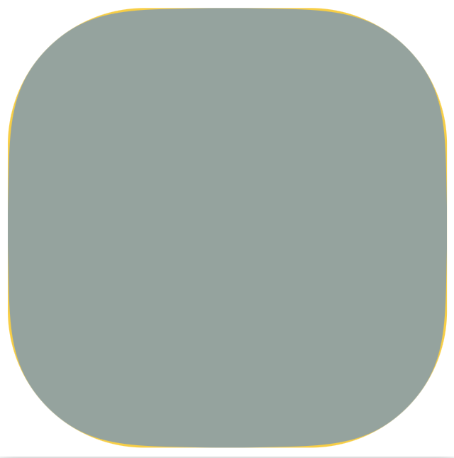
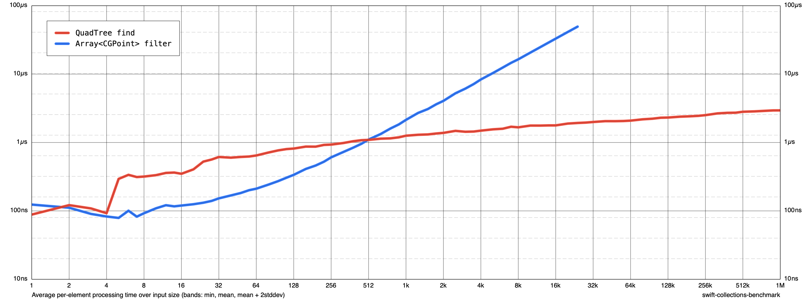

# A Flock of Swifts

We are a group of people excited by the Swift language. We meet each Saturday morning to share and discuss Swift-related topics. 

All people and all skill levels are welcome to join. 

## Archives

- [2020 Meetings](2020/README.md)
- [2021 Meetings](2021/README.md)
- [2022 Meetings](2022/README.md)


## 2023.11.25

- **RSVP**: https://www.meetup.com/A-Flock-of-Swifts/

---

## 2023.11.18

### Review Typed Throws Proposal

There is a new Swift Evolution proposal runing to the end of the month that introduces typed throws.

https://github.com/apple/swift-evolution/blob/main/proposals/0413-typed-throws.md

The solution is very elegant for creating generic code and it does away with rethrows by introducing another generic.

```swift
// Normal throwing function 
func compute() throws -> Int
// Can be written equivalently
func compute() throws(any Error) -> Int
```

```swift
// Non-throwing function 
func compute() -> Int
// Can be written equivalently
func compute() throws(Never) -> Int
```

But now:

```swift
func compute() throws(ComputeError) -> Int
```

Now the compiler can type check exactly what gets thrown and no dynamic allocation is needed.

An important point made in the proposal, however, is that most code should prefer the previous form since most errors do not need to be exhastively type checked and it makes evolving the implementation of the function easier.

### Scroll View

Rainer talked about his plan for solving his scroll view problem. Maybe we will see the solution next week?

Andy R. suggested that layout guides might help:

- https://useyourloaf.com/blog/easier-scrolling-with-layout-guides/
  
- https://developer.apple.com/documentation/uikit/uiscrollview/2865772-framelayoutguide
  
- https://developer.apple.com/documentation/uikit/uiscrollview/2865870-contentlayoutguide


### Demo of the Scheduling App

Monty gave a demo of the time app that he has been working on. The app looked pretty great and we gave some suggestions that he may look into.

Implementation wise, these things might help:

- https://developer.apple.com/documentation/foundation/relativedatetimeformatter
- https://developer.apple.com/documentation/uikit/uiapplication/1622944-willenterforegroundnotification


### RealityKit

Josh gave a demo of a RealityKit app and showed how to mix SwiftUI components inside and outside of a RealityView volume.


John Brewer showed us a non-vision pro version of his lunar lander app.

- https://developer.apple.com/documentation/gamecontroller/gcvirtualcontroller


### Odds and Ends


#### New Apple Framework: Memory Mapped I/O

-  https://github.com/apple/swift-mmio

#### SwiftUI MasterClass on Udemy

Great assets. Uses text-to-speech for most of the course.

- https://www.udemy.com/course/swiftui-masterclass-course-ios-development-with-swift/

#### VisionPro DevCamp

Anticipates the release of hardware.

- https://visiondevcamp.org

#### Game Controller

- https://developer.apple.com/documentation/gamecontroller/gcvirtualcontroller

#### Visualizing Data

Some links from Carlyn about data.

- https://www.youtube.com/watch?v=MIZXqC1-VLc

There is a paid course coming up during the summer:

- https://cereg.risd.edu/search/publicCourseSearchDetails.do?method=load&courseId=1029093


---

## 2023.11.11

### Fixing Layout

Josh refactored Monty's layout code to work properly.  In addition to converting over to a stateful filter algorithm that is O(n) instead of O(n^2) as a result of calling `contains()` on an array type, he also fixed the bug that was causing text truncation. This was due to looking into the views array at the wrong index and thus using the wrong bounds for different methods.  The original code from Monty is here:

https://github.com/MontyHarper/CalendarTests.git

You can see the diffs (as a pull request from Josh):

https://github.com/MontyHarper/CalendarTests/pull/2/commits/34be937e8e643473dbca138898cb6a64a6b545b2

### Indie Developer Finances

Carlyn continued her exploration of the financial side of indie development making this spreadsheet to compute costs and how they result in profits/losses.

- https://docs.google.com/spreadsheets/d/1mM009MW_9w4BP-I9t3YEBZc6BtQFq5rRaxlOKwBveVA/


Josh made a recommendation to talk to some Indie devs that are actually making a go of it at this meetup:

- https://www.meetup.com/core-coffee-a-catch-up-for-ios-and-macos-developers/

Alternately, it might be useful (if doing a poll) to reach out on the slack channel.

- https://ios-developers.slack.com


### Composable Architecture

We gave a quick look at the Case Studies app to show how features can be composed.  Here are the main points:

- You can keep the `State` of other reducers in your reducer.
- You can use the `Scope() { ChildReducer() }` reducer building in a parent reducer to pair down the state and specify a routing `Action` and then put the child reducer into the parents reducer body.
- In the view you can use the scope operator on a store to widdle down the state to just what you need and pass the view in.


---

## 2023.11.04

### MacBook Pro M3/Pro/Max

It is a compelling upgrade. 

- https://daringfireball.net/2023/11/the_2023_m3_macbook_pros

We talked about how to decide whether to upgrade or not and
a discussion about how to make a sustainable career doing iOS
development and consulting followed. 

Carlyn was looking for resources similar to other industries such as:

- https://graphicartistsguild.org/  
- https://www.asmp.org/


The consensus seemed to be that there are not a lot of great resources out there as there is in other industries.

A talk about the business side of contracting:

- https://appdevcon.nl/session/tips-and-tricks-for-independent-contracting/

-   https://blog.curtisherbert.com/slopes-diaries-43-chasing-a-goldilocks-business/

Alex L. gave us some insight as to what he does including preparing for equipment failure.

### Collection View Handling

Rainer had a question about how to handle table views inside a collection view. He was fairly convinced, however, that a compositional collection would not work for his use case.

Alex mention this Paul Hudson:

- https://www.youtube.com/watch?v=SR7DtcT61tA

### Layout

Monty was trying to adapt Josh's layout solution to a case where the items spacing were not uniform. We looked a little bit at the code and tried to see why the text was clipping. We tried a couple of experiments without luck. Running short on time so will look into it again next week.

### The Composable Architecture

We took a few minutes to see about composing features. We will investigate it more in future weeks.

---

## 2023.10.28

### Reading BarCodes

Josh: Using AVFoundation to access video from Cameras is a 
common iOS thing that you want to do. You should check
out these sample code from Apple:

- https://developer.apple.com/documentation/vision/vndetectbarcodesrequest
- https://developer.apple.com/documentation/avfoundation/capture_setup/avcambarcode_detecting_barcodes_and_faces


### Functional Optics

Franklin:

- https://theswiftdev.com/lenses-and-prisms-in-swift/


### ProTip: Don't put Views in your Observable Objects

### Use Logs

Logs are pretty great. You should use them. You can learn about them here:

- https://www.avanderlee.com/debugging/oslog-unified-logging/
- https://developer.apple.com/wwdc23/10226
- https://github.com/joshuajhomann/Logging

The **Console** app makes a pretty good viewer 

### Use Calendar

The Temporal Axis of Space-Time - Dave DeLong https://vimeo.com/865876497

### The Composable Architecture

We continued our experiments with the composable architecture. We implemented
testing for our Add Project flow. See https://github.com/rayfix/TimeKeep

```swift
  @MainActor
  func testAddProject() async {
    let store = TestStore(initialState: ProjectsListFeature.State(projects: [])) {
      ProjectsListFeature()
    } withDependencies: { values in
      values.uuid = .incrementing
    }
    
    let project = Project(id: .init(UUID(0)), name: "Project", timeEvents: [], isActive: true)
    
    await store.send(.addButtonTapped)  { state in
      state.projects = [project]
    }
    await store.receive(.editProjectName(project)) { state in
      state.projectName = "Project"
      state.focus = .project(project.id)
    }
    store.assert { state in
      XCTAssert(state.isAddDisabled)
    }
    await store.send(.set(\.$projectName, "Study Swift")) { state in
      state.projectName = "Study Swift"
    }
    
    store.assert { state in
      XCTAssert(state.isAddDisabled)
    }
    
    await store.send(.editProjectNameSubmit) { state in
      state.focus = nil
      state.projects = [Project(id: .init(UUID(0)), name: "Study Swift", timeEvents: [], isActive: true)]
      state.projectName = ""
    }
    store.assert { state in
      XCTAssertFalse(state.isAddDisabled)
    }
  }
```


---

## 2023.10.21

### git Troubleshooting 

A great flowchart for if you run into trouble:

- http://justinhileman.info/article/git-pretty/


### Xcode and AI

- https://github.com/features/copilot
- https://github.com/intitni/CopilotForXcode

A humorous look at ChatGPT from Bob D.:

- https://www.youtube.com/watch?v=dxxCPdcMcFw


### Data Management in SwiftUI iOS 17

PointFree has a deep dive series going on right now about observation:

- https://www.pointfree.co/episodes/ep253-observation-the-present

Another resource about Observation:

- https://www.youtube.com/watch?v=wxJxpVEkEjw&t=377s


We attempted using the environment to pass the data but it didn't seem to work with @Observable.
A more traditional approach of just passing it in worked better.

### Scanning Bar Codes

This worked out well for Tim.

- https://www.hackingwithswift.com/books/ios-swiftui/scanning-qr-codes-with-swiftui

Bob D. notes this app uses it:

- https://github.com/bobdel/16-Hot-Prospects/tree/main

### Chargers

John B. thinks this is a good one. 

- https://www.apple.com/shop/product/HPZE2ZM/A/mophie-speedport-120-4-port-gan-wall-charger-120w


### A Quick Tour of Flutter

Ed took us on a quick tour of Flutter using InteliJ.  The language dart looks a lot like Java.  Heavy use of semicolons and closures all the way down.

From Ed:

"There are 2 parts - Dart and the Flutter frameworks.  There are several online sources to get the basics of Dart.  That was enough to get started, and I just googled for anything I needed - like optional parameters, enums, etc.  Flutter has a ton of examples and they’re enough to get started with setting up the environment and starting an app.  Then I just googled when I got stuck on something - there’s lots of examples out there and many packages that help with basic things."

Georgi pointing out some large companies that use multi-platform frameworks.

Uber

- https://www.uber.com/blog/new-rider-app-architecture/

Meetup

- https://www.youtube.com/watch?v=GtJBS7B3eyM&t=43s


### SwiftUI Companion

Andrei F. finds this resource to be useful:

- https://swiftui-lab.com/companion/

Documentation and live code.

### TCA Tutorials

These written in beautiful DocC.  How did they do that Tim asks:

- https://developer.apple.com/documentation/docc/tutorial-syntax
- https://developer.apple.com/wwdc21/10235


### More practice with TCA

We looked at the TimeKeep app a little more today.

https://github.com/rayfix/TimeKeep


You can go even further than we did than last week and eliminate the scratch variable by creating a custom
binding:

```swift
  TextField("", text: viewStore.binding(
            get: { $0.projects[id: project.id]?.name ?? "" },
            send: { ProjectsListFeature.Action.updateProjectName(project.id, $0) }
            ),
            prompt: Text("Project Name")
  )
```

Notice that to create a binding it is get/send and not get/set. The only way you can change app state in
TCA is to send actions into the store.

In the end, this is not a good idea.  You want to user to be able to pass through invalid states such as 
blanking out the entire name before submitting a new one. So we reverted this change.

---


## 2023.10.14

### Refactoring!

Monty mentioned wanting to learn how to organize his code better and that 
started a discussion about refactoring and testing

A resource about refactoring:

- https://martinfowler.com/books/refactoring.html

You want to be able to unit test your code:

- https://pragprog.com/titles/jrlegios/ios-unit-testing-by-example/


This quick post by Paul Hudson:

- https://www.hackingwithswift.com/store/testing-swift


How to add testing to an existing target:

- https://www.youtube.com/watch?v=9LRWgSP7lCU


### New this week

PointFree.co video nicely demonstrate how Observable object drives changes in SwiftUI

- https://www.pointfree.co/episodes/ep252-observation-the-past 

### Talks from NSSpain

- https://vimeo.com/showcase/10672108

Related to refactoring (and from NSSpain), bug-free by design:

- https://vimeo.com/showcase/10672108/video/865647957


### Presentation: TimeKeep

We continued exploration of the TCA architecture by implementing the ability to 
edit the apps "Project" names inline.  

The work-in-progress repo:

- https://github.com/rayfix/TimeKeep


- Created our first Feature (reducer + views)
- Created State and Action that are sub-types of the Reducer
- Used Dependency injection for UUID
- Used UIKit hack to let SwiftUI text field get first responder and select all.
- Used `@BindingState` and `BindingAction<State>` so that we could adapt SwiftUI two-way bindings into a one way binding
- Created a focus variable and used `bind` to connect it to from our state to our model
- Created list view, store, and viewStore


---

## 2023.10.07

### Comparing Combine, ObservableObject and Observation

A presentation by Josh H. about the different systems for building apps. We started by reviewing a previous app that performed incremental search on a service that fetches Magick The Gathering cards. Then we built a new app using the `@Observable` macro for also doing search as you type.

- https://github.com/joshuajhomann/MapSearchCompleter


### Type Erasing AsyncStream

Josh showed us why you can't easily type erase an AsyncStream: no primary associated type for the element. Here is he showed and how it doesn't really work with `any P`.  The error: `Member 'prefix' cannot be used on value of type 'any AsyncSequence'; consider using a generic constraint instead`.

```swift
    import PlaygroundSupport
    PlaygroundPage.current.needsIndefiniteExecution = true
    
    protocol P {
        associatedtype S: AsyncSequence where S.Element == Int
        var s: S { get }
    }
    
    final class Q: P {
        let s: AsyncStream<Int>
        init() {
            var state = 0
            s = AsyncStream {
                defer { state += 1 }
                return state
            }
        }
    }
    
    func iterate<S: AsyncSequence>(s: S) async where S.Element == Int  {
    
    }
    
    Task {
        let p: any P = Q()
        for try await element in (p.s as any AsyncSequence).prefix(10) {
            print(element)
        }
    }
```

### Types and Protocols

Implementing generics

https://www.reddit.com/r/rust/comments/7gkiie/implementing_swift_generics_video/


Intro to protocol oriented programming

- https://youtu.be/ekYdBcl3dzs?si=uu7qFb2lQAOWAA1A


## Editors

Ray was looking into TextKit2 this week and asking about editors.

- https://github.com/qeude/SwiftDown
- https://github.com/simonbs/Runestone

Related:

- https://developer.apple.com/documentation/foundation/attributedstring/instantiating_attributed_strings_with_markdown_syntax


## Localization and CollectionViews

This seems to be a good way to hook into assigning the focus view: use the delegate.

https://developer.apple.com/documentation/uikit/uicollectionviewdelegate/1618066-indexpathforpreferredfocusedview

### Celebrating Life on Earth

At the beginning of the meeting we talked about the wonder of the world.

Life on Earth is amazing.  A three minute video set to Hallelujah by the New York City Choir.

- https://www.youtube.com/watch?v=wxX7Sa8WtuI

An amazing book about biology and "sensors".

- https://www.penguinrandomhouse.com/books/616914/an-immense-world-by-ed-yong/


---

## 2023.09.30

### TimeKeep Composable Architecture 

We continued the slow development of the TimeKeep app and created our first composable architecture feature.  
https://github.com/rayfix/TimeKeep

A feature is a Reducer which contains:

    - State
    - Action
    - Reducer body
    - External dependencies injected with @Dependency

These are business logic that are highly configurable and testable. Imagine business logic that can be composed much like views can be composed in SwiftUI.

In SwiftUI, the UI is driven by a `Store` which consists of a feature in an initial state. The view observes some of all of the state and reduces on it.  This is done using a ViewStore.  TestStores are special store types that can be used for testing.

### Facetime using tvOS

- https://support.apple.com/guide/tv/use-facetime-atvb3cced7cd/tvos

### Old Man's 
- https://apps.apple.com/us/app/old-mans/id1473496741


### Testing Notifications

Ed told us about many tools you can use to experiment with notifications:

    1. Drag an .apns file with notification onto the simulator.
    2. xcrun simctl push
    3. Use web frontend icloud.developer.com
    4. RocketSim

### Airpods
    
Voice isolation is an iOS / MacOS feature.
- https://www.macrumors.com/how-to/enable-voice-isolation-cellular-phone-calls/


### Other thoughts about Composable Architecture

Side effects.  Ray: I am not sure if these are so current.

- https://github.com/pointfreeco/swift-composable-architecture/discussions/1145
- https://www.pointfree.co/collections/composable-architecture/side-effects


### Vision Pro and Unity

Some discussion about how to get a simple HelloWorld app working with Xcode.

- https://jera.com/blog/2023/9/unity-and-vision-pro-its-complicated
- https://www.meetup.com/monthly-sf-game-development-community/

---

## 2023.09.23

### Swift 5.9 Released

Sites that give you Xcode version and Swift version.

- https://swiftversion.net (more swift focused, evolution proposals)
- https://xcodereleases.com (more xcode focused, Xcode release notes)

When you open Xcode 15 it gives you this useful link about what's new this year:

 - https://developer.apple.com/documentation/updates/wwdc2023

### Streaming large data files

Some talk about implementing a streaming system.

- https://developer.apple.com/documentation/foundation/nsdata/readingoptions


### Gestures

Monty was having difficulty with tap and long tap gestures interfering. 
Some background links to resolve:

- https://developer.apple.com/documentation/swiftui/composing-swiftui-gestures
- https://developer.apple.com/documentation/swiftui/view/highprioritygesture(_:including:)

Josh's advice was to implement all of the delegate methods and print from there
to see how the different gestures are interfering.

- https://developer.apple.com/documentation/uikit/uigesturerecognizerdelegate


Monty reported adding this fixed his problem:

```swift
func gestureRecognizer(_ gestureRecognizer: UIGestureRecognizer, 
                       shouldRecognizeSimultaneouslyWith other: UIGestureRecognizer) -> Bool { true }
```

### Keyboard and Toolbars

You can add toolbars to the keyboard since iOS 13.

- https://www.hackingwithswift.com/quick-start/swiftui/how-to-add-a-toolbar-to-the-keyboard


```swift
    .toolbar {
                ToolbarItemGroup(placement: .keyboard) {
                  if focus {
                    Spacer()
                    Button {
                      focus = false
                    } label: {
                      Text("Done")
                    }
                    .foregroundColor(.white)
                    .buttonStyle(.borderedProminent)
                  }
                }
              }
```

### Conference Report from Frank

- https://www.iosdevuk.com
- https://2023.nsspain.com
- https://swiftconnection.io

This talk on Image Processing was particularly great: https://www.youtube.com/watch?v=yB6kfGwfeXA
    

### Swift Talk at C++Now

- https://www.youtube.com/watch?v=lgivCGdmFrw


### Tree Data Structures

- https://swiftpackageindex.com/search?query=tree+data+structure


### TimeKeep App Revisited

We will use the Composable Architecture and create the time keep app:

- https://github.com/rayfix/TimeKeep

Next week we will implement a feature.

---

### Swift State Machines

We discussed the presentation by Cory Benfield about state machines: 
https://www.youtube.com/watch?v=7UC7OUdtY_Q


Some of the key points:

- Name the states explicitly with an enum.
- Put the enum into a struct and make the state private so you can control how it is initialized.
- Make the transitions function calls on the state machine struct. (Avoid huge switch statements.)
- Simplify common operations buy using protocols.

### Side Journey into The Composable Architecture

Speaking of state machines, the basic components of the composable architecture, "features" are built an awful lot like state machines. We talked about the elements of a TCA feature. You might want to check out their new videos on TCA 1.0.  The first one is free. 😉

https://www.pointfree.co/episodes/ep243-tour-of-the-composable-architecture-1-0-the-basics

### Core Data

Looking for guidance about where the core data stack should live.

A sample app that uses core data:

- https://www.hackingwithswift.com/100/swiftui/53

An example from Josh a while back using core data:

https://github.com/joshuajhomann/Todo

A good way is implement a service and inject with dependency injection:

https://github.com/pointfreeco/swift-dependencies


### Controlling the Simulator from the Command Line

- https://nshipster.com/simctl/

### Learning Swift

The usual answers 😆:

- https://www.hackingwithswift.com/100/swiftui
- https://cs193p.sites.stanford.edu


### Virtualization and Testing Betas

- https://arstechnica.com/gadgets/2022/07/how-to-use-free-virtualization-apps-to-safely-test-the-macos-ventura-betas/

PS: Remember that you can give feedback on broken stuff!

---
## 2023.09.09

### Trees in Swift
*  Rainer asked about Replacing (Alamofire)[https://github.com/Alamofire/Alamofire] with URL session. The consensus was to not keep Alamofire unless if you require some feature that it implements that URLSession cannot match such as previously SSL pinning, although Franklin noted that SSL pinning is now implemented on iOS via (App Transport Security)[https://blog.eidinger.info/infoplist-based-certificate-pinning-on-ios].
*  Peter asked about making a background view interactive while displaying a keyboard on a sheet. Jane suggested, using (Popovers)[https://github.com/aheze/Popovers]. Josh suggested using an environment function to show an arbitrary view from the root view of the app as an overlay.

Josh dived into an extended answer to Ed's question last week about lazy tree traversals in swift.  We looked at implementing a tree as an enum with associated types using indirect case to make the associated type storage a reference:  

```swift
enum Tree<Element> {
    indirect case node(value: Element, children: [Self])
    case leaf(value: Element)
}

let tree = Tree<Int>.node(value: 1, children: [
    .node(value: 2, children: [
        .leaf(value: 4),
        .leaf(value: 5),
        .leaf(value: 6)
    ]),
    .node(value: 3, children: [
        .leaf(value: 7),
        .leaf(value: 8)
    ])
])
```

Such trees are trivially `Codable`` as long as their `Elements`s are `Codable`:

```swift
extension Tree: Codable where Element: Codable { }

let encoder = JSONEncoder()
encoder.outputFormatting = [.prettyPrinted, .sortedKeys]
let data = try! encoder.encode(tree)
print(String(data: data, encoding: .utf8)!)
```
We discussed implementing tree traversals imperatively as a while loop, and implementing them lazily and declaratively as a `sequence`.  We also discussed the difference between breath first traversal and depth first traversal, as being the difference between a using a queue (FIFO) and a stack (LIFO).  For real world implementations use a real queue and not an array.
```swift
extension Tree {
    var breadthFirstTraversal: some Sequence<Element> {
        sequence(state: [self]) { queue in
            guard !queue.isEmpty else { return nil }
            switch queue.removeFirst() {
            case let .leaf(value): return value
            case let .node(value, children):
                queue.append(contentsOf: children)
                return value
            }
        }
    }
    var depthFirstTraversal: some Sequence<Element> {
        sequence(state: [self]) { stack in
            switch stack.popLast() {
            case let .leaf(value): return value
            case let .node(value, children):
                stack.append(contentsOf: children.reversed())
                return value
            case .none: return nil
            }
        }
    }
}

for value in tree.depthFirstTraversal {
    print(value)
}
```

An alternative implementation for a binary tree. Note for real world usage binary trees should be implemented as an array to optimize for cache coherency:

```swift

enum BinaryTree<Element: Hashable> {
    indirect case node(value: Element, left: Self, right: Self)
    case empty
    static func leaf(_ value: Element) -> Self {
        .node(value: value, left: .empty, right: .empty)
    }
    var isEmpty: Bool {
        switch self {
        case .node: false
        case .empty: true
        }
    }
}

extension BinaryTree {
    var breadthFirstTraversal: some Sequence<Element> {
        sequence(state: [self]) { queue in
            guard !queue.isEmpty else { return nil }
            switch queue.removeFirst() {
            case let .node(value, left, right):
                if !left.isEmpty { queue.append(left) }
                if !right.isEmpty { queue.append(right) }
                return value
            case .empty: return  nil
            }
        }
    }
    var depthFirstTraversal: some Sequence<Element> {
        sequence(state: [self]) { stack in
            switch stack.popLast() {
            case let .node(value, left, right):
                if !right.isEmpty { stack.append(right) }
                if !left.isEmpty { stack.append(left) }
                return value
            case .empty, .none: return  nil
            }
        }
    }
}

let binaryTree = BinaryTree<Int>.node(
    value: 0, 
    left: .node(
        value: 1, 
        left: .leaf(3), 
        right: .leaf(4)
    ),
    right: .node(
        value: 2, 
        left: .leaf(5), 
        right: .leaf(6)
    )
)
```
## 2023.09.02

### Shader Demo

Josh showed us some amazing code that styles in SwiftUI with metal shader programmers that are dynamically called at runtime.
[ShapeStyle](https://github.com/joshuajhomann/ShapeStyle)


### Improving Build Times

From iOS Dev weekly:

- https://www.manu.show/2023-08-18-improve-build-times-in-spm-packages-and-in-your-apps/

### Followup on Decimation Code

Monty was having trouble getting the code to run. Josh used the `#Predicate` macro in Swift 5.9.
A non-macro version looks like this:

```swift
let decimation = [
  subviews.indices.lazy.filter { _ in true },
  subviews.indices.lazy.filter { !$0.isMultiple(of: 4) },
  subviews.indices.lazy.filter { !$0.isMultiple(of: 3) },
  subviews.indices.lazy.filter { $0.isMultiple(of: 2) },
  subviews.indices.lazy.filter { $0.isMultiple(of: 3) },
  subviews.indices.lazy.filter { $0.isMultiple(of: 4) },
  subviews.indices.lazy.filter { $0.isMultiple(of: 6) },
  subviews.indices.lazy.filter { _ in false },
]
  let bestFit = decimation.first { indicies in
          zip(indicies, indicies.dropFirst())
              .allSatisfy { left, right in
              frames[left].maxX + minimumSpacing < frames[right].minX
                  }
          }.map(Set.init) ?? []
```

There were suggestions that he might be running into environment problems. Peter suggested he might want to clean up some of his disk space usage with this Apple Genius recommended application:

- https://daisydiskapp.com

### Embedded Swift

A Vision document has been released on the Swift forum for using Swift in resource starved environments:

- https://forums.swift.org/t/embedded-swift/67057

### Keystrokes

Allen was asking about how to get key presses in SwiftUI. There isn't really a good way to do it today but iOS 17 introduces a new modifier described in this article.

https://www.hackingwithswift.com/quick-start/swiftui/how-to-detect-and-respond-to-key-press-events

### Modelling Trees

Ed showed us some code he was using to build a tree. There was a suggestion to conform to sequence to allow different traversals. (Breadth first, Depth first) rather than have recursive functions to do the job.  He might want 

### Precise Domain Modelling

We talked about precise domain modelling and making invalid states non-representable. Josh recommended we all watch:

- https://www.youtube.com/watch?v=7UC7OUdtY_Q

### Learning Swift

The top (and free) choices are

- https://cs193p.sites.stanford.edu
- https://www.hackingwithswift.com/100/swiftui
- https://developer.apple.com/tutorials/swiftui

Also, a good resource for getting specific questions answered:

- https://join.slack.com/t/swiftcodersla/shared_invite/zt-22cn00k47-KyUe9GQ49GlSazpJ5vifLA

### Using C in your Swift

Carlyn found another great example for using C in your Swift code:

- https://github.com/apple/swift-nio

---

## 2023.08.26

### Layout Decimation

We revisited Monty's question about removing views when they are overlapping.  Josh presented a solution using the new (Predicate)[https://developer.apple.com/documentation/foundation/predicate] type in Swift 5.7 and a custom SwiftUI Layout.  This code can be further optimized by implementing the caching methods on the Layout protocol as we have discussed in previous examples.  

```swift
import SwiftUI

@Observable
@MainActor
final class ViewModel {
    var items: [Item] = []
    nonisolated init() { }
    func callAsFunction() async {
        let formatter = NumberFormatter()
        formatter.numberStyle = .ordinal
        items = (1...12).compactMap { value in
            formatter.string(for:value).map { string in
                Item(description: string)
            }
        }
    }
}

extension ViewModel {
    struct Item: Identifiable, Hashable, CustomStringConvertible {
        var id: String { description }
        var description: String
    }
}

struct ContentView: View {
    @State private var viewModel = ViewModel()
    var body: some View {
        ProportionalHorizontalLayout {
            ForEach(viewModel.items) { item in
                Text(String(describing: item)).font(.largeTitle)
            }
        }
        .task { await viewModel() }
    }
}

struct ProportionalHorizontalLayout: Layout {
    var minimumSpacing: CGFloat = 10
    func sizeThatFits(proposal: ProposedViewSize, subviews: Subviews, cache: inout ()) -> CGSize {
        proposal.replacingUnspecifiedDimensions(by: .zero)
    }
    func placeSubviews(in bounds: CGRect, proposal: ProposedViewSize, subviews: Subviews, cache: inout ()) {
        let frames = subviews.enumerated().map { index, view in
            let size = view.sizeThatFits(.unspecified)
            let proportion = Double(index) / Double(max(subviews.count - 1, 1))
            return CGRect(
                origin: .init(
                    x: bounds.origin.x + bounds.width * proportion,
                    y: bounds.origin.y + bounds.midY
                )
                , size: .zero
            )
                .insetBy(dx: -size.width / 2, dy: -size.height / 2)
        }
        
        let decimation = [
            #Predicate { _ in true },
            #Predicate { $0 % 4 != 0 },
            #Predicate { $0 % 3 != 0 },
            #Predicate { $0 % 2 == 0 },
            #Predicate { $0 % 3 == 0 },
            #Predicate { $0 % 4 == 0 },
            #Predicate { $0 % 6 == 0 },
            #Predicate { _ in false }
        ].lazy.compactMap { predicate in
            try? subviews.indices.filter(predicate)
        }

        let bestFit = decimation.first { indicies in
            zip(indicies, indicies.dropFirst()).allSatisfy { left, right in
                frames[left].maxX + minimumSpacing < frames[right].minX
            }
        }.map(Set.init) ?? []

        let nowhere = CGPoint(x: 1e12, y: 1e12)

        for (index, view) in subviews.enumerated() {
            let frame = frames[index]
            view.place(
                at: bestFit.contains(index) ? frame.origin : nowhere,
                anchor: .topLeading,
                proposal: .init(width: frame.size.width, height: frame.size.height)
            )
        }
    }
}
```

We discussed using closures as an alternative for pre Swift 5.7:  

```swift
let decimation = [
    subviews.indices.lazy.filter { _ in true },
    subviews.indices.lazy.filter { !$0.isMultiple(of: 4) },
    subviews.indices.lazy.filter { !$0.isMultiple(of: 3) },
    subviews.indices.lazy.filter { $0.isMultiple(of: 2) },
    subviews.indices.lazy.filter { $0.isMultiple(of: 3) },
    subviews.indices.lazy.filter { $0.isMultiple(of: 4) },
    subviews.indices.lazy.filter { $0.isMultiple(of: 6) },
    subviews.indices.lazy.filter { _ in false },
]
```

### Interpolation

We revisited Ed's question from last week about built in Swift methods for linear interpolation.  Josh showed an example using both the (mix)[https://developer.apple.com/documentation/accelerate/1425031-mix] function from Swift.Accelerate and the (VectorArithmetic)[https://developer.apple.com/documentation/swiftui/vectorarithmetic] protocol from SwiftUI.  

```swift
import Combine
import SwiftUI
import simd

import PlaygroundSupport

@Observable
final class ViewModel {
    private(set) var color: Color = .indigo
    var alpha = 0.0
    var method = Method.simd
    enum Method: String, RawRepresentable, Identifiable, CustomStringConvertible, CaseIterable, Hashable {
        case simd, vectorArithmetic, unitPoint
        var id: String { rawValue }
        var description: String { rawValue }
    }
    func onChange(_ colorScheme: ColorScheme) {
        var environmentValues = EnvironmentValues()
        environmentValues.colorScheme = colorScheme
        let s = Color.indigo.resolve(in: environmentValues)
        let d = Color.orange.resolve(in: environmentValues)
        switch method {
        case .simd:
            let indigioRGBA = SIMD4(s.red,  s.green,  s.blue,  s.opacity)
            let orangeRGBA = SIMD4(d.red,  d.green, d.blue,  d.opacity)
            let rgba = mix(indigioRGBA, orangeRGBA, t: Float(alpha))
            color = Color(red: Double(rgba.x), green: Double(rgba.y), blue: Double(rgba.z), opacity: Double(rgba.w))
        case .vectorArithmetic:
            self.color = Color(
                red: Double(s.red.interpolated(towards: d.red, amount: alpha)),
                green: Double(s.green.interpolated(towards: d.green, amount: alpha)),
                blue: Double(s.blue.interpolated(towards: d.blue, amount: alpha)),
                opacity: Double(s.opacity.interpolated(towards: d.opacity, amount: alpha))
            )
        case .unitPoint:
            let t = UnitCurve.easeInOut.value(at: alpha)
            self.color = Color(
                red: Double(s.red.interpolated(towards: d.red, amount: t)),
                green: Double(s.green.interpolated(towards: d.green, amount: t)),
                blue: Double(s.blue.interpolated(towards: d.blue, amount: t)),
                opacity: Double(s.opacity.interpolated(towards: d.opacity, amount: t))
            )
        }
    }
}

struct V: View {
    @State private var viewModel = ViewModel()
    @Environment(\.colorScheme) var colorScheme
    var body: some View {
        Picker("Method", selection: $viewModel.method) {
            ForEach(ViewModel.Method.allCases) { method in
                Text(String(describing: method)).tag(method)
            }
        }
        .pickerStyle(.segmented)
        Slider(value: $viewModel.alpha)
        Circle()
            .fill(viewModel.color)
            .onChange(of: viewModel.alpha) { _, _ in viewModel.onChange(colorScheme) }
            .onChange(of: colorScheme) { _, _ in viewModel.onChange(colorScheme) }
            .onChange(of: viewModel.method) { _, _ in viewModel.onChange(colorScheme) }
    }
}

let v = V()
PlaygroundPage.current.setLiveView(V())
```

### ShapeStyle continued
Josh continued discussion of shape style and the new (Shader)[https://developer.apple.com/documentation/swiftui/shader] conformance in iOS 17 as well as the new (visualEffect)[https://developer.apple.com/documentation/swiftui/visualeffect?changes=_6] modifier.  We also touched on how shader makes use of the String verison of (@dynamicMemberLookup)[https://github.com/apple/swift-evolution/blob/main/proposals/0195-dynamic-member-lookup.md] and (@dynamicCallable)[https://github.com/apple/swift-evolution/blob/main/proposals/0216-dynamic-callable.md].  

---

## 2023.08.19

### CardView

We went on a random walk to create a `CardView` in SwiftUI. Some key learnings:

- Alignment can give better performance using Spacer().
- Use shapeStyle and semantic colors to make dark mode work well.
- You can use `@Environment(\.colorScheme) var colorScheme` to do special things for `.dark` vs `.light` mode.

```swift
import SwiftUI

struct CardView<Content: View>: View {
  let size: Double
  let title: String
  let subtitle: String
  let isSelectable: Bool
  let isSelected: Bool
  let isLiked: Bool
  let radius = 10.0
  @ViewBuilder var content: () -> Content
  
  @Environment(\.colorScheme) var colorScheme
  
  private var shadowColor: Color {
    colorScheme == .dark ?
    Color(red: 0.3, green: 0.3, blue: 0.3).opacity(0.8) :
    Color(red: 0.9, green: 0.9, blue: 0.9).opacity(0.8)
  }
  
  var body: some View {
    ZStack {
      Rectangle().foregroundStyle(.background)
      content()
        .padding(10)
        .aspectRatio(contentMode: .fit)
      VStack(alignment: .leading) {
        Spacer()
        HStack {
          VStack(alignment: .leading) {
            HStack(alignment: .firstTextBaseline) {
              Text(title).bold(); Spacer();
              Image(systemName: "heart.fill").foregroundColor(.red)
                .opacity(isLiked ? 1 : 0)
            }
            Text(subtitle).font(.caption)
          }
          Spacer()
        }
        .padding()
        .frame(width: size)
        .background(Rectangle().foregroundStyle(.bar))
      }
    }
    .overlay(alignment: .topTrailing) {
      Image(systemName: "checkmark.circle.fill")
        .font(.title)
        .symbolRenderingMode(.multicolor)
        .foregroundStyle(.white, .blue)
        .padding(10)
        .opacity(isSelectable ? 1 : 0)
    }
    .frame(width: size, height: size)
    .cornerRadius(radius)
    .shadow(color: .secondary,
            radius: radius)
  }
}

struct ContentView: View {  
  var body: some View {
    CardView(size: 230,
             title: "Around the world",
             subtitle: Date.now.formatted(),
             isSelectable: false,
             isSelected: true,
             isLiked: true) {
      Image(systemName: "globe").resizable()
    }
  }
}

struct ContentView_Previews: PreviewProvider {
  static var previews: some View {
    ContentView()
  }
}

``` 
### Infinite Loop Bug

Franklin posed this question:

 https://stackoverflow.com/questions/76902789/how-can-i-fix-screen-freezing-and-excessive-cpu-usage-when-attempting-to-impleme/76904182#76904182


Josh showed that the problem could be fixed making `@ObservedObject` into `@StateObject`. Also:


```swift
    final class MyBadClass {
        init() {
            logger.log("\(String(describing: Self.self)) \(#function)")
        }
    }
    
    struct MyBadClassEnvironmentKey: EnvironmentKey {
        static let defaultValue: MyBadClass = .init()
        typealias Value = MyBadClass
    }
    
    extension EnvironmentValues {
        var expensive: MyBadClass {
            self[MyBadClassEnvironmentKey.self]
        }
    }
    
    
    final class Test: ObservableObject {
        init() {
            logger.log("\(String(describing: Self.self)) \(#function)")
        }
    }
```


### Swift C++ Integration

In Swift, you can construct a Swift C++ std::string with the code std.string(swiftString)

### Activity Classification

Bill wanted an outline of how to do activity classification. Josh provided a quick explanation but there is a WWDC 2019 presentation about the very topic:

- https://developer.apple.com/wwdc19/426


### Interpolation

Ed working on a simple interpolation algorithm for an (Ordered) dictionary. It probably works fine for what he wants it to do but might want to check out a more exhaustive solution (that uses SIMD):

- https://developer.apple.com/documentation/accelerate/2896707-simd_mix


### Stanford 2023

From Hegarty

- https://cs193p.sites.stanford.edu/2023

### Animations

You can do it at the website now:

- https://www.lottielab.com/dashboard

---

## 2023.08.12

### ShapeStyle

Josh put together an epic dmeo project to demostrate the many capabilities of ShapeStyle in SwiftUI. Link TBD.

### Project IDX

A new development enviornment for full stack developers by google. https://idx.dev

[Ray: Go, Flutter, JS Python. Swift not even on the coming-soon list. 😅]

### Bluetooth

Rainer wondering about the security of a temperature sensor. The main risk is the actual app.

Frank notes: For reverse engineering: Lightblue and BluefruitConnect (iPhone apps) can do the job.

You can write your own App! CoreBluetooth.

- https://github.com/jeradesign/BluetoothDump (example from John Brewer)
- https://github.com/joshuajhomann/bluetooth (example from Josh Homann)

A package that can make it easier to handle data according to Frank:

- https://swiftpackageindex.com/QuickBirdEng/DataKit

### Question: Reference copying

```swift
var a = someClass
a = someClass.parent
```

The `a` is simply a referece that points to the same underlying object that someClass points to. What a references changes but the type itself is not mutated in this short example.

### C++ Interop

A cool set of links from carlyn who is exploring this for USD.

- https://developer.apple.com/videos/play/wwdc2023/10172/
- https://developer.apple.com/documentation/Swift/MixingLanguagesInAnXcodeProject 
- https://developer.apple.com/documentation/swift/callingapisacrosslanguageboundaries
- https://www.swift.org/documentation/cxx-interop/
- https://www.swift.org/documentation/cxx-interop/project-build-setup/

Also (work-in-progress):

- https://github.com/carlynorama/CxxInteropLibrary
- https://github.com/carlynorama/CppInteropSimplestXCode

### Custom Layout

- https://developer.apple.com/documentation/swiftui/composing_custom_layouts_with_swiftui

### Macros

- There are challenges.
- You need to understand the AST.
- https://github.com/apple/swift-syntax
- https://swift-ast-explorer.com


### RealityKit

https://developer.apple.com/documentation/realitykit/modifying-realitykit-rendering-using-custom-materials


---

## 2023.08.05

### Result Builder Exploration

https://gist.github.com/carlynorama/3e6765d4a87aaaf3fe2f69abb14764ca

### Actors in Action

```swift
protocol PersistenceServiceProtocol: Actor {
   func create(timestamp: Date)  throws -> Item
   var count: Int { get throws }
   ...
}
```

This enforces actor semantics for conformance to the protocol. You don't have to add `async` everywhere even though methods can still suspend.

### Centering Text and Circle

Presented by Monty. The problem is that you want to center the view at 
the center of the circle and have the text above it. Here is the solution 
we arrived at:

```swift
 struct CircleView: View {
   var body: some View {
     Circle()
       .fill(.yellow)
       .frame(width: 40, height: 40)
       .overlay(
         Text("Yellow").fixedSize().offset(y: -40), 
         alignment: .bottom)    
    }
}
```

Some notes:

- Overlay keeps the Circle anchor at the center.
- `fixedSize()` removes text clipping
- A more general solution that was covered previously: https://github.com/joshuajhomann/Wordle/blob/main/Wordle/AnchorToParentLayout.swift


### Conferences and meetings

- https://s2023.siggraph.org/ (This week!)
- iosdevhappyhour.slack.com
- ios-developers.slack.com

### License for command line tools

Bob notes:

```swift
sudo xcodebuild -license
```

### Using Reflection with Binding

An extended example from Ed. We didn't figure it out during the meeting but Ed sent in the answer shortly after:

```swift
import SwiftUI
import Combine
import PlaygroundSupport

struct M {
  var a : Double?
  var b : Double?
  
  static var props : [String] {
    let mirror = Mirror(reflecting: M().self)
    return mirror.children.compactMap { $0.label }
  }
}

struct R {
  var n : String
  var r : Double?
  func good() -> Bool {
    r != nil && r! >= 2 && r! <= 3
  }
}

class List : ObservableObject {
  @Published var r : [R]
  
  init() {
    let props = M.props
    self.r = props.enumerated().map { i,p in
      R(n: p, r: nil)
    }
  }
}


struct BView : View {
  @StateObject private var list = List()
  var body: some View {
    VStack {
      ForEach($list.r.indices, id:\.self) { i in
        TextField(value: $list.r[i].r, format: .number, label: {Text(list.r[i].n)})
          .textFieldStyle(.roundedBorder)
          .padding()
          .background(
            RoundedRectangle(cornerRadius:10.0)
              .fill(list.r[i].good() ? Color.green : Color.clear)
          )
      }
    }
  }
}

let view = BView()
PlaygroundPage.current.setLiveView(view)
```

### Apple Watches

New ones are coming so you may want to wait for a price drop or the new model.

- https://www.apple.com/shop/product/MPA13AM/A/41mm-midnight-braided-solo-loop-size1


### The Composable Architection 1.0

Released this week. 
- https://pointfreeco.github.io/swift-composable-architecture/main/tutorials/meetcomposablearchitecture/


### VisionPro Meetup

Don't forget!

- https://www.meetup.com/vision-pro-developers/events/294299473/


---

## 2023.07.29

### Puyo Puyo app
Josh finished the Puyo Puyo app (code here)[https://github.com/joshuajhomann/PuyoPuyo]  


### Timers

Talked about timers and how to invalidate them. Some live code from Josh:

```swift
import SwiftUI
import UIKit
import PlaygroundSupport
    
    
let timer = Timer.scheduledTimer(withTimeInterval: 1, repeats: false) { _ in
    print(timer)
}
    
timer.invalidate()
```

Some resources:

- https://developer.apple.com/documentation/foundation/timer/2091889-scheduledtimer
- https://www.hackingwithswift.com/articles/117/the-ultimate-guide-to-timer
- https://sarunw.com/posts/timer-in-swiftui/

Also, consider using a timeline view:

- https://developer.apple.com/documentation/swiftui/timelineview


### Getting a Preview in Playground

```swift
import SwiftUI
import UIKit

import PlaygroundSupport


struct V: View {
    var body: some View {
        Color.red
    }
}
    
PlaygroundPage.current.setLiveView(V())
```

### Blog Posting

Many options and opinions here.

- GitHub Pages
- Publish (all Swift and neat, but not designed for general usage)
- https://micro.blog
- Substack
- https://getgrav.org
- https://www.nearlyfreespeech.net
- https://www.netlify.com
- https://gohugo.io


### USD

Carlyn talks about her exploration with the USD file format.

https://www.whynotestflight.com/excuses/hello-usd-part-16-swift-just-sipping-openusd-through...-a-pipe/


## 2023.07.22

### Discussion about CI

- GitHub Actions
- https://developer.apple.com/xcode-cloud/


### Getting and Setting Colors

Monty had a question about getting the hue, saturation, and brightness from a SwiftUI Color that he had already set.

Josh used a playground to demonstrate the relationship between SwiftUI colors, CGColors, and UIColor. Some serious API archeology happening here! 😄

```
import SwiftUI
import UIKit
import PlaygroundSupport
    
    
let swiftuiColor = Color(hue: 0.668944, saturation: 1.0, brightness: 0.267304)
let cgColor = swiftuiColor.cgColor
let uiColor = UIColor(cgColor: cgColor!)
    
var (h,s,v,a) = (CGFloat.zero,CGFloat(1.0),CGFloat(1.0),CGFloat(1.0))
    
print(uiColor.getHue(&h, saturation: &s, brightness: &v, alpha: &a))
    
print(h,s,v,a)
```


### Weather API

Another question Monty had was about using WeatherKit to get sunrise and sunset.  You can use wheter kit to do this with SunEvents.  

- https://developer.apple.com/videos/play/wwdc2022/10003/
- https://betterprogramming.pub/wwdc22-get-started-with-weatherkit-202794853c01

You can also use a free API:

https://sunrise-sunset.org/api

You can do your own "cleanroom" implementation that can be computed locally.

- https://gml.noaa.gov/grad/solcalc/solareqns.PDF
- https://github.com/ceeK/Solar


### Vision Pro

Unity beta release. A good article that explains what is possible with the different modes (RealityKit vs Unity)

- https://arstechnica.com/gadgets/2023/07/unity-launches-visionos-beta-opening-the-doors-for-existing-apps-and-games/

### Ad Hoc Database

Ed took us on a journey about using dictionaries to implement fast lookup to a local database.

We talked about everything from sets to the demise of C-style for loops.

### Puyopuyo Continued

Josh continued his epic example creating Puyo puyo in iOS17 SwiftUI, which will probably complete next week with the collapse of puyo towers! 😂

---

## 2023.07.15


### New HTTP Types

- https://github.com/apple/swift-http-types
- https://www.swift.org/blog/introducing-swift-http-types/

### Social Media for Developers

- https://iosdev.space
- https://ios-developers.slack.com

### JSON Schema

- https://json-schema.org

A project that uses JSON Schema

- https://www.swift.org/blog/introducing-swift-openapi-generator/


### Universal Scene Description Demo

Carlyn is implementing the USD format from scratch in Swift. You can find a flurry of blog posts on her blog: https://www.whynotestflight.com


She showed this JavaScript library that does similar thing to what she wants to do: https://p5js.org

A big part of the library is using ResultBuilder. Josh did a presentation on this last year. This is his template 

```swift
@resultBuilder
    struct <#Name#>Builder {
        typealias Expression = <#Expression#>
        typealias Component = <#Component#>
        typealias FinalResult = <#FinalResult#>
    
        static func buildBlock(_ components: Component...) -> Component {
            buildArray(components)
        }
        static func buildExpression(_ expression: Expression) -> Component {
    
        }
        static func buildOptional(_ component: Component?) -> Component {
            component ?? <#empty#>
        }
        static func buildEither(first component: Component) -> Component {
            component
        }
        static func buildEither(second component: Component) -> Component {
            component
        }
        static func buildArray(_ components: [Component]) -> Component {
    
        }
        static func buildLimitedAvailability(_ component: Component) -> Component {
            component
        }
        static func buildFinalResult(_ component: Component) -> FinalResult {
    
        }
    }

```

### Migratable Codable

Ed had some discussion on making codable formats that can migrate. Here is code from Josh proposed:

```swift
final class A {
        var integer: Integer
        init(dictionary: [Swift.String: Any]) {
            integer = .init(dictionary: dictionary.compactMapValues { $0 as? Int})
        }
        @dynamicMemberLookup
        struct Integer {
            var dictionary: [Swift.String: Int]  
            subscript(dynamicMember member: Swift.String) -> Int {
                dictionary[member] ?? 0
            }
        }
        @dynamicMemberLookup
        struct String {
            var dictionary: [Swift.String: Swift.String]  
            subscript(dynamicMember member: Swift.String) -> Swift.String {
                dictionary[member] ?? ""
            }
        }
}
    
let a = A(dictionary: ["a": "a", "b": 1])
print(a.integer.b)
```

### Puyopuyo

The demo continues showing, custom Layout, animation, state management, and more.

---

## 2023.07.08

### Working with Autolayout and Size Classes

Emil Safier gave a talk a few years back:
https://youtu.be/Hao5mA-sQbQ

### Swiftful YouTube

Humberto De La Cruz recommends a video series on YouTube called "Swiftful Thinking".

### Vision Pro

Remember there is a meetup group starting this Tuesday.

https://www.meetup.com/vision-pro-developers/


```swift
    #if os(xrOS)
      let minWidthX: CGFloat = 300
    #else
      let minWidthX = UIScreen.main.bounds.width
    #endif
```

### Best Monitor to Buy

Various suggestions from people.

- https://www.nytimes.com/wirecutter/reviews/best-monitors/
- https://www.amazon.com/gp/product/B078GVTD9N/
- https://www.amazon.com/Philips-276E8VJSB-3840x2160-UltraNarrow-DispalyPort/dp/B07JXCR263?th=1
- https://camelcamelcamel.com

### How to Understand a Big Codebase

- Understand the dependencies.
- ASK Questions!
- Find out what the intent is.
- ASK Questions!


### PuyoPuyo, Animation, Layout

An epic example of how to do custom layout.

Code: TBD.

---

## 2023.07.01

### Welcome Monty

New to iOS programming. Currently doing a UDEMY course but several people say he would be
better off doing 100 days of SwiftUI.

Discussed his passion project: calendar app for cognitively impaired. Some advice:

- Try out SwiftUI
- Draw out your UI on paper
- 100 days of SwiftUI https://www.hackingwithswift.com/100/swiftui
- Guided Access https://support.apple.com/guide/ipad/guided-access-ipada16d1374/ipados
- Apps to reference: https://9to5mac.com/2022/09/28/up-ahead-countdown-app-iphone/

Tutorial: https://devtut.github.io/ios/eventkit.html


### Realm and Mongo Atlas

- https://atlasmadness.devpost.com
- https://en.wikipedia.org/wiki/MongoDB_Inc
- https://aws-quickstart.github.io/quickstart-mongodb-atlas/ — notes a three-node cluster minimum for a replica set for high availability, but it does not say it *must* be replicated across regions. 

### Layout Problems with Geometry Reader

Mark trying to make a list that can control row spacing. Attempts at using GeometryReader seemed to break lineLimit modifiers. He tried putting the GeometryReader in the overlay but it didn't help. Brainstorm advice was to not use List (and implement Edit functionality) or to use Layout.

- https://www.swiftbysundell.com/articles/swiftui-layout-system-guide-part-2/
- https://github.com/carlynorama/LayoutTests
- https://developer.apple.com/documentation/swiftui/view/linelimit(_:reservesspace:)

### PDF Multipage on Mac

- https://www.hackingwithswift.com/quick-start/swiftui/how-to-render-a-swiftui-view-to-a-pdf


### visionPro Meetup

New meetup to start July 11, 2023. Online and in-person.

https://www.meetup.com/vision-pro-developers/


---

## 2023.06.24

### Whats new in animation for iOS 17
* [phaseAnimator](https://developer.apple.com/documentation/swiftui/phaseanimator/)
* [keyframeAnimator](https://developer.apple.com/documentation/swiftui/view/keyframeanimator(initialvalue:trigger:content:keyframes:))
* [KeyframeTrack](https://developer.apple.com/documentation/swiftui/keyframetrack)
* [CubicKeyframe](https://developer.apple.com/documentation/swiftui/cubickeyframe)
* [SpringKeyframe](https://developer.apple.com/documentation/swiftui/springkeyframe)
* [scrollTargetBehavior](https://developer.apple.com/documentation/swiftui/view/scrolltargetbehavior(_:))

Download the project [here](https://github.com/joshuajhomann/PokemonAnimation)  


## 2023.06.17

### Curve continuity
Josh discussed [Squircles](https://en.wikipedia.org/wiki/Squircle) and C1 [continuity](https://en.wikipedia.org/wiki/Smoothness) and saw how the squircle differs from a rounded rect:
```swift
import SwiftUI
import PlaygroundSupport

struct V: View {
    var body: some View {
        RoundedRectangle(cornerRadius: 250, style: .circular)
            .fill(.yellow)
            .overlay(
                RoundedRectangle(cornerRadius: 250, style: .continuous)
                    .fill(.blue.opacity(0.5))
            )
            .aspectRatio(1, contentMode: .fill)
            .padding()
    }
}

PlaygroundPage.current.setLiveView(V())
```


### Changes to timing animation timing functions in iOS 17
Josh went through a  project demonstrating the new spring functions in iOS 17 https://github.com/joshuajhomann/AnimationCurves


## 2023.06.10

### WWDC Roundup

We talked about what we thought was cool from WWDC. This site collects notes from WW.

 - https://wwdcnotes.com/events/wwdc23/


Some Favorite features:

  - TipKit (works with UIKit too)
  - Macros (and all they enable)
  - Xcode Documentation Previews
  - Widgets, Siri Integration, Intents
  - Logging Console in Xcode
  - Better autocompletion
  - Improvements to scroll views
  - Sensitive Content Analysis

  Josh is worried about how the new Observation feature in SwiftUI works with testing.


### Vision Pro

- https://podcasts.apple.com/us/podcast/apple-vision-pro-experiencing-the-future/id1001591696
- https://daringfireball.net/2023/06/first_impressions_of_vision_pro_and_visionos


### Cool New Presentation Software

- https://ia.net/presenter

---

## 2023.06.03

### WWDC is next week!  some community event links:
* https://developer.apple.com/wwdc23/beyond-wwdc/
* https://github.com/twostraws/wwdc
* https://wwdc.community

### Lab registration: 
* https://developer.apple.com/wwdc23/labs-and-activities/dashboard/upcoming/activities/register

### Demo: detecting leaks in your app
* github project: [Leak Detector](https://github.com/joshuajhomann/LeakDetector)  

## 2023.05.27

Primary `associatedtype`s, existentials and opaque types: why you should care
With a type that has primary associatedtypes we can use the existential `any` to erase the type at the contract level:
```swift
struct Item { }
	
	protocol Repository {
	    func getItems() -> any Publisher<[Item], Never>
	}
	
	
	final class EmptyRepository: Repository {
	    func getItems() -> any Publisher<[Item], Never> {
	        Just([])
	    }
	}
	
	
	final class NeverRepository: Repository {
	    func getItems() -> any Publisher<[Item], Never> {
	        Empty(completeImmediately: false)
	    }
	}
	
```
But if we try the same thing with the opaque type it doesn't work because the compiler cannot infer a single concrete type for `some Publisher<Item, Never>`
```swift
	protocol Repository {
        // This doesn't compile
	    func getItems() ->  some Publisher<[Item], Never>
	}
	
	
	final class EmptyRepository: Repository {
	    func getItems() -> some Publisher<[Item], Never> {
	        Just([])
	    }
	}
```
The solution is to use a generic:
```swift
	protocol Repository {
	    associatedtype GetItemPublisher: Publisher<[Item], Never>
	    func getItems() -> GetItemPublisher
	}
	
	
	final class EmptyRepository: Repository {
	    func getItems() -> some Publisher<[Item], Never> {
	        Just([])
	    }
	}
	
	
	final class NeverRepository: Repository {
	    func getItems() -> some Publisher<[Item], Never> {
	        Empty(completeImmediately: false)
	    }
	}
```
While either the existential or the associatedtype + opaque type work for types with primary associatedtypes like Publisher, only the associatedtype + opaque type works for types without primary associatedtypes like AsyncSequence:
```swift
protocol AsyncRepository<Element> {
	    associatedtype Element
	    associatedtype GetItemAsyncSequence: AsyncSequence where GetItemAsyncSequence.Element == Element
	    func getItems() -> GetItemAsyncSequence
	}
	
	struct AsyncEmptyRepository: AsyncRepository {
	    typealias Element = [Item]
	    func getItems() -> AsyncPrefixSequence<AsyncStream<[Item]>> {
	        AsyncStream { [] }.prefix(1)
	    }
	}
	
	struct AsyncNeverRepository: AsyncRepository {
	    typealias Element = [Item]
	    func getItems() -> AsyncStream<[Item]> {
	        AsyncStream { nil }
	    }
	}
```

### Stagemanger on the simulator
* simctl: https://nshipster.com/simctl/
* using simclt to enable stage manager `xcrun simctl spawn booted defaults write -g SBChamoisWindowingEnabled -bool true` :https://developer.apple.com/forums/thread/708567
* open the HIG in Xcode: shift + cmd + H

demo project: switching between SplitView and TabView based on iPadOS window size:
```swift
import SwiftUI

struct ViewSizeEnvironmentKey: EnvironmentKey {
    static var defaultValue: CGSize = .zero
}

extension EnvironmentValues {
    var viewSize: CGSize {
        get { self[ViewSizeEnvironmentKey.self] }
        set { self[ViewSizeEnvironmentKey.self] = newValue }
    }
}

struct MeasureModifier: ViewModifier {
    let alignment: Alignment
    func body(content: Content) -> some View {
        GeometryReader { proxy in
            content
                .environment(\.viewSize, proxy.size)
                .frame(width: proxy.size.width, height: proxy.size.height, alignment: alignment)
        }
    }
}

extension View {
    func measure(alignment: Alignment = .center) -> some View {
        modifier(MeasureModifier(alignment: alignment))
    }
}

@MainActor
final class ViewModel: ObservableObject {
    @Published var selectedTab: String
    @Published var selectedItem: String?
    let items = ["star", "circle", "checkmark"]
    init() {
        selectedTab = items[0]
        selectedItem = items[0]
        $selectedTab.removeDuplicates().map { $0 as String? }.assign(to: &$selectedItem)
        $selectedItem.removeDuplicates().compactMap { $0 }.assign(to: &$selectedTab)
    }
}

enum Platform {
#if os(macOS)
    static let isMac = true
#else
    static let isMac = false
#endif
}

struct RootView: View {
    @StateObject private var viewModel = ViewModel()
    @Environment(\.viewSize) private var viewSize
    @Environment(\.horizontalSizeClass) private var horizontalSizeClass
    @Environment(\.verticalSizeClass) private var verticalSizeClass
    var body: some View {
        if viewSize.width > 750 || Platform.isMac {
            NavigationSplitView {
                List(viewModel.items, id: \.self, selection: $viewModel.selectedItem) { item in
                    Image(systemName: item)
                }
                .listStyle(.sidebar)
            } detail: {
                content(for: viewModel.selectedItem)
            }

        } else {
            TabView(selection: $viewModel.selectedTab) {
                ForEach(viewModel.items, id: \.self) { item in
                    content(for: item)
                        .tabItem { Image(systemName: item) }
                        .tag(item)
                }
            }
        }
    }

    func content(for item: String?) -> some View {
        VStack {
            Label(item ?? "no selection", systemImage: item ?? "").font(.largeTitle)
            Text(String(describing: horizontalSizeClass))
            Text(String(describing: verticalSizeClass))
        }
    }
}

struct ContentView: View {
    var body: some View {
        RootView().measure()
    }
}
```


## 2023.05.20


### Followups from Rainer

- Two line buttons don't work well. Instead he needed to use a view with a tap gesture and was able to put it in nested scroll views.
- Looking at using a base class and derived class instead of a protocol with associated types. Josh warned him it might not be as good as sticking with a protocol.
- Using transform compositions to translate and rotate points.

### Transitions From Ed

Rather than using transitions mentioned last week, Ed pursued another solution. We worked on it together to simplify how it ran.

Some notes: 


```swift
import SwiftUI

struct BackImage: View {
  let index: Int
  let size: CGSize
  @State var opacity = 0.0
  var x: Double {
    Double.random(in: 0..<1) * size.width - 60.0
  }
  var y: Double {
    Double.random(in: 0..<1) * size.height - 60.0
  }
  var delay: TimeInterval {
    0.001 * Double(index)
  }
  var body: some View {
    Image(systemName: "star.fill")
      .resizable()
      .foregroundColor(index.isMultiple(of: 2) ? .blue : .yellow)
      .frame(width: 120, height: 120)
      .offset(x: x, y: y)
      .opacity(opacity)
      .animation(.easeIn.delay(delay).speed(0.25),
                 value: opacity)
      .task {
        opacity = 1
      }
  }
}

struct BackView: View {
  var body: some View {
    GeometryReader { proxy in
      ForEach(0..<250, id: \.self) { index in
        BackImage(index: index, size: proxy.size)
      }
    }
  }
}
```

### Discussion about Tasks

- https://developer.apple.com/videos/play/wwdc2021/10254/
- https://github.com/apple/swift-evolution/blob/main/proposals/0392-custom-actor-executors.md

### New Swift Project Structure

Core team is still at the top with new Steering Groups and Workgroups.

- https://www.swift.org/blog/evolving-swift-project-workgroups/


### A Great Tutorial for The Composable Architecture

Uses the Xcode tutorial format and explains The Composable Architecture.

- https://pointfreeco.github.io/swift-composable-architecture/main/tutorials/meetcomposablearchitecture

The tutorial technology is also interesting:

- https://developer.apple.com/wwdc21/10235
- https://developer.apple.com/documentation/xcode/slothcreator_building_docc_documentation_in_xcode

### Macros are coming in Swift 5.9

Kawasumi build an macro expression library called PowerAssert.

### Type Erasure

We taked about Type Erasure and opening existentials.

- https://forums.swift.org/t/understanding-the-limitations-of-open-existential/65022/3

---

## 2023.05.13

### Bard and Pong

Josh tested out Google's AI Bard to make the game Pong. The result 
kind of worked but was a little bit dicey in how it tried to render the view.

ChatGPT seems to be better at writing Swift code at the moment but be sure to
use 4, otherwise you get older, less idiomatic Swift.

### Representing an optional as an array

```swift
import Foundation
	
let a: Int? = nil
	
extension Optional {
    var asArray: [Wrapped] {
        map { [$0] } ?? []
    }
}
print(a.asArray)
```

Another alternative (TMTOWTDI):

```swift
[b].compactMap { $0 }
```

This approach is more "compact" (haha) but can require two allocations where the first way is always a single allocation.


### Identifiable

Watch out that you don't have duplicate IDs or you will confuse the pants off of SwiftUI.


### Wheel of Fortune Demo

Josh created a Wheel of Fortune using SwiftUI drawing groups for performance.  Rotations effect applied do the magic of creating wedges in the proper place and spinning the wheel.

```swift

final class WheelViewModel: ObservableObject {
    @Published private(set) var items: [Item] = []
    @Published private(set) var angle: Angle = .zero
    @Published private(set) var winner = ""
    private let names: [String]
    private var winningIndex = 0
    let arcLength: Double
    init() {
        let colors: [UIColor] = [#colorLiteral(red: 0.8039215803, green: 0.8039215803, blue: 0.8039215803, alpha: 1), #colorLiteral(red: 0.9058823529, green: 0.9058823529, blue: 0.9058823529, alpha: 1), #colorLiteral(red: 0.6434109211, green: 0.625438869, blue: 0.6250535846, alpha: 1),]
        let url = Bundle.main.url(forResource: "list", withExtension: "csv")
        let data = try! Data(contentsOf: url!)
        let text = String(data: data, encoding: .utf8)!
        names = text
            .components(separatedBy: .newlines)
            .filter { !$0.isEmpty }
            .lazy
            .map { $0.localizedCapitalized }
            .reduce(into: Set<String>()) { $0.insert($1) }
            .sorted(by: <)
        let count = Double(names.count)
        arcLength = (2 * .pi) / count
        items = names
            .enumerated()
            .map { offset, name in
                .init(
                    name: name.description,
                    color: Color(uiColor: colors[offset % colors.count]),
                    rotation: .radians(Double(offset) * arcLength - 0.5 * .pi)
                )
            }
    }

    func tap() {
        winningIndex = names.indices.randomElement() ?? 0
        let remainder = fmod(angle.radians, 2.0 * .pi)
        let revolutions = 2 * 2.0 * .pi + angle.radians
        angle = .radians(revolutions - remainder - Double(winningIndex) * arcLength)
        print("Winner: \(names[winningIndex])")
    }

    func showWinner() {
        winner = names[winningIndex]
    }

    struct Item: Identifiable {
        var id: String { name }
        var name: String
        var color: Color
        var rotation: Angle
    }
}

struct Wedge: View {
    var title: String
    var color: Color
    var arcLength: Angle
    var bounds: CGRect
    var body: some View {
        ZStack(alignment: .center) {
            let center = CGPoint(x: bounds.midX, y: bounds.midY)
            let radius = bounds.width / 2
            let halfArcLength = Angle.radians(arcLength.radians * 0.5)
            Path { path in
                path.move(to: center)
                path.addArc(
                    center: center,
                    radius: radius,
                    startAngle: -halfArcLength,
                    endAngle: halfArcLength,
                    clockwise: false
                )
                path.closeSubpath()
            }
            .foregroundColor(color)
            Text(title)
                .offset(x: bounds.width / 3)
                .position(x: bounds.midX, y: bounds.midY)
        }
    }
}

struct Wheel: View {
    @StateObject private var viewModel: WheelViewModel = .init()
    var body: some View {
        ZStack {
            GeometryReader { proxy in
                let bounds = proxy.frame(in: .local)
                ZStack(alignment: .center) {
                    ForEach(viewModel.items) { item in
                        Wedge(title: item.name, color: item.color, arcLength: .radians(viewModel.arcLength), bounds: bounds)
                            .rotationEffect(item.rotation)
                    }
                }
            }
            .drawingGroup()
            .padding()
            .rotationEffect(viewModel.angle)
            GeometryReader { proxy in
                let bounds = proxy.frame(in: .local)
                Wedge(
                    title: "",
                    color: .cyan.opacity(0.5),
                    arcLength: .radians(viewModel.arcLength),
                    bounds: bounds
                )
                    .rotationEffect(-.radians(0.5 * .pi))
                    .blendMode(.sourceAtop)
            }
        }
        .aspectRatio(1, contentMode: .fit)
        .onTapGesture {
            withAnimation(.easeInOut(duration: 8)) {
                viewModel.tap()
            }
        }
    }
}

PlaygroundPage.current.setLiveView(Wheel().frame(width: 800, height: 800))
```

---

## 2023.05.06

### Mojo from Chris Lattner

It is like Python++

- https://www.fast.ai/posts/2023-05-03-mojo-launch.html

### Upcoming Conferences

- https://www.swiftconf.to
- https://www.tryswift.co


### Spiral Example

Josh created a epic spiral example and blew our minds with maximum irrationality. (ϕ)

Repo: TBD

---

## 2023.04.29

Frank showed how to use `NSViewRepresentable` to control window zooming on macOS with SwiftUI
```swift
//
	//  NSWindowDemoApp.swift
	//  NSWindowDemo
	//
	//  Created by Frank Lefebvre on 15/04/2023.
	//
	
	import SwiftUI
	import AppKit
	
	@main
	struct NSWindowDemoApp: App {
	    let imageWidth = 800.0
	    let imageHeight = 600.0
	    
	    var body: some Scene {
	        Window("Image", id: "main") {
	            ContentView()
	                .windowSize(idealWidth: imageWidth, idealHeight: imageHeight)
	        }
	    }
	}
	
	struct WindowAccessor: NSViewRepresentable {
	    let callback: (NSWindow) -> Void
	    
	    private class WindowDetectingView: NSView {
	        private let callback: (NSWindow) -> Void
	        
	        init(_ callback: @escaping (NSWindow) -> Void) {
	            self.callback = callback
	            super.init(frame: .zero)
	        }
	        
	        required init?(coder: NSCoder) {
	            fatalError("init(coder:) has not been implemented")
	        }
	        
	        override func viewDidMoveToWindow() {
	            if let window {
	                DispatchQueue.main.async {
	                    self.callback(window)
	                }
	            }
	        }
	    }
	    
	    func makeNSView(context: Context) -> some NSView {
	        WindowDetectingView(callback)
	    }
	    
	    func updateNSView(_ nsView: NSViewType, context: Context) {
	    }
	}
	
	extension View {
	    func windowSize(idealWidth: CGFloat, idealHeight: CGFloat) -> some View {
	        modifier(WindowSizeModifier(idealWidth: idealWidth, idealHeight: idealHeight))
	    }
	}
	
	struct WindowSizeModifier: ViewModifier {
	    let idealWidth: CGFloat
	    let idealHeight: CGFloat
	    @State private var zoomDelegate: WindowZoomDelegate?
	    
	    func body(content: Content) -> some View {
	        content
	            .background(WindowAccessor(callback: { window in
	                if window.styleMask.contains(.fullSizeContentView) {
	                    let savedFrame = window.frame
	                    window.styleMask.remove(.fullSizeContentView)
	                    window.setFrame(savedFrame, display: false)
	                }
	                update(window: window, idealWidth: idealWidth, idealHeight: idealHeight)
	                zoomDelegate = WindowZoomDelegate(idealWidth: idealWidth, idealHeight: idealHeight, window: window)
	                window.delegate = zoomDelegate
	            }))
	    }
	    
	    private func update(window: NSWindow, idealWidth: CGFloat, idealHeight: CGFloat) {
	        window.contentAspectRatio = .init(width: idealWidth, height: idealHeight)
	    }
	}
	
	final class WindowZoomDelegate: NSObject, NSWindowDelegate {
	    let idealWidth: CGFloat
	    let idealHeight: CGFloat
	    private weak var window: NSWindow?
	    private weak var target: NSWindowDelegate?
	    
	    init(idealWidth: CGFloat, idealHeight: CGFloat, window: NSWindow) {
	        self.idealWidth = idealWidth
	        self.idealHeight = idealHeight
	        self.window = window
	        self.target = window.delegate
	        super.init()
	    }
	    
	    func windowWillUseStandardFrame(_ window: NSWindow, defaultFrame newFrame: NSRect) -> NSRect {
	        guard let screenFrame = window.screen?.visibleFrame, let contentFrame = window.contentView?.frame else { return newFrame }
	        let proposedContentRect = window.contentRect(forFrameRect: newFrame)
	        let newWidth = min(idealWidth, proposedContentRect.width)
	        let newHeight = min(idealHeight, proposedContentRect.height)
	        var newOrigin = window.frame.origin
	        let offset = contentFrame.height - newHeight
	        newOrigin.y += offset
	        newOrigin.y = max(newOrigin.y, screenFrame.minY)
	        return window.frameRect(forContentRect: NSRect(x: newOrigin.x, y: newOrigin.y, width: newWidth, height: newHeight))
	    }
	    
	    override func responds(to aSelector: Selector!) -> Bool {
	        Self.instancesRespond(to: aSelector) || (target?.responds(to: aSelector) ?? false)
	    }
	    
	    override func forwardingTarget(for aSelector: Selector!) -> Any? {
	        target
	    }
	}
}
```

Josh showed a similar playground using `UIViewRepresentable` and the `UIResponder` chain to walk up the chain and mutate a UIKit type from within SwiftUI:
```swift
import UIKit
import SwiftUI
import PlaygroundSupport

struct ProxyView: UIViewRepresentable {
    var onMoveToWindow: (UIView) -> Void
    func makeUIView(context: Context) -> Proxy { .init() }
    func updateUIView(_ proxy: Proxy, context: Context) {
        proxy.onMoveToWindow = onMoveToWindow
    }
    final class Proxy: UIView {
        var onMoveToWindow: ((UIView) -> Void)?
        override func didMoveToWindow() {
            super.didMoveToWindow()
            guard window != nil else { return }
            backgroundColor = .clear
            onMoveToWindow?(self)
        }
    }
}

extension View {
    func modifyNavigationBar(perform: @escaping (UINavigationBar) -> Void) -> some View {
        background(ProxyView {
            sequence(first: $0) { $0.next }
                .lazy
                .compactMap { $0 as? UINavigationController }
                .first { _ in true }
                .map(\.navigationBar)
                .map(perform)
        })
    }
}

struct V: View {
    @ViewBuilder
    var body: some View {
        NavigationStack {
            NavigationLink("Push me") {
                Text("Color changed")
                    .navigationTitle("I have a red bar")
                    .modifyNavigationBar { bar in
                        bar.titleTextAttributes = [.foregroundColor : UIColor.white]
                        bar.backgroundColor = .red
                    }
            }
            .navigationTitle("I have a blue bar")
            .modifyNavigationBar { bar in
                bar.prefersLargeTitles = false
                bar.titleTextAttributes = [.foregroundColor : UIColor.systemYellow]
                bar.backgroundColor = .blue
            }
        }
        .navigationViewStyle(.stack)
    }
}

PlaygroundPage.current.setLiveView(V())
```

---

## 2023.04.22

### Switching Between Different Xcodes

John had some questions about Xcode versions. Alex said he used this app to help with the command line
`xcode-select -s` stuff.  It is called https://www.xcodes.app

### Architecture

Some questions about architecture. There is some overhead to this solution but it puts you in a position to swap out the database implementation later.

  - https://github.com/joshuajhomann/DatabaseFacade

### Git Ignore

- Xcode puts stuff in .git/info/exlude
- John B. says https://github.com/github/gitignore/blob/main/Swift.gitignore

### Converting Objective-C code to Swift

Josh mentions:

- https://swiftify.com/converter/code/


### Wrapping PNG

Carlyn came up with a way to wrap LibPNG and all of its setjump/longjump error handling.

https://github.com/carlynorama/SwiftLIBPNG/blob/main/META.md

The source will run (eventually) on Linux. She demo'ed it this week.


### TimeKeep: Testing with @Dependency 

Last week we created a project timer. This week we wrote tests for it.

See https://github.com/rayfix/TimeKeep/tree/main/TimeKeep

```swift
import Dependencies
import XCTest

@testable import TimeKeep

final class TimeKeepTests: XCTestCase, @unchecked Sendable {

  var dateValue: Date = .now
  
  func testProjectTimer() {
    var generator = DateGenerator { self.dateValue }
    
    let timer = withDependencies {
      $0.date = generator
    } operation: {
      return ProjectTimer()
    }
    
    XCTAssertFalse(timer.isRunning)
    
    timer.start()
    XCTAssert(timer.isRunning)
        
    timer.stop()
    XCTAssertFalse(timer.isRunning)
    
    dateValue += 1
    
    XCTAssertEqual(timer.elapsed, .zero)
    
    timer.start()
    dateValue += 1
    XCTAssertEqual(timer.elapsed, .seconds(1))
    
    dateValue += 3
    XCTAssertEqual(timer.elapsed, .seconds(4))
    
    // A stopped timer should not record elapsed time.
    timer.stop()
    dateValue += 400
    XCTAssertEqual(timer.elapsed, .seconds(4))
  }
}
```

### Golden Ratio

Josh started with his project. He showed how you can overload operators in Swift to make beautiful syntax for defining golden ratio constants 1 ± √5


---

## 2023.04.15

### Recording iOS Demo Video

- Assistive touch (but it leave some extra chrome that gets recorded)
- Use "defaults write com.apple.iphonesimulator ShowSingleTouches 1" (josh)
- https://support.screenpal.com/portal/en/kb/articles/show-finger-taps-when-recording-your-screen-on-ios (via Franklin)
- https://youtu.be/DAXxgBo-Mr4 (via Franklin)


### Evolution 

Josh took us through some recent proposals.

- `is case` https://github.com/apple/swift-evolution/pull/2007
- Observability https://github.com/apple/swift-evolution/blob/main/proposals/0395-observability.md


### TimeKeep

We created a `ProjectTimer` and introduced the dependency for .now

https://github.com/rayfix/TimeKeep/tree/main/TimeKeep

### Mixing SwiftUI and UIKit (Part II)

```swift
import Combine
import SwiftUI
import UIKit

import PlaygroundSupport
    
final class VM: ObservableObject {
    @Published var value = 0.0
}
    
final class VC: UIViewController {
    @ObservedObject var viewModel = VM()
    private var subscription: AnyCancellable?
    init() {
        super.init(nibName: nil, bundle: nil)
        let label = UILabel()
        let vm = viewModel
        let button = UIButton(primaryAction: .init(image: .init(systemName: "arrow.counterclockwise"), handler: { _ n vm.value = 0.0 }))
        let slider = ViewBinding(\.value, on: vm) { $value in
            Slider(value: $value).frame(idealWidth: 300)
        }
        let stack = UIStackView(arrangedSubviews: [
            label,
            button,
            UIHostingController(rootView: slider).view
        ])
        stack.translatesAutoresizingMaskIntoConstraints = false
        stack.axis = .vertical
        view?.addSubview(stack)
        NSLayoutConstraint.activate([
            view.centerXAnchor.constraint(equalTo: stack.centerXAnchor),
            view.centerYAnchor.constraint(equalTo: stack.centerYAnchor)
        ])
        subscription = viewModel.$value
            .map(String.init(describing:)).map { $0 as String? }
            .assign(to: \.text, on: label)
    }

    @available(*, unavailable)
    required init?(coder: NSCoder) {
        fatalError("init(coder:) has not been implemented")
    }
}
    
PlaygroundPage.current.setLiveView(VC())
    
struct ViewBinding<Target: ObservableObject, Value, Content: View>: View {
    private let keypath: ReferenceWritableKeyPath<Target, Value>
    @ObservedObject private var target: Target
    private let content: (Binding<Value>) -> Content
    
    init(_ keypath: ReferenceWritableKeyPath<Target, Value>,
         on target: Target,
         @ViewBuilder content: @escaping (Binding<Value>) -> Content) {
            self.keypath = keypath
            _target = .init(wrappedValue: target)
            self.content = content
    }
    var body: some View {
        content($target[dynamicMember: keypath])
    }
}
```

This lets SwiftUI respond to changes from UIKit. The key difference is

```swift
let binding = Binding<Double>(get: { vm.value },
                          set: { vm.value = $0 })                          
let slider = Slider(value: binding).frame(idealWidth: 300)
```

versus:

```swift
let slider = ViewBinding(\.value, on: vm) { $value in
  Slider(value: $value).frame(idealWidth: 300)
}
```

---

## 2023.04.08


### Discussions

- Ed was lamenting the state of HealthKit documentation. In particular, using workouts is not well documented at all.
- Activity tracking might be interesting.
- Property wrapper projected values $.  It can be used to create a binding or get to a publisher depending on where you put it.
- Be careful that you don't make your EnvironmentObjects too broad. Any view listening to it will need to rebuild for any change (more precisely when objectWillChange fires).


### The PNG Format

Carlyn is exploring the PNG format. She highly recommends the PNG book. Even though it is a little dated, it is extremely well written, informative, and funny.

- http://www.libpng.org/pub/png/book/


Her repos:

- https://github.com/carlynorama/SwiftLIBPNG


### Modern SwiftUI with sample app TimeKeep

Ray is starting a series to talk about modern SwiftUI heavily influenced by https://pointfree.co.  Together we are building a small app `TimeKeep` that lets you track time for multiple projects.

- Track the time for multiple projects simultaneously
- Multiplatform (iOS, macOS, etc)
- Highly testable
- Use modern architection

We started this week by building the basic domain and some helper extensions for dealing with
dates.

https://github.com/rayfix/TimeKeep/tree/main/TimeKeep

In the process we used point free library `Tagged` and `IdentifiedArrayOf` to model the domain as precisely as possible.

#### Meeting inspired changes

- Allen: Change the name of `Time` to `TimeEvent`.
- Ed: Use `Calendar` method to tell if two dates are the same day. 
- Josh: Use static member lookup instead of an enum for the filter predicate.

#### Next week

We will start putting up some UI.


### Mixing SwiftUI and UIKit

Josh gave a great example of how to integrate Swift with UIKit and some of the pitfalls associated with that.  The example demonstrates that using a Binding from UIKit to SwiftUI works but binding from SwiftUI to UIKit does not.  We will explore how to fix this next week.

```swift
import Combine
import SwiftUI
import UIKit
    
import PlaygroundSupport
    
final class VM {
    @Published var value = 0.0
}
    
final class VC: UIViewController {
    private let viewModel = VM()
    private var subscription: AnyCancellable?
    init() {
        super.init(nibName: nil, bundle: nil)
        let label = UILabel()
        let vm = viewModel
        let button = UIButton(primaryAction: .init(image: .init(systemName: "arrow.counterclockwise"), handler: { _ in vm.value = 0.0 }))
        let stack = UIStackView(arrangedSubviews: [
            label,
            button,
            UIHostingController(rootView:
                Slider(value: Binding<Double>(get: { vm.value }, set: { vm.value = $0 })).frame(idealWidth: 300)
           ).view
        ])
        stack.translatesAutoresizingMaskIntoConstraints = false
        stack.axis = .vertical
        view?.addSubview(stack)
        NSLayoutConstraint.activate([
            view.centerXAnchor.constraint(equalTo: stack.centerXAnchor),
            view.centerYAnchor.constraint(equalTo: stack.centerYAnchor)
        ])
        subscription = viewModel.$value.map(String.init(describing:))
          .map { $0 as String? }.assign(to: \.text, on: label)
    }

    @available(*, unavailable)
    required init?(coder: NSCoder) {
        fatalError("init(coder:) has not been implemented")
    }
}
    
PlaygroundPage.current.setLiveView(VC())
```

---

## 2023.04.01

### Interfacing with C

Carlyn is documenting her explorations into using C libraries from Swift.

- https://github.com/carlynorama/UnsafeWrapCSampler
- https://github.com/carlynorama/UnsafeExplorer

### Swift One-liners

Franklin brought to our attention that Swift can now be invoked with -e on the command line.

- https://blog.eidinger.info/swift-e-runs-code-directly-from-the-command-line

### What's New In Swift 5.8

Josh gave us a tour of what is available in Swift 5.8.

- https://www.hackingwithswift.com/articles/256/whats-new-in-swift-5-8

### Morphology in Foundation

Ray reminded us that you can say, `Text("\^[(count) items](inflect: true)")` and 
items will be pluralized properly. It works for other languages too.

- https://medium.com/geekculture/automatic-grammar-agreement-b953cbf5d101

### Flocking Simulation (Boids)

Josh started a presentation on implementing flocking using Timeline/Canvas in SwiftUI. Some background material:

- http://www.red3d.com/cwr/papers/1987/SIGGRAPH87.pdf
- http://www.red3d.com/cwr/papers/1999/gdc99steer.html
- https://cs.stanford.edu/people/eroberts/courses/soco/projects/2008-09/modeling-natural-systems/boids.html

His implementation used an unsafe to hold the `Boid` type to prevent reference count traffic. You can learn about that here:

- https://www.kodeco.com/7181017-unsafe-swift-using-pointers-and-interacting-with-c


Final Project: TDB

---

## 2023.03.25

### Swift Ecosystem

Apple is now sponsoring the Swift Package Index.

https://www.swift.org/blog/swift-package-index-developer-spotlight/


### Github Changed Host Key

- https://github.blog/2023-03-23-we-updated-our-rsa-ssh-host-key/


### Using the Camera

Jake working through some issues with purple errors and UIRepresentable.

- https://www.kodeco.com/26244793-building-a-camera-app-with-swiftui-and-combine


### What's Coming in Swift

A pitch about type-safe predicates:

- https://forums.swift.org/t/pitch-swift-predicates/62000

Elide `some`:

- https://forums.swift.org/t/pitch-elide-some-in-swift-6/63737


Parameter Packs

- https://github.com/apple/swift-evolution/blob/main/proposals/0393-parameter-packs.md


### TikTok Logo Effect: Metal Shaders in CoreImage

The finished project:
https://github.com/joshuajhomann/MetalCIFilter 


---

## 2023.03.18

### Swift Packages with C

Carlyn gave us a demo on wrapping a C package with Swift Package Manager:

- https://theswiftdev.com/how-to-call-c-code-from-swift/
- https://github.com/carlynorama/NoiseMaker

Also,

- https://www.youtube.com/watch?v=6-0UaeJBumA

### Debugging Updates

- https://www.hackingwithswift.com/quick-start/swiftui/how-to-find-which-data-change-is-causing-a-swiftui-view-to-update

### TikTok Logo Effect: Metal Shaders in CoreImage

Josh began creating a sample App that lets you pick an image from your library
and apply a color separating effect (think TikTok logo) on the image.
This week he showed the main points:

- Create a metal file
- Add special flag -fcikernel to Other Metal Compiler Flags and Other Metal Linker Flags
- Make the function extern "C" so metal can see it.

```swift
#include <metal_stdlib>
#include <CoreImage/CoreImage.h>
using namespace metal;

extern "C" {
    auto channelOffset(coreimage::sampler s, float2 redOffset, float2 greenOffset, float2 blueOffset) -> float4 {
        auto index = s.coord();
        return float4(
            s.sample(index - redOffset).r,
            s.sample(index - greenOffset).g,
            s.sample(index - blueOffset).b,
            s.sample(index).a
        );
    }
}
```

Using the `-` to subract the offsets is arbitrary. (It could have been `+` too.)


### Learning Shader Graphics:

- https://github.com/markusmoenig/ShaderMania
- https://hexler.net/kodelife
- https://thebookofshaders.com/
- https://gfxcourses.stanford.edu/cs248/winter22

---

## 2023.03.11

### What's new in Swift

Swift 5.8 has been released to beta:
- https://www.hackingwithswift.com/articles/256/whats-new-in-swift-5-8

Also Swift 5.9 is on the way
- https://forums.swift.org/t/swift-5-9-release-process/63557

New actor proposal

Frank's code for his talk about distributed actors:
https://github.com/franklefebvre/DistributedActors-FrenchKit

Question from Allen: how to we sync state between SwiftUI and Scenekit
- Answer: have a single source of truth:
```swift
    final class ViewModel: ObsevableObject {
        @Published var truth
    ...
    }
```
- share with SwiftUI with binding via the projected value of the `StateObject`:
```
   childview($viewmodel.binding)
```
- share with SceneKit with a publisher projected fromt he `@Published` property
```
   scene(viewmodel.$truth)
```

### Demo: ImageIO

Josh went over the ImageIO library and using it to read files, and image meta data.  The full project is below:
- https://github.com/joshuajhomann/ImageIOExample


---

## 2023.03.04

### Conferences

- Deep Dish Swift https://deepdishswift.com
- Try Swift https://www.tryswift.co/events/2023/nyc/

### Escaping Closures

@escaping means they can be stored in a property and used as a callback later.

- http://www.goshdarnclosuresyntax.com

Also recommended by Carlyn:

- https://www.hackingwithswift.com/quick-start/beginners/how-to-accept-functions-as-parameters


### Generative AI for Game Assets

- https://aiva.ai
- https://www.scenario.com


### Metal

Josh created an Apple cross-platform app to show how to get Metal going in SwiftUI and created a `MetalView`. (Watch does not support metal yet.)

Roughly based on:

- https://medium.com/@warrenm/thirty-days-of-metal-day-1-devices-e371729d05ca

Also see:

- https://developer.apple.com/metal/Metal-Shading-Language-Specification.pdf


You can see some amazing WebGL based demos at:

 - https://www.shadertoy.com

Project:
- https://github.com/joshuajhomann/MetalExample


---

## 2023.02.25

### WeightedStackView


Josh put together a new type of stack layout that lets each view communicate what weight it wants to the layout system. He wrote the logic for placing views in a functional style and utilized lazy sequences to avoid creation of temporary copies.

See https://developer.apple.com/documentation/swift/lazysequenceprotocol


```swift
import PlaygroundSupport
import SwiftUI

struct V: View {
    var body: some View {
        WeightedStackLayout(axis: .vertical, spacing: 0) {
            Color.red.stack(weight: 7)
            Color.green.stack(weight: 5)
            Text("hi").background(Color.yellow)
            Color.blue.stack(weight: 3)
            Color.orange.stack(weight: 2)
            Color.brown.stack(weight: 4)
            Color.cyan.stack(weight: 3)
        }
            .frame(width: 400, height: 400)
    }
}

PlaygroundPage.current.setLiveView(V())

struct WeightedStackLayoutKey: LayoutValueKey {
    static var defaultValue = 1.0
}

extension View {
    func stack(weight: Double) -> some View {
        layoutValue(key: WeightedStackLayoutKey.self, value: weight)
    }
}

extension Layout.Subviews.Element {
    var stackWeight: Double {
        max(self[WeightedStackLayoutKey.self], 1e-6)
    }
}

struct WeightedStackLayout: Layout {
    var axis: Axis = .vertical
    var spacing: CGFloat = 10

    func sizeThatFits(proposal: ProposedViewSize, subviews: Subviews, cache: inout ()) -> CGSize {
        proposal.replacingUnspecifiedDimensions(by: .zero)
    }

    func placeSubviews(in bounds: CGRect, proposal: ProposedViewSize, subviews: Subviews, cache: inout ()) {
        let totalSpace = CGFloat(subviews.count - 1) * spacing
        let dimension = (axis == .vertical ? bounds.height : bounds.width) - totalSpace
        let pointsPerWeight = dimension / subviews.lazy.map(\.stackWeight).reduce(0, +)
        let weights = subviews.lazy.map(\.stackWeight).accumulated(0, +)
        let points = zip(
            weights.dropLast(),
            weights.dropFirst()
        ).enumerated().lazy.map { offset, element in
            let (startWeight, endWeight) = element
            let spaceBefore = spacing * CGFloat(offset)
            let offset = axis == .vertical ? bounds.origin.y : bounds.origin.x
            return (
                start: startWeight * pointsPerWeight + spaceBefore + offset,
                end: endWeight * pointsPerWeight + spaceBefore + offset
            )
        }
        zip(subviews, points).forEach { view, point in
            let distance = point.end - point.start
            switch axis {
            case .vertical:
                view.place(
                    at: .init(x: bounds.midX, y: point.start + distance / 2),
                    anchor: .center,
                    proposal: .init(width: bounds.width, height: distance)
                )
            case .horizontal:
                view.place(
                    at: .init(x: point.start + distance / 2, y: bounds.midY),
                    anchor: .center,
                    proposal: .init(width: distance, height: bounds.height)
                )
            }
        }
    }

}

struct LazyAccumulatedSequence<Accumulated>: LazySequenceProtocol {
    private let _makeIterator: () -> Iterator
    init<Element>(
        underlying: some Sequence<Element>,
        initial: Accumulated,
        accumulate: @escaping (Accumulated, Element) -> Accumulated
    ) {
        _makeIterator = {
            var iterator = underlying.makeIterator()
            var nextAccumulated: Accumulated? = initial
            return Iterator {
                nextAccumulated.map { accumulated in
                    nextAccumulated = iterator.next().map { next in
                        accumulate(accumulated, next)
                    }
                    return accumulated
                }
            }
        }
    }
    func makeIterator() -> Iterator { _makeIterator() }
    struct Iterator: IteratorProtocol {
        let _next: () -> Accumulated?
        mutating func next() -> Accumulated? { _next() }
    }
}

extension LazySequenceProtocol {
    func accumulated<Accumulated>(
        _ initial: Accumulated,
        _ accumulate: @escaping (Accumulated, Element) -> Accumulated
    ) -> LazyAccumulatedSequence<Accumulated> {
        LazyAccumulatedSequence(underlying: self, initial: initial, accumulate: accumulate)
    }
}

extension Sequence {
    func accumulated<Accumulated>(
        _ initial: Accumulated,
        _ accumulate: (Accumulated, Element) throws -> Accumulated
    ) rethrows -> [Accumulated] {
        var current = initial
        var accumulated = [Accumulated]()
        accumulated.reserveCapacity(underestimatedCount + 1)
        accumulated.append(current)
        for element in self {
            current = try accumulate(current, element)
            accumulated.append(current)
        }
        return accumulated
    }
}

print([1,2,3].accumulated(0, +))

```

### Deep linking in Apps

Josh had an example:

- https://github.com/joshuajhomann/PokemonNavigation

### Learning AI

General Neural Networks

- https://www.youtube.com/watch?v=aircAruvnKk

Running on you own computer

- https://github.com/karpathy/nanoGPT


Facebook's Large Language Model

- https://ai.facebook.com/blog/large-language-model-llama-meta-ai/
- https://github.com/facebookresearch/llama


ChatGPT Client for iOS

- https://github.com/adamrushy/OpenAISwift.git


---

## 2023.02.18


### Upcoming Conferences

- https://www.tryswift.co/events/2023/nyc/


### Edit Kit Pro

From iOSDev weekly, Ed told us about https://digitalbunker.dev/editkit-pro/

### URLSessionTaskDelegate

Carlyn is doing some work on the 

- https://developer.apple.com/documentation/foundation/urlsessiontaskdelegate
- https://github.com/MastodonKit/MastodonKit
- https://github.com/TootSDK/TootSDK
- https://github.com/carlynorama/TrunkLine/blob/dev/Sources/TrunkLine/Mastodon/ServerSentEventListener.swift


### Models 

You can do a lot of work to cleanup models by declaring custom initializers.  (You don't have to expose ViewModels but can construct those internally.)  You can also use custom Codable to cleanup your code.

- https://developer.apple.com/documentation/foundation/archives_and_serialization/encoding_and_decoding_custom_types
- https://quicktype.io/


### Tagged

Ray revisited the `Identifier<Tag>` type that we looked at in November. The folks over at point free have a library that makes it easy to make unique little types.

- https://github.com/pointfreeco/swift-tagged

```swift
import Tagged

struct User {
    var id: Tagged<Self, UUID>
}
```

The point free guys have a whole series on modern SwiftUI development that you can check out on their blog.
https://www.pointfree.co/blog


### Swift Evolution Proposals

- Attached Macros (https://forums.swift.org/t/se-0389-attached-macros/63165)
- Expression Macros (https://forums.swift.org/t/se-0382-second-review-expression-macros/63064)
- Convenience Async makeStream methods (https://forums.swift.org/t/se-0388-convenience-async-throwing-stream-makestream-methods/63139)

### Unicode

Swift Strings are unique in the way that they handle Unicode. Several examples from Josh about how mutation is handled with both `String` and bridged `NSString` and `NSMutableString`. Swift makes a defensive copy for you when assigning.

```swift
var a: String = "a"
var b: UnsafeMutablePointer<String> = .init(&a)
a = "b"
print(a,b.pointee)

var c: NSMutableString = "c"
var d: NSString = c
c = "d"
print(c,d)

@propertyWrapper
struct Reference<Value> {
    final class Wrapper<Value> {
        var value: Value
        init(value: Value) {
            self.value = value
        }
    }
    private var wrapper: Wrapper<Value>
    var wrappedValue: Value {
        get { wrapper.value }
        set { wrapper.value = newValue }
    }
    init(wrappedValue: Value) {
        wrapper = .init(value: wrappedValue)
    }
}

var e = Reference(wrappedValue: "e")
var f = e
e.wrappedValue = "f"
print(e.wrappedValue, f.wrappedValue)

["âa", "áb", "àc", "ad", "äe"].lazy.map { string in
    string.contains("a")
}.forEach { print($0) }

["âa", "z", "áb", "àc", "ad", "äe"].sorted { lhs, rhs in
    lhs.lexicographicallyPrecedes(rhs)
}.forEach { print($0) }

["âa", "áb", "àc", "ad", "äe"].lazy.map { string in
    string.localizedStandardContains("a")
}.forEach { print($0) }

["âa", "z", "áb", "àc", "ad", "äe"].sorted { lhs, rhs in
    lhs.localizedCaseInsensitiveCompare(rhs) == .orderedAscending
}.forEach { print($0) }
```

---

## 2023.02.11

### Virtual Buddy

A useful tool for creating clean installs. Frank will soon be making a pull request for linux VMs.

- https://github.com/insidegui/VirtualBuddy
- https://developer.apple.com/documentation/virtualization/installing_macos_on_a_virtual_machine

### Smooth Data

Common methods include moving averages, exponential smoothing, kernel smoothing, and splines. 

We discussed a moving average which is probably the simplest.  You can do this with a queue.

- https://github.com/apple/swift-collections/blob/main/Documentation/Deque.md


### Passing Data

Although not discussed on video, this was a side discussion in the chat.

- https://www.bigmountainstudio.com/data
- https://developer.apple.com/wwdc20/10040 

### Facebook Engineering

Discussion of the technology Facebook uses (C++, Obj-C++)   

  - https://engineering.fb.com/2023/02/06/ios/facebook-ios-app-architecture/

If you want to do hardcore Swift, Facebook might not be your first choice.

### Cross Platform SwiftUI

- https://www.scade.io

Although they might only have a small subset of things done.

### Swift on the Command Line (Scripting)

Carlyn talked about work she is doing in VS Code and Swift

- https://github.com/carlynorama/swift-scripting
- https://github.com/carlynorama/tipsy-robot-swift


Link mentioned in chat:

- https://rderik.com


A side topic to this was Swift on the Server:

- https://vapor.codes
- https://www.swift.org/sswg/
- https://www.areweserveryet.org

Frank mentioned that the biggest gotcha is differences between implementations on Linux and macOS. Several (Josh and Franklin) noting that this will eventually be solved when Foundation becomes pure Swift:

- https://www.swift.org/blog/future-of-foundation/


### Wordle Animation!

Josh shows how animation can be brought into the wordle app with a little restructuring.  Shows the difference between implicit and explicit animation.

https://github.com/joshuajhomann/Wordle


---

## 2023.02.04

### Parsing RSS Feeds

RSS is simple XML, so the the old XML Parser API should work.
    
- https://developer.apple.com/documentation/foundation/xmlparser

Frank did some work on this previously. This project might help.

- https://github.com/franklefebvre/XMLCoder

Josh implemented a partial SVG reader where he didn't implement all of the callbacks but got the information that he was interested in.  See: https://github.com/joshuajhomann/SVGPasteBoard/blob/master/SVGPasteBoard/ContentView.swift


### Using Custom Fonts

Ed wants his custom fonts to play nicely with the OS (and respect dynamic type).

Franklin mentioned:

```swift
@ScaledMetric(relativeTo: .largeTitle) var dynamicHeader1Size: CGFloat = 24
```

### iOS Podcast GPT

- https://www.buzzsprout.com/1414396


### Writing Apps with ChatGPT

Emil reports that ChatGPT is helping him to get going with SwiftUI.  He has reproduced a major portion of his previous app in SwiftUI in a few days where the original took him months (as he was learning).

Noting that some of the code is old (because ChatGPT was trained before 2021).  

The licensing of the code is ambiguous.


### Space, the final Frontier

Carlyn mentioned that many of her space friends are excited about this new release:

https://www.penguinrandomhouse.com/books/651844/critical-mass-by-daniel-suarez/


### The Nature of Code 

Carlyn has been working through these (knows the author) in the last couple of months:

 - https://natureofcode.com/ 
 - https://thecodingtrain.com/


### Wordle Clone!

Josh implemented all of the game logic for his wordle clone. He used a reducer that took inputs through a tap gesture recognizer and reduced the state, modifying two properties that drive the UI updates.

https://github.com/joshuajhomann/Wordle

---


## 2023.01.28

### AsyncImage Fix

Jake had an update to how he was able to fix the animation problem with `AsyncImage`. Here is the code:

```swift
AsyncImage(url: user.profileURL,
           transaction: Transaction(animation: .default)) { phase in
  switch phase {
    case .success(let image):
             image.resizable()
                  .clipShape(Circle())
                  .aspectRatio(contentMode: .fit)
    default:
            ZStack {
              Circle().stroke(.black)
                      .frame(width: 90, height: 90)
              Image(systemName: "person")
                      .font(.title.bold())
                      .scaledToFill()
            }
    }                                  
}.frame(width: 90, height: 90)
```

### Non-uniform shuffling

Carlyn asked about the most Swifty way to enable non-uniform probability picking.

Some suggestions from the group:

- Look around in GameKit? (Perhaps look at this: https://www.youtube.com/watch?v=gXnuMk7AVwc)
- Create an array with duplicates of the number of elements in the probablilty you want.
- Create a special collection that vends the duplicates without actually hosting them in memory.

A related topic:  https://en.wikipedia.org/wiki/Rejection_sampling


### Speeding up Conformance Checking

We reviewed this blog post about how you can re-order conformance records to get a 20% performance boost.

-  https://www.emergetools.com/blog/posts/how-order-files-speed-up-protocols


### Wurdle (Wordle Clone)

Josh continued his epic presentation on a Wordle clone.  Attempted to make it work pretty. Namely, `GeometryReader` is not greedy and anchors things to the upper-left. You can work around it by adding a ZStack that contains a greedy view like Color.clear or Rectangle().hidden() to the ZStack.

We used the `Layout` protocol which is a type of view that can explicitly control the layout of a view and its subviews. Josh created a AnchorInParentLayout that lets you align an arbitrary position (`UnitPoint`) with an arbitrary position of the subview(s). A view modifier makes it easy to use.

---

## 2023.01.21


### Layout with AsyncImage

Jake was seeing a problem with `AsyncImage` where the transition animation would be cancelled when the async image loaded.  The image would appear at the destination without loading. Josh theorized that the problem was happening because its identity was changing. However, we could not seem to fix the problem by explicitly setting `id` on the views.

One recommendation is to use a much more capable third party library like Nuke.

- https://github.com/kean/Nuke


### Dates

Using Core Data to sort by date. Ed says, "`CalendarComponents` is your friend."  Trevor recommended this resource:  https://nsdateformatter.com/

### Inspiration for UI

- https://dribbble.com
- https://twitter.com/_kavsoft?lang=en
- Edward Tufte

Jacey noted that SnapKit is also good (easy) way to layout views.

- https://github.com/SnapKit/SnapKit


### Sendable

Sendable conformance will be one of the important areas to be aware of as come into Swift 6. You can enable strict concurrency warnings in your build settings. The default is minimal but you can use "targetted" to check your own code.

When you enabled this checking, you will see warnings where an instance is passed across a concurrency domain and is not `Sendable`. For example:

```swift
func findInBackground(quadTree: QuadTree,
                      region: CGRect) async -> Task<[CGPoint], Never> {
  Task.detached {
    quadTree.find(in: region) // WARNING: QuadTree is not Sendable
  }
}
```

You can mark `QuadTree` as `Sendable` to fix this warning. This will, in turn, lead to a warning that `Node`, the reference type, is not sendable. If you mark `Node` sendable you get more warnings. This is because the class contains multiple immutable stored properties that could get modified from another concurrency domain. In this case you can mark `Node` with `@unchecked Sendable` since you know that all mutation is protected by `isKnownUniquelyReferenced` and makes a deep copy if it is not unique. (Aka COW.) 


### Benchmarks

The collection-benchmark project allows you to create benchmarks where the time might be dependent on the size of the input.  We created a command-line target and included the benchmark package.

- https://github.com/apple/swift-collections-benchmark


We wrote the following benchmarks:

```swift
import CollectionsBenchmark
import CoreGraphics.CGBase

struct TestPoints {
  let region: CGRect
  let points: [CGPoint]
  
  init(size: Int) {
    region = CGRect(origin: .zero, size: CGSize(width: size, height: size))
    points = zip((0..<size).shuffled(), (0..<size).shuffled())
      .map { CGPoint(x: $0.0, y: $0.1) }
  }
}


var benchmark = Benchmark(title: "QuadTree Benchmarks")

benchmark.registerInputGenerator(for: TestPoints.self) { size in
  TestPoints(size: size)
}


benchmark.add(title: "QuadTree find",
              input: TestPoints.self) { testPoints in
  
  let tree = QuadTree(region: testPoints.region, points: testPoints.points)
  return { timer in
    testPoints.points.forEach { point in
          let searchRegion = CGRect(origin: point, size: .zero).insetBy(dx: -1, dy: -1)
          blackHole(tree.find(in: searchRegion))
        }
  }
}

benchmark.addSimple(title: "Array<CGPoint> filter",
                    input: TestPoints.self) { testPoints in
  testPoints.points.forEach { point in
    let searchRegion =  CGRect(origin: point, size: .zero).insetBy(dx: -1, dy: -1)
    blackHole(testPoints.points.filter { candidate in
      searchRegion.contains(candidate)
    })
  }
}

benchmark.main()
```

Then we ran the following commands arguments:

```
run QuadFindResult.json --cycles 1
render QuadFindResults.json QuadFindResults.png
```

This produced the following results:



This is a log-log chart and you can see that the growth of the array implementation is linear.

You can see the jump at 4 items which is where the QuadTree logic is kicking in.  I found that on my machine, I can boost this constant to 512 to make it always perform better than array.

You can also use a special group file to automatically produce sets of benchmarks and multiple graphs.

### Wurdle

Josh continued working on the Wordle game example getting through a lot of the layout issues of the words and keyboard (adding return and backspace). 
```swift
import SwiftUI

extension Color {
    static let darkGray = Color(#colorLiteral(red: 0.4784313725, green: 0.4823529412, blue: 0.4980392157, alpha: 1))
    static let lightGray = Color(#colorLiteral(red: 0.8274509804, green: 0.8431372549, blue: 0.8549019608, alpha: 1))
    static let darkGreen = Color(#colorLiteral(red: 0.4117647059, green: 0.6705882353, blue: 0.3803921569, alpha: 1))
    static let darkYellow = Color(#colorLiteral(red: 0.7960784314, green: 0.7098039216, blue: 0.3137254902, alpha: 1))
}

struct Row: Hashable, Identifiable {
    var id: Int
    var letters: [Letter]
}

struct Letter: Hashable, Identifiable {
    var id: Int
    var character: Character
    var status: Status
    enum Status: Int, Comparable {
        static func < (lhs: Letter.Status, rhs: Letter.Status) -> Bool { lhs.rawValue < rhs.rawValue }
        case unguessed, wrong, wrongPosition, correct
    }
}

@MainActor
final class GameViewModel: ObservableObject {
    @Published private(set) var words: [Row] = []
    @Published private(set) var keys: [Row] = []
    init() {
        words = ["SWIFT", "CODER", "PLAYA", "     ", "     ", "     "]
            .enumerated()
            .map { word in
                Row(
                    id: word.offset,
                    letters: word.element.enumerated().map { character in
                        Letter(
                            id: word.offset * 10 + character.offset,
                            character: character.element,
                            status: {
                                switch character.element {
                                case " ": return Letter.Status.unguessed
                                case "O", "A": return .correct
                                case "L": return .wrongPosition
                                default: return .wrong
                                }
                            }()
                        )
                    }
                )
            }
        $words
            .map { rows in
                let keys = rows
                    .lazy
                    .flatMap(\.letters)
                    .reduce(into: [Character: Letter.Status]()) { accumulated, next in
                        accumulated[next.character] = accumulated[next.character].map { max($0, next.status) } ?? next.status
                    }
                return ["QWERTYUIOP", "ASDFGHJKL", "ZXCVBNM"]
                    .enumerated()
                    .map { string in
                        Row(
                            id: string.offset,
                            letters: string.element.enumerated().map { character in
                                Letter(
                                    id: string.offset * 100 + character.offset,
                                    character: character.element,
                                    status: keys[character.element] ?? .unguessed
                                )
                            }
                        )
                    }
            }
            .assign(to: &$keys)
    }
}

struct ContentView: View {
    @StateObject var viewModel = GameViewModel()
    var body: some View {
        GeometryReader { reader in
            VStack(spacing: 36) {
                Grid(alignment: .topLeading, horizontalSpacing: 12, verticalSpacing: 12) {
                    ForEach(viewModel.words) { row in
                        GridRow {
                            ForEach(row.letters) { letter in
                                LetterView(style: .word(letter))
                            }
                        }
                    }
                }
                .frame(maxWidth: 600)
                VStack (spacing: 12) {
                    ForEach(viewModel.keys) { row in
                        HStack(spacing: 8) {
                            if viewModel.keys.last == row {
                                LetterView(style: .keyImage("return"))

                                keys(for: row)
                                LetterView(style: .keyImage("delete.backward"))

                            } else {
                                keys(for: row)
                            }
                        }
                    }
                }
            }
            .padding()
        }
    }

    private func keys(for row: Row) -> some View {
        ForEach(row.letters) { letter in
            LetterView(style: .key(letter))
        }
    }
}

struct LetterView: View {
    var style: Style
    enum Style {
        case key(Letter), word(Letter), keyImage(String)
    }
    private let fontSize: CGFloat
    private let aspectRatio: CGFloat
    private let textColor: Color
    private let backgroundColor: Color
    private let outlineColor: Color

    init(style: Style) {
        self.style = style
        switch style {
        case .keyImage:
            aspectRatio = 0.66 * 1.5
            fontSize = 48
            textColor = .black
            backgroundColor = .lightGray
            outlineColor = .clear
        case let .key(letter):
            aspectRatio = 0.66
            fontSize = 48
            (textColor, backgroundColor, outlineColor) = colors(for: letter, isKey: true)
        case let .word(letter):
            aspectRatio = 1
            fontSize = 100
            (textColor, backgroundColor, outlineColor) = colors(for: letter, isKey: false)
        }
        func colors(for letter: Letter, isKey: Bool) -> (Color, Color, Color) {
            switch (letter.status, isKey) {
            case (.unguessed, true): return (.black, .lightGray, .clear)
            case (.unguessed, false): return (.black, .white, .black)
            case (.correct, _): return (.white, .darkGreen, .clear)
            case (.wrongPosition, _): return (.white, .darkYellow, .clear)
            case (.wrong, _): return (.white, .darkGray, .clear)
            }
        }
    }

    var body: some View {
        GeometryReader { proxy in
            RoundedRectangle(cornerRadius: 8)
                .strokeBorder(outlineColor, lineWidth: 4)
                .background(RoundedRectangle(cornerRadius: 8).fill(backgroundColor))
                .overlay {
                    switch style {
                    case let .keyImage(name):
                        Image(systemName: name)
                    case let .key(letter), let .word(letter):
                        Text(String(describing: letter.character))
                    }
                }
                .foregroundColor(textColor)
                .font(.system(size: fontSize, weight: .bold))
        }
        .aspectRatio(aspectRatio, contentMode: .fit)
    }
}

```
---

## 2023.01.14

### PointFree Dependency Injection

A new library for dependency injection was announced this week by the folks at pointfree.co. Josh gave us a quick tour of the library and an additions library:

https://github.com/pointfreeco/swift-dependencies

Peter posted this example of using the additions library:

https://twitter.com/tgrapperon/status/1612698675356250114

### Ed Launches Testflight

Ed launched a private testfligt build for his new app. During the coarse of the meeting was able to find and fix an out of bounds crasher when there is no data. The power of testing in action.

### Learning Swift

Some of the tried and true:

- https://cs193p.sites.stanford.edu
- https://twostraws.gumroad.com/l/pro-swiftui

### Async Result

You can create an async init for result types to get clean monadic chaining instead of nested `do {} catch {}` blocks. Daniel and Josh showed us how!


### CoreData

Core Data is a deep subject. A good place to start:

- https://developer.apple.com/documentation/coredata/setting_up_a_core_data_stack


### Noise Generation

GameKit although old and written in ObjectiveC, has API for creating "natural" noise often used for procedural terrain generation in games. 

- https://developer.apple.com/documentation/gameplaykit/gknoisemap


### Wurdle

As part of another epic, multipart demo, Josh is implementing a version of the popular game in SwiftUI.  Today he created the basic model for Rows and Letters and Keys as well as the Status for each.


---

## 2023.01.07

### Using contraMap Example

You can write a contramap function on `CurrentValueSubject<Int>` to make functions
that can send other types into the current value.

```swift
import Foundation
import Combine

extension CurrentValueSubject {
    func contraMap<Value>(transform: @escaping (Value) -> Output) -> (Value) -> Void {
      { [weak self] input in
          self?.send(transform(input))
      }
    }
}

let subject = CurrentValueSubject<Int, Never>(0)
let sendBool = subject.contraMap { (bool: Bool) in bool ? 1 : 0 }
sendBool(true)
print(subject.value)
```

### Learning SwiftUI

- https://swiftui-lab.com
- https://swiftui-lab.com/companion/


### Core Data Debugging

Suggestions for Dan's app that has a crashing problem:

- Log non-fatal errors
- Think about all of the validations done by the Core Data model
- It reliably crashes on start
- Take note of the OS / devices it is happening on in the crash logs
- Debugging concurrency issues with -com.apple.CoreData.ConcurrencyDebug 1

### Returning Swift Conferences

- https://deepdishswift.com
- https://www.swiftconf.to
- https://tryswift.jp (meetup style on 1/21)

### Swift Charts Performance

Ed wrote his own charts with `GeometryReader` instead of SwiftUI Charts because of
performance problems on rotation and scrolling.

### Photo Picker iOS16

- Jake reports it is awesome.
- Requires user iteraction so no permission is required.
- https://developer.apple.com/documentation/photokit/photospicker


### New Swift Proposals

https://www.swift.org/swift-evolution/

- SE-0383 Deprecate @UIApplicationMain and @NSApplicationMain
- SE-0384 Importing Forward Declared Objective-C Interfaces and Protocols
- SE-0382 Expression Macros

### Compression
The new multicore APFS aware Apple Archive framework: https://developer.apple.com/documentation/applearchive

### Swift Collections

Josh took us on a guided tour of the Swift Collections package.

- https://github.com/apple/swift-collections

Exploration of CHAMP:
- https://blog.acolyer.org/2015/11/27/hamt/
- https://www.youtube.com/watch?v=imrSQ82dYns


Aside: A Benchmarking Tool
- https://github.com/apple/swift-collections-benchmark


### JSON with decode indirect enum


You can represent JSON with swift with this:

```swift
enum JSON {
	indirect case array([JSON])
	indirect case dictionary([String: JSON])
	case boolean(Bool)
	case number(Double)
	case string(String)
	case null
}
```

You can implement `Decodable` using a single value container. Naively it is a bunch of nested `do {} catch {}` blocks but it can be done quite succinctly by using a `Result` type and `flatMapError` to implement successive retries.

```swift
enum JSON {
    indirect case array([JSON])
    indirect case dictionary([String: JSON])
    case boolean(Bool)
    case number(Double)
    case string(String)
    case null
}

extension JSON: Decodable {
    init(from decoder: Decoder) throws {
        self = try Result { try decoder.singleValueContainer() }
            .flatMap { container in
                container.decodeNil()
                    ? .success(JSON.null)
                    : Result { JSON.boolean(try container.decode(Bool.self)) }
                        .flatMapError { _ in Result { JSON.number(try container.decode(Double.self)) } }
                        .flatMapError { _ in Result { JSON.string(try container.decode(String.self)) } }
                        .flatMapError { _ in Result { JSON.array(try container.decode([JSON].self)) } }
                        .flatMapError { _ in Result { JSON.dictionary(try container.decode([String: JSON].self)) } }
            }.get()
    }
}
```

---
