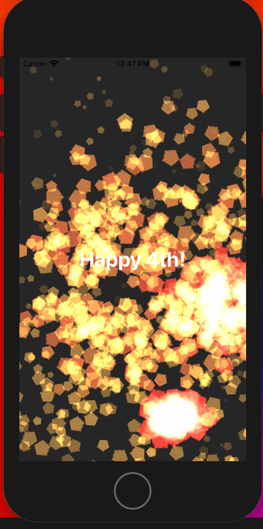

# A Flock of Swifts 

A Flock of Swifts is a physical space meeting of like-minded people excited about the Swift language.  We normally meet each Saturday morning.  Here is our meetup page.  All people and all skill levels are welcome to join.  

https://www.meetup.com/A-Flock-of-Swifts/

----

## 2020.07.24

### Using `UserDefaults`

John showed how to make an apps view-model remember its state using `UserDefaults`.  He did that by loading (or defaulting) the values of the view-model in the initializer and saving the values in the `didSet` method for each of these published properties. He created a separate "Hello" view that initialized the view-model and showed some of the data.  It stays in sync with the rest of the app because it is coming in from `UserDefaults`.

Interesting finding:  The + operator is implemented for `Text` views. 

The code: https://github.com/codger/Persistant-Demo

### A generic storage abstraction

Josh took another look at John's solution.  First, he demonstrated using the new SwiftUI feature `@AppStorage` that lets you save things in `UserDefaults` and also conforms to the `DynamicProperty` protocol which means that your `View` will recompute the `body` every time it changes.  It has some downsides in that it cannot be used inside an `ObservableObject` and only support a very primative set of data types.

He asked what would happen if requirements changed. For example, first you used `UserDefaults`, but then you wanted to sync to cloudkit.  Then you required a common file format for android devices.  Then you wanted to use Firebase; then your own server.  Can you abstact the problem of saving and loading so that you can implement any of these solutions without making changes to the call-sites of your code.  He first created a generic `StorageService` based on the `Codable` protocol.  He implemented this for mock storage service (in-memory dictionary) and then `UserDefaults`.  He then put this into John's original solution.  So that he could keep `@Published` vars publishing their changes and control setter control of these types, he created a `Storage` wrapper type that used `@dynamicMemberLookup` to guarantee values get saved.  Finally, he showed how he could swap out the storage implementation using file based storage.

The code: https://github.com/aflockofswifts/Persistant-Demo

### Stacks of Navigation

Andrei showed us what happens if you navigate to a view that has navigation in it. The navigation titles stack!  This is cool but probably not what you want because it reduces the amount of content available.  You only want the top level view to be wrapped in the `NavigationView`.  When you navigate down the hierarchy, you can still use `.navigationTitle(...)` modifiers and they will utilize the top level `NavigationView`.

### Implementing an in-place editable, draggable folder icon

Ray showed a demo making a draggable folder that can be edited in-place. The two major tricks here:

#### Point 1

Make `TextField` use the same layout spaces as `Text`

```swift
    Text(text)
      .hidden()
      .overlay(TextField("",  text: $text))
```

#### Point 2

When making your `DragGesture()` make sure to make the `minimumDistance` > 0 or it will interfere with `TextField`

The code:
https://gist.github.com/rayfix/400893d383bae7fbab4a69f7b535d5d1

---

## 2020.07.18

Dug into many of the shortcomings of the Combine framework and how they can be overcome.  Great demos on concat, amb and more by Josh.

We looked at these projects:

https://github.com/CombineCommunity/CombineExt

Adds a bunch of missing features for combine (including concat).

We also looked at:

https://github.com/pointfreeco/combine-schedulers

This allows you to control time in detail.

----

## 2020.07.11

Demonstrated examples of using `UIHostingViewController` and `UIViewControllerRepresentable` to interoperate between SwiftUI and UIKit.

Josh had an amazing demonstration but because turnout was light this week, we decided to save it for a future meetup.

----

## 2020.07.04

Happy 4th!  

#### Ray showed:

A fireworks demonstration using the new `SpriteView` available in SwiftUI.  The demo shows how to use a geometry reader to scale the scene to the entire device or window.

I cleaned up some of the variable names and start the fireworks show in onAppear rather than in the init.  I also added a message in a ZStack



The source code is here:  https://github.com/aflockofswifts/FireworksDemo

#### Josh showed:

  * [Nasa Media Search](https://github.com/joshuajhomann/NasaMediaSearch-SwiftUI) example project
  * [OutlineGroup](https://developer.apple.com/documentation/swiftui/outlinegroup) to create a hierarchical navigation side bar
  * [@Appstorage](https://developer.apple.com/documentation/swiftui/appstorage) to persist recent searches.
  * [GridItem](https://developer.apple.com/documentation/swiftui/griditem) to create `.fixed`, `.flexible` and .`adaptive` grids
  * [fullScreenCover](https://developer.apple.com/documentation/scenekit/sceneview/3607780-fullscreencover) to present fullscreen modals on iPad on MacOS


## 2020.06.27

### WWDC 2020 round up
#### Ray showed:
  * The new [`DocumentGroup`](https://developer.apple.com/documentation/swiftui/documentgroup) and [`TextEditor`](https://developer.apple.com/documentation/swiftui/resetfocusaction)
#### John showed
  * dismissing the keyboard with UIKit.  There aappear to be a series of focus values in the environment that you may wish to [explore further](https://developer.apple.com/documentation/swiftui/resetfocusaction)
  * [The new multiple traingling closure syntaxt](https://forums.swift.org/t/se-0279-multiple-trailing-closures/34255)
  * The new [`Map`](https://developer.apple.com/documentation/mapkit/map) `struct` in SwiftUI; similar functionality exists for:
    * SpriteKit
    * SceneKit
    * AVKit
    * QuickLook
    * Homekit
    * ClockKit
    * WatchKit
#### Josh showed
  * control flow and optional binding in a ViewBuilder
  * [`Label`](https://developer.apple.com/documentation/swiftui/label) 
  * Images inside of String interpolation
  * `LazyVGrid`.  We also discussed the new LazyVStack/HStack and ScrollViewReader which you can find [here](https://developer.apple.com/documentation/swiftui/view-layout-and-presentation)
Additional discussion:
  * `@Namespace` and `matchedGeometryEffect`
  * `ContainerRelativeSshape`
  * `Guage` and `ProgressView`
  * `ToobarItem` and semantic positioning
  * `Link`, `AppleArchive`, `System`, `Numeric`
  *  Automatic loading skeleton generation with `.preview`
  * `@main`, `@Argument`, `@Help`
  * `Appstorage` and `SceneStorage`

----

## 2020.06.20

### Drawing a custom WatchOS style activity ring view in SwiftUI
Ray presented creating a custom watchOS style activity ring view in SwiftUI by using shapes, AngularGradient, strokes and transforms.  Here is what we came up with:

https://gist.github.com/rayfix/651894420460161b8f2345f9e6a07b59

The idea for drawing the circle at the end came from this implementation:

https://andyregensky.dev/articles/swiftui-activityrings/

This article also describes making a shadow and clip region which we did not discuss.  (I don't think it looks great on a white background.  The example uses a black background.)

### Publishers and Functional MVVM
Josh reviewed Publishers:
  * Publishers emit 0 to ♾️ Outputs followed by exactly 0 or 1 completion or Failure
  * Subscriptions (sink and assign) return a Cancellable that you must retain to keep the Publisher alive
We looked at the various ways you can create a publisher:
```
//Factories
let a = Just(1)
let b = Empty(completeImmediately: false, outputType: String.self, failureType: Never.self)
let c = Fail<Int, URLError>(error: URLError(URLError.Code(rawValue: 404)))

// Closure
let d = Future<Int, Never> { promise in
  promise(.success(1))
}

// Subject
class A {
  @Published var a = 0
}
let e = CurrentValueSubject<Int, Never>(0)
let f = PassthroughSubject<Int, Never>()

// Foundation (or RealityKit)
let g = NotificationCenter.default.publisher(for: UIApplication.willTerminateNotification)
let h = URLSession.shared.dataTaskPublisher(for: URL(string: "cnn.com")!)
let i = [1,2,3].publisher
let j = Timer.publish(every: 1, on: .main, in: .common)
```

We looked at how you can use various operators including `map`, `scan`, and `prepend` to model a stateful system functionally.
```
let emojis = "🐶🐱🐭🐹🐰🦊🐻🐼🐨🐯"

let cancellable = Timer
  .publish(every: 1, on: .main, in: .common)
  .autoconnect()
  .map { _ in 1 }
  .scan (0, +)
  .prepend(0)
  .map { index in
    let wrappedIndex = index % emojis.count
    return String(emojis[emojis.index(emojis.startIndex, offsetBy: wrappedIndex)])
  }
  .sink { output in
    print(output)
  }
```
* We looked making a functional viewModel and the difference between `flatMap` and `switchToLatest`
* We applied what we learned to refactor and imperative version of Tic Tac Toe to be stateless, declarative, immutable and functional.

example code: https://github.com/joshuajhomann/TicTacToe-SwiftUI

## 2020.06.13

### Generics and Opaque types

Ray presented a solution for genrating combinations of sequences and touched on the differences between the opaque return types from `some` and the concrete `Any*` type erasers as well as code coverage and unit testing.

Here is the gist of the code:

https://gist.github.com/rayfix/9053908eccfad6cb744dc6048fa2b8dc

Started a discussion here:

https://forums.swift.org/t/constraining-associated-type-s-of-opaque-types/37551

Xcode tips:
- Document the code you write by selecting the API and pressing Option-Command-/.  Then fill in the placehodlers.
- Option shift click to make multiple, simultaneous edit points.
- Option drag to select a rectangular region.

Update: We were looking for overall coverage. statistics.  You have to turn on coverage in the scheme.  Also enable coverage in the display.


### SwiftUI, Stanford Course and Composable Architecture

Josh presented a solution to Stanford's CS193P Homework 3 using the Composable Architecture from Pointfree
https://github.com/joshuajhomann/Set-Game-Composable-Architecture-CS193P

### Announcment

Frank shared an upcoming WWDC recap meetup for Swift Paris online June 30 (GMT +2 6:00PM which is 9:00AM Pacific)
https://www.meetup.com/swiftparis/events/271199742

---

## 2020.06.06

We discussed functional approaches to solving Standford CS193P's 3rd assignment:
https://cs193p.sites.stanford.edu/sites/g/files/sbiybj16636/files/media/file/assignment_3.pdf

Joe shared his solution here: https://github.com/jmestro/SetGame/tree/master

Point free's composable architecture.  Note that their sample app contains many examples that you may find to be useful.
https://github.com/pointfreeco/swift-composable-architecture
The video series is here:
https://www.pointfree.co/episodes/ep100-a-tour-of-the-composable-architecture-part-1

Demo Composable app showing master detail navigation and composable reducers for state propagation:
https://github.com/joshuajhomann/Composable-Test

We discussed the idea `projection` in the context of transforming state to substate and of `pullback` as the inverse of transforming a subaction to an action using a casePath:
https://www.pointfree.co/blog/posts/22-some-news-about-contramap
https://github.com/pointfreeco/swift-case-paths

Stephen Celis - Reactive view models, simplified:
https://www.youtube.com/watch?v=uTLG_LgjWGA

Next week, more Composable Architecture (including side effects) and functional MVVM in SwiftUI & Combine and a follow up on Stanford homework 3.

## 2020.05.30

Ray showed how to use template views in lieu of preferences to make views with a minimum size.  https://swiftwithmajid.com/2020/05/13/template-view-pattern-in-swiftui/

John demoed a maps project using UIViewRepresentable to show and zoom in on a MapView using spans and geometry effects.
https://github.com/codger/MapZoom

Josh demoed his 2048 project and showed how to use coordinate spaces, and generic preference keys to leverage the SwiftUI rendering system with custom drawing: https://github.com/joshuajhomann/SwiftUI-2048

## 2020.05.23

We met on Zoom and talked about SwiftUI state observation and looked forward to what is coming at WWDC 2020.

### Probing @State and @Binding

We looked the similarities and difference between @Binding and @State.  State is the single source of truth that can be connected to two way bindings.  We can use the projected type of @State to get at the binding.  Everything stays in sync!

### Observable Object

We used didSet {} to limit a message to 20 characters.  Our combine version didn't work.  Here is the broken code for that attempt.

https://gist.github.com/rayfix/854c2844366351e4fe29e91118ebfdbb

The print show that the string is being truncated but for some reason assign to message isn't working like we think it should.

### A minimal custom @Environment  example

Exploring the @Environment and @EnvironmentObject

https://gist.github.com/rayfix/1606190f572b6eb934e45f4a56701feb

### Swift 5.3

Josh walked us through things coming in Swift 5.3

https://medium.com/better-programming/whats-new-in-swift-5-3-142d89d4d1f7

### Teaser: Animating 1024

Josh is creating the game 1024.  With relatively small code he got the whole game working but without animation.  Animation is coming next week.

### Divvy Scan

From Joe

This is a short explainer video of the project I worked on during the Brother hackathon:

https://www.youtube.com/watch?v=uqjUeefqec8

This will be an open-source project eventually; after releases are finalized.


### Stanford Class

Stanford videos are starting to come out.  Thanks Matt!
https://cs193p.sites.stanford.edu/


### The Composable Architecture

Ray will discuss (and demo) this at next week's meeting.


### Follow up on text assignment with a binding

It appears that this doesn't work because we are trying to modify the `@Published` value while SwiftUI is in the middle of a redraw.  Matt discovered it does work if you add a `receive(on: DispatchQue.main)`, which I suspect is due to the fact that this defers the update to the next runloop, at which point SwiftUI is no longer in the midst of a redraw.

```
import Combine
import SwiftUI
import PlaygroundSupport

final class VM: ObservableObject {
  @Published var text = "0123456789"
  var s: AnyCancellable?
  init() {
    s = $text
      .filter { $0.count > 10 }
      .map {
        print("Map")
        return String($0.prefix(10))
      }
      .assign(to: \.text, on: self)
  }
}

struct V: View {
  @ObservedObject var vm: VM = .init()
  var body: some View {
    VStack {
      Text(vm.text)
      TextField("test", text: .init(get: { self.vm.text}, set: {
        print("setting")
        self.vm.text = $0
      }))
    }
  }
}

PlaygroundPage.current.liveView = UIHostingController(rootView: V())
```

----


## 2020.05.16

We met on Zoom and did some review of SwiftUI and Combine

### Building up a ViewModel

We built a very simple SwiftUI with a slider and a couple of numbers.  We purposefully wrote a lot of wrong code that compiled so we could understand why it was wrong.  For example, if you put an onRecieve of a publisher in your view, that publisher is going to get the CurrentValue each time and fail to update correctly.  Reviewed the mechanism by which Bindings work with State and ObservedObject property wrappers.  How to use the projected type to get bindings for both State and ObservedObjects.

https://gist.github.com/rayfix/f97a8f9bac0bc3ba7d23f64fa4b3dfe1


Josh showed off a project to get magic cards and converted it from imperative to declarative and functional reactive.
The project is here with two folders, the starting imperative version and the final declarative version:

https://github.com/joshuajhomann/Magic-Browser-SwiftUI

## 2020.05.09

We met on Zoom and focused on SwiftUI today.

### Demonstration of making a view dragable

Use `ViewModifiers` to make behaviors reusable.

https://gist.github.com/rayfix/605066823f4a70c644dd216226d51c41

### Rolex Watch (1)

https://github.com/codger/SwiftUI-Rolex

### Rolex Watch Refactored (2)

https://github.com/aflockofswifts/2020-05-09-SwiftUI-Rolex-Refactor-MVVM

### Concentration with Animation

Uses a redux inspired approach

https://github.com/joshuajhomann/Memory-SwiftUI-Animation


## 2020.05.02

We met today on Zoom.  There were four presentations.

### A demonstration of scale and rotation effect anchor with `UnitPoint`
by Ray Fix

We created a simple project and explored animation modifiers.
https://gist.github.com/rayfix/6cdfcbffc9294456729d46aab8184ef8

### Charting in SwiftUI
by John James

First load in the package using the package manager:
https://github.com/AppPear/ChartView

It is very easy to add and remove packages.

Show off the code using this sample code:
https://gist.github.com/rayfix/89e6d6167e7c1881e222413e1d3cee03

### John Conway's Life in SwiftUI
https://github.com/joshuajhomann/Conway-Life-SwiftUI

### Concentration in SwiftUI
by Josh Homann

## 2020.04.25

We met on Zoom.

Talked about Dave Abrahams' apperance on the Swift by Sundell podcast.

https://www.swiftbysundell.com/podcast/71/

Start with a value type, you will discover (not invent) the protocols by exploring the problem domain.

John was running into a problem with creating fancy buttons:

https://www.appcoda.com/swiftui-button-style-animation/

Discovered the problem was that the gradient code using colors from the asset catalog not registered.  They can be registered.

Josh: Why can't Xcode auto generate code for the assets?

Presentation on Swift on the Server using Vapor

https://iosdevsurvey.com/2019/08-swift-on-the-server/

Ray will be giving a presentation on this on Monday night.

https://www.meetup.com/sdiosdevelopers/events/270119290/

Josh working on a Combine / SwiftUI version of John Conway's Life. Having trouble with timer events.

Next week we will look more at SwiftUI animation and app architecture. If you have DispatchQueue in your View code you are doing it wrong.

## 2020.04.11

We met on Zoom.

Josh presented how to make a type eraser, and when to use type erasure in SwiftUI and Combine: https://github.com/joshuajhomann/TypeErasure

Ray talked about type erasure with opaque return types using the `some` keyword.

John presented a flip animationf or his card game and we discussed various ideas for how to animate cards moving from one section of the game board to another.

## 2020.04.04

We met on Zoom.

There have been many small improvements to Swift from Swift 4 to the current 5.2.  We are noticing how many of these changes are being utilized in interesting and even unexpected ways in libraries like SwiftUI.

Ray presented a playground on `keyPaths`
* More on keypaths: https://github.com/apple/swift-evolution/blob/master/proposals/0161-key-paths.md
* The sample code that we played with: https://gist.github.com/rayfix/4ca37c321fb64fc376b100b2f6b08ef5

There are many `KeyPath` types that the compiler uses in various situations:

* `KeyPath<Root, Value>`
* `WriteableKeyPath<Root, Value>`
* `ReferenceWritableKeyPath<Root, Value>`
* `PartialKeyPath<Root>`
* `AnyKeyPath`

Josh presented a playground on `propertyWappers`, their `wrappedValues` and their `projectedValues` and then demostrated a project to show the `projectedValues` for the `propertyWrappers` in SwiftUI and Combine: https://github.com/aflockofswifts/2020-4-5-Property-Wrappers

* More on property wrappers: https://github.com/apple/swift-evolution/blob/master/proposals/0258-property-wrappers.md
* More on key apth dynamic member lookup: https://github.com/apple/swift-evolution/blob/master/proposals/0252-keypath-dynamic-member-lookup.md

John showed his card game in SwiftUI, using image slicing.  We discussed some possible solutions for animations.

## 2020.03.28

We met on Zoom due to California's current "Safer at home" restrictions.

Ray presented a measure utility to explore sizing of SwiftUI.Views.
Ray discussed new features in Swift 5.2:
  * Key Path Expressions as Functions https://github.com/apple/swift-evolution/blob/master/proposals/0249-key-path-literal-function-expressions.md
  * Callable values of user-defined nominal types https://github.com/apple/swift-evolution/blob/master/proposals/0253-callable.md
and new in Swift 5.3:
  * Enum cases as protocol witnesses https://github.com/apple/swift-evolution/blob/master/proposals/0280-enum-cases-as-protocol-witnesses.md

Josh presented debouncing expensive operations in combine with an Ascii filter example available here: https://github.com/joshuajhomann/AsciiFilter

Jo fixed her launch image by purging the similator & fixed an opacity animation.  Note that that requirement to use a storybaord for your launch screen has been delayed: https://developer.apple.com/news/

## 2020.03.07

We met at Daden LLC where Ray gave a presentation on layout in SwiftUI and how to communicate information up the View tree by using `PreferenceKey`.

We broke into groups and tried to apply `PreferenceKey` to the problem of making a grid where you can select a number of squares by dragging.

Josh's solution to this problem is here: https://github.com/joshuajhomann/Preferences

A similar problem solved without preferences by manually calcaluating everything is here: https://github.com/joshuajhomann/Boggle-SwiftUI

## 2020.02.15

Josh is working on AWS amplify: https://aws-amplify.github.io/docs/ios/start?ref=amplify-iOS-btn

Decoding JSON from firebase dictionaries:
```
protocol JSONRepresentable {
  init?(json: [String: Any])
  func json() -> [String: Any]?
}

extension JSONRepresentable where Self: Codable {
  init?(json: [String:Any]) {
    guard let value = (try? JSONSerialization.data(withJSONObject: json, options: []))
      .flatMap ({ try? JSONDecoder().decode(Self.self, from: $0) }) else {
        return nil
    }
    self = value
  }
  func json() -> [String:Any]? {
    return (try? JSONEncoder().encode(self))
      .flatMap { try? JSONSerialization.jsonObject(with: $0, options: []) } as? [String: Any]

  }
}


struct User: Codable, JSONRepresentable {
  var name: String
}

let dictionary: [[String: Any]] = [
  ["name" : "John"],
  ["name" : "Bill"],
  ["invalid": "test"]
]

let users = dictionary.compactMap(User.init(json:))
print(users)
```

## 2020.02.08
* Josh made 2D water in spriteKit: https://github.com/joshuajhomann/Waves
* John worked on bar charts in SwiftUI

## 2020.02.01
* We met at Daden LLC for some presentations
* Ray covered github & swift package manger https://gitup.co
* Josh covered SwiftUIAnimations: https://github.com/joshuajhomann/SwiftUI-Animations

## 2020.01.25

* John is exploring swift package manager: https://swift.org/package-manager/
* Josh worked on displaying a chain of CFilters in a MTKView: https://github.com/joshuajhomann/Core-Image-Metal-View
* Feathering: https://stackoverflow.com/questions/40593884/how-to-achieve-real-feather-fade-effect-on-a-uiimage-which-is-cropped-by-a-uibez/40667463#40667463

## 2020.01.18

Coding challenges for all levels if anyone is interested in trying: https://www.reddit.com/r/dailyprogrammer/

The deadline is fast approaching.  Update your apps with a launch storyboard and support for arbitrary screen sizes.
```As announced at WWDC19, starting April 2020, apps submitted to the App Store must use an Xcode storyboard to provide the app’s launch screen and must have an interface that supports any display size.```
https://developer.apple.com/news/?id=01132020b

CIFilter example:
```
import PlaygroundSupport
import UIKit

let ciImage = Bundle.main.url(forResource: "dog", withExtension: "jpg")
  .flatMap { try! Data(contentsOf:$0) }
  .flatMap(UIImage.init(data:))?
  .cgImage
  .flatMap(CIImage.init(cgImage:))!

let blur = CIFilter(name: "CIGaussianBlur")
blur?.setValue(ciImage, forKey: kCIInputImageKey)
blur?.setValue(16, forKey: "inputRadius")
let uncroppedImage = (blur?.value(forKey: kCIOutputImageKey) as? CIImage)
  .flatMap(UIImage.init(ciImage:))!
let croppedImage = UIGraphicsImageRenderer(size: ciImage!.extent.size).image { _ in
  uncroppedImage.draw(at: .init(
    x: (ciImage!.extent.size.width - uncroppedImage.size.width) / 2,
    y: (ciImage!.extent.size.height - uncroppedImage.size.height) / 2
  ))
}
```


## 2020.01.11

John working on button customization using a view modifier.  I suggested creating a `ButtonModifier` because you can get at the button.

```swift
struct RectangularButtonStyle: ButtonStyle {

  func makeBody(configuration: Configuration) -> some View {
    configuration.label.frame(width: 150, height: 50)
      .background(Color.blue)
      .foregroundColor(.white)
      .font(.subheadline)
      .cornerRadius(10)
    
  } 
}

// Use it like this:

Button("Press Me!") {
  print("Hello")
}.buttonStyle(RectangularButtonStyle())

```


Josh and Ray working on SwiftUI navigation.

Some background links:

### Basic SwiftUI Navigation
https://www.raywenderlich.com/5824937-swiftui-tutorial-navigation

### Deep Linking (Uses AppState to control navigation)
https://nalexn.github.io/swiftui-deep-linking/
This uses `AppState` to figure out how views set themselves up.

### Combine Tutorial Navigation
https://www.raywenderlich.com/4161005-mvvm-with-combine-tutorial-for-ios
Combine tutorial which contains some info on "pragmatic navigation" using a view builder function.

### Starter Project from Josh
This uses the TVMaze API that creates a simple navigation.
https://github.com/joshuajhomann/TVMaze-SwiftUI-Navigation

Adding a coordinator turns out to be a little less straightforward than originally thought.


### Looking for a Job

Some ideas in no particular order.

- Hired
- Vettery
- TrippleByte
- Karat
- Mainz Brady Group
- StackOverflow
- Zip Recruiter
- AngelList

Project a professional appearance online.

## 2020.01.04 

- Simon Simon worked on SwiftUI navigation.  We hit a bug where you can't push a view after it has been dismissed.  This is really weird.

```swift
struct DetailView: View {

    @Environment(\.presentationMode) var presentation

    var body: some View {
        Button("Done") {
            self.presentation.wrappedValue.dismiss()
        }
    }
}

struct ContentView: View {
    var body: some View {
        NavigationView {
            NavigationLink(destination: DetailView()) {
                Text("Hello")
            }
        }
    }
}
```

Any ideas?

--EDIT: Josh--

John and I worked on the same issue a few weeks ago.  The solution is to use a binding for the navigationLink.  If you think about it its wierd to be manipulating the global presentation state since whether or not a view is presented is a piece of local state that someone should own (in this case that someone is the parent).

```swift
struct DetailView: View {
  @Binding var isShown: Bool
  var body: some View {
    Button("done") {
      self.isShown = false
    }
  }
}

struct ContentView: View {
  @State private var isDetailShown = false
  var body: some View {
    NavigationView {
      NavigationLink("hello", destination: DetailView(isShown: $isDetailShown), isActive: $isDetailShown)
    }
  }
}
```
--END EDIT--

Ray:  Actually this also does not work. If you go back using the back button, you can no longer push onto the navigation stack.  (At least in the 13.3 sim).  Ray Posted feedback to Apple FB7522002


- Victoria worked on SpriteKit and attempted to commit her code with Gitup.  She understands the importance of version control but isn't a fan of the current product offerings.  

https://gitup.co

- Other topics included working with Firebase (cascading multiple requests)


## 2019.12.21 [A Geeky Swiftmas Party]

Making Ornaments, snacks, drinks (moldly drinks!), iPad Pictionary, a presentation, discussion. 

Five Swift things to be excited about in 2020.

- SwiftUI and Combine
- Swift on the Server
- Swift for Machine Learning (TensorFlow)
- The vibrant Swift community
- Our community

Brainstorm ideas for 2020.

- Analyze buoy data in relation to tsunamis
- Build a game for Apple Arcade (or find out what it takes)
- Build a self driving car (Use Swift for TensorFlow)
- Build a Draw and Guess Game

### Links:
- https://www.donkeycar.com
- https://www.robolink.com/codrone/


## 2019.12.14 [New Beginnings]

- Discussion  of Markov Chains, Markov Chain Monte Carlo (MCMC)

- Ray starting aflockofswifts github organization.  See me (ray) IRL if you want to join the organization.  

- Josh and John are working on a SwiftUI version of Boggle.  https://github.com/joshuajhomann/Boggle-SwiftUI

- John and Josh used `UITextChecker` to validate the dictionary which contained 250k invalid words.  Seems to be slow, it takes 5 minutes to process the 300k dictionary.  Cleaned up dictionary opens fast in iOS but crashes in catalyst (???)

- Xcode 11.3 seems to have trouble opening a large json array. Hangs. (Reported to Apple as FB7493904)

- Bill wants to know how to use hash tags in his instagram profile (Not Swift related but hey...)

- Simon is working of SwiftUI layout with video player.  Also used `Bundle.main` to fetch a local video rather than streaming from the web.

- Victoria is going through a SpriteKit tutorial  

- Swiftforgood.com Book is on pre-order.

### Some Code

`PrefixTree` is a trie that provides fast lookup in the English dictionary for a valid word.  Here is the key method:

```swift
     func contains(_ collection: SomeCollection) -> Bool {
        collection.reduce(into: self, { $0 = $0?.children[$1]})?.isTerminal == true
     }
```

### Required init issue

A short coming in the current version of Swift is that even if you have a `final class` if you reference and init a `Self` you *MUST* have a `required` initializer.  It seems like it should not be `required` if the class is `final`.

#### Screenshot of Boogle App


